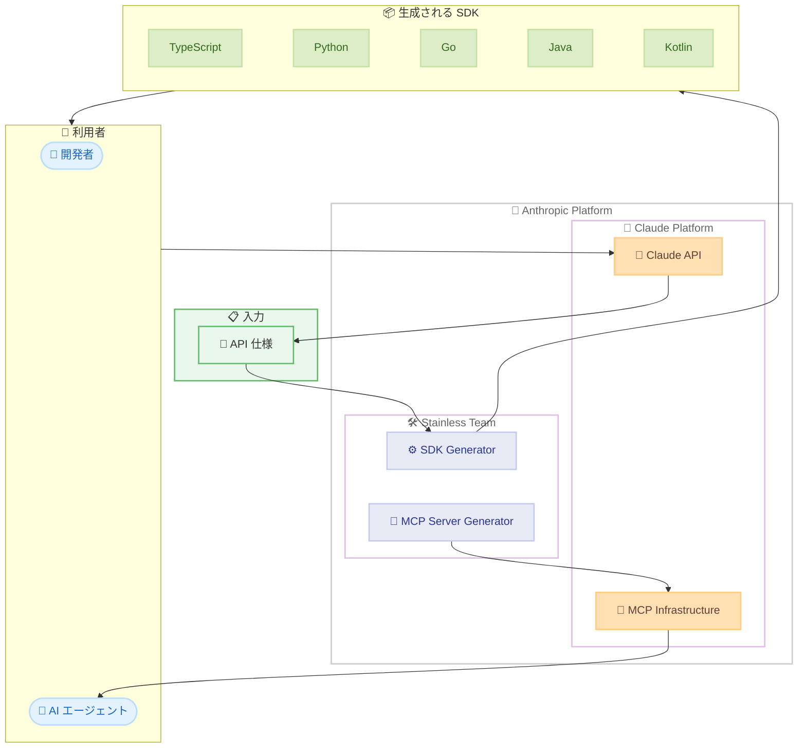

# Anthropic が Stainless を買収

## メタデータ

| 項目 | 内容 |
|------|------|
| 発表日 | 2026-05-18 |
| ソース | Anthropic News |
| カテゴリ | 企業買収・エコシステム |
| 公式リンク | https://www.anthropic.com/news/anthropic-acquires-stainless |

## 概要

Anthropic は、SDK 生成および MCP サーバーツーリングを専門とする Stainless の買収を発表した。Stainless は 2022 年に設立され、API 仕様から TypeScript、Python、Go、Java、Kotlin などの言語ネイティブな SDK を自動生成する技術を提供している。Claude API の公式 SDK は初期から Stainless によって生成されており、今回の買収により同チームが Anthropic に完全統合される。

この買収は、AI モデルが質問に応答するだけでなく、エージェントとして行動を実行する時代への移行を見据えた戦略的な決定である。エージェントの有用性はアクセスできるシステムの範囲に依存するため、Stainless のツーリング技術がその到達範囲を拡大する役割を担う。

## 詳細

### 背景

AI 業界は、モデルがクエリに応答するフェーズから、エージェントがツールやデータに接続して実際のアクションを実行するフェーズへと移行している。Anthropic はこのビジョンを実現するために MCP (Model Context Protocol) を策定し、エージェントの接続性を高めるインフラを構築してきた。

Stainless は 2022 年の設立以来、API 仕様を入力として受け取り、各プログラミング言語にネイティブな SDK、CLI、MCP サーバーを自動生成するプラットフォームを構築してきた。数百の企業が Stainless を利用しており、Anthropic もその最初期の顧客の 1 つであった。

### 主な変更点

1. **チームの完全統合**: Stainless のチームが Anthropic に加入し、Claude Platform の開発者体験とエージェント接続性の強化に注力する
2. **SDK 生成の内製化**: これまで外部パートナーとして提供されていた SDK 生成が Anthropic 内部の機能となる
3. **MCP エコシステムの強化**: Stainless の MCP サーバー生成技術が Anthropic の MCP インフラと統合される
4. **開発者体験の向上**: SDK とプラットフォームの一体的な開発により、より洗練された開発者体験の提供が可能になる

### 技術的な詳細

Stainless のアプローチは「仕様駆動型 (spec-driven)」である。以下の特徴を持つ。

- **入力**: OpenAPI などの API 仕様
- **出力**: 各言語にネイティブな SDK、CLI ツール、MCP サーバー
- **対応言語**: TypeScript、Python、Go、Java、Kotlin、その他
- **品質**: 高速、信頼性が高く、各言語のイディオムに沿ったコード生成
- **MCP サーバー生成**: エージェントが外部サービスに接続するためのコネクタを自動生成

## 開発者への影響

### 対象

- Claude API を利用する全ての開発者
- Anthropic SDK (Python、TypeScript、Go、Java、Kotlin) を利用するユーザー
- MCP サーバーを構築・利用するエージェント開発者
- Stainless を利用して独自の SDK を生成している企業

### 必要なアクション

現時点で開発者側に即座の対応が必要なアクションはない。既存の Anthropic SDK は引き続き同じ方法で利用可能である。今後、SDK の品質向上や新機能追加が期待される。

- 既存の SDK インストールや利用方法に変更なし
- パッケージ名やリポジトリの変更は発表されていない
- 将来的に MCP サーバー生成ツールがより深く Anthropic プラットフォームに統合される可能性がある

### 移行ガイド (該当する場合)

現時点では移行は不要。SDK の利用方法に変更はなく、既存のコードはそのまま動作する。

## コード例

```python
# Anthropic SDK (Python) - Stainless によって生成されたコード
# 今後も同じインターフェースで利用可能
import anthropic

client = anthropic.Anthropic()

message = client.messages.create(
    model="claude-sonnet-4-6-20260318",
    max_tokens=1024,
    messages=[
        {"role": "user", "content": "Hello, Claude!"}
    ]
)
print(message.content[0].text)
```

```typescript
// Anthropic SDK (TypeScript) - Stainless によって生成されたコード
import Anthropic from "@anthropic-ai/sdk";

const client = new Anthropic();

const message = await client.messages.create({
  model: "claude-sonnet-4-6-20260318",
  max_tokens: 1024,
  messages: [
    { role: "user", content: "Hello, Claude!" }
  ],
});
console.log(message.content[0].text);
```

## アーキテクチャ図



## 関連リンク

- [Anthropic 公式発表](https://www.anthropic.com/news/anthropic-acquires-stainless)
- [Anthropic SDK - Python](https://github.com/anthropics/anthropic-sdk-python)
- [Anthropic SDK - TypeScript](https://github.com/anthropics/anthropic-sdk-typescript)
- [Model Context Protocol](https://modelcontextprotocol.io/)
- [Stainless 公式サイト](https://www.stainlessapi.com/)

## まとめ

Anthropic による Stainless の買収は、エージェント時代における開発者体験とシステム接続性の強化を目指す戦略的な決定である。Stainless は設立以来 Anthropic の公式 SDK を生成してきたパートナーであり、今回の統合によりプラットフォームと SDK が一体となった開発が可能になる。

開発者にとっての即座の影響は限定的だが、中長期的には以下の改善が期待される。

- SDK の品質向上とリリース速度の加速
- MCP サーバー生成ツールのプラットフォーム統合
- エージェントが接続できるサービスの範囲拡大
- より一貫性のある開発者体験の提供

AI エージェントの有用性はアクセスできるツールやデータの範囲に直結するため、Stainless の技術は Anthropic のエージェント戦略における重要な基盤となる。
