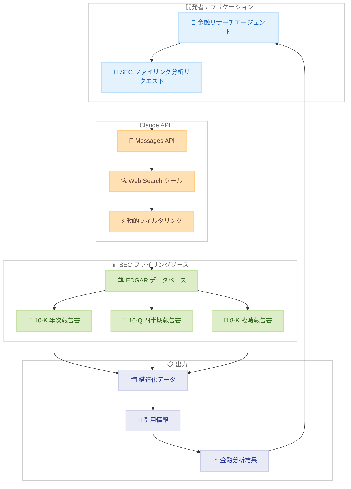

# Web Search ツールで SEC ファイリングデータの強化

## メタデータ

| 項目 | 内容 |
|------|------|
| 発表日 | 2026-05-18 |
| ソース | Claude API Release Notes |
| カテゴリ | API アップデート |
| 公式リンク | https://platform.claude.com/docs/en/release-notes/overview |

## 概要

Claude API の Web Search ツールが強化され、SEC (米国証券取引委員会) ファイリングデータをよりリッチに返却するようになった。この改善により、金融リサーチエージェント、決算分析、デューデリジェンスワークフローにおいて、一次情報源に基づいた引用付きの分析が容易になる。

## 詳細

### 背景

Web Search ツールは 2026 年 2 月 17 日に一般提供 (GA) が開始されたサーバーサイドツールであり、Claude が最新のウェブ情報を検索して回答に活用できる機能を提供している。Claude API の Messages エンドポイントで使用し、ツール定義として `web_search_20250305` または動的フィルタリング対応の `web_search_20260209` を指定することで利用可能となる。

SEC ファイリングは企業の財務状況を把握するための最も信頼性の高い一次情報源であり、10-K (年次報告書)、10-Q (四半期報告書)、8-K (臨時報告書) などの公式書類が含まれる。これまでも Web Search ツールで SEC 関連情報を検索できたが、返却されるデータの構造や詳細度には改善の余地があった。

### 主な変更点

- **SEC ファイリングデータの充実**: Web Search ツールが SEC ファイリング関連の検索結果において、よりリッチで構造化されたデータを返却するようになった
- **引用付きソース**: 検索結果には引用情報が含まれ、一次情報源へのトレーサビリティを確保
- **金融リサーチエージェントの基盤強化**: エージェントが権威あるソースに基づいて分析を行うことが容易に
- **決算分析のサポート**: 企業の決算情報へのアクセスが改善され、収益分析ワークフローを支援
- **デューデリジェンスワークフロー**: 投資判断や企業調査に必要な情報収集を効率化

### 技術的な詳細

この機能強化は既存の Web Search ツールの内部改善であり、API インターフェースの変更は不要である。開発者は既存の Web Search ツール設定をそのまま使用して、強化された SEC ファイリングデータを受け取ることができる。

主な技術的特徴は以下の通り。

- ツールタイプ: `web_search_20250305` (基本版) または `web_search_20260209` (動的フィルタリング対応版)
- レスポンス形式: 既存の `web_search_result` 形式を維持しつつ、SEC ファイリング関連データの内容が充実
- 引用形式: `web_search_result_location` 型の引用に SEC ファイリングのソース情報が含まれる
- 動的フィルタリングとの併用: `web_search_20260209` を使用することで、大量の SEC ファイリングデータから関連情報のみを抽出可能

## 開発者への影響

### 対象

- 金融分析アプリケーションを構築している開発者
- Claude API で投資リサーチエージェントを開発しているチーム
- デューデリジェンスや企業調査の自動化に取り組む組織
- SEC ファイリング情報を活用したコンプライアンスツールの開発者

### 必要なアクション

この強化は既存の Web Search ツールの内部改善であるため、API の呼び出し方法に変更はない。既に Web Search ツールを使用している場合、SEC ファイリング関連の検索を行うだけで自動的に改善されたデータを受け取ることができる。

新規に SEC ファイリング分析機能を構築する場合は以下の通り。

1. Claude API の Web Search ツールを有効にする
2. SEC ファイリングに関連するプロンプトを設計する
3. 返却される引用情報を活用してソースの信頼性を担保する
4. 動的フィルタリング (`web_search_20260209`) の活用を検討する

### 移行ガイド (該当する場合)

既存の実装からの移行作業は不要。Web Search ツールを既に使用している場合、SEC ファイリング関連の検索結果が自動的に改善される。

動的フィルタリングへのアップグレードを検討する場合は以下の通り。

```python
# 基本版から動的フィルタリング版への変更
# Before: "web_search_20250305"
# After:  "web_search_20260209"

tools=[{"type": "web_search_20260209", "name": "web_search"}]
```

## コード例

```python
import anthropic

client = anthropic.Anthropic()

# SEC ファイリングデータを活用した金融リサーチエージェントの例
response = client.messages.create(
    model="claude-opus-4-7",
    max_tokens=4096,
    system="あなたは金融リサーチアナリストです。SEC ファイリングの一次情報源に基づいて、"
           "正確で引用付きの分析を提供してください。",
    messages=[
        {
            "role": "user",
            "content": "Apple Inc. の最新の 10-K ファイリングから、"
                       "売上高と営業利益の推移を分析してください。",
        }
    ],
    tools=[
        {
            "type": "web_search_20260209",
            "name": "web_search",
            "max_uses": 10,
            "allowed_domains": ["sec.gov", "edgar.sec.gov"],
        }
    ],
)

# レスポンスから引用情報を抽出
for block in response.content:
    if block.type == "text" and hasattr(block, "citations"):
        if block.citations:
            for citation in block.citations:
                print(f"出典: {citation.title}")
                print(f"URL: {citation.url}")
                print(f"引用テキスト: {citation.cited_text}")
                print("---")
    elif block.type == "text":
        print(block.text)
```

## アーキテクチャ図



## 関連リンク

- [Web Search ツール公式ドキュメント](https://platform.claude.com/docs/en/agents-and-tools/tool-use/web-search-tool)
- [Claude API リリースノート](https://platform.claude.com/docs/en/release-notes/overview)
- [サーバーツール](https://platform.claude.com/docs/en/agents-and-tools/tool-use/server-tools)
- [ツールリファレンス](https://platform.claude.com/docs/en/agents-and-tools/tool-use/tool-reference)
- [SEC EDGAR データベース](https://www.sec.gov/edgar/searchedgar/companysearch)

## まとめ

今回のアップデートにより、Claude API の Web Search ツールが SEC ファイリングデータに対してよりリッチな情報を返却するようになった。これは API インターフェースの変更を伴わない内部改善であり、既存の実装をそのまま活用できる。金融リサーチエージェント、決算分析、デューデリジェンスワークフローにおいて、一次情報源に基づいた引用付きの正確な分析が容易になり、金融分野での Claude API 活用がさらに強化された。動的フィルタリング (`web_search_20260209`) との組み合わせにより、大量の SEC ファイリングデータから必要な情報のみを効率的に抽出することも可能である。
