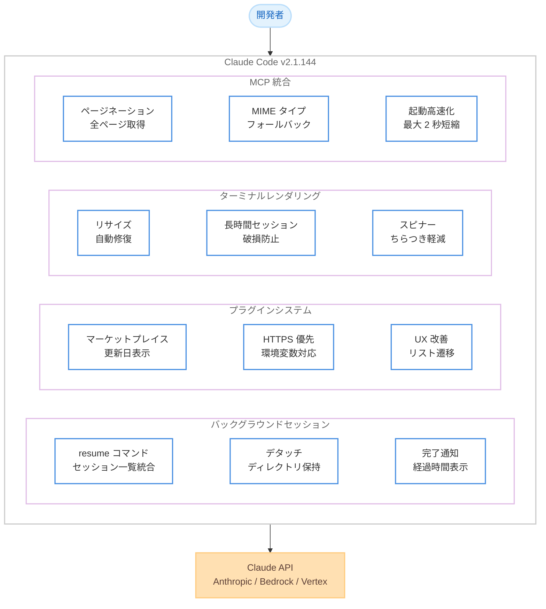

# Claude Code v2.1.144 - バックグラウンドセッション改善とプラグイン強化

## メタデータ

| 項目 | 内容 |
|------|------|
| 発表日 | 2026-05-19 |
| ソース | Claude Code Changelog |
| カテゴリ | Claude Code アップデート |
| 公式リンク | https://github.com/anthropics/claude-code/blob/main/CHANGELOG.md |

## 概要

Claude Code v2.1.144 は、51 件の変更を含む大規模アップデートである。新機能 6 件、改善 12 件、バグ修正 33 件で構成され、バックグラウンドセッション、プラグイン管理、ターミナルレンダリング、MCP 互換性の 4 つの領域に重点を置いている。

特に、バックグラウンドセッションの `/resume` サポートや、セッションスコープのモデル切り替え機能が追加され、長時間タスクの管理と柔軟なモデル選択が大幅に改善された。

## 詳細

### 背景

Claude Code はバージョン 2.1 系で継続的にバックグラウンドセッション機能を強化してきた。v2.1.143 ではバックグラウンドセッションに関するリグレッションが発生し、macOS 環境でクラッシュする問題があった。v2.1.144 ではこれらの問題を修正するとともに、バックグラウンドセッションの管理性を大幅に向上させている。

また、プラグインエコシステムの成熟に伴い、マーケットプレイスの UX 改善やセキュリティ設定 (HTTPS 優先) の反映が行われている。

### 主な変更点

#### 新機能 (6 件)

1. **`/resume` コマンドのバックグラウンドセッション対応**: `claude --bg` やエージェントビューで開始されたセッションが、インタラクティブセッションと並んで表示される。`bg` マークで区別可能
2. **バックグラウンドサブエージェント完了通知に経過時間を表示**: 「Agent completed - 3h 2m 5s」のように所要時間を確認可能
3. **`/model` コマンドのセッションスコープ化**: 現在のセッションのみモデルを変更し、モデルピッカーで `d` を押すと新規セッションのデフォルトを設定
4. **`/bg` および左矢印キーによるデタッチ時に `/add-dir` で追加したディレクトリを保持**
5. **プラグインマーケットプレイスが `CLAUDE_CODE_PLUGIN_PREFER_HTTPS` を尊重**
6. **`/plugin` のブラウズ/ディスカバーペインでプラグインの最終更新日を表示**

#### 主な改善 (9 件)

1. **「extra usage」を「usage credits」に名称変更**: `/extra-usage` は `/usage-credits` に変更 (旧名も引き続き使用可能)
2. **検索時の不要なツールエラーを削減**: `head`/`tail` によるファイル閲覧が read-before-edit チェックを満たすようになり、grep の「マッチなし」がエラー報告されなくなった
3. **再開セッションが使用中のモデルを維持**: 他セッションの `/model` 選択を引き継がなくなった
4. **レスポンス前のストリーム停止からの回復改善**: 非ストリーミングフォールバックではなく、ストリーミングを 1 回リトライ
5. **SDK/ヘッドレス MCP 起動の高速化**: pre-wait が起動とオーバーラップし、遅い MCP サーバーで最大 2 秒高速化
6. **バックグラウンドセッションの worktree 分離ガードが非 Git VCS ユーザーにも適用**
7. **`/plugin` が有効化/無効化/アンインストール後にインストール済みリストに戻る**
8. **`/doctor` がコマンドフックに `command` フィールドがない場合に exec-form の例を表示**
9. **VS Code でのターミナルレンダリングのちらつきを軽減**: スピナーアニメーションの色数を削減

#### 注目のバグ修正 (11 件)

1. **起動時の最大 75 秒ハングを修正**: `api.anthropic.com` に到達不能な場合、サイドチャネル API コールが 15 秒でタイムアウト
2. **ウィンドウリサイズイベント取りこぼし後のターミナル出力の文字化けを修正**: 次フレームで自動修復
3. **長時間セッションでのターミナル表示の漸進的破損を修正**
4. **macOS バックグラウンドセッションのクラッシュを修正**: Full Disk Access 保護フォルダ下での「exit 1 before init」(v2.1.143 のリグレッション)
5. **MCP サーバーのページネーション対応 `tools/list` で最初のページのみ返される問題を修正**
6. **未サポート MIME タイプの MCP 画像 (SVG 等) が会話を破壊する問題を修正**
7. **スキルディレクトリ内でビルド実行時のファイルディスクリプタ枯渇を修正**
8. **ヘッドレスモードで Skill ツールがパーミッションエラーになる問題を修正** (v2.1.141 のリグレッション)
9. **Bedrock/Vertex ユーザーが `/model` ピッカーで「Opus (1M context)」を選択できない問題を修正** (v2.1.129 のリグレッション)
10. **Windows でアタッチ済みバックグラウンドセッションのスクロールを修正**: PgUp/PgDn、マウスホイール、Ctrl+O が動作
11. **`claude mcp list` が `.mcp.json` のパースエラー時にサーバーなしと報告する問題を修正**

### 技術的な詳細

#### バックグラウンドセッション管理の改善

バックグラウンドセッションは `/resume` コマンドで統合管理されるようになった。セッションリストには `bg` マークが付き、インタラクティブセッションとバックグラウンドセッションを一覧から区別できる。デタッチ時に `/add-dir` で追加したディレクトリコンテキストが保持されるため、再アタッチ後もワークスペースの状態が維持される。

#### MCP 互換性の強化

ページネーション対応の `tools/list` レスポンスで全ページを取得するよう修正された。また、SVG などの未サポート MIME タイプの画像が会話コンテキストを破壊しないよう、適切なフォールバック処理が追加された。SDK/ヘッドレスモードでの MCP サーバー起動も最適化され、pre-wait と起動処理のオーバーラップにより最大 2 秒の高速化が実現された。

#### ターミナルレンダリングの安定性

3 つの異なるターミナル表示問題が修正された。ウィンドウリサイズイベントの取りこぼし、長時間セッションでの漸進的破損、VS Code でのスピナーちらつきがそれぞれ対処されている。

## 開発者への影響

### 対象

- Claude Code CLI を使用するすべての開発者
- バックグラウンドセッションを活用するチーム
- MCP サーバーを統合している開発者
- Bedrock/Vertex 経由で Claude Code を使用している AWS/GCP ユーザー
- プラグインを開発・配布しているエコシステム参加者

### 必要なアクション

1. **Claude Code を v2.1.144 にアップデート**: `claude update` を実行
2. **`/extra-usage` を使用している場合**: `/usage-credits` への移行を検討 (旧名も動作するが将来的に非推奨の可能性あり)
3. **MCP サーバーを使用している場合**: ツールリストが正しく取得されているか確認
4. **macOS でバックグラウンドセッションを使用している場合**: v2.1.143 のクラッシュ問題が解消されたことを確認

### 移行ガイド (該当する場合)

**`/extra-usage` から `/usage-credits` への移行**:

旧コマンド `/extra-usage` は引き続き動作するため、即座の対応は不要である。ただし、ドキュメントやスクリプトで参照している場合は、新名称 `/usage-credits` への更新を推奨する。

## コード例

### /resume コマンドによるバックグラウンドセッション管理

```bash
# バックグラウンドでタスクを開始
claude --bg "プロジェクト全体のテストを実行して結果をまとめてください"

# 別のバックグラウンドタスクを開始
claude --bg "依存パッケージの脆弱性スキャンを実行してください"

# インタラクティブセッションを開始
claude

# /resume でセッション一覧を表示 (bg マーク付きで表示される)
> /resume
# 出力例:
#   1. [bg] プロジェクト全体のテストを実行... (running · 3m 22s)
#   2. [bg] 依存パッケージの脆弱性スキャン... (completed · 1m 45s)
#   3.      前回のインタラクティブセッション (paused · 2h ago)

# バックグラウンドセッションにアタッチ
> /resume 2
# → 完了したセッションの結果を確認可能
```

### /model コマンドのセッションスコープ動作

```bash
# セッション内でモデルを変更 (現在のセッションのみ影響)
> /model
# モデルピッカーが表示される
#   Opus 4.6 (1M context)
#   Sonnet 4.6
#   Haiku 4.5
#
# 'd' キーを押すとデフォルト設定として保存
# Enter で現在のセッションのみ変更

# セッション再開時は元のモデルが維持される
# 他のセッションの /model 変更は影響しない
```

## アーキテクチャ図



## 関連リンク

- [Claude Code Changelog](https://github.com/anthropics/claude-code/blob/main/CHANGELOG.md)
- [Claude Code ドキュメント](https://docs.anthropic.com/en/docs/claude-code)
- [MCP プロトコル仕様](https://modelcontextprotocol.io/)
- [Claude Code プラグイン開発ガイド](https://docs.anthropic.com/en/docs/claude-code/plugins)

## まとめ

Claude Code v2.1.144 は、バックグラウンドセッション、プラグイン管理、ターミナルレンダリング、MCP 互換性の 4 つの主要領域を改善した大規模アップデートである。特に `/resume` コマンドのバックグラウンドセッション対応により、長時間実行タスクの管理が直感的になった。また、起動時の 75 秒ハング修正や MCP 起動の 2 秒短縮など、パフォーマンス面での改善も顕著である。

33 件のバグ修正により、v2.1.129、v2.1.141、v2.1.143 で発生していた複数のリグレッションが解消され、Bedrock/Vertex ユーザーや macOS ユーザーの安定性が回復した。全ユーザーに対して早期のアップデートを推奨する。
