# KPMG が Claude を全社導入 -- 276,000 人超の従業員に展開するグローバル戦略的提携

## メタデータ

| 項目 | 内容 |
|------|------|
| 発表日 | 2026-05-19 |
| ソース | Anthropic News |
| カテゴリ | エンタープライズ・パートナーシップ |
| 公式リンク | https://www.anthropic.com/news/anthropic-kpmg |

## 概要

KPMG と Anthropic がグローバル戦略的提携を発表した。KPMG は 138 の国と地域で監査、税務、法務、アドバイザリーサービスを提供するプロフェッショナルサービス企業であり、今回の提携により 276,000 人以上の全従業員が Claude にアクセス可能になる。Claude Cowork および Managed Agents が KPMG の主要クライアントワークプラットフォームである Digital Gateway に統合され、税務・法務クライアント向けの新ツール開発を皮切りに、プライベートエクイティ、サイバーセキュリティなど幅広い分野での活用が計画されている。

## 詳細

### 背景

KPMG US では既に 2 年間にわたり、AI and Data Labs や社内チームで Claude を活用してきた実績がある。今回の発表は、この実績をグローバル規模に拡大するものであり、エンタープライズ AI の導入において重要なマイルストーンとなる。

プロフェッショナルサービス業界では、正確性、説明責任、信頼性が不可欠であり、AI 導入にも同等の厳格さが求められる。KPMG は Trusted AI フレームワークを策定し、責任ある AI の展開を推進している。

### 主な変更点

今回の提携における主要な要素は以下のとおりである。

- **Digital Gateway への Claude 統合**: KPMG の主要クライアントワークプラットフォーム (Microsoft Azure 上に構築) に Claude Cowork と Managed Agents を組み込み
- **全従業員への展開**: 138 の国と地域の 276,000 人以上が Claude にアクセス可能に
- **税務・法務ツールの開発**: 初期フォーカスとして新しい AI ツールを税務・法務クライアント向けに提供開始
- **プライベートエクイティ優先パートナー**: Anthropic が KPMG をプライベートエクイティ分野の優先パートナーに指名
- **KPMG Blaze**: プライベートエクイティ向け新サービスとして Claude Code を組み込み、レガシー IT のモダナイゼーションを加速
- **サイバーセキュリティ連携**: KPMG の Trusted AI フレームワークに基づき、脆弱性の発見と修正に Claude を活用
- **共同研究**: テキサス大学オースティン校 McCombs School of Business と AI 展開における人間の役割に関する研究を実施

### 技術的な詳細

#### Digital Gateway プラットフォーム

Digital Gateway は KPMG の主要クライアントワークプラットフォームであり、以下の特徴を持つ。

- Microsoft Azure 上に構築
- KPMG の税務専門知識、独自ツール、クライアントデータを集約
- Claude Cowork と Managed Agents を統合し、プラットフォーム内で AI 機能を構築可能に

#### Claude Cowork と Managed Agents

- クライアントの変化する税務規制への対応を支援する AI エージェントの構築が、従来の数週間から数分に短縮
- 複数ツール間の切り替えが不要に
- プロフェッショナルとクライアントが直接プラットフォーム内で AI 機能を利用可能

#### KPMG Blaze

- プライベートエクイティのポートフォリオ企業向け新サービス
- Claude Code を組み込み、レガシー IT システムのモダナイゼーションを加速
- AI 対応の新技術を短期間で提供

## 開発者への影響

### 対象

- KPMG のクライアント企業の技術チーム
- プライベートエクイティのポートフォリオ企業の開発者
- エンタープライズ AI 統合を検討する組織
- Anthropic のエンタープライズ API を利用する開発者

### 必要なアクション

- **KPMG クライアント**: 担当の KPMG アカウントチームに連絡し、Digital Gateway 内の Claude 機能について問い合わせ
- **エンタープライズ導入検討者**: Anthropic のエンタープライズページで情報を確認
- **開発者**: Claude API を利用した統合開発について Anthropic のドキュメントを参照

### 移行ガイド (該当する場合)

本件はパートナーシップ発表であり、既存 API ユーザーへの直接的な移行作業は不要である。KPMG クライアントについては、Digital Gateway プラットフォーム内で段階的に Claude 機能が利用可能になる。

## アーキテクチャ図

```mermaid
flowchart TD
    subgraph KPMG["🏢 KPMG グローバル"]
        subgraph DG["🖥️ Digital Gateway - Microsoft Azure"]
            direction LR
            Cowork["🤖 Claude Cowork"]
            Agents["🔧 Managed Agents"]
            Tools["📋 税務・法務ツール"]
            Cowork ~~~ Agents ~~~ Tools
        end
        subgraph Services["💼 サービス領域"]
            direction LR
            Tax["📊 税務"]
            Legal["⚖️ 法務"]
            Cyber["🔒 サイバーセキュリティ"]
            PE["💰 プライベートエクイティ"]
            Tax ~~~ Legal ~~~ Cyber ~~~ PE
        end
        subgraph Blaze["🔥 KPMG Blaze"]
            ClaudeCode["💻 Claude Code"]
            Legacy["🏗️ レガシー IT モダナイゼーション"]
            ClaudeCode --> Legacy
        end
    end

    subgraph Anthropic["🧠 Anthropic"]
        Claude["⭐ Claude"]
        Enterprise["🏢 Enterprise API"]
    end

    subgraph Research["🎓 共同研究"]
        UT["📚 UT Austin McCombs"]
    end

    Claude --> Cowork
    Claude --> Agents
    Claude --> ClaudeCode
    Enterprise --> DG
    DG --> Services
    KPMG --- Research

    classDef platform fill:none,stroke:#CCCCCC,stroke-width:2px,color:#666666
    classDef layer fill:none,stroke:#E1BEE7,stroke-width:2px,color:#666666
    classDef api fill:#FFE0B2,stroke:#FFCC80,stroke-width:2px,color:#5D4037
    classDef model fill:#E8EAF6,stroke:#C5CAE9,stroke-width:2px,color:#283593
    classDef service fill:#DCEDC8,stroke:#C5E1A5,stroke-width:2px,color:#33691E
    classDef research fill:#E3F2FD,stroke:#BBDEFB,stroke-width:2px,color:#1565C0

    class KPMG platform
    class DG,Services,Blaze layer
    class Cowork,Agents,Tools api
    class Claude,Enterprise model
    class Tax,Legal,Cyber,PE service
    class UT,Research research
```

## 関連リンク

- [KPMG-Anthropic 提携発表](https://www.anthropic.com/news/anthropic-kpmg)
- [Anthropic Enterprise](https://www.anthropic.com/enterprise)
- [Claude API](https://www.claude.com/platform/api)

## まとめ

KPMG と Anthropic のグローバル戦略的提携は、エンタープライズ AI 導入の新たな基準を示すものである。276,000 人以上の従業員への Claude 展開、Digital Gateway への Cowork と Managed Agents の統合、プライベートエクイティ向け KPMG Blaze の立ち上げなど、多面的な協業が発表された。

特に注目すべき点は以下のとおりである。

- **規模**: 138 の国と地域、276,000 人以上への全社展開
- **効率化**: 税務規制対応 AI エージェントの構築が数週間から数分に短縮
- **責任ある AI**: KPMG の Trusted AI フレームワークに基づくガバナンス重視のアプローチ
- **共同研究**: AI と人間の協働における役割の研究を学術機関と実施

Daniela Amodei (Anthropic 共同創業者兼プレジデント) が述べたように、「KPMG は正確性、説明責任、信頼が選択肢ではない業界で活動しており、AI にも同じ基準を適用している」。このパートナーシップは、信頼性と安全性を重視したエンタープライズ AI の展開モデルとして、他の大規模組織にも参考となるだろう。
