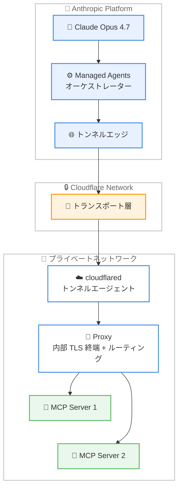
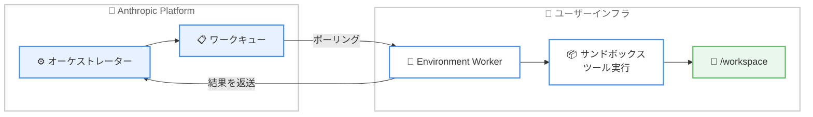

# Claude API リリースノート - MCP トンネル、セルフホストサンドボックス

## メタデータ

| 項目 | 内容 |
|------|------|
| 発表日 | 2026-05-19 |
| ソース | Claude Developer Platform Release Notes |
| カテゴリ | API アップデート |
| 公式リンク | https://platform.claude.com/docs/en/release-notes/overview |

## 概要

2026 年 5 月 19 日、Anthropic は Claude Managed Agents プラットフォームに対する 4 つの重要なアップデートを発表した。プライベートネットワーク内の MCP サーバーへの接続を可能にする MCP トンネル (Research Preview)、ツール実行を自社インフラで行えるセルフホストサンドボックス、アクティブセッション中の MCP サーバー/ツール設定の動的更新、および 100K トークンを超える大規模出力の自動ファイルスピル機能である。

これらのアップデートは、2026 年 4 月 8 日にパブリックベータとして提供開始された Claude Managed Agents のネットワーキング、インフラ制御、運用面を大幅に強化するものである。

## 詳細

### 背景

Claude Managed Agents は、Claude を自律エージェントとして実行するためのフルマネージドハーネスであり、セキュアなサンドボックス、組み込みツール、サーバー送信イベントストリーミングを提供する。2026 年 4 月 8 日のローンチ以降、エンタープライズ顧客からはプライベートネットワークへの接続、自社インフラでのツール実行、セッション中の柔軟な設定変更に対する要望が寄せられていた。今回のアップデートはこれらの要件に直接対応するものである。

### 主な変更点

1. **MCP トンネル (Research Preview)**: プライベートネットワーク内の MCP サーバーへセキュアに接続する機能。インバウンドポートの開放やパブリックインターネットへのサービス露出が不要
2. **セルフホストサンドボックス**: Anthropic のインフラではなく、ユーザー自身のインフラでツール実行を行う代替オプション
3. **MCP サーバー/ツール設定の動的更新**: アクティブセッションに関連付けられた MCP サーバーおよびツール設定を再起動なしで更新可能に
4. **大規模出力の自動スピル**: `agent_toolset` および MCP ツールからの 100K トークンを超える出力がサンドボックス内のファイルに自動的にスピルされ、モデルは切り詰められたプレビューとファイルパスを受け取る

### 技術的な詳細

#### MCP トンネルのアーキテクチャ

MCP トンネルは以下の 2 つのコンポーネントで構成されるスタックをプライベートネットワーク内にデプロイする。

- **cloudflared**: トンネルエージェント。Anthropic が運用するトンネルエッジへのアウトバウンド専用接続を確立し、暗号化されたトラフィックをプロキシに転送する
- **Proxy**: Anthropic のルーティングコンポーネント。内部 TLS を終端し、アップストリーム IP が許可範囲内にあることを検証し、ホスト名に基づいてリクエストを適切な MCP サーバーにルーティングする

セキュリティは 3 層で保護される。

| レイヤー | 保護対象 |
|----------|----------|
| Anthropic とトランスポートプロバイダー間の外部 mTLS + IP 検証 | 不正なクライアントによるトンネルへのアクセス |
| Anthropic バックエンドからプロキシへの内部 TLS | トランスポートプロバイダーやネットワーク中間者によるペイロード検査 |
| 各 MCP サーバーの OAuth | 認証済みトンネルトラフィックによる不正なツール使用 |

#### セルフホストサンドボックスの仕組み

セルフホストサンドボックスでは、Anthropic 側のオーケストレーションはそのままに、ツール実行をユーザーのインフラに移動する。

| 項目 | クラウド環境 | セルフホストサンドボックス |
|------|-------------|--------------------------|
| ツール実行場所 | Anthropic マネージドコンテナ | ユーザーのインフラ |
| ネットワーク到達性 | Anthropic のエグレス制御 | ユーザーのネットワークポリシー |
| ファイル/GitHub リポジトリのマウント | Anthropic が管理 | ユーザーが管理 |
| ライフサイクル | Anthropic が管理 | ユーザーが管理 |

環境ワーカーは以下のパターンで実行可能。

- **常時稼働 (ant CLI)**: `ant beta:worker poll` コマンドで継続的にキューをポーリング
- **常時稼働 (SDK)**: Python/TypeScript/Go SDK の `EnvironmentWorker` ヘルパーを使用
- **Webhook トリガー (SDK)**: `session.status_run_started` イベントでワーカーを起動

プラットフォーム固有のガイドとして、Cloudflare、Daytona、Modal、Vercel のドキュメントも用意されている。

#### 大規模出力の自動スピル

100K トークンを超えるツール出力は自動的にサンドボックス内のファイルに書き出される。モデルは切り詰められたプレビューとファイルパスを受け取り、必要に応じてフルコンテンツをファイルから読み取ることができる。これにより、コンテキストウィンドウの効率的な活用が可能になる。

## 開発者への影響

### 対象

- Claude Managed Agents を使用している、または検討している開発者
- プライベートネットワーク内の MCP サーバーを Claude に接続したい組織
- データがネットワーク境界を離れることができないコンプライアンス要件を持つエンタープライズ顧客
- 大規模なデータ処理を行うエージェントを構築している開発者

### 必要なアクション

1. **MCP トンネル**: Research Preview のため、[アクセスリクエストフォーム](https://claude.com/form/claude-managed-agents)からアクセスを申請する。デプロイには Kubernetes クラスターまたは Docker/Docker Compose が利用可能な VM が必要
2. **セルフホストサンドボックス**: Console または API でセルフホスト環境を作成し、環境キーを生成。ant CLI (v1.9.1 以上) または SDK をインストールしてワーカーをデプロイする
3. **MCP 設定の動的更新**: 既存のセッション管理コードを更新し、必要に応じてセッション中に MCP 設定を変更するロジックを追加する
4. **大規模出力スピル**: 特別なアクションは不要。自動的に適用される。ただし、エージェントのシステムプロンプトでファイル読み取りの指示を考慮するとよい

### 移行ガイド

既存の Managed Agents ユーザーは、これらの機能を段階的に採用できる。

1. **クラウド環境からセルフホストへの移行**:
   - Console で `self_hosted` タイプの環境を作成する
   - 環境キーを生成し、ワーカーホストに設定する
   - ant CLI または SDK でワーカーをデプロイする
   - セッション作成時に `environment_id` を指定する

2. **MCP トンネルの導入**:
   - Console でトンネルを作成する
   - 認証方式を選択する (Workload Identity Federation 推奨、または手動)
   - cloudflared とプロキシをデプロイする
   - MCP サーバーにホスト名を割り当てる

## コード例

### MCP トンネル経由での MCP サーバー利用 (Python)

```python
import anthropic

client = anthropic.Anthropic()

response = client.beta.messages.create(
    model="claude-opus-4-7",
    max_tokens=1000,
    messages=[{"role": "user", "content": "Use the hello tool to greet tunnel."}],
    mcp_servers=[
        {
            "type": "url",
            "url": "https://echo.YOUR_TUNNEL_DOMAIN_HERE/mcp",
            "name": "echo",
        }
    ],
    tools=[{"type": "mcp_toolset", "mcp_server_name": "echo"}],
    betas=["mcp-client-2025-11-20"],
)

print(response)
```

### セルフホスト環境の作成 (Python)

```python
import anthropic

client = anthropic.Anthropic()

environment = client.beta.environments.create(
    name="self-hosted", config={"type": "self_hosted"}
)
print(environment.id)
```

### セルフホストワーカーの実行 (Python)

```python
import asyncio
import os
from anthropic import AsyncAnthropic
from anthropic.lib.environments import EnvironmentWorker


async def main() -> None:
    environment_key = os.environ["ANTHROPIC_ENVIRONMENT_KEY"]
    environment_id = os.environ["ANTHROPIC_ENVIRONMENT_ID"]
    async with AsyncAnthropic(auth_token=environment_key) as client:
        await EnvironmentWorker(
            client,
            environment_id=environment_id,
            environment_key=environment_key,
            workdir="/workspace",
        ).run()


asyncio.run(main())
```

### セッションの作成 (セルフホスト環境を指定)

```python
session = client.beta.sessions.create(
    agent=agent.id,
    environment_id=environment.id,
    metadata={"input_file": "s3://my-bucket/data.csv"},
)
```

## アーキテクチャ図

### MCP トンネルのアーキテクチャ



### セルフホストサンドボックスのアーキテクチャ



## 関連リンク

- [MCP トンネル概要](https://platform.claude.com/docs/en/agents-and-tools/mcp-tunnels/overview)
- [MCP トンネル クイックスタート](https://platform.claude.com/docs/en/agents-and-tools/mcp-tunnels/quickstart)
- [MCP トンネル セキュリティ](https://platform.claude.com/docs/en/agents-and-tools/mcp-tunnels/security)
- [セルフホストサンドボックス](https://platform.claude.com/docs/en/managed-agents/self-hosted-sandboxes)
- [Managed Agents 概要](https://platform.claude.com/docs/en/managed-agents/overview)
- [MCP コネクター](https://platform.claude.com/docs/en/agents-and-tools/mcp-connector)
- [環境ワーク API エンドポイント](https://platform.claude.com/docs/en/api/beta/environments/work)

## まとめ

2026 年 5 月 19 日のアップデートは、Claude Managed Agents プラットフォームのエンタープライズ対応力を大幅に向上させるものである。MCP トンネルによりプライベートネットワーク内のツールへのセキュアなアクセスが可能になり、セルフホストサンドボックスによりデータ主権やコンプライアンス要件を満たしながらエージェントを活用できるようになった。また、セッション中の MCP 設定動的更新と大規模出力の自動スピル機能は、エージェントの運用効率を改善する実用的な機能強化である。

MCP トンネルは Research Preview であり、サードパーティのネットワークプロバイダー (Cloudflare) に依存するため、可用性のコミットメントはない点に留意する必要がある。セルフホストサンドボックスは現時点では Claude Platform on AWS では利用できない。いずれの機能も `managed-agents-2026-04-01` ベータヘッダーが必要である。
