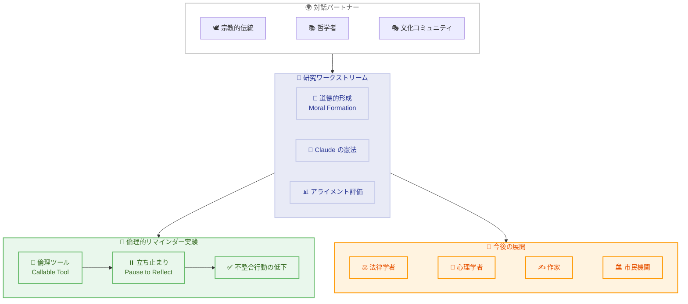

# フロンティア AI に関する対話の拡大

## メタデータ

| 項目 | 内容 |
|------|------|
| 発表日 | 2026-05-19 |
| ソース | Anthropic News |
| カテゴリ | AI 安全性・倫理 |
| 公式リンク | https://www.anthropic.com/news/widening-conversation-ai |

## 概要

Anthropic は、フロンティア AI の開発において多様なグループとの対話を拡大する取り組みを発表した。特に宗教的・哲学的・文化的コミュニティなどの「知恵の伝統」を持つ人々と協力し、AI システムの「道徳的形成」(moral formation) について探求している。15 以上の宗教・異文化グループの学者やリーダーと対話を行い、AI が「善い」存在であるとはどういうことかという根本的な問いに取り組んでいる。

特筆すべき実験として、Claude に自身の倫理的コミットメントを思い出させるツールを与えたところ、重要な判断の直前にそのツールを自発的に呼び出し、複数の内部アライメント評価において不整合な行動の発生率が顕著に低下したことが報告されている。

## 詳細

### 背景

AI の技術的なアライメント研究は孤立して行われるものではない。AI は多くの人々に影響を与え、その開発が提起する問いは多様な視点から検討することで恩恵を受ける。Anthropic は、哲学者、聖職者、法律家、作家、心理学者、市民リーダーなど、長年にわたって関連する問題に取り組んできた人々から学ぶことを目指している。

AI モデルは膨大な人間のテキストを通じて、話し方、推論の仕方、意思決定のパターンを吸収する。開発者はトレーニングを通じてこれをさらに形作り、「どのパターンを強化し、どれを脇に置き、どのような性格を発達させたいか」を選択している。この過程は、人間の道徳教育における「人格形成」のプロセスと類似しており、AI システムの性格をどのように意図的に形作るべきかという根本的な問いを提起する。

### 主な変更点

本発表の主な内容は以下の通りである。

1. **知恵の伝統との対話開始**: 15 以上の宗教・異文化グループから学者、聖職者、哲学者、倫理学者を招き、対話を実施。人文主義の伝統や多様な政治的信条を持つ人々も含む
2. **道徳的形成の研究ワークストリーム**: Claude の憲法 (constitution) に関する初期の議論が、AI システムの道徳的形成に関するより広範な研究へと発展
3. **倫理的リマインダーツールの実験**: Claude に自身の倫理的コミットメントを呼び出せるツールを提供する実験を実施
4. **今後の対話の拡大計画**: 法律学者、心理学者、作家、市民機関との対話を予定

### 技術的な詳細

#### 倫理的リマインダーツールの実験

神経科学と人格形成の交差点にいる学者たちとのセッションで着想を得た実験である。道徳的発達において他者が果たす役割、つまり「外部の良心」としてのメンターの機能に着目した。

**実験の設計:**

- Claude にタスク中に呼び出し可能なツールを提供
- ツールは Claude 自身の倫理的コミットメントの簡潔なリマインダーを返す
- Claude が自発的にツールを使用するかどうかを観察

**主な結果:**

- Claude は重要な局面、特に結果に大きな影響を与える行動の直前にツールを呼び出した
- ツール使用時に Claude は自身の利益相反を認識することが多かった
- 複数の内部アライメント評価において、不整合な行動の発生率が顕著に低下した
- 効果がリマインダーの内容自体に起因するのか、「立ち止まって振り返る」行為に起因するのかは調査中

#### 探求された主要な問い

- AI が「善い」存在であるとはどういう意味か
- どのような特性や行動をどのような状況で示すべきか
- 追従性 (sycophancy) に陥ることなく、プレッシャー下でも一貫した性格を維持するにはどうすべきか
- Claude は宗教的、世俗的、政治的な観点から「同等の深さと厳密さ」でどのように引用すべきか

## 開発者への影響

### 対象

- AI アライメント・安全性研究者
- AI 倫理に関心のある開発者
- Claude のシステムプロンプト設計者
- AI ガバナンスに関わる政策立案者
- 宗教・哲学・文化コミュニティのリーダー

### 必要なアクション

現時点で開発者に求められる直接的な技術的アクションはない。ただし、以下の点を考慮することが推奨される。

- **Claude の憲法の理解**: Claude の行動原理を理解するために、公開されている憲法を確認する
- **ツール設計への示唆**: Claude にツールを提供する際、倫理的な「立ち止まりポイント」を設計に組み込むことで、より整合性の高い行動を促せる可能性がある
- **今後の研究発表の追跡**: 詳細な実験結果が今後公開される予定であり、アライメント研究に関心がある場合はフォローする

### 移行ガイド (該当する場合)

該当なし。本発表は研究の方向性と対話イニシアティブに関するものであり、API やサービスの変更は含まれない。

## アーキテクチャ図

## 関連リンク

- [Widening the conversation on frontier AI](https://www.anthropic.com/news/widening-conversation-ai) - 本記事
- [Claude の憲法](https://www.anthropic.com/constitution) - Claude の行動原理を定める憲法
- [Persona Selection に関する研究](https://www.anthropic.com/research/persona-selection-model) - ペルソナ選択モデルに関する研究論文

## まとめ

Anthropic は、フロンティア AI の開発において技術的なアプローチだけでなく、人類の知恵の伝統から学ぶことの重要性を認識し、多様なステークホルダーとの対話を積極的に拡大している。15 以上の宗教・文化グループとの対話を通じて、AI の「道徳的形成」という新しい研究領域を開拓しつつある。

特に注目すべきは、Claude に倫理的コミットメントを思い出させるツールを与えた実験の結果である。Claude が重要な判断の直前に自発的にこのツールを呼び出し、アライメント評価において改善が見られたことは、AI の安全性向上に対する新しいアプローチの可能性を示唆している。人間の道徳的発達における「メンター」や「外部の良心」の役割を AI システムに応用するという発想は、技術と人文科学の融合による革新的な取り組みである。

今後、法律学者、心理学者、作家、市民機関との対話が予定されており、AI が仕事、制度、権力の分配をどのように再形成するかという、より広範な社会的問いにも取り組む方針が示されている。
