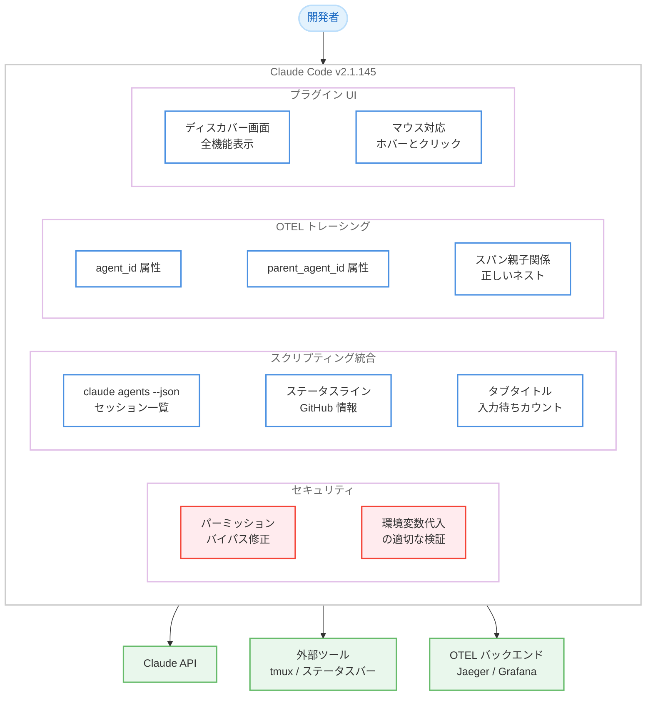

# Claude Code v2.1.145 - セキュリティ修正とスクリプティング支援の強化

## メタデータ

| 項目 | 内容 |
|------|------|
| 発表日 | 2026-05-20 |
| ソース | Claude Code Changelog |
| カテゴリ | Claude Code アップデート |
| 公式リンク | https://github.com/anthropics/claude-code/blob/main/CHANGELOG.md |

## 概要

Claude Code v2.1.145 は、新機能 7 件、バグ修正 12 件、改善 1 件を含むアップデートである。セキュリティ修正として、環境変数代入を利用したパーミッションプロンプトバイパスの脆弱性が修正された。また、`claude agents --json` コマンドの追加により外部スクリプトとの統合が容易になり、OTEL トレーシングの改善でマルチエージェント環境のデバッグ体験が向上している。

プラグインシステムでは、インストール前にプラグインの全機能 (コマンド、エージェント、スキル、フック、MCP/LSP サーバー) を確認できるようになり、安全で情報に基づいたプラグイン選択が可能になった。

## 詳細

### 背景

Claude Code v2.1.144 ではバックグラウンドセッション管理とプラグイン強化が行われた。v2.1.145 では、セキュリティの堅牢化、外部ツールとの統合性向上、Agent Teams 機能の安定化に焦点が置かれている。

特に、パーミッションプロンプトバイパスの脆弱性修正は、Bash コマンド実行における安全性を確保する重要なセキュリティ対応である。また、`claude agents --json` による JSON 出力のサポートは、tmux-resurrect やステータスバーなどの外部ツールとの連携を想定した開発者体験の改善である。

### 主な変更点

#### 新機能 (7 件)

1. **`claude agents --json` コマンド**: 実行中の Claude セッションを JSON 形式で一覧表示。tmux-resurrect、ステータスバー、セッションピッカーなどの外部スクリプトとの統合に利用可能
2. **OTEL スパンへの `agent_id` / `parent_agent_id` 属性追加**: `claude_code.tool` スパンにエージェント識別子が付与され、バックグラウンドサブエージェントのスパンが Agent ツールスパン配下に正しくネストされるようトレース親子関係を修正
3. **ステータスライン JSON に GitHub リポジトリおよび PR 情報を含める**: 検出時に自動で追加される
4. **`/plugin` のディスカバー/ブラウズ画面でプラグインの全機能を表示**: インストール前にコマンド、エージェント、スキル、フック、MCP/LSP サーバーを確認可能
5. **`claude agents` タブタイトルに入力待ちカウントを表示**: Alt-Tab で切り替えたウィンドウからエージェントが注意を必要としているかを即座に確認可能
6. **スラッシュコマンドおよび @メンションのサジェストリストがフルスクリーンモードでマウスホバーとクリックに対応**
7. **Stop / SubagentStop フック入力に `background_tasks` および `session_crons` フィールドを追加**

#### バグ修正 (12 件)

1. **パーミッションプロンプトバイパスの修正** (セキュリティ): Bash コマンド内の非許可リスト環境変数への素の変数代入が自動承認されていた脆弱性を修正
2. **MCP プロンプトスラッシュコマンドのエラー表示改善**: 必須引数を省略した際に生のサーバーバリデーションエラーではなく、不足している引数名と期待される使い方を表示
3. **スピナーおよび経過時間表示のフリーズ修正**: ターミナルのリサイズまたは再フォーカス後にキー入力まで更新が止まる問題を解消
4. **Windows PowerShell 5.1 でのクロスプロジェクト resume ヒント修正**: Windows ではコマンドセパレータとして `;` を使用するよう変更
5. **エージェントビューのリプライペインで音声プッシュトゥトークが動作しない問題を修正**
6. **タスクリストの表示順序修正**: 複数タスクを同時に作成した際にランダムな順序で表示される問題を解消
7. **「Failed to install Anthropic marketplace」バナーの誤表示修正**: マーケットプレイスが既にインストールされている場合に古いエラーバナーが表示されなくなった
8. **PR バッジのリアルタイム更新修正**: `gh pr create` などの PR 状態変更コマンド実行後にフッターの PR バッジが即座に更新される
9. **Agent Teams の非 ASCII 名対応修正**: 非 ASCII 文字を含むチームメイト名が無効なヘッダーエンコーディングにより全 API コールが失敗する問題を修正
10. **`/review` コマンドの GraphQL クエリ修正**: 廃止された `projectCards` クエリを使用しており、Classic Projects を持つリポジトリでエラーが発生する問題を修正
11. **`claude plugin validate` のスキルエントリ検証修正**: `skills:` エントリがディレクトリではなくファイルを指している場合にフラグを立て、親ディレクトリを提案するよう改善
12. **スキルの `context: fork` による無限ループ修正**: 自己を繰り返し再呼び出しする代わりに正しく実行されるよう修正

#### 改善 (1 件)

1. **Read ツールのトークン制限超過時の動作改善**: ファイル全体の読み込みがトークン制限を超える場合、ハードエラーではなく最初のページを切り詰めて「PARTIAL view」通知とともに返すよう変更

### 技術的な詳細

#### セキュリティ修正: パーミッションプロンプトバイパス

Bash コマンドの実行において、許可リストに含まれない環境変数への素の変数代入 (例: `SECRET_KEY=value`) がパーミッションプロンプトなしで自動承認される脆弱性が存在した。この修正により、許可リストにない環境変数の代入を含むコマンドは適切にパーミッションプロンプトが表示されるようになった。

#### OTEL トレーシングの親子関係修正

マルチエージェント構成において、バックグラウンドサブエージェントの OTEL スパンが正しい親スパン (ディスパッチ元の Agent ツールスパン) の配下にネストされるようになった。`agent_id` と `parent_agent_id` 属性により、トレース内でどのエージェントがどのツール呼び出しを実行したかを明確に識別できる。

#### Agent Teams の非 ASCII 名対応

Agent Teams でチームメイト名に日本語などの非 ASCII 文字を使用している場合、HTTP ヘッダーへのエンコーディング処理が不適切であり、全 API コールが失敗していた。この修正により、非 ASCII 文字を含む名前が正しくエンコードされ、国際化された環境での Agent Teams 利用が安定した。

#### Read ツールのグレースフルデグラデーション

従来、大規模ファイルの全体読み込みがトークン制限を超えると即座にエラーが発生していた。v2.1.145 では、最初のページ分のコンテンツを返しつつ「PARTIAL view」通知を添付する方式に変更された。これにより、ファイルの先頭部分を確認してから必要な範囲を指定して再読み込みするワークフローが自然に実現される。

## 開発者への影響

### 対象

- Claude Code CLI を使用するすべての開発者
- Agent Teams 機能を利用しているチーム (特に非 ASCII 名を使用するチーム)
- OTEL トレーシングでデバッグを行うマルチエージェント環境の運用者
- tmux やカスタムスクリプトで Claude セッションを管理している開発者
- プラグインを開発・評価しているエコシステム参加者
- Windows 環境で Claude Code を使用している開発者

### 必要なアクション

1. **全ユーザー**: `claude update` でセキュリティ修正を含む v2.1.145 にアップデート
2. **Agent Teams で非 ASCII 名を使用している場合**: アップデート後に正常動作を確認
3. **OTEL トレーシングを利用している場合**: 新しい `agent_id` / `parent_agent_id` 属性を活用してダッシュボードやアラートを強化可能
4. **`/review` コマンドが Classic Projects リポジトリでエラーになっていた場合**: アップデートで解消
5. **プラグイン開発者**: `claude plugin validate` の新しいスキルディレクトリ検証に対応しているか確認

### 移行ガイド (該当する場合)

**セキュリティ対応**:

パーミッションプロンプトバイパスの修正により、以前は自動承認されていた環境変数代入コマンドでプロンプトが表示されるようになる可能性がある。正当なワークフローで環境変数を設定する場合は、`.claude/settings.json` の `permissions.allow` に該当コマンドパターンを追加することで対応可能。

**外部スクリプトの統合**:

`claude agents --json` を利用して、既存のセッション管理スクリプトを簡素化できる。

## コード例

### claude agents --json によるセッション管理

```bash
# 実行中の Claude セッションを JSON で取得
claude agents --json

# 出力例:
# [
#   {"id": "abc123", "status": "running", "task": "テスト実行中..."},
#   {"id": "def456", "status": "awaiting_input", "task": "コードレビュー"}
# ]

# tmux ステータスバーでの活用例
claude agents --json | jq '[.[] | select(.status == "awaiting_input")] | length'
# → 入力待ちセッション数を表示

# セッションピッカーでの活用例
claude agents --json | jq -r '.[] | "\(.id)\t\(.status)\t\(.task)"' | fzf | cut -f1
```

### OTEL スパン属性の活用

```python
# OTEL トレースでのエージェント識別例
from opentelemetry import trace

# claude_code.tool スパンに含まれる属性
# - agent_id: ツールを実行したエージェントの ID
# - parent_agent_id: 親エージェントの ID (サブエージェントの場合)

# Jaeger/Grafana でのフィルタリング例
# service.name = "claude-code"
# span.name = "claude_code.tool"
# span.attributes.agent_id = "main-agent"
# span.attributes.parent_agent_id = ""  (トップレベル)
```

### Stop フックでのバックグラウンドタスク情報取得

```json
{
  "hooks": {
    "Stop": [
      {
        "command": ["python3", "on_stop.py"],
        "description": "セッション停止時の処理"
      }
    ]
  }
}
```

```python
# on_stop.py - フック入力の新フィールド活用
import json
import sys

hook_input = json.load(sys.stdin)

# v2.1.145 で追加されたフィールド
background_tasks = hook_input.get("background_tasks", [])
session_crons = hook_input.get("session_crons", [])

if background_tasks:
    print(f"実行中のバックグラウンドタスク: {len(background_tasks)} 件")
    for task in background_tasks:
        print(f"  - {task}")

if session_crons:
    print(f"登録されたセッション cron: {len(session_crons)} 件")
```

## アーキテクチャ図



## 関連リンク

- [Claude Code Changelog](https://github.com/anthropics/claude-code/blob/main/CHANGELOG.md)
- [Claude Code ドキュメント](https://docs.anthropic.com/en/docs/claude-code)
- [OpenTelemetry トレーシング](https://opentelemetry.io/)
- [Claude Code プラグイン開発ガイド](https://docs.anthropic.com/en/docs/claude-code/plugins)
- [Claude Code Agent Teams](https://docs.anthropic.com/en/docs/claude-code/agent-teams)

## まとめ

Claude Code v2.1.145 は、セキュリティ、スクリプティング統合、オブザーバビリティの 3 つの柱を中心としたアップデートである。

最も重要な変更は、環境変数代入を利用したパーミッションプロンプトバイパスのセキュリティ修正であり、全ユーザーに即座のアップデートを推奨する。

開発者体験の面では、`claude agents --json` により外部スクリプトとの統合が格段に容易になり、OTEL スパンへのエージェント ID 追加によりマルチエージェント環境のデバッグが効率化された。プラグインシステムでは、インストール前の全機能プレビューにより、安全で情報に基づいたプラグイン選択が可能になった。

12 件のバグ修正の中でも、Agent Teams の非 ASCII 名対応は日本語環境のユーザーにとって特に重要な修正であり、国際化対応の改善が着実に進んでいることを示している。
