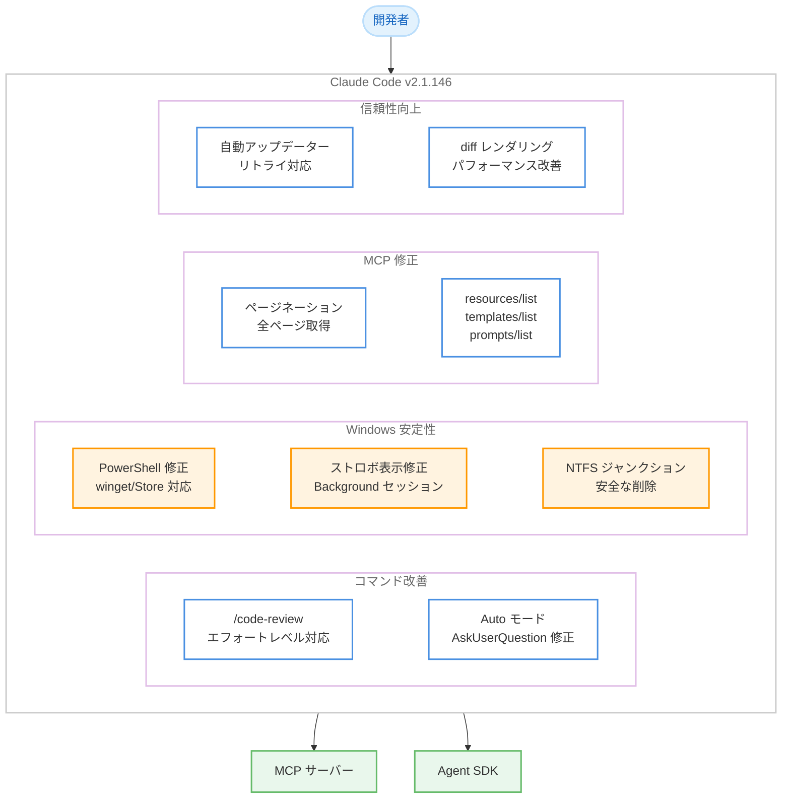

# Claude Code v2.1.146 - コマンドリネーム、Auto モード改善、Windows 安定性修正

## メタデータ

| 項目 | 内容 |
|------|------|
| 発表日 | 2026-05-21 |
| ソース | Claude Code Changelog |
| カテゴリ | CLI ツール更新 |
| 公式リンク | https://github.com/anthropics/claude-code/blob/main/CHANGELOG.md |

## 概要

Claude Code v2.1.146 は、ユーザー向けコマンドの改善、Auto モードの動作修正、Windows 環境の安定性強化、MCP ページネーション修正を含むアップデートである。`/simplify` コマンドが `/code-review` にリネームされてエフォートレベル指定が可能になり、Auto モードでは `AskUserQuestion` の抑制ロジックが修正されてスキルやユーザーが明示的に依存している場合に正しく動作するようになった。

Windows 環境では v2.1.124 で導入されたリグレッションを含む複数の修正が行われ、PowerShell ツールの安定性、バックグラウンドセッションのストロボ表示、NTFS ジャンクション経由のワークツリー削除問題が解消された。また、MCP のページネーション処理で 2 ページ目以降のアイテムがドロップされる問題が修正された。

## 詳細

### 背景

Claude Code v2.1.145 ではセキュリティ修正と OTEL トレーシング強化が行われた。v2.1.146 では、日常的なユーザー体験の改善と、Windows プラットフォームの安定性向上に焦点が置かれている。

特に `/simplify` から `/code-review` へのリネームは、コマンドの目的をより明確に伝える命名変更であり、オプションのエフォートレベル指定によりレビューの深さを制御できるようになった。また、MCP ページネーション修正は、大量のリソースやプロンプトを提供する MCP サーバーとの連携における信頼性を大幅に向上させる。

### 主な変更点

#### コマンド変更 (1 件)

1. **`/simplify` を `/code-review` にリネーム**: オプションのエフォートレベル指定が可能 (例: `/code-review high`)。コードレビューの深さを `low`、`medium`、`high` で制御できる

#### 動作変更 (1 件)

1. **Auto モードでの `AskUserQuestion` 抑制ロジック修正**: ユーザーまたはスキルが明示的に `AskUserQuestion` に依存している場合、Auto モードでも抑制されなくなった

#### バグ修正 (10 件)

1. **Windows PowerShell ツールの "command line is invalid" エラー修正**: winget または Microsoft Store 経由で `pwsh` をインストールした環境での失敗を修正 (v2.1.124 でのリグレッション)
2. **MCP ページネーション修正**: `resources/list`、`resources/templates/list`、`prompts/list` で 2 ページ目以降のアイテムがドロップされる問題を修正
3. **Windows Terminal でのフルスクリーンストロボ修正**: アタッチされたバックグラウンドセッションで Claude がストリーミング中に画面がちらつく問題を修正
4. **自動アップデーターのステータスライン修正**: アップデート失敗時に現在のバージョンが表示されない問題を修正
5. **Windows での NTFS ジャンクション問題修正**: バックグラウンドジョブのワークツリー削除時にメインリポジトリへ NTFS ジャンクションを辿ってしまう問題を修正
6. **`/background` コマンドのセッション拒否修正**: 唯一の入力がスキルまたはカスタムスラッシュコマンドであるセッションが拒否される問題を修正
7. **バックグラウンドセッションの権限再要求修正**: 「don't ask again」で許可済みのツール権限がバックグラウンドセッションで再度要求される問題を修正
8. **`/theme` ダイアログの Esc キー修正**: カラーエディターと「New custom theme」ダイアログが Esc キーに反応しない問題を修正
9. **Agent SDK ストリーミングセッション終了時の例外修正**: ストリーミングセッション終了時にキャッチされない例外が発生する問題を修正
10. **`forceLoginOrgUUID` / `forceLoginMethod` ポリシー修正**: マネージド設定のログインポリシーがサードパーティプロバイダーおよび API キーセッションに対して適用されない問題を修正
11. **GNOME Terminal のペースト修正**: 右クリックおよび中クリックでのペーストがテキストを挿入しない問題を修正
12. **`CLAUDE_CODE_SUBAGENT_MODEL` 環境変数修正**: マルチエージェントセッションで子プロセスに転送されない問題を修正

#### 改善 (2 件)

1. **自動アップデーターの信頼性向上**: ネイティブバージョンチェックとダウンロードが一時的なネットワーク障害時に即座に失敗する代わりにリトライするようになった
2. **大規模ファイル編集時の diff レンダリングパフォーマンス改善**: 大きなファイルの差分表示が高速化された

### 技術的な詳細

#### `/code-review` コマンドのエフォートレベル

従来の `/simplify` コマンドは、コードの簡素化と品質改善を提案する単一機能であった。`/code-review` へのリネームにより、コマンドの意図がより明確になるとともに、エフォートレベルの指定で以下のような段階的なレビューが可能になった。

| レベル | 説明 |
|--------|------|
| (指定なし) | デフォルトのレビュー深度 |
| `low` | 軽量レビュー (明らかな問題のみ) |
| `high` | 詳細レビュー (再利用性、効率性、品質を網羅的に確認) |

#### Auto モードと AskUserQuestion

Auto モードでは通常、Claude がユーザーに質問を投げかける `AskUserQuestion` ツールの使用が抑制され、自律的に処理を進める。しかし、スキルやユーザーのワークフローが明示的に `AskUserQuestion` に依存している場合 (例: 確認プロンプトを必須とするスキル)、この抑制がワークフローを破壊していた。

v2.1.146 では、ユーザーまたはスキルが明示的に依存している場合に限り、`AskUserQuestion` の抑制を無効化する条件付きロジックが導入された。

#### MCP ページネーション修正

MCP (Model Context Protocol) サーバーが `resources/list`、`resources/templates/list`、`prompts/list` の各エンドポイントでページネーションを使用している場合、Claude Code は最初のページのみを処理し、後続ページのアイテムを破棄していた。この修正により、全ページのアイテムが正しく収集されるようになった。

#### Windows PowerShell リグレッション修正

v2.1.124 で導入されたリグレッションにより、winget または Microsoft Store 経由でインストールされた `pwsh` が "command line is invalid" エラーで失敗していた。この問題は、これらのインストール方法固有のパス解決やコマンドライン構築の差異に起因しており、v2.1.146 で正しく対応された。

#### NTFS ジャンクションの安全な削除

Windows では、バックグラウンドジョブが専用のワークツリーで動作する。ワークツリーの削除時に、NTFS ジャンクション (シンボリックリンクに類似) を辿ってメインリポジトリのファイルを削除してしまう危険性があった。v2.1.146 では、ジャンクションを辿らずにワークツリーのみを安全に削除する処理が実装された。

## 開発者への影響

### 対象

- Claude Code CLI を使用するすべての開発者
- `/simplify` コマンドを使用していた開発者
- Auto モードでスキルを活用している開発者
- Windows 環境で Claude Code を使用している開発者 (特に winget/Microsoft Store 経由で PowerShell をインストールしている場合)
- MCP サーバーと連携している開発者
- Agent SDK を利用してストリーミングセッションを実装している開発者
- マルチエージェント構成で `CLAUDE_CODE_SUBAGENT_MODEL` を使用している開発者
- 企業環境で `forceLoginOrgUUID` / `forceLoginMethod` ポリシーを適用している管理者

### 必要なアクション

1. **全ユーザー**: `claude update` で v2.1.146 にアップデート
2. **`/simplify` を使用していた場合**: `/code-review` に切り替え。オプションでエフォートレベルを指定可能
3. **Windows + winget/Microsoft Store の `pwsh` ユーザー**: アップデートにより v2.1.124 以降の PowerShell エラーが解消
4. **MCP サーバーで大量のリソース/プロンプトを提供している場合**: アップデート後にすべてのアイテムが正しく取得されることを確認
5. **Agent SDK でストリーミングセッションを実装している場合**: アップデートにより終了時の例外が解消
6. **`CLAUDE_CODE_SUBAGENT_MODEL` を使用している場合**: アップデートにより子プロセスへの環境変数転送が修正
7. **企業管理者**: ログインポリシーがサードパーティセッションに正しく適用されることを確認

### 移行ガイド (該当する場合)

**`/simplify` から `/code-review` への移行**:

コマンド名が変更されたため、ドキュメントやチーム内の手順書で `/simplify` を参照している場合は `/code-review` に更新する必要がある。

```bash
# 旧コマンド (v2.1.145 以前)
/simplify

# 新コマンド (v2.1.146 以降)
/code-review          # デフォルトのレビュー深度
/code-review high     # 詳細レビュー
/code-review low      # 軽量レビュー
```

**Auto モード + スキルの確認**:

`AskUserQuestion` に依存するスキルを Auto モードで使用している場合、v2.1.146 以降は正しく質問が表示されるようになる。以前 Auto モードで質問がスキップされていた場合は、意図した動作が復元されていることを確認する。

## コード例

### /code-review コマンドの使用

```bash
# デフォルトのレビュー深度でコードレビューを実行
/code-review

# 詳細レビュー (再利用性、品質、効率性を網羅的にチェック)
/code-review high

# 軽量レビュー (明らかな問題のみ)
/code-review low
```

### MCP サーバーのページネーション確認

```typescript
// MCP サーバーがページネーションを使用している場合の動作確認
// v2.1.146 以降、全ページのアイテムが正しく取得される

// サーバー側 (例: 100 件のリソースを 10 件ずつページネーション)
server.setRequestHandler(ListResourcesRequestSchema, async (request) => {
  const page = request.params?.cursor ? parseInt(request.params.cursor) : 0;
  const pageSize = 10;
  const resources = getAllResources();
  const start = page * pageSize;
  const end = start + pageSize;

  return {
    resources: resources.slice(start, end),
    nextCursor: end < resources.length ? String(page + 1) : undefined,
  };
});

// クライアント側 (Claude Code v2.1.146)
// → 全 100 件が正しく取得される (v2.1.145 以前は最初の 10 件のみ)
```

### CLAUDE_CODE_SUBAGENT_MODEL の設定

```bash
# マルチエージェントセッションでサブエージェントのモデルを指定
export CLAUDE_CODE_SUBAGENT_MODEL="claude-sonnet-4-6"

# v2.1.146 以降、この環境変数が子プロセスに正しく転送される
claude --agent-mode
```

## アーキテクチャ図



## 関連リンク

- [Claude Code Changelog](https://github.com/anthropics/claude-code/blob/main/CHANGELOG.md)
- [Claude Code ドキュメント](https://docs.anthropic.com/en/docs/claude-code)
- [MCP (Model Context Protocol) 仕様](https://modelcontextprotocol.io/)
- [Claude Code バックグラウンドセッション](https://docs.anthropic.com/en/docs/claude-code/background-sessions)
- [Claude Code Agent SDK](https://docs.anthropic.com/en/docs/claude-code/agent-sdk)

## まとめ

Claude Code v2.1.146 は、コマンド改善、Auto モード動作修正、Windows 安定性強化、MCP ページネーション修正を柱としたアップデートである。

最もユーザーに影響する変更は `/simplify` から `/code-review` へのリネームであり、エフォートレベル指定によりレビューの深さを制御できるようになった。Auto モードでの `AskUserQuestion` 抑制ロジック修正は、スキル連携の信頼性を向上させる重要な動作変更である。

Windows 環境では、v2.1.124 で導入された PowerShell リグレッションの修正をはじめ、ストロボ表示、NTFS ジャンクション、GNOME Terminal ペーストなど、プラットフォーム固有の問題が多数解消された。

MCP ページネーション修正は、大量のリソースやプロンプトを提供する MCP サーバーとの連携において、データの欠損を防ぐ重要な修正である。自動アップデーターのリトライ対応と diff レンダリングのパフォーマンス改善により、日常的な使用感も向上している。
