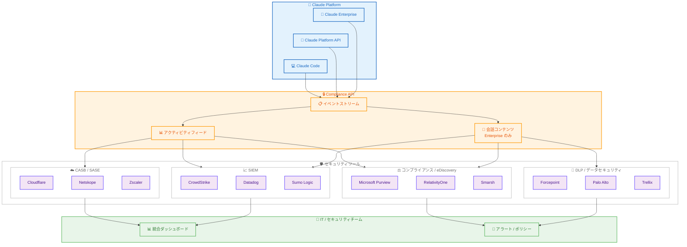

# Claude Compliance API インテグレーション

## メタデータ

| 項目 | 内容 |
|------|------|
| 発表日 | 2026-05-21 |
| ソース | Claude Apps Release Notes |
| カテゴリ | エンタープライズ / セキュリティ / コンプライアンス |
| 公式リンク | https://support.claude.com/en/articles/15167101-get-started-with-claude-compliance-api-integrations |

## 概要

Anthropic は 2026 年 5 月 21 日、Claude Compliance API インテグレーションの一般提供を開始した。この機能により、IT チームおよびセキュリティチームは、既存のセキュリティツールやコンプライアンスツールを通じて Claude のプラットフォーム全体を統合的に管理できるようになる。SIEM、DLP、CASB、eDiscovery、AI セキュリティポスチャ管理など、幅広いカテゴリの 25 以上のパートナーツールとの連携が可能となっている。

エンタープライズ組織が他のアプリケーションと同様の方法で Claude の利用を統治し、可視化できることを目的とした機能であり、Anthropic のエンタープライズセキュリティ戦略における重要なマイルストーンとなる。

## 詳細

### 背景

エンタープライズ環境において、AI ツールの導入が加速する中で、セキュリティチームは以下の課題に直面している。

- **可視性の欠如**: 従業員が AI ツールをどのように利用しているかの把握が困難
- **コンプライアンス要件**: 規制産業 (金融、医療、法務など) における AI 利用の監査証跡の確保
- **データ保護**: 機密情報が AI サービスに送信されるリスクの管理
- **統合管理**: AI ツールを既存のセキュリティスタック内で一貫して管理する必要性

Anthropic はこれらの課題に対応するため、2024 年 11 月の Admin API、2025 年 8 月の Usage & Cost API、2025 年 9 月の Claude Code Analytics API、2026 年 2 月の Data Residency Controls と段階的にエンタープライズ機能を拡充してきた。今回の Compliance API インテグレーションは、この一連のエンタープライズセキュリティ戦略の集大成として位置づけられる。

### 主な変更点

#### 対象プラン

- **Claude Enterprise プラン**: 会話コンテンツおよびアクティビティフィードイベントの取得が可能
- **Claude Platform (API 利用)**: アクティビティフィードイベントのみ (会話コンテンツは対象外)

#### 取得可能なデータ

**Claude Enterprise で利用可能なデータ。**

- 会話コンテンツ (チャット、アップロードファイル、プロジェクト)
- アクティビティフィードイベント (ユーザーログイン、管理者アクション、設定変更)

**Claude Platform で利用可能なデータ。**

- 管理者/システムイベント (メンバー変更、ワークスペース変更、API キー作成、アカウント設定)
- リソースイベント (ファイル作成、ダウンロード、スキル変更)

#### パートナーインテグレーション (25 以上)

| カテゴリ | パートナー |
|---------|-----------|
| CASB / SASE | Cloudflare、Netskope、Zscaler |
| SIEM / セキュリティオペレーション | CrowdStrike、Datadog、ReliaQuest、Sumo Logic |
| DLP / データセキュリティ | Cyera、Forcepoint、Fortinet、Palo Alto Networks、Trellix、Varonis |
| コンプライアンス / eDiscovery | Microsoft Purview、Mimecast、Proofpoint、RelativityOne、Smarsh、Theta Lake |
| ID / アクセス管理 | Okta (ベータ予定)、SailPoint |
| AI セキュリティポスチャ管理 | Geordie AI、IBM Guardium (近日提供)、Snyk、Tenable、Wiz |
| オブザーバビリティ / テレメトリ | Cribl、Rubrik |

### 技術的な詳細

#### イベントタイプ

Compliance API が提供するイベントタイプは以下の通り。

- ユーザーログイン / 認証イベント
- 管理者アクション
- 設定変更
- メンバーおよびワークスペース変更
- API キー作成
- アカウント設定変更
- ファイル作成 / ダウンロード
- スキル変更
- チャットインタラクション (Enterprise プランのみ)
- ファイルアップロード

#### パートナー固有の技術仕様

- **Cribl**: HTTPS 経由のファーストクラステレメトリストリームとして監査アクティビティを取り込み
- **RelativityOne**: Relativity Short Message Format (RSMF) にデータを正規化
- **Datadog**: Claude Platform からの監査ログを SIEM / コンプライアンス用途に取り込み
- **Forcepoint**: コネクタ展開時に過去のアクティビティをバックフィル可能
- **Cyera**: 95% 精度のデータ分類およびリスクスコアリング (OmniDLP)
- **Fortinet**: PII、PHI、CHD、認証データの検出に対応

#### セットアップ手順

1. 組織設定で Compliance API を有効化
2. サポートされているセキュリティプラットフォームにインスタンスを接続
3. Claude Platform の場合、Anthropic セールスチームに連絡

詳細なテクニカルドキュメントは `https://platform.claude.com/docs/en/manage-claude/compliance-api` で公開されている。

## 開発者への影響

### 対象

- **IT 管理者 / セキュリティチーム**: Claude の利用状況を既存のセキュリティスタックで一元管理する必要がある組織
- **コンプライアンス担当者**: 規制要件に基づく監査証跡の確保が必要な組織
- **エンタープライズアーキテクト**: AI ツールを全社セキュリティアーキテクチャに統合する担当者
- **セキュリティツールベンダー**: Claude との連携を実装するパートナー企業

### 必要なアクション

1. **既存の Claude Enterprise / Platform ユーザー**: 組織設定で Compliance API を有効化し、利用中のセキュリティツールとの連携を構成する
2. **セキュリティツール運用者**: 各パートナーのセットアップガイドに従い、Claude コネクタを追加する
3. **新規導入検討組織**: Claude Enterprise プランの契約を検討し、セキュリティ要件との適合性を評価する

### 移行ガイド (該当する場合)

既存の Admin API を利用してカスタムコンプライアンスソリューションを構築している組織は、パートナーインテグレーションへの移行を検討できる。移行の際は以下を考慮する。

- 現在取得しているイベントタイプが Compliance API でカバーされているか確認
- パートナーツールのデータ保持ポリシーとの整合性を確認
- 既存のアラートルールやダッシュボードの再構成が必要か評価

## コード例

```python
# Compliance API の基本的な利用例 (概念的なコード)
# 詳細は公式ドキュメントを参照:
# https://platform.claude.com/docs/en/manage-claude/compliance-api

import requests

# Compliance API エンドポイントからイベントを取得
COMPLIANCE_API_BASE = "https://api.anthropic.com/v1/compliance"

headers = {
    "Authorization": f"Bearer {ADMIN_API_KEY}",
    "Content-Type": "application/json",
    "anthropic-version": "2026-05-01"
}

# アクティビティイベントの取得
response = requests.get(
    f"{COMPLIANCE_API_BASE}/events",
    headers=headers,
    params={
        "start_time": "2026-05-21T00:00:00Z",
        "end_time": "2026-05-21T23:59:59Z",
        "event_types": ["user_login", "file_upload", "admin_action"],
        "limit": 100
    }
)

events = response.json()

# SIEM への転送例 (Datadog)
for event in events["data"]:
    print(f"[{event['timestamp']}] {event['event_type']}: {event['details']}")
```

## アーキテクチャ図



## 関連リンク

- [Claude Compliance API インテグレーション セットアップガイド](https://support.claude.com/en/articles/15167101-get-started-with-claude-compliance-api-integrations)
- [Compliance API テクニカルドキュメント](https://platform.claude.com/docs/en/manage-claude/compliance-api)
- [Claude Apps Release Notes](https://support.claude.com/en/articles/12138966-release-notes)
- [Cloudflare CASB Claude 連携](https://developers.cloudflare.com/changelog/post/2026-05-19-casb-claude-compliance-api/)
- [CrowdStrike Marketplace - Anthropic Data Connector](https://marketplace.crowdstrike.com/listings/anthropic-data-connector/)
- [Datadog Anthropic Compliance Logs 連携](https://docs.datadoghq.com/integrations/anthropic-compliance-logs/)
- [Microsoft Purview AI 連携](https://learn.microsoft.com/en-us/purview/ai-microsoft-purview)
- [Wiz Claude 連携ブログ](https://wiz.io/blog/claude-wiz-integration)
- [インテグレーションパートナー申請フォーム](https://forms.gle/1rkBcdwwR5bLLD82A)

## まとめ

Claude Compliance API インテグレーションは、Anthropic のエンタープライズセキュリティ戦略における重要な進展である。2024 年 11 月の Admin API から始まったエンタープライズ管理機能の拡充は、今回の Compliance API によって本格的なセキュリティツールエコシステムとの統合を実現した。

25 以上のセキュリティパートナーとの連携により、組織は Claude を「特別な AI ツール」として個別管理する必要がなくなり、既存のセキュリティスタック内で他のエンタープライズアプリケーションと同様に統治できるようになる。これは、エンタープライズにおける AI 導入の障壁を大きく下げるものであり、セキュリティチームが AI の利用を可視化し、コンプライアンスポリシーを一貫して適用できる環境を提供する。

特に規制産業 (金融、医療、法務) において、AI 利用の監査証跡を確保しながら生産性向上を両立できる点は、Claude の競争優位性を強化する重要な差別化要因となる。
