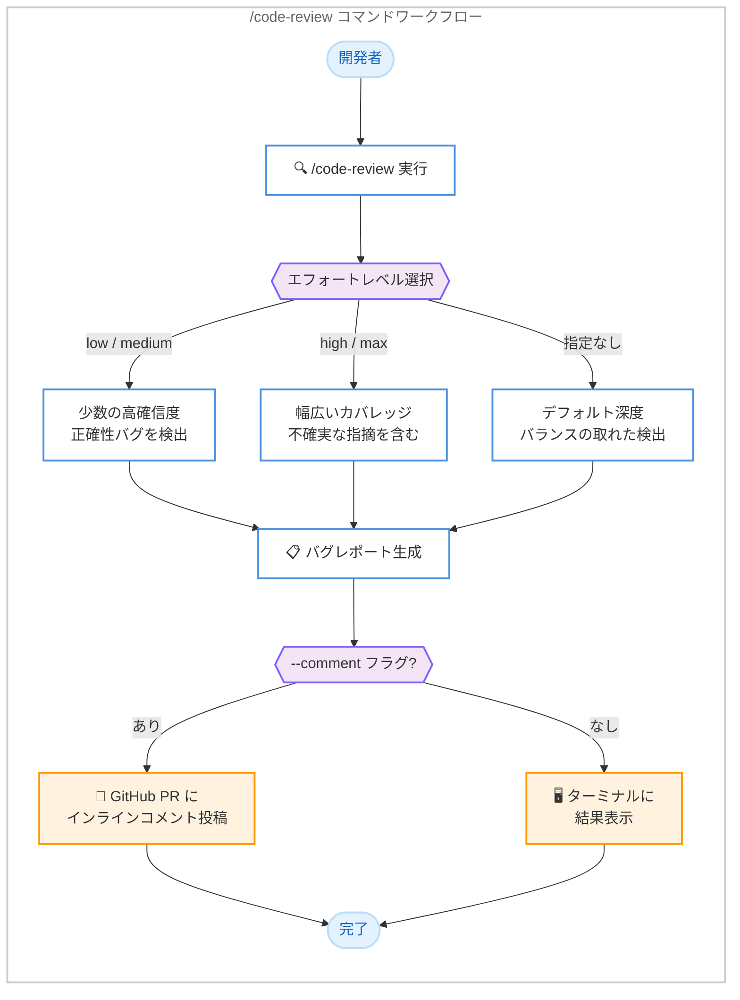

# Claude Code v2.1.147 / v2.1.148 - /code-review 刷新、ピン留めセッション強化、Bash ツールリグレッション修正

## メタデータ

| 項目 | 内容 |
|------|------|
| 発表日 | 2026-05-22 |
| ソース | Claude Code Changelog |
| カテゴリ | Claude Code アップデート |
| 公式リンク | https://github.com/anthropics/claude-code/blob/main/CHANGELOG.md |

## 概要

Claude Code v2.1.147 および v2.1.148 が 2026 年 5 月 22 日にリリースされた。v2.1.147 は `/simplify` コマンドの `/code-review` へのリネームと機能刷新、ピン留めバックグラウンドセッションの永続化、自動アップデーターの信頼性向上、多数のバグ修正を含む大規模アップデートである。v2.1.148 は v2.1.147 で導入されたリグレッション (Bash ツールが全コマンドで exit code 127 を返す問題) の緊急修正パッチである。

主要な変更として、`/code-review` コマンドはエフォートレベル指定による段階的なコードレビューが可能となり、`--comment` フラグで GitHub PR にインラインコメントを直接投稿できるようになった。従来の「クリーンアップと修正」動作は削除され、正確性バグの検出に特化したコマンドに生まれ変わった。

## 詳細

### 背景

Claude Code v2.1.146 では Auto モードの AskUserQuestion 抑制修正や MCP ページネーション修正が行われた。v2.1.147 では、開発者ワークフローの根幹となる `/code-review` コマンドの大幅刷新、バックグラウンドセッションの運用性向上、Windows/PowerShell 環境の安定性強化が実施された。しかし、v2.1.147 で Bash ツールに深刻なリグレッションが混入し、一部ユーザーの環境で全コマンドが exit code 127 で失敗する事態が発生したため、翌日中に v2.1.148 が緊急リリースされた。

### 主な変更点

#### 新機能・改善 (v2.1.147: 4 件)

1. **`/simplify` を `/code-review` にリネーム・機能刷新**: エフォートレベル (例: `/code-review high`) を指定して正確性バグを検出。`--comment` フラグで GitHub PR にインラインコメントを投稿可能。従来のクリーンアップ動作は削除された
2. **ピン留めバックグラウンドセッションの永続化**: `claude agents` で `Ctrl+T` によりピン留めしたセッションがアイドル時にも生存し続け、Claude Code アップデート適用時にはインプレースで再起動される。メモリプレッシャー時には非ピン留めセッションが先に回収される
3. **自動アップデーターの信頼性向上**: 一時的なネットワーク障害時にリトライし、失敗時には具体的なエラーカテゴリと OS エラーコードを報告。アップデート失敗時に現在のバージョンも表示されるようになった
4. **大規模ファイル編集時の diff レンダリングパフォーマンス改善**: 大きなファイルの差分表示が高速化された

#### UX 改善 (v2.1.147: 1 件)

1. **プロンプト履歴の重複排除**: 矢印キーで呼び出したプロンプトを再送信しても、連続する重複エントリが記録されなくなった

#### セキュリティ修正 (v2.1.147: 1 件)

1. **エンタープライズログインポリシーの適用強化**: `forceLoginOrgUUID` および `forceLoginMethod` マネージド設定が、サードパーティプロバイダーおよび API キーセッションに対して正しく適用されるようになった

#### バグ修正 (v2.1.147: 22 件、v2.1.148: 1 件)

**v2.1.148 (緊急修正)**:

1. **Bash ツールの exit code 127 リグレッション修正**: v2.1.147 で導入されたリグレッションにより、一部ユーザーの環境で Bash ツールが全コマンドに対して exit code 127 を返す問題を修正

**v2.1.147 (Windows/PowerShell 関連: 7 件)**:

1. **PowerShell ツールのデフォルトフォーマッター出力消失修正**: デフォルトフォーマッターに依存するコマンドの出力がドロップされる問題を修正
2. **Windows「Yes, and don't ask again」ルールマッチング修正**: PowerShell スクリプト実行の許可ルールが次回以降のラン時に正しくマッチするようになった
3. **PowerShell ツールの winget/Microsoft Store 対応**: `pwsh` を winget または Microsoft Store 経由でインストールした Windows 環境で exit code 1 で失敗する問題を修正
4. **Windows Terminal フルスクリーンストロボ修正**: アタッチされたバックグラウンドセッションで Claude がストリーミング中に画面がちらつく問題を修正
5. **Windows NTFS ジャンクション安全削除**: バックグラウンドジョブのワークツリー削除時にメインリポジトリへ NTFS ジャンクションを辿る問題を修正
6. **Windows CJK 文字によるエージェントビュー表示崩れ修正**: バックグラウンドセッション結果にワイド文字 (CJK) が含まれる場合に行が重複・古くなる問題を修正
7. **Windows スクロール待機ハング修正**: スクロールが落ち着くのを待つ間のまれなハングを修正

**v2.1.147 (コマンド・UI 関連: 7 件)**:

1. **`&` の HTML エスケープ修正**: `!` コマンド出力で `&` が `&amp;` と表示され、URL のコピーペーストが壊れる問題を修正
2. **不明なスラッシュコマンドのエラー表示**: ヘッドレス/SDK モードで不明なスラッシュコマンドが何も起きず失敗する問題を修正し、エラーメッセージを表示するようになった
3. **`/help` の小画面レンダリング修正**: 小さいターミナルでタブヘッダーが壊れ、1 ページに 1 コマンドしか表示されない問題を修正
4. **`/effort` スライダー初期位置修正**: 現在のエフォートレベルでスライダーが開始されるようになった
5. **`/theme` ダイアログの Esc キー修正**: 「New custom theme」およびカラーエディターダイアログが Esc に反応するようになった
6. **スラッシュコマンド後のタブ/改行の処理修正**: スラッシュコマンドの後にタブまたは改行が続く場合に不明なコマンドとして扱われる問題を修正
7. **各種メニューのレイアウト修正**: `/plugin`、`/status`、`/mobile`、`/sandbox`、`/permissions` メニューのスペーシングとレイアウトの不具合を修正

**v2.1.147 (プラグイン・MCP・エージェント関連: 5 件)**:

1. **MCP サーバーページネーション修正**: ページ 1 以降のリソース、テンプレート、プロンプトがドロップされる問題を修正
2. **プラグインエージェントの複数 Agent 型宣言修正**: `tools:` フロントマターで複数の `Agent(...)` 型を宣言したプラグインで最後のエントリ以外が失われる問題を修正
3. **`claude plugin details` のコンポーネント数重複修正**: マニフェストのパスがデフォルトディレクトリと重複する場合にコンポーネント数が倍増する問題を修正
4. **Agent SDK ストリーミングセッション例外修正**: Agent SDK 経由のストリーミングセッション終了時にキャッチされない例外が発生する問題を修正
5. **`CLAUDE_CODE_SUBAGENT_MODEL` 環境変数転送修正**: エージェントチームで子プロセスに環境変数が転送されない問題を修正

**v2.1.147 (その他: 5 件)**:

1. **シェルスナップショットのアンダースコア関数修正**: 名前が単一アンダースコアで始まるユーザー関数がドロップされ、それを参照するエイリアスが壊れる問題を修正
2. **Hook の `if` 条件マッチング修正**: `PowerShell(git push*)` のような条件がマッチしない問題を修正 (以前は `PowerShell(*)` のみ動作)
3. **Auto モードの `AskUserQuestion` 抑制修正**: ユーザーまたはスキルが明示的に依存している場合に抑制されなくなった。Auto モード分類器がユーザーの回答をインテントシグナルとして認識するようになった
4. **ペーストテキストのプレースホルダー問題修正**: ペーストされたテキストが `[Pasted text #N]` プレースホルダーとしてエージェントに配信される問題を修正
5. **GNOME Terminal ペースト修正**: 右クリックおよび中クリックによるペーストが動作するようになった
6. **ストリップされた画像の再読み取りループ修正**: 削除済みメディアをモデルが繰り返し再読み取りしようとする問題を修正

### 技術的な詳細

#### /code-review コマンドの刷新

v2.1.147 での `/code-review` は、従来の `/simplify` から大幅に機能が変更された。

| 項目 | 旧 /simplify | 新 /code-review |
|------|-------------|-----------------|
| 目的 | コードのクリーンアップと修正提案 | 正確性バグの検出 |
| エフォートレベル | なし | low/medium/high 指定可能 |
| PR コメント | なし | `--comment` で GitHub PR にインライン投稿 |
| 出力内容 | 簡素化の提案 | 正確性バグレポート |

エフォートレベルによるレビュー範囲。

| レベル | 対象 |
|--------|------|
| low / medium | 少数の高確信度な正確性バグ |
| high / max | 幅広いカバレッジ (不確実な指摘を含む場合あり) |

#### ピン留めバックグラウンドセッションのライフサイクル

`claude agents` で `Ctrl+T` により特定のセッションをピン留めすると、以下のライフサイクル管理が適用される。

1. **アイドル時の生存**: ピン留めセッションはアイドル状態でも自動終了されない
2. **アップデート時のインプレース再起動**: Claude Code のアップデートが適用されると、ピン留めセッションは同じ位置で再起動される
3. **メモリプレッシャー時の優先保護**: メモリ不足時には非ピン留めセッションが先に回収され、ピン留めセッションは最後まで保護される

#### Bash ツール exit code 127 リグレッション (v2.1.148)

v2.1.147 で導入されたリグレッションにより、一部のユーザー環境で Bash ツールが全コマンドに対して exit code 127 (command not found) を返す問題が発生した。exit code 127 は通常、指定されたコマンドが PATH 上に見つからない場合に返されるコードであり、この問題により Claude Code のコマンド実行機能が完全に停止する深刻な不具合であった。v2.1.148 でこの問題が修正された。

#### Hook の if 条件パターンマッチング修正

Hook 設定で `if` 条件を使用する場合、`PowerShell(git push*)` のようなグロブパターンがマッチしない問題があった。以前は `PowerShell(*)` (全マッチ) のみが正しく動作していた。v2.1.147 ではパターンマッチングロジックが修正され、具体的なコマンドパターンも正しくマッチするようになった。

## 開発者への影響

### 対象

- Claude Code CLI を使用するすべての開発者
- `/simplify` コマンドを使用していた開発者 (重要な動作変更あり)
- GitHub PR レビューワークフローに Claude Code を統合している開発者
- `claude agents` でバックグラウンドセッションを運用している開発者
- Windows/PowerShell 環境の開発者
- MCP サーバーと連携している開発者
- プラグイン開発者 (特に複数 Agent 型を宣言するプラグイン)
- Hook の `if` 条件でパターンマッチングを使用している開発者
- Agent SDK を利用している開発者

### 必要なアクション

1. **全ユーザー**: `claude update` で v2.1.148 にアップデート (v2.1.147 には Bash ツールのリグレッションがあるため、必ず v2.1.148 以降を使用)
2. **`/simplify` を使用していた場合**: `/code-review` に移行。従来の「クリーンアップと修正」動作は削除されたため、正確性バグ検出コマンドとして利用する
3. **PR レビューワークフロー**: `/code-review --comment` で PR にインラインコメントを直接投稿できる。CI/CD パイプラインへの統合を検討
4. **バックグラウンドセッション運用者**: `Ctrl+T` でのピン留め機能を活用し、重要なセッションの永続性を確保
5. **Hook 設定者**: `PowerShell(git push*)` のような具体的パターンが正しく動作するようになったため、以前 `PowerShell(*)` で代替していた設定を具体的なパターンに修正可能
6. **プラグイン開発者**: 複数 `Agent(...)` 型を宣言するプラグインが正しく動作するようになったことを確認

### 移行ガイド (該当する場合)

**`/simplify` から `/code-review` への移行**:

v2.1.147 以降、`/simplify` は使用できない。コマンドの目的自体が変更されている点に注意が必要である。

```bash
# 旧コマンド (v2.1.146 以前)
/simplify

# 新コマンド (v2.1.147 以降)
/code-review              # デフォルトのレビュー深度
/code-review high         # 詳細レビュー (幅広いカバレッジ)
/code-review low          # 軽量レビュー (高確信度の指摘のみ)
/code-review --comment    # GitHub PR にインラインコメントとして投稿
/code-review high --comment  # 詳細レビュー + PR コメント投稿
```

**Hook の if 条件修正後の設定更新**:

```json
{
  "hooks": {
    "pre-push": {
      "if": "PowerShell(git push*)",
      "run": "echo 'Push detected'"
    }
  }
}
```

## コード例

### /code-review コマンドの使用

```bash
# 正確性バグをデフォルトの深度で検出
/code-review

# 高エフォートレベルで詳細なバグ検出
/code-review high

# 低エフォートレベル (高確信度の問題のみ)
/code-review low

# GitHub PR にインラインコメントとして結果を投稿
/code-review --comment

# 高エフォート + PR コメント投稿の組み合わせ
/code-review high --comment
```

### ピン留めセッションの運用

```bash
# claude agents でセッション一覧を表示
claude agents

# セッション上で Ctrl+T を押下してピン留め
# → アイドル時も生存、アップデート時にインプレース再起動
# → メモリプレッシャー時は非ピン留めセッションが先に回収
```

### v2.1.148 への緊急アップデート

```bash
# v2.1.147 で Bash ツールが exit code 127 を返す場合
claude update

# アップデート後の動作確認
claude --version
# Claude Code v2.1.148
```

## アーキテクチャ図



## 関連リンク

- [Claude Code Changelog](https://github.com/anthropics/claude-code/blob/main/CHANGELOG.md)
- [Claude Code ドキュメント](https://docs.anthropic.com/en/docs/claude-code)
- [Claude Code バックグラウンドセッション](https://docs.anthropic.com/en/docs/claude-code/background-sessions)
- [Claude Code Agent SDK](https://docs.anthropic.com/en/docs/claude-code/agent-sdk)
- [MCP (Model Context Protocol) 仕様](https://modelcontextprotocol.io/)

## まとめ

Claude Code v2.1.147 / v2.1.148 は、`/code-review` コマンドの機能刷新、ピン留めバックグラウンドセッションの永続化、自動アップデーターの改善を柱とした大規模アップデートと、その緊急修正パッチの組み合わせである。

最も注目すべき変更は `/code-review` コマンドの刷新である。従来の `/simplify` が提供していた「クリーンアップと修正提案」から、エフォートレベルを指定した「正確性バグの検出」へと目的が根本的に変更され、`--comment` フラグにより GitHub PR へのインラインコメント投稿が可能になった。これにより、Claude Code を PR レビューパイプラインに直接統合するワークフローが実現可能となった。

ピン留めバックグラウンドセッションの永続化は、長時間実行される監視タスクや開発サーバーの運用において信頼性を大幅に向上させる。Claude Code アップデート時のインプレース再起動により、セッションの手動再構築が不要になった。

v2.1.147 には 22 件のバグ修正が含まれ、特に Windows/PowerShell 環境 (7 件)、コマンド/UI (7 件)、プラグイン/MCP/エージェント (5 件) の修正が網羅的に行われた。しかし、v2.1.147 で Bash ツールに重大なリグレッションが混入し、一部ユーザーで全コマンドが exit code 127 で失敗する問題が発生したため、v2.1.148 が緊急リリースされた。ユーザーは必ず v2.1.148 以降にアップデートすることが推奨される。
