# Claude Code v2.1.149 - 使用量カテゴリ別内訳表示、セキュリティ修正、大量バグフィックス

## メタデータ

| 項目 | 内容 |
|------|------|
| 発表日 | 2026-05-22 |
| ソース | Claude Code Changelog |
| カテゴリ | 開発ツール / Claude Code |
| 公式リンク | https://github.com/anthropics/claude-code/blob/main/CHANGELOG.md |

## 概要

Claude Code v2.1.149 が 2026 年 5 月 22 日にリリースされた。本バージョンでは、`/usage` コマンドのカテゴリ別使用量内訳表示、`/diff` ビューのキーボードスクロール対応、GFM タスクリストのレンダリング、エンタープライズ向け `allowAllClaudeAiMcps` 設定の追加が新機能として導入された。

バグ修正面では、PowerShell のパーミッションバイパスや Git ワークツリーのサンドボックス書き込み許可リストの問題など、重大なセキュリティ修正が複数含まれている。加えて、`find` コマンドが macOS のシステムファイルテーブルを枯渇させてホストをクラッシュさせる問題、`/ultraplan` の誤動作、UI 表示の多数の不具合が修正された。同日には v2.1.148 も緊急パッチとしてリリースされ、v2.1.147 で導入された Bash ツールの exit code 127 リグレッションが修正されている。

## 詳細

### 背景

v2.1.147 / v2.1.148 では `/code-review` コマンドの刷新やピン留めバックグラウンドセッションの永続化が実施され、v2.1.148 で Bash ツールのリグレッションが緊急修正された。v2.1.149 はその直後にリリースされ、使用量の可視性向上、セキュリティの強化、および多数の UX バグ修正に焦点を当てたリリースとなっている。

特にセキュリティ面では、PowerShell の組み込み `cd` 関数を利用したパーミッションバイパスや、Git ワークツリーでサンドボックスの書き込み許可が意図しない範囲に適用される問題など、ワークスペース外のファイルにアクセスできてしまう深刻な脆弱性が修正された。

### 主な変更点

#### 新機能・改善 (4 件)

1. **`/usage` コマンドのカテゴリ別使用量内訳表示**: スキル、サブエージェント、プラグイン、MCP サーバーごとのコスト内訳が表示されるようになり、リミット使用量の原因を特定しやすくなった
2. **`/diff` 詳細ビューのキーボードスクロール対応**: 矢印キー、`j`/`k`、`PgUp`/`PgDn`、`Space`、`Home`/`End` でスクロール操作が可能になった
3. **GFM タスクリストチェックボックスのレンダリング**: Markdown 出力で `- [ ] todo` / `- [x] done` がプレーンな箇条書きではなくチェックボックスとして描画されるようになった
4. **エンタープライズ: `allowAllClaudeAiMcps` マネージド設定**: `managed-mcp.json` と並行して claude.ai のクラウド MCP コネクターを読み込む設定が追加された

#### セキュリティ修正 (4 件)

1. **PowerShell パーミッションバイパスの修正**: 組み込み `cd` 関数 (`cd..`、`cd\`、`cd~`、`X:`) がワーキングディレクトリを検知されずに変更し、後続コマンドがワークスペース外のファイルを読み取れる脆弱性を修正
2. **Git ワークツリーのサンドボックス書き込み許可リスト修正**: Git ワークツリーで共有 `.git` ディレクトリのみを許可すべきところ、メインリポジトリのルート全体が書き込み許可されていた問題を修正 (`hooks/` および `config` は引き続き拒否)
3. **PowerShell プレフィックス/ワイルドカード許可ルール修正**: `PowerShell(dotnet.exe build *)` のようなルールがネイティブ実行ファイルやスクリプトを事前承認しない問題を修正
4. **パーミッション分析のギャップ修正**: パーサーが `cd`/`pushd`/`popd` をまたいで `PWD`/`OLDPWD`/`DIRSTACK` の古い変数トラッキング値を信頼してしまう問題を修正

#### バグ修正 (15 件)

1. **`find` コマンドによる macOS クラッシュ修正**: Bash ツールで `find` が大きなディレクトリツリーに対して実行された際、macOS のシステムファイル/vnode テーブルを枯渇させてホストをクラッシュさせる問題を修正
2. **マネージド設定の承認ダイアログフリーズ修正**: 起動時にマネージド設定の承認ダイアログを受け入れた後、ターミナルがフリーズする問題を修正
3. **`/ultraplan` およびリモートセッション作成の失敗修正**: ワーキングツリーに実際の変更がない場合に "Could not capture uncommitted changes" エラーで失敗する問題を修正
4. **`otelHeadersHelper` のスペース含有パス問題修正**: スクリプトパスにスペースが含まれている場合にサイレントに失敗する問題を修正。ヘルパーの失敗は `/doctor` およびデバッグログで報告されるようになった
5. **シンキングスピナーの色表示修正**: ツールコール間および新しいシンキングバーストでスピナーがアンバー色のまま残る問題を修正
6. **折りたたみ Bash 出力の隠し行カウント修正**: 短い行が多い出力で、非表示行数が誤って報告される問題を修正
7. **スラッシュコマンドの引数ヒントクリッピング修正**: ヒントが入力ボックスをオーバーフローした際に末尾の入力文字がクリップされる問題を修正
8. **Tab 補完後の引数ヒント表示修正**: フロントマターの `name:` がディレクトリのベース名と異なるスキルを Tab 補完した後、引数ヒントおよびプログレッシブ引数サジェスチョンが表示されない問題を修正
9. **ステータスバーのエフォートレベル表示修正**: スキル/エージェントの `effort:` フロントマターで適用されたエフォートレベルではなく、ユーザーのベースライン `/effort` 設定が表示される問題を修正
10. **Ctrl+O トランスクリプトビューのフリーズ修正**: 開いた瞬間にフリーズし、新しいメッセージをテーリングしない問題を修正
11. **プロンプト履歴の編集消失修正**: リコールしたプロンプト履歴エントリを編集後、矢印キーで上下に移動すると編集内容が失われる問題を修正
12. **`/config` 終了サマリーのファントム変更修正**: 無関係な設定をトグルした際に auto-compact とテーマへのファントム変更が報告される問題を修正
13. **`/insights` クラッシュ修正**: キャッシュされたセッションメタファイルでオプションフィールドが欠落している場合にクラッシュする問題を修正
14. **トランスクリプト折りたたみでの誤分類修正**: 入力が欠落している不正な PowerShell および History ツールコールがトランスクリプト折りたたみで読み取りとして誤分類される問題を修正
15. **リモートコントロールセッションのリネーム同期修正**: claude.ai や Claude モバイルアプリからセッション名を変更した際、`claude --resume` のローカルセッション名が更新されない問題を修正
16. **プロンプト履歴の重複登録修正**: 送信直後のプロンプトが上矢印の履歴に 2 回表示されるレースコンディションを修正
17. **フルスクリーンモードの "Jump to bottom" ピル修正**: タップしても即座に非表示にならない問題を修正

#### その他の改善 (1 件)

1. **`/feedback` レポートの改善**: コンテキストコンパクション前の会話内容がフィードバックレポートに含まれるようになり、長いセッションの初期に発生した問題のトリアージが容易になった

#### v2.1.148 (同日リリースの緊急修正)

1. **Bash ツールの exit code 127 リグレッション修正**: v2.1.147 で導入されたリグレッションにより、一部ユーザーの環境で Bash ツールが全コマンドに対して exit code 127 を返す問題を修正

### 技術的な詳細

#### PowerShell パーミッションバイパスの詳細

PowerShell には `cd..`、`cd\`、`cd~`、ドライブレター `X:` など、通常の `cd` コマンドとは異なる組み込み関数としてのディレクトリ変更手段が存在する。これらは Claude Code のパーミッション分析システムによる検知を回避していたため、以下のような攻撃シナリオが可能であった。

1. ワークスペース内で Claude Code セッションを開始
2. `cd..` や `X:` を使用してワークスペース外に移動 (パーミッションチェックをバイパス)
3. 後続のコマンドでワークスペース外のファイルを読み取り

v2.1.149 ではこれらの組み込み `cd` 関数を検知し、ワーキングディレクトリの変更を適切にトラッキングするようになった。

#### パーミッション分析の変数トラッキング問題

パーミッション分析システムは、コマンド列のセキュリティ評価のために `PWD`、`OLDPWD`、`DIRSTACK` の値をトラッキングしている。しかし、`cd`、`pushd`、`popd` の実行後にこれらの値が更新されず、古い (stale) 値のまま後続コマンドの評価に使用されるギャップが存在した。これにより、ディレクトリ変更後のコマンドが意図しないパーミッションレベルで評価される可能性があった。

#### Git ワークツリーのサンドボックス問題

Git ワークツリーは `.git` ファイルでメインリポジトリの `.git` ディレクトリを参照する仕組みである。Claude Code のサンドボックスは、ワークツリーが共有する `.git` ディレクトリ (例: `hooks/`、`config` を除く) への書き込みを許可する必要があるが、v2.1.149 以前ではメインリポジトリのルートディレクトリ全体が書き込み許可リストに含まれてしまっていた。これにより、ワークツリーからメインリポジトリ内の任意のファイルに書き込みが可能な状態であった。

#### macOS の find コマンドによるクラッシュ

Bash ツールで `find` コマンドが大規模なディレクトリツリー (例: `node_modules` やシステムディレクトリ) に対して実行された場合、大量のファイルディスクリプタが開かれ、macOS のシステムファイルテーブルおよび vnode テーブルが枯渇する問題があった。これによりホスト OS 自体がクラッシュする可能性があり、v2.1.149 ではリソース制限が適切に設定されるようになった。

#### /usage コマンドのカテゴリ別内訳

v2.1.149 以前の `/usage` コマンドは合計使用量のみを表示していたが、新バージョンでは以下のカテゴリ別の内訳が表示される。

| カテゴリ | 説明 |
|----------|------|
| スキル | スキル実行によるトークン消費 |
| サブエージェント | サブエージェント呼び出しのコスト |
| プラグイン | プラグイン実行のコスト |
| MCP サーバー | 各 MCP サーバーごとのコスト |

## 開発者への影響

### 対象

- Claude Code CLI を使用するすべての開発者
- Windows/PowerShell 環境の開発者 (重大なセキュリティ修正あり)
- Git ワークツリーを使用している開発者 (セキュリティ修正あり)
- macOS 上で大規模プロジェクトを扱う開発者 (`find` クラッシュ修正)
- エンタープライズ管理者 (`allowAllClaudeAiMcps` 設定の追加)
- `/ultraplan` やリモートセッションを使用する開発者
- コスト管理を重視する開発者 (`/usage` 内訳表示)
- スキルやプラグインの開発者 (エフォートレベル表示修正)

### 必要なアクション

1. **全ユーザー**: `claude update` で v2.1.149 にアップデート。特にセキュリティ修正が含まれるため早期のアップデートを推奨
2. **PowerShell ユーザー**: パーミッションバイパスの脆弱性が修正されたため、速やかにアップデートが必要
3. **Git ワークツリー利用者**: サンドボックスの書き込み許可が適切な範囲に修正されたため、アップデートが必要
4. **macOS ユーザー**: `find` コマンドによるシステムクラッシュの可能性が排除されたため、アップデートを推奨
5. **エンタープライズ管理者**: claude.ai のクラウド MCP コネクターを有効化する場合、`allowAllClaudeAiMcps` 設定を `managed-mcp.json` に追加
6. **コスト管理者**: `/usage` コマンドでカテゴリ別の内訳を確認し、コスト最適化に活用

### 移行ガイド (該当する場合)

本バージョンには破壊的な変更は含まれていない。ただし、セキュリティ修正の影響により、以下の動作が変更される。

**PowerShell 環境**:
- `cd..`、`cd\`、`cd~`、ドライブレター `X:` によるディレクトリ変更がパーミッションシステムに検知されるようになった
- プレフィックス/ワイルドカード許可ルールがネイティブ実行ファイルにも適用されるようになった

**Git ワークツリー環境**:
- サンドボックスの書き込み許可がメインリポジトリのルート全体ではなく、共有 `.git` ディレクトリのみに制限されるようになった

## コード例

### /usage コマンドのカテゴリ別内訳表示

```bash
# 使用量の確認 (v2.1.149 以降)
/usage

# 出力例:
# Usage breakdown:
#   Skills:        45% (anthropic-news-summary, code-review)
#   Subagents:     25% (task-decomposition)
#   Plugins:       15% (eslint-plugin, jest-runner)
#   MCP Servers:   15%
#     - github:     8%
#     - filesystem: 7%
```

### /diff ビューのキーボード操作

```bash
# diff 詳細ビューを開く
/diff

# キーボード操作:
#   j / Down Arrow  : 1 行下にスクロール
#   k / Up Arrow    : 1 行上にスクロール
#   PgDn / Space    : 1 ページ下にスクロール
#   PgUp            : 1 ページ上にスクロール
#   Home            : 先頭に移動
#   End             : 末尾に移動
```

### エンタープライズ: allowAllClaudeAiMcps 設定

```json
{
  "allowAllClaudeAiMcps": true
}
```

この設定を有効にすると、`managed-mcp.json` で管理される MCP サーバーに加えて、claude.ai で設定されたクラウド MCP コネクターも読み込まれるようになる。

### GFM タスクリストのレンダリング

```markdown
# v2.1.149 以降の Markdown 出力
- [x] 完了したタスク
- [ ] 未完了のタスク
- [x] もう 1 つの完了タスク

# v2.1.148 以前 (プレーンな箇条書きとして表示)
- [x] 完了したタスク
- [ ] 未完了のタスク
```

## アーキテクチャ図

```mermaid
flowchart TD
    subgraph SecurityFixes["セキュリティ修正の対象範囲"]
        direction TB

        subgraph PS["PowerShell パーミッション"]
            direction LR
            PSBypass["cd.. / cd\\ / cd~ / X:<br/>パーミッションバイパス"]
            PSWildcard["プレフィックス/ワイルドカード<br/>許可ルール"]
            PSBypass ~~~ PSWildcard
        end

        subgraph Sandbox["サンドボックス"]
            direction LR
            GitWorktree["Git ワークツリー<br/>書き込み許可リスト"]
            VarTracking["PWD/OLDPWD/DIRSTACK<br/>変数トラッキング"]
            GitWorktree ~~~ VarTracking
        end

        subgraph Stability["安定性"]
            direction LR
            FindCrash["find コマンド<br/>vnode テーブル枯渇"]
            ManagedDialog["マネージド設定<br/>ダイアログフリーズ"]
            FindCrash ~~~ ManagedDialog
        end
    end

    subgraph NewFeatures["新機能"]
        direction LR
        Usage["📊 /usage<br/>カテゴリ別内訳"]
        DiffScroll["📜 /diff<br/>キーボードスクロール"]
        TaskList["✅ GFM<br/>タスクリスト"]
        McpSetting["🏢 Enterprise<br/>allowAllClaudeAiMcps"]
        Usage ~~~ DiffScroll ~~~ TaskList ~~~ McpSetting
    end

    User(["👤 開発者"]) --> NewFeatures
    User --> SecurityFixes

    classDef platform fill:none,stroke:#CCCCCC,stroke-width:2px,color:#666666
    classDef security fill:#FFEBEE,stroke:#F44336,stroke-width:2px,color:#333333
    classDef feature fill:#E8F1FF,stroke:#4A90E2,stroke-width:2px,color:#333333
    classDef stability fill:#FFF3E0,stroke:#FF9800,stroke-width:2px,color:#333333
    classDef user fill:#E3F2FD,stroke:#BBDEFB,stroke-width:2px,color:#1565C0

    class SecurityFixes platform
    class PS,Sandbox security
    class Stability stability
    class NewFeatures,Usage,DiffScroll,TaskList,McpSetting feature
    class PSBypass,PSWildcard,GitWorktree,VarTracking security
    class FindCrash,ManagedDialog stability
    class User user
```



## 関連リンク

- [Claude Code Changelog](https://github.com/anthropics/claude-code/blob/main/CHANGELOG.md)
- [Claude Code ドキュメント](https://docs.anthropic.com/en/docs/claude-code)
- [Claude Code セキュリティモデル](https://docs.anthropic.com/en/docs/claude-code/security)
- [MCP (Model Context Protocol) 仕様](https://modelcontextprotocol.io/)
- [Git ワークツリー ドキュメント](https://git-scm.com/docs/git-worktree)

## まとめ

Claude Code v2.1.149 は、コスト可視性の向上、重大なセキュリティ修正、および多数の UX バグ修正を含む重要なリリースである。

最も注目すべきは 4 件のセキュリティ修正である。PowerShell の組み込み `cd` 関数によるパーミッションバイパス、Git ワークツリーでのサンドボックス書き込み許可リストの過剰な範囲設定、パーミッション分析の変数トラッキングギャップ、PowerShell のプレフィックス/ワイルドカード許可ルールの不備が修正された。これらはいずれもワークスペース外のファイルへの意図しないアクセスを許す可能性がある脆弱性であり、特に PowerShell 環境や Git ワークツリーを使用する開発者は速やかにアップデートすべきである。

安定性面では、`find` コマンドが macOS のシステムファイルテーブルを枯渇させてホストをクラッシュさせる問題の修正が重要である。大規模プロジェクトで作業する macOS ユーザーにとって、この修正はシステム安定性の大幅な向上を意味する。

新機能面では、`/usage` コマンドのカテゴリ別内訳表示が実用的である。スキル、サブエージェント、プラグイン、MCP サーバーごとのコスト内訳が可視化されることで、リミット使用量の原因特定とコスト最適化が容易になった。エンタープライズ向けの `allowAllClaudeAiMcps` 設定は、claude.ai のクラウド MCP コネクターを組織内で活用する際の管理性を向上させる。

全ユーザーは `claude update` で v2.1.149 以降にアップデートすることが強く推奨される。
