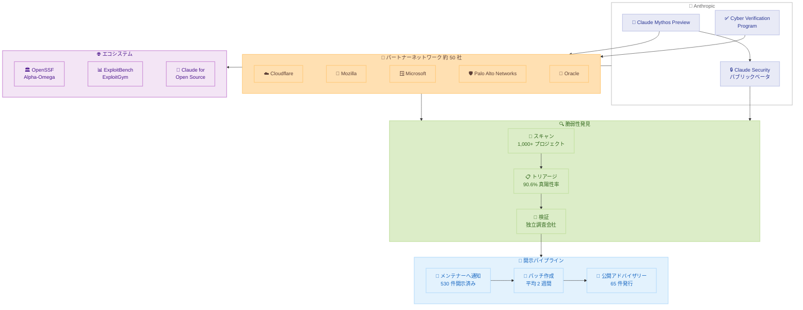

# Project Glasswing: 初回アップデート

## メタデータ

| 項目 | 内容 |
|------|------|
| 発表日 | 2026-05-22 |
| ソース | Anthropic Research |
| カテゴリ | セキュリティ / 研究 |
| 公式リンク | https://www.anthropic.com/research/glasswing-initial-update |

## 概要

Project Glasswing は、Anthropic が Claude Mythos Preview を活用し、重要なソフトウェアの脆弱性を AI が悪用される前に発見するために立ち上げた共同サイバーセキュリティイニシアチブである。開始から約 1 か月で、約 50 のパートナーが参加し、10,000 件以上の高 / 重大な脆弱性が発見された。複数のパートナーではバグ発見率が 10 倍以上に向上しており、AI を活用したセキュリティ防御の新たな可能性を示している。

## 詳細

### 背景

AI の進化に伴い、サイバー攻撃に AI が悪用されるリスクが高まっている。Anthropic は「防御側が攻撃側よりも先に脆弱性を発見し修正する」というアプローチで、このリスクに先手を打つことを目指している。Project Glasswing は、最先端のサイバーセキュリティ能力を持つ Claude Mythos Preview を業界パートナーに提供し、共同で重要インフラのセキュリティを強化する取り組みである。

AI によるコード解析の利点は以下の通りである。

- 大規模コードベースを網羅的にスキャン可能
- 人間のテスターよりも低い偽陽性率
- マルチステップの攻撃シナリオをエンドツーエンドで解析
- 脆弱性の発見から修正パッチの提案まで一貫して対応

### 主な変更点

#### パートナー別成果

**Cloudflare**:
- クリティカルパスシステム全体で 2,000 件のバグを発見
- うち 400 件が高 / 重大な脆弱性
- 偽陽性率は「人間のテスターよりも優れている」と評価

**Mozilla**:
- Firefox 150 で 271 件の脆弱性を発見・修正
- Firefox 148 で Claude Opus 4.6 を使用した際と比較して 10 倍以上の発見数

**UK AI Security Institute**:
- Mythos Preview が初めて両方のサイバーレンジ (マルチステップサイバー攻撃シミュレーション) をエンドツーエンドで解決した最初のモデル

**XBOW**:
- Web エクスプロイトベンチマークで「既存のすべてのモデルから大幅なステップアップ」
- トークンあたりの精度が「前例のないレベル」

**Palo Alto Networks**:
- 最新リリースのパッチ数が通常の 5 倍以上

**Microsoft**:
- 新しいパッチが「しばらくの間、より大規模になる傾向が続く」と報告

**Oracle**:
- 脆弱性の発見と修正が従来の数倍の速度に向上

**非公開パートナー銀行**:
- メール侵害とスプーフ電話による 150 万ドルの不正送金を検出・防止

#### オープンソーススキャン結果

| 指標 | 数値 |
|------|------|
| スキャン対象プロジェクト数 | 1,000 以上 |
| 発見された脆弱性の総数 | 23,019 件 |
| 高 / 重大と推定される脆弱性 | 6,202 件 |
| 独立調査で検証された件数 | 1,752 件 |
| 真陽性率 | 90.6% (1,587 件) |
| 高 / 重大と確認された件数 | 62.4% (1,094 件) |
| 推定高 / 重大脆弱性総数 | 約 3,900 件 |

#### 開示パイプライン

| ステータス | 件数 |
|-----------|------|
| メンテナーへ開示済み (高 / 重大) | 530 件 |
| メンテナー要請による未検証報告 | 1,129 件 (推定 175 件が高 / 重大) |
| 開示待ちの確認済み脆弱性 | 827 件 |
| パッチ済み | 75 件 |
| 公開アドバイザリー発行済み | 65 件 |
| 平均パッチ適用時間 | 2 週間 |

#### 注目事例: wolfSSL (CVE-2026-5194)

wolfSSL 暗号ライブラリ (数十億台のデバイスで使用) に脆弱性を発見。Mythos Preview が証明書偽造を可能にするエクスプロイトを構築し、CVE-2026-5194 として登録された。現在はパッチ済みで、技術的な詳細分析は今後公開予定。

### 技術的な詳細

#### リリースされたツール

**Claude Security (パブリックベータ)**:
- Claude Enterprise 顧客向けに公開
- コードベースをスキャンし、修正案を生成
- 開始 3 週間で Claude Opus 4.7 を使用して 2,100 件以上の脆弱性をパッチ

**Cyber Verification Program**:
- 認定されたセキュリティ専門家が、特定の悪用防止セーフガードなしにモデルを使用可能
- 脆弱性調査、ペネトレーションテスト、レッドチーミングなどの正当な目的に使用

**パートナーツーリング (要リクエスト)**:
- **スキル**: 反復作業のためのカスタム指示
- **ハーネス**: コードベースマッピング、スキャンサブエージェント起動、トリアージ、レポート生成
- **脅威モデルビルダー**: コードベースを解析し攻撃対象を特定、作業の優先順位付け

**Cisco の貢献**:
- Foundry Security Spec をオープンソース化し、他の防御者が類似の評価システムを構築できるように支援

#### エコシステムパートナーシップ

**Open Source Security Foundation (Alpha-Omega)**:
- メンテナーのバグレポート処理とトリアージを支援するパートナーシップ
- 1,250 万ドルの助成金

**学術ベンチマーク**:
- ExploitBench と ExploitGym の開発を支援
- External Researcher Access Program を通じてサポート

**Claude for Open Source**:
- メンテナーとコントリビューターを支援
- Anthropic が今後採用するオープンソースパッケージのスキャンを約束

## 開発者への影響

### 対象

- セキュリティエンジニア / ペネトレーションテスター
- オープンソースプロジェクトのメンテナー
- エンタープライズセキュリティチーム
- セキュリティリサーチャー
- DevSecOps エンジニア

### 必要なアクション

1. **Claude Enterprise 顧客**: Claude Security (パブリックベータ) を活用して自社コードベースのスキャンを開始
2. **セキュリティ専門家**: Cyber Verification Program への登録を検討
3. **オープンソースメンテナー**: Anthropic からの脆弱性開示通知への迅速な対応体制を整備
4. **パートナー候補**: Project Glasswing への参加を検討 (特に米国および同盟国の政府機関)
5. **セキュリティツール開発者**: Cisco の Foundry Security Spec を参照し、自社の評価システムに活用

### 移行ガイド (該当する場合)

本発表は新しいイニシアチブの進捗報告であり、既存システムからの移行は不要。ただし、以下の点に注意が必要である。

- 脆弱性の発見速度が従来の手法を大幅に上回るため、パッチ適用プロセスの迅速化が求められる
- メンテナーは開示通知の増加に備え、対応体制を強化する必要がある
- 将来的に Mythos クラスのモデルが一般公開される際に備え、セキュリティ体制の見直しを推奨

## コード例

Claude Security を使用した脆弱性スキャンのワークフロー例 (概念的):

```bash
# Claude Security によるコードベーススキャン (Enterprise 向けパブリックベータ)
# 実際の CLI インターフェースは公式ドキュメントを参照

# 1. プロジェクトのスキャンを開始
claude security scan --project ./my-application --severity high,critical

# 2. 発見された脆弱性のレポートを確認
claude security report --format json --output vulnerabilities.json

# 3. 自動修正パッチの生成
claude security fix --vulnerability CVE-XXXX-YYYY --review
```

## アーキテクチャ図



## 関連リンク

- [Project Glasswing 初回アップデート (公式)](https://www.anthropic.com/research/glasswing-initial-update)
- [Anthropic News](https://www.anthropic.com/news)
- [wolfSSL CVE-2026-5194](https://nvd.nist.gov/vuln/detail/CVE-2026-5194)
- [Cisco Foundry Security Spec (GitHub)](https://github.com/cisco/foundry-security-spec)
- [Open Source Security Foundation Alpha-Omega](https://openssf.org/community/alpha-omega/)
- [ExploitBench / ExploitGym](https://github.com/exploitbench)

## まとめ

Project Glasswing の初回アップデートは、AI を活用したサイバーセキュリティ防御の実効性を強く示すものである。開始からわずか 1 か月で、以下の成果が達成された。

1. **規模**: 約 50 パートナーが参加し、10,000 件以上の高 / 重大脆弱性を発見
2. **精度**: 90.6% の真陽性率、偽陽性率は人間テスターを上回る精度
3. **速度**: 複数パートナーでバグ発見率が 10 倍以上に向上
4. **実用性**: wolfSSL の証明書偽造脆弱性や 150 万ドル不正送金の防止など、実世界での成果

一方で、新たな課題も明らかになった。脆弱性の発見速度がパッチ適用速度を大幅に上回っており、「発見」から「修正」へのボトルネックが生じている。一部のメンテナーが開示のペースを落とすよう要請するなど、エコシステム全体での対応能力の向上が必要とされている。

今後は、米国および同盟国政府への拡大、Mythos クラスモデルの一般公開 (より強力なセーフガード付き)、およびオープンソースコードの継続的なスキャンが計画されている。Project Glasswing は、AI がサイバーセキュリティの「盾」として機能する未来への重要な一歩を示している。
