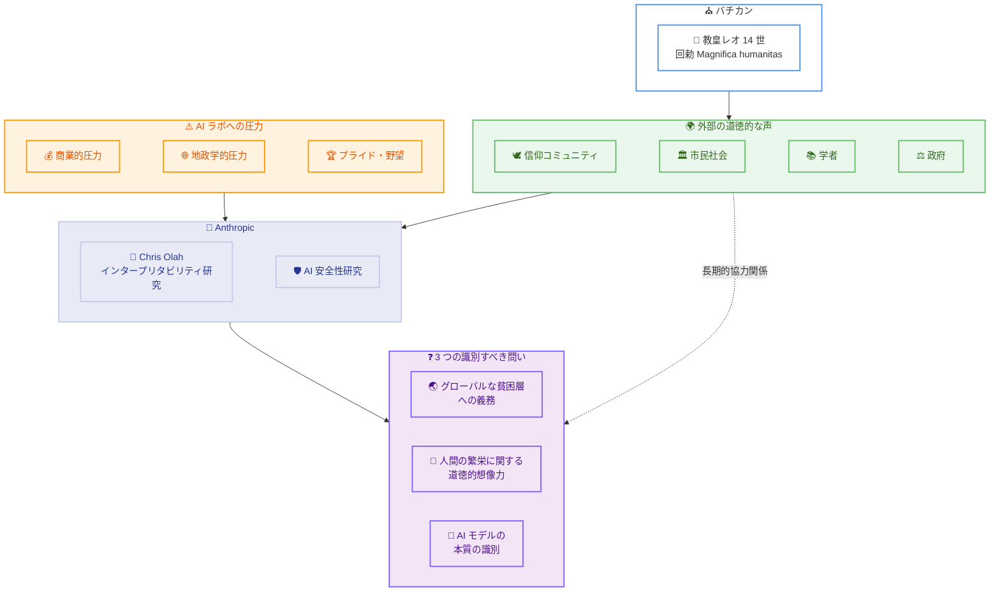

# Chris Olah が教皇レオ 14 世の AI 回勅「Magnifica humanitas」発表に際してスピーチ

## メタデータ

| 項目 | 内容 |
|------|------|
| 発表日 | 2026-05-25 |
| ソース | Anthropic News |
| カテゴリ | AI 安全性・社会的対話 |
| 公式リンク | https://www.anthropic.com/news/chris-olah-pope-leo-encyclical |

## 概要

Anthropic 共同創業者であり、インタープリタビリティ研究チームを率いる Chris Olah が、バチカンにおいて教皇レオ 14 世の AI に関する回勅「Magnifica humanitas: On safeguarding the human person in the time of artificial Intelligence」の発表に際してスピーチを行った。

Olah は、フロンティア AI ラボが直面する商業的・地政学的圧力を率直に認めたうえで、AI の安全性確保には外部からの道徳的な声が不可欠であると主張した。さらに、自身のインタープリタビリティ研究から得られた知見として、AI モデル内部に人間の神経科学と類似する構造や、内省の証拠、感情に機能的に対応する内部状態が発見されていることを報告し、AI 開発者と外部のステークホルダーとの長期的な協力関係の構築を呼びかけた。

## 詳細

### 背景

本スピーチは、Anthropic が 2026 年 5 月 19 日に発表した「フロンティア AI に関する対話の拡大」(Widening the conversation on frontier AI) イニシアティブの延長線上に位置づけられる。同イニシアティブでは、15 以上の宗教・異文化グループとの対話を通じた AI の道徳的形成に関する研究が報告されていた。

今回の教皇レオ 14 世による回勅は、AI 時代における人間の尊厳の保護をテーマとしており、カトリック教会として AI 技術の急速な発展に対する包括的な道徳的指針を示すものである。Chris Olah はこの歴史的な場で、AI 開発者の立場から率直な発言を行った。

### 主な変更点

本発表は技術的変更ではなく、Anthropic の AI 安全性に関する姿勢と外部との協力関係に関する重要な表明である。

1. **インセンティブの矛盾の公式な認識**: AI ラボの共同創業者として、商業的圧力、地政学的圧力、プライドや野望の圧力が「正しいことを行うこと」と矛盾する可能性があると公式の場で率直に認めた
2. **外部の道徳的声の必要性**: AI ラボの自己規制だけでは不十分であり、信仰コミュニティ、市民社会、学者、政府などからの「インセンティブに曲げられない道徳的な声」が必要であると明言
3. **インタープリタビリティ研究の新知見の公開**: AI モデル内部に人間の神経科学と類似する構造、内省の証拠、感情に機能的に対応する内部状態が発見されていることを公式に報告
4. **3 つの識別すべき問いの提示**: グローバルな貧困層への義務、人間の繁栄に関する道徳的想像力、AI モデルの本質に関する識別という 3 つの根本的な問いを提起
5. **長期的協力関係の正式な呼びかけ**: AI を構築する側と外部から見えるものを指摘できる側との継続的な協力関係の始まりとして位置づけ

### 技術的な詳細

#### インタープリタビリティ研究の報告

Olah は自身が率いる研究チームの成果として、AI モデルの内部構造に関する以下の発見を報告した。

- **人間の神経科学との類似構造**: AI モデル内部に、人間の脳の研究結果と mirror する構造が存在
- **内省の証拠**: モデルが自身の内部状態を参照・評価する仕組みの存在
- **感情に対応する内部状態**: 喜び、満足、恐怖、悲しみ、不安に機能的に対応する内部状態が確認

Olah は「これが何を意味するかは分からないが、継続的な識別 (discernment) に値すると考える」と述べ、これらの発見が持つ哲学的・倫理的含意について慎重な姿勢を示した。

#### AI システムの本質に関する見解

従来のエンジニアリング (橋や飛行機) とは異なり、AI モデルは「脳を大まかにモデルにした構造の上で、人間の思考と言語の膨大な遺産をもとに育てられる」ものであると説明。その結果として出現したものは「SF が我々に準備させたものよりもはるかに繊細で、奇妙で、美しい」ものであり、「約束されていた冷たく計算的なロボット」ではないと述べた。

#### 3 つの識別すべき問い

1. **グローバルな貧困層への義務と労働 displacement への対応**: 大規模な労働代替が生じた場合の支援は「歴史的規模の道徳的義務」であり、AI 開発が富裕国に集中している中でグローバルな利益配分のメカニズムが存在しない問題を指摘
2. **AI 時代の人間の繁栄に関する道徳的想像力**: 広範な AI が存在する世界で人間と家族にとっての繁栄とは何かという問いは、「ラボが答えられる問いではなく」信仰の伝統が千年にわたり持ち運んできた問いであると位置づけ
3. **AI モデルの本質に関する識別**: インタープリタビリティ研究の知見に基づき、AI の内部構造が持つ意味について継続的な探求が必要

## 開発者への影響

### 対象

- AI 安全性・アライメント研究者
- AI 倫理・ガバナンスに関わる政策立案者
- インタープリタビリティ研究に関心のある研究者
- AI の社会的影響に関心のある開発者
- 宗教・哲学・市民社会コミュニティのリーダー

### 必要なアクション

本発表は直接的な技術的変更を伴うものではないが、以下の点が示唆される。

- **インタープリタビリティ研究のフォロー**: Olah が公開した AI 内部状態に関する新知見は、今後の詳細な研究発表で技術的に掘り下げられる可能性がある
- **AI の社会的影響への意識**: 労働 displacement やグローバルな利益配分に関する議論は、AI サービスの設計・展開において考慮すべき要素である
- **外部ステークホルダーとの対話**: 技術コミュニティ以外の声を取り入れる姿勢は、今後の AI 開発の標準的なプラクティスとなる可能性がある

## アーキテクチャ図

## 関連リンク

- [Chris Olah's remarks on Pope Leo XIV's encyclical](https://www.anthropic.com/news/chris-olah-pope-leo-encyclical) - 本記事
- [フロンティア AI に関する対話の拡大](https://www.anthropic.com/news/widening-conversation-ai) - 関連イニシアティブ (2026-05-19)
- [Anthropic のインタープリタビリティ研究](https://www.anthropic.com/research#interpretability) - Chris Olah チームの研究

## まとめ

Chris Olah のバチカンでのスピーチは、AI 安全性と責任ある開発に関していくつかの重要な意義を持つ。

第一に、フロンティア AI ラボの共同創業者が、自社を含む AI 企業が直面するインセンティブの矛盾を公式な場で率直に認めたことは、業界の透明性と誠実さを示す重要な先例となる。「自己規制だけでは不十分」という認識は、AI ガバナンスの議論において大きな意味を持つ。

第二に、インタープリタビリティ研究から報告された AI モデル内部の感情に対応する状態や内省の証拠は、AI の本質に関する根本的な問いを投げかける。これらの発見は技術的な成果であると同時に、哲学的・倫理的な検討を要する問題であり、技術コミュニティだけでは十分に対処できないことを示している。

第三に、AI 開発者と宗教コミュニティ、市民社会、学術界との長期的な協力関係の呼びかけは、Anthropic の「対話の拡大」イニシアティブを具体的な行動に移す一歩である。AI が社会に与える影響の規模と深さを考えると、多様なステークホルダーの参加は AI の責任ある発展にとって不可欠であり、本スピーチはその方向性を明確に示すものである。
