# Anthropic ミラノオフィス開設 - 欧州 6 拠点目としてイタリア市場に本格参入

## メタデータ

| 項目 | 内容 |
|------|------|
| 発表日 | 2026-05-27 |
| ソース | Anthropic News |
| カテゴリ | 企業ニュース |
| 公式リンク | https://www.anthropic.com/news/milan-office-opening |

## 概要

Anthropic は 2026 年 5 月 27 日、イタリア・ミラノに新オフィスを開設したことを発表した。これは欧州における 6 番目の拠点であり、ロンドン、ダブリン、パリ、チューリッヒ、ミュンヘンに続くものとなる。Southern Europe 責任者の Thomas Remy が現地チームを率い、イタリアの企業、研究機関、開発者コミュニティとの連携を推進する。

Generali Group、Enel Group、Pirelli といった大手企業から、Satispay、Bending Spoons などのテクノロジースタートアップまで、幅広いパートナーシップが既に構築されており、イタリア市場における Claude の実績が示されている。

## 詳細

### 背景

Anthropic は 2025 年以降、欧州市場での存在感を急速に拡大してきた。ロンドンを皮切りに、ダブリン、パリ、チューリッヒ、ミュンヘンと拠点を増やし、今回のミラノ開設で 6 拠点体制となった。この動きは、各地域の文化・産業に根ざした AI 導入支援を重視する Anthropic の国際戦略を反映している。

ミラノオフィスの開設は、教皇レオ 14 世が AI に関する初の回勅「Magnifica Humanitas」を発表した直後のタイミングとなった。Anthropic 共同創業者の Chris Olah がその発表に登壇しており、イタリアにおける AI と社会の対話に Anthropic が積極的に参加していることを示している。

### 主な変更点

**リーダーシップ体制:**

- **Thomas Remy** (Head of Southern Europe): ミラノオフィスおよび南欧地域の統括
- **Chris Ciauri** (MD International): 「イタリアの企業、研究、文化を安全な AI 移行を通じて支援するためにここにいる」と表明

**エンタープライズクライアント:**

| セクター | 企業 |
|----------|------|
| 金融 | Generali Group、Unipol Group |
| ライフサイエンス | Angelini Pharma、Bracco Group |
| エネルギー | Enel Group |
| 自動車 | Pirelli |

**テクノロジー・スタートアップパートナー:**

- **JAKALA**: 欧州有数のデータ/AI 企業。3,000 席以上で Claude を展開し、シニアチームの時間の約 70% をより高度な判断業務に振り向けることに成功
- **Satispay**: 600 万人以上のユーザーを持つフィナンシャルスーパーアプリ。Claude をエンジニアリングチーム全体に導入し、18 ヶ月のロードマップを 7 ヶ月に圧縮。コア決済システムの更新速度を 10 倍に向上
- **Bending Spoons**: イタリア最大級のテック企業。コード変更の大半が Claude Code との共同作業で実施

**デザイン・文化パートナーシップ:**

- ミラノデザインウィーク期間中に Alcova Milano と提携し、工業デザイナー、家具デザイナー、空間デザイナー向けのハンズオンワークショップを開催

### 技術的な詳細

今回の発表はビジネス展開に関するものであり、新たな技術的機能のリリースは含まれていない。ただし、パートナー事例から Claude の実用的な導入効果が明確に示されている。

**Satispay の事例:**

- エンジニアリングチーム全体への Claude 導入
- 開発ロードマップの 61% 短縮 (18 ヶ月 → 7 ヶ月)
- コア決済システム更新速度の 10 倍改善

**Bending Spoons の事例:**

- Claude Code を活用したコード共同作成
- コード変更の過半数が AI アシスト

**JAKALA の事例:**

- 3,000 席以上の大規模展開
- シニアチームの約 70% の時間を高付加価値業務にシフト

## 開発者への影響

### 対象

- イタリアの開発者コミュニティ
- 南欧地域で Claude API を利用する企業の技術チーム
- イタリアのスタートアップおよびテクノロジー企業
- デザイン・クリエイティブ分野の専門家

### 必要なアクション

現時点で技術的な対応は不要。ただし、以下の点に注目することを推奨する。

- イタリア市場向けのローカルサポート体制の強化により、現地でのサポート品質向上が期待される
- 南欧地域での Claude のエンタープライズ展開事例を参考に、自社での導入戦略を検討可能
- Anthropic のパートナープログラムへの参加機会が拡大

### 移行ガイド (該当する場合)

該当なし。本発表はビジネス拡大に関するものであり、技術的な移行は不要。

## コード例

N/A - 本発表はオフィス開設およびビジネスパートナーシップに関するものであり、技術的なコード変更は含まれていない。

## アーキテクチャ図 (該当する場合)

```mermaid
flowchart TD
    subgraph Anthropic["🏢 Anthropic 欧州拠点ネットワーク"]
        direction TB
        subgraph Northern["🌍 北欧・西欧"]
            direction LR
            London["🇬🇧 ロンドン"]
            Dublin["🇮🇪 ダブリン"]
            Paris["🇫🇷 パリ"]
            London ~~~ Dublin ~~~ Paris
        end
        subgraph Central["🌍 中欧"]
            direction LR
            Zurich["🇨🇭 チューリッヒ"]
            Munich["🇩🇪 ミュンヘン"]
            Zurich ~~~ Munich
        end
        subgraph Southern["🌍 南欧"]
            direction LR
            Milan["🇮🇹 ミラノ<br/>NEW"]
        end
    end

    subgraph Leadership["👥 ミラノオフィス体制"]
        Remy["👤 Thomas Remy<br/>Head of Southern Europe"]
        Ciauri["👤 Chris Ciauri<br/>MD International"]
    end

    subgraph Partners["🤝 イタリアパートナー"]
        direction TB
        subgraph Enterprise["🏛️ エンタープライズ"]
            direction LR
            Generali["💰 Generali"]
            Enel["⚡ Enel"]
            Pirelli["🚗 Pirelli"]
            Generali ~~~ Enel ~~~ Pirelli
        end
        subgraph Startup["🚀 テック・スタートアップ"]
            direction LR
            JAKALA["📊 JAKALA"]
            Satispay["💳 Satispay"]
            BendingSpoons["💻 Bending Spoons"]
            JAKALA ~~~ Satispay ~~~ BendingSpoons
        end
    end

    Milan --> Remy
    Milan --> Ciauri
    Milan --> Enterprise
    Milan --> Startup

    classDef platform fill:none,stroke:#CCCCCC,stroke-width:2px,color:#666666
    classDef region fill:none,stroke:#E1BEE7,stroke-width:2px,color:#666666
    classDef office fill:#E8EAF6,stroke:#C5CAE9,stroke-width:2px,color:#283593
    classDef newoffice fill:#C8E6C9,stroke:#66BB6A,stroke-width:3px,color:#1B5E20
    classDef leader fill:#FFF3E0,stroke:#FF9800,stroke-width:2px,color:#E65100
    classDef partner fill:#E3F2FD,stroke:#BBDEFB,stroke-width:2px,color:#1565C0
    classDef enterprise fill:#FCE4EC,stroke:#F48FB1,stroke-width:2px,color:#880E4F
    classDef startup fill:#E0F7FA,stroke:#80DEEA,stroke-width:2px,color:#006064

    class Anthropic platform
    class Northern,Central,Southern,Leadership,Partners region
    class London,Dublin,Paris,Zurich,Munich office
    class Milan newoffice
    class Remy,Ciauri leader
    class Enterprise,Startup region
    class Generali,Enel,Pirelli enterprise
    class JAKALA,Satispay,BendingSpoons startup
```

## 関連リンク

- [Anthropic ミラノオフィス開設 公式発表](https://www.anthropic.com/news/milan-office-opening)
- [Anthropic 公式サイト](https://www.anthropic.com)
- [Chris Olah による教皇回勅発表への登壇](https://www.anthropic.com/news/chris-olah-pope-leo-encyclical)
- [Anthropic シドニーオフィス開設 (アジア太平洋 4 拠点目)](https://www.anthropic.com/news/sydney-fourth-office-asia-pacific)
- [Claude API ドキュメント](https://docs.anthropic.com)

## まとめ

Anthropic のミラノオフィス開設は、同社の欧州戦略における重要なマイルストーンである。6 番目の欧州拠点として、イタリアの伝統的な産業大手 (Generali、Enel、Pirelli) からテクノロジースタートアップ (Satispay、Bending Spoons) まで、幅広いパートナーシップを既に確立している点が注目に値する。

特に Satispay の事例 (開発期間 61% 短縮、更新速度 10 倍) や JAKALA の事例 (シニアチーム時間の 70% を高付加価値業務にシフト) は、Claude のエンタープライズ導入が具体的なビジネス成果につながることを実証している。

また、ミラノデザインウィークでの Alcova Milano との提携や、教皇回勅発表への参加など、テクノロジーの枠を超えた文化的エンゲージメントを重視している点は、Anthropic が「安全な AI 移行」を技術面だけでなく社会・文化面からも推進する姿勢を明確に示している。
