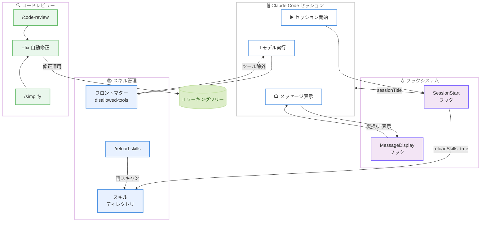

# Claude Code v2.1.152 — コードレビュー自動修正、スキルの動的管理、セッションフック拡張

## メタデータ

| 項目 | 内容 |
|------|------|
| 発表日 | 2026-05-27 |
| ソース | Claude Code Changelog |
| カテゴリ | 開発ツール・CLI アップデート |
| 公式リンク | https://github.com/anthropics/claude-code/blob/main/CHANGELOG.md |

## 概要

Claude Code v2.1.152 が 2026 年 5 月 27 日にリリースされた。本バージョンは 17 個の新機能と 12 個のバグ修正を含む大規模アップデートであり、コードレビューの自動修正 (`/code-review --fix`)、スキルの動的管理機構、セッションフックの大幅な拡張が主要なテーマとなっている。開発者の日常的なワークフローを効率化する機能が多数追加され、特にコードレビューから修正適用までをシームレスに行える新機能は生産性向上に大きく貢献する。

## 詳細

### 背景

Claude Code は継続的にリリースを重ねており、前バージョン v2.1.150 (2026 年 5 月 24 日) は内部インフラの改善リリースであった。v2.1.152 はそれに続く機能追加リリースであり、コードレビュー、スキルシステム、フック機構、プラグインエコシステムの 4 領域にわたる包括的な改善が含まれている。

Auto モードのオプトイン同意が不要になったことで、初回利用のハードルが下がり、すべてのユーザーがスムーズに自動化機能を活用できるようになった。

### 主な変更点

#### 1. コードレビュー自動修正 (`/code-review --fix`)

- `/code-review --fix` コマンドが追加され、レビュー結果 (再利用の提案、簡略化、効率改善) をワーキングツリーに直接適用できるようになった
- `/simplify` コマンドが `/code-review --fix` を内部的に呼び出すようになり、コードの簡略化ワークフローが統一された

#### 2. スキルの動的管理

- スキルおよびスラッシュコマンドのフロントマターに `disallowed-tools` を設定し、スキルがアクティブな間特定のツールをモデルから除外できるようになった
- `/reload-skills` コマンドが追加され、セッションを再起動せずにスキルディレクトリを再スキャンできるようになった
- `SessionStart` フックで `reloadSkills: true` を返すことで、フックがインストールしたスキルを同一セッション内で利用可能にできるようになった

#### 3. セッションフックの拡張

- `MessageDisplay` フックイベントが追加され、アシスタントメッセージのテキストを表示時に変換・非表示にできるようになった
- `SessionStart` フックが `hookSpecificOutput.sessionTitle` でセッションタイトルを設定可能になった (起動時・再開時の両方に対応)

#### 4. プラグインエコシステム

- `pluginSuggestionMarketplaces` 管理設定が追加され、組織マーケットプレイスのプラグイン提案を許可リスト化できるようになった
- `claude plugin marketplace remove` が `--scope user|project|local` オプションをサポートし、`marketplace add`、`install`、`uninstall` との対称性が確保された

#### 5. Auto モードとフォールバック

- Auto モードがオプトイン同意なしで利用可能になった
- プライマリモデルが見つからない場合、`--fallback-model` に自動切り替えしてセッションを継続するようになった (従来は全リクエスト失敗)

#### 6. UI/UX 改善

- Vim モード: NORMAL モードで `/` キーが逆方向ヒストリ検索を開くようになった (bash/zsh の vi-mode と同等)
- `/usage` コマンドにラージセッションファイルの内訳が表示されるようになった (ストリーミング読み取りでメモリ使用量は一定)
- Thinking サマリーが最低 3 秒間読めるように表示され、Markdown レンダリングに対応、10 行で制限 (`Ctrl+O` で全文表示)
- フルスクリーンモードで "Thinking for Ns" インジケーターがリアルタイムでカウントアップするようになった
- バックグラウンドエージェント/ワークフロー完了待ちの表示改善

#### 7. テレメトリ

- セッションエントリポイントが OpenTelemetry メトリクス属性として追加された (`app.entrypoint`、`OTEL_METRICS_INCLUDE_ENTRYPOINT=true` でオプトイン)

### 技術的な詳細

#### バグ修正ハイライト

- **ターミナルスタイル劣化の修正**: 長時間セッションでレンダラーのスタイルプールをリサイクルすることで解決
- **プラグイン MCP サーバーの重複排除バグ**: 同じコマンドで異なる環境変数を持つサーバーが誤って重複排除される問題を修正
- **リモート MCP サーバー接続**: Claude Code Remote セッションでエグレスプロキシが有効な場合の接続失敗を修正
- **Thinking ブロック署名**: モデルまたはログイン切り替え後に残留する古い Thinking ブロック署名がセッションを停止させる問題を修正 (プロアクティブに除去し、リトライのセーフティネットも追加)
- **`cache_creation_input_tokens` の報告**: API がネストされた `cache_creation` 内訳のみでキャッシュ書き込みを報告する場合に 0 と表示される問題を修正

## 開発者への影響

### 対象

- Claude Code CLI を使用するすべての開発者
- スキルやフックを活用したカスタムワークフローを構築している開発者
- プラグインマーケットプレイスを管理する組織の管理者
- Vim キーバインドを使用する開発者

### 必要なアクション

1. **アップデートの実行**:

```bash
claude update
```

2. **Auto モードの確認**: オプトイン同意が不要になったため、チーム内での Auto モードの利用方針を再確認することを推奨

3. **スキルのフロントマター確認**: `disallowed-tools` 機能を活用する場合、既存スキルのフロントマターに設定を追加

4. **プラグインマーケットプレイス管理者**: `pluginSuggestionMarketplaces` 設定で組織マーケットプレイスの許可リストを構成

### 移行ガイド (該当する場合)

- `/simplify` コマンドの動作が変更され、内部的に `/code-review --fix` を呼び出すようになった。従来の `/simplify` の挙動に依存していたワークフローがある場合は動作を確認すること
- Auto モードのオプトイン同意が不要になったため、組織でオプトイン同意をセキュリティポリシーとして位置付けていた場合は代替手段を検討すること

## コード例

### `/code-review --fix` の基本的な使い方

```bash
# コードレビューを実行し、修正提案をワーキングツリーに自動適用
/code-review --fix

# /simplify は内部的に /code-review --fix を呼び出す
/simplify
```

### スキルフロントマターでの `disallowed-tools` 設定

```yaml
---
name: security-audit
description: セキュリティ監査用スキル
disallowed-tools:
  - Bash
  - Write
---

# Security Audit Skill
このスキルがアクティブな間、Bash と Write ツールは無効化されます。
読み取り専用の監査を安全に実行できます。
```

### `SessionStart` フックでのスキル再読み込み

```json
{
  "hooks": {
    "SessionStart": [
      {
        "command": "install-team-skills.sh",
        "timeout": 10000
      }
    ]
  }
}
```

```bash
#!/bin/bash
# install-team-skills.sh
# チームスキルをインストールし、セッション内で利用可能にする

git clone --depth 1 https://github.com/team/claude-skills.git .claude/skills/team/ 2>/dev/null

# reloadSkills: true を返してスキルを再スキャン
echo '{"reloadSkills": true, "hookSpecificOutput": {"sessionTitle": "Team Session"}}'
```

### `MessageDisplay` フックの活用例

```json
{
  "hooks": {
    "MessageDisplay": [
      {
        "command": "filter-sensitive-output.sh",
        "timeout": 5000
      }
    ]
  }
}
```

## アーキテクチャ図

### スキル/フック拡張フロー



## 関連リンク

- [Claude Code Changelog](https://github.com/anthropics/claude-code/blob/main/CHANGELOG.md)
- [Claude Code ドキュメント](https://docs.anthropic.com/en/docs/claude-code)
- [Claude Code フック設定](https://docs.anthropic.com/en/docs/claude-code/hooks)
- [Claude Code スキルガイド](https://docs.anthropic.com/en/docs/claude-code/skills)
- [Claude Code v2.1.150 レポート](./2026-05-24-claude-code-v2-1-150.md)

## まとめ

Claude Code v2.1.152 は、コードレビュー自動修正、スキルの動的管理、セッションフックの拡張という 3 つの柱を中心とした大規模アップデートである。

`/code-review --fix` により、レビュー結果の修正適用が手動作業なしで完了するようになり、コードの品質改善ループが大幅に短縮される。`disallowed-tools` フロントマターと `/reload-skills` コマンドの追加により、スキルの安全性と柔軟性が向上し、セッション中にスキルを動的に管理できるようになった。`MessageDisplay` フックは出力のカスタマイズに新たな可能性を開き、機密情報のフィルタリングや表示形式の変換に活用できる。

Auto モードのオプトイン同意の廃止とフォールバックモデルへの自動切り替えにより、利用開始と継続利用のハードルが下がった。12 件のバグ修正では、長時間セッションでのスタイル劣化やリモート MCP 接続の問題など、実運用で遭遇しやすい課題が解消されている。

すべての Claude Code ユーザーに `claude update` によるアップデートを推奨する。
