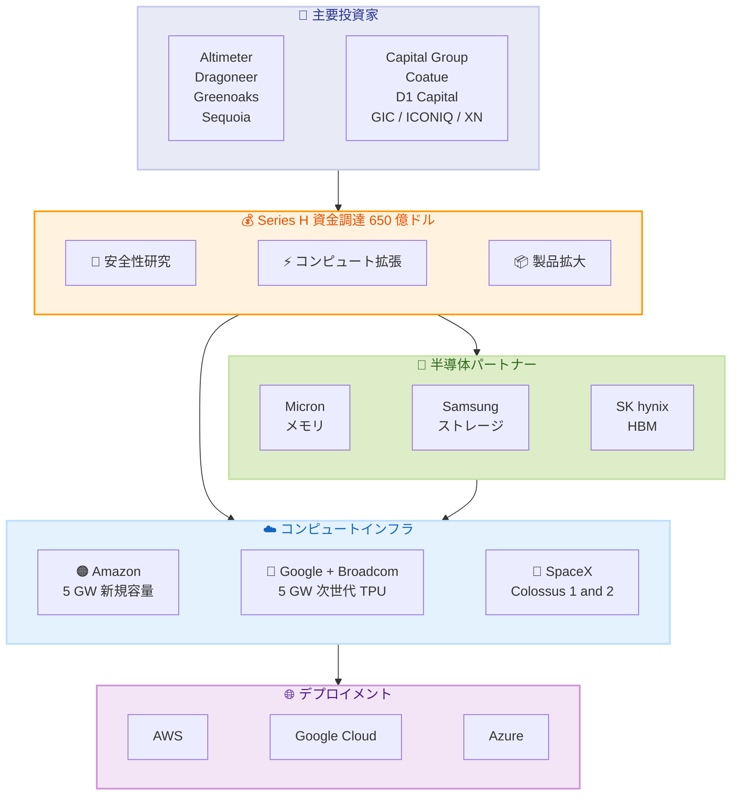

# Anthropic Series H 資金調達: 650 億ドルの大型ラウンド完了

## メタデータ

| 項目 | 内容 |
|------|------|
| 発表日 | 2026-05-28 |
| ソース | Anthropic News |
| カテゴリ | 企業ニュース |
| 公式リンク | https://www.anthropic.com/news/series-h |

## 概要

Anthropic は 2026 年 5 月 28 日、Series H 資金調達ラウンドで 650 億ドル (約 9.7 兆円) を調達したと発表した。ポストマネー評価額は 9,650 億ドルに達し、AI 業界において史上最大規模の資金調達となる。本ラウンドは 2026 年 2 月の Series G に続くもので、Altimeter Capital、Dragoneer、Greenoaks、Sequoia Capital がリード投資家として参加している。

調達資金は安全性・解釈可能性研究の推進、コンピュートインフラの拡張、製品・パートナーシップの拡大に充てられる。同社のランレート収益は 2026 年 5 月に 470 億ドルを突破しており、急速な事業成長を裏付けている。

## 詳細

### 背景

Anthropic は 2026 年 2 月に Series G を完了した後、わずか 3 か月で Series H を実施した。この短期間での連続的な大型調達は、AI インフラへの巨額投資需要と Claude の急速な市場浸透を反映している。Claude は AWS、Google Cloud、Microsoft Azure の 3 大クラウドすべてで利用可能な初のフロンティアモデルとなり、エンタープライズ市場での採用が加速している。

### 主な変更点

**調達規模と評価額:**

- 調達額: 650 億ドル
- ポストマネー評価額: 9,650 億ドル
- ハイパースケーラーからの既存コミットメント: 150 億ドル (うち Amazon から 50 億ドル)

**投資家構成:**

- **リード投資家**: Altimeter Capital、Dragoneer、Greenoaks、Sequoia Capital
- **コリード投資家**: Capital Group、Coatue、D1 Capital Partners、GIC、ICONIQ、XN
- **主要投資家**: AMP PBC、Baillie Gifford、Blackstone、Brookfield、D.E. Shaw Ventures、DST Global、Fidelity、General Catalyst、Insight Partners、Jane Street、Lightspeed、MGX、NTTVC、NX1 Capital、Situational Awareness LP、T. Rowe Price、Temasek

**戦略的インフラパートナー:**

- Micron、Samsung、SK hynix (メモリ、ストレージ、ロジックチップ技術の提供)

**資金使途:**

1. 安全性・解釈可能性研究の推進
2. Claude への需要増大に対応するコンピュート拡張
3. 製品とパートナーシップの拡大

### 技術的な詳細

**コンピュートインフラの拡張計画:**

| パートナー | 容量 | 内容 |
|-----------|------|------|
| Amazon | 最大 5 GW | 新規データセンター容量 |
| Google + Broadcom | 5 GW | 次世代 TPU 容量 |
| SpaceX | GPU 容量 | Colossus 1 および Colossus 2 |

合計 10 GW 以上のコンピュート容量は、AI モデルのトレーニングと推論の両面で大幅なスケールアップを可能にする。AWS は引き続き主要なクラウドプロバイダーおよびトレーニングパートナーとしての役割を担う。

**半導体サプライチェーンの強化:**

Micron、Samsung、SK hynix との戦略的パートナーシップにより、AI ワークロードに最適化されたメモリ・ストレージ技術へのアクセスを確保している。これは大規模モデルのトレーニングおよび推論における HBM (High Bandwidth Memory) 需要の急増に対応するものである。

## 開発者への影響

### 対象

- Claude API を利用する全開発者
- AWS、Google Cloud、Azure 上で Claude を使用するエンタープライズ顧客
- AI アプリケーションを構築するスタートアップおよび企業

### 必要なアクション

本ラウンドは資金調達に関するニュースであり、API やサービスの変更は伴わない。ただし、以下の恩恵が期待される。

- **コンピュート拡張による安定性向上**: インフラ投資によりサービスの可用性とレスポンス速度の改善が見込まれる
- **新機能の加速**: 研究投資により次世代モデルや新機能のリリースペースが加速する可能性がある
- **マルチクラウド対応の強化**: 3 大クラウドでの Claude 利用がさらに容易になることが期待される

### 移行ガイド (該当する場合)

該当なし。本ニュースは資金調達に関する発表であり、API の変更や移行は必要ない。

## コード例

N/A - 本ニュースは企業の資金調達に関する発表であり、技術的なコード変更は伴わない。

## アーキテクチャ図 (該当する場合)

## 関連リンク

- [Anthropic Series H 公式発表](https://www.anthropic.com/news/series-h)
- [Anthropic 公式サイト](https://www.anthropic.com)
- [Claude API ドキュメント](https://docs.anthropic.com)
- [Anthropic News](https://www.anthropic.com/news)

## まとめ

Anthropic の Series H は、AI 業界の資金調達として前例のない規模であり、同社の急成長と市場からの高い期待を示している。650 億ドルの調達と 9,650 億ドルの評価額は、Claude が企業向け AI プラットフォームとして確固たる地位を築いていることの証左である。

特に注目すべきは以下の点である。

- **マルチクラウド戦略の成功**: 3 大クラウドすべてで利用可能な唯一のフロンティアモデルとして、幅広い顧客基盤を確保
- **コンピュート容量の大規模拡張**: 合計 10 GW 以上の新規容量により、今後のモデル開発と推論サービスの大幅なスケールアップが可能に
- **収益成長の加速**: ランレート収益 470 億ドルは、エンタープライズ市場での急速な採用を反映
- **安全性研究への継続的投資**: 商業的成功と並行して、AI 安全性・解釈可能性研究を推進する姿勢を明確化

開発者にとっては、インフラ拡張によるサービス品質の向上と、新機能のリリース加速が期待される。
