# Claude Code v2.1.153: バックグラウンドセッション安定化と MCP 修正を含む大型アップデート

## メタデータ

| 項目 | 内容 |
|------|------|
| 発表日 | 2026-05-28 |
| ソース | Claude Code Changelog |
| カテゴリ | ツールアップデート |
| 公式リンク | https://github.com/anthropics/claude-code/blob/main/CHANGELOG.md |

## 概要

Claude Code v2.1.153 は、バックグラウンドセッションの安定性を大幅に向上させ、MCP サーバー関連のリグレッション修正、Windows 対応の改善、エージェント機能の強化を含む包括的なアップデートである。特にバックグラウンドセッションに関する 10 件以上のバグ修正が行われ、`/model` コマンドの動作変更やサブエージェントの MCP 設定に関する重要な修正が含まれている。

## 詳細

### 背景

前バージョン v2.1.147 で導入されたステートフル MCP サーバーのリグレッションや、カスタム API ゲートウェイの認証トークン問題など、複数の重要なバグが報告されていた。また、バックグラウンドセッション機能は利用者の増加に伴い、各種プラットフォームでの安定性に関する課題が顕在化していた。本バージョンではこれらの問題に対する包括的な修正と、開発者体験を向上させる新機能が追加されている。

### 主な変更点

#### 新機能・改善

1. **Git LFS スキップオプション**: `github`/`git` プラグインのマーケットプレイスソースに `skipLfs` オプションを追加。クローンおよびアップデート時の Git LFS ダウンロードをスキップ可能に
2. **npm グローバルインストール通知**: 自動更新ができない npm グローバルインストール環境で、一度だけ通知を表示。`/doctor` で修正方法を確認可能
3. **ステータスラインの環境変数**: ステータスラインコマンドに `COLUMNS` と `LINES` 環境変数を渡し、ターミナル幅に応じた出力サイズ調整が可能に
4. **`claude agents` オートコンプリート改善**: ディスパッチ入力でネイティブスラッシュコマンドとバンドルスキルを候補に表示 (プロジェクトスキルだけでなく)
5. **`claude agents` PR 表示改善**: PR カラムが単一 PR の場合は `PR #N`、複数の場合は `N PRs` と表示
6. **`claude doctor` 更新情報**: 前回のアップデート試行結果を表示
7. **認証通知の統合**: MCP サーバーとコネクタの認証通知を 1 つのメッセージに統合
8. **macOS バックグラウンドエージェント改善**: Privacy & Security に "Claude Code" として表示され、アップグレード後もパーミッション付与が維持される
9. **`/model` コマンドの動作変更**: 選択したモデルが新規セッションのデフォルトとして保存される (IDE と同じ動作)。現在のセッションのみ変更する場合はピッカーで `s` を押す

#### バグ修正 - MCP サーバー関連

1. **ステートフル MCP サーバーの再接続ループ修正**: オプションの GET SSE ストリームを持たないステートフル MCP サーバーが `tools/list` で再接続ループする問題を修正 (v2.1.147 でのリグレッション)
2. **カスタム API ゲートウェイの認証トークン修正**: ゲートウェイ独自のトークンではなく、ユーザーの Anthropic OAuth 認証情報がゲートウェイに送信されるリグレッションを修正
3. **サブエージェントの MCP 設定修正**: Agent ツールのフロントマター MCP サーバーが `--strict-mcp-config`、`--bare`、リモートモード、エンタープライズマネージド MCP 設定、マネージド設定の MCP サーバー許可/拒否ポリシーを無視する問題を修正
4. **`--strict-mcp-config` のインライン MCP 保持**: 明示的に渡されたエージェント定義 (`--agents` / SDK `agents`) のインライン `mcpServers` を削除しなくなり、ブロックされたサブエージェント MCP サーバーに対して可視的な警告を表示
5. **MCP ツール進捗通知**: 折り畳みツールビューで MCP ツールの進捗通知がレンダリングされない問題を修正

#### バグ修正 - バックグラウンドセッション関連

1. **`/bg` コマンドの応答継続**: Claude が応答中に `/bg` を実行した場合、応答をドロップせずバックグラウンドセッションで継続するよう修正
2. **`/btw` キーボードショートカット修正**: タスク実行中のバックグラウンドセッションでショートカットが応答しなくなる問題を修正
3. **一時ファイルのパーミッション**: バックグラウンドセッションが `$CLAUDE_JOB_DIR` に一時ファイルを書き込む際の "sensitive file" パーミッションプロンプトを修正
4. **ワーキングディレクトリ削除時のリカバリ**: 削除されたディレクトリを持つバックグラウンドエージェントのリカバリ時に、スタックトレースの代わりに明確なエラーメッセージを表示
5. **`EnterWorktree` の即時利用**: バックグラウンドセッションで `ToolSearch` を先に実行しなくても `EnterWorktree` が使用可能に
6. **iTerm2/Terminal.app での再描画**: `cmd+k` でアタッチ済みバックグラウンドセッションが再描画されない問題を修正
7. **Windows IME 候補ウィンドウ**: アタッチ済みバックグラウンドセッションで IME 候補ウィンドウが入力カーソル横ではなく画面下部に表示される問題を修正
8. **256 色ターミナルでの背景色にじみ**: ファイル差分表示後に 256 色ターミナルからアタッチした際の背景色にじみを修正
9. **tmux 内でのクリップボード**: `/copy` とコピーオンセレクトが tmux 内のバックグラウンドセッションでシステムクリップボードを更新できない問題を修正
10. **Remote Control 使用時のゾンビセッション**: `claude agents` を Remote Control 有効で開き、終了後に Code タブにゾンビセッションエントリが残る問題を修正
11. **`/rename` の即時反映**: バックグラウンドセッションでのリネームがセッションバナーに即座に反映されるよう修正

#### バグ修正 - Windows 関連

1. **PowerShell インストーラー修正**: インストールが実際に失敗した場合でも "Installation complete!" と報告される問題を修正
2. **Windows アップデートロールバック**: 更新失敗時に元の実行ファイルをコピーで復元し、リカバリ方法を通知
3. **VS Code プロセス終了修正**: Windows で VS Code を閉じた際に Claude Code プロセスが正常に終了しない問題を修正 (偽の "unclean exit" レポートと孤立した MCP サーバーの原因)

#### バグ修正 - その他

1. **`claude update` のリリースチャネル準拠**: npm インストールで設定されたリリースチャネルのバージョンではなく最新バージョンをインストールする問題を修正
2. **セッション再開時のメモリ使用量**: トランスクリプトファイルパスでセッションを再開する際、多数の保存セッションがあるマシンでの過剰なメモリ使用量 (数 GB) を修正
3. **古いデーモンの問題**: `claude agents` と `claude --bg` がバイナリテイクオーバーサポート前に起動された古いデーモンで実行される問題を修正
4. **stream-json モードのハング**: stdin が EOF なしで閉じられた際に CLI が終了できずハングし、古いセッションマーカーが残る問題を修正
5. **不正な `file://` リンク**: Claude の応答中の不正な `file://` リンクがターミナルでクリックできない問題を修正
6. **`claude --help` の表示**: 92 カラム未満のターミナルで折り返しなしの出力がレンダリングされる問題を修正
7. **Agent ツールの一時ワークツリー**: `subagent_type: 'claude'` を使用した Agent ツールが未ドキュメントの一時ワークツリーで実行され、gitignored パスへの出力がサイレントに破棄される問題を修正

### 技術的な詳細

**MCP サーバー認証フロー修正**: カスタム API ゲートウェイ使用時に、OAuth 認証情報のルーティングロジックが修正された。これにより、ユーザーの Anthropic OAuth トークンがサードパーティのゲートウェイに誤送信されるセキュリティ上の問題が解消された。

**メモリ使用量の最適化**: セッション再開時に全保存セッションのメタデータを読み込んでいた処理が最適化され、対象セッションのみを効率的に読み込むよう変更された。これにより、多数のセッションを持つマシンでの数 GB レベルのメモリ消費が解消された。

**`/model` コマンドのキーバインド変更**: デフォルト設定動作が `d` から暗黙的な選択に変更され、現在のセッションのみ変更するキーが `s` に割り当てられた。`modelPicker:setAsDefault` をカスタマイズしていた場合は `modelPicker:thisSessionOnly` への変更が必要。

## 開発者への影響

### 対象

以下の開発者に影響がある。

- Claude Code CLI を日常的に使用している全開発者
- バックグラウンドセッション (`claude --bg`、`/bg`) を活用している開発者
- カスタム API ゲートウェイを使用しているエンタープライズユーザー
- MCP サーバーを利用している開発者
- Windows 環境で Claude Code を使用している開発者
- `--strict-mcp-config` でサブエージェントを運用している開発者

### 必要なアクション

以下のアクションが必要である。

1. **`/model` キーバインドのカスタマイズ**: `modelPicker:setAsDefault` を `keybindings.json` でカスタマイズしていた場合、`modelPicker:thisSessionOnly` にリネームする
2. **アップデート実行**: `claude update` で v2.1.153 に更新する
3. **MCP サーバーの動作確認**: v2.1.147 以降でステートフル MCP サーバーの再接続ループが発生していた場合、本バージョンで解消されていることを確認する
4. **カスタム API ゲートウェイ利用者**: 認証トークンが正しくルーティングされていることを確認する (セキュリティ修正)

### 移行ガイド

`/model` コマンドのキーバインドを変更していた場合。

```json
// keybindings.json - 変更前
{
  "modelPicker:setAsDefault": "d"
}

// keybindings.json - 変更後
{
  "modelPicker:thisSessionOnly": "s"
}
```

## アーキテクチャ図

```mermaid
flowchart TD
    subgraph Core["🏠 Claude Code コア"]
        direction LR
        CLI["🖥️ CLI"]
        Daemon["👻 デーモン"]
        SessionMgr["📋 セッション管理"]
        CLI ~~~ Daemon ~~~ SessionMgr
    end

    subgraph BG["🔄 バックグラウンドセッション<br/>10 件以上のバグ修正"]
        direction LR
        BGSession["💤 /bg 応答継続"]
        BTW["⌨️ /btw 修正"]
        Clipboard["📋 クリップボード"]
        IME["🔤 IME 修正"]
        BGSession ~~~ BTW ~~~ Clipboard ~~~ IME
    end

    subgraph MCP["🔌 MCP サーバー<br/>5 件の修正"]
        direction LR
        Stateful["🔁 再接続ループ修正"]
        Auth["🔑 認証トークン修正"]
        SubAgent["🤖 サブエージェント設定"]
        Stateful ~~~ Auth ~~~ SubAgent
    end

    subgraph Platform["💻 プラットフォーム対応"]
        direction LR
        Win["🪟 Windows<br/>3 件の修正"]
        Mac["🍎 macOS<br/>パーミッション改善"]
        Terminal["📟 ターミナル<br/>表示修正"]
        Win ~~~ Mac ~~~ Terminal
    end

    subgraph Agents["🤖 エージェント機能"]
        direction LR
        AutoComplete["🔍 オートコンプリート"]
        PRColumn["📊 PR 表示"]
        Doctor["🩺 /doctor 改善"]
        AutoComplete ~~~ PRColumn ~~~ Doctor
    end

    subgraph Memory["🧠 パフォーマンス"]
        direction LR
        MemOpt["📉 メモリ最適化"]
        StaleD["🔄 古いデーモン修正"]
        Hang["⏱️ ハング修正"]
        MemOpt ~~~ StaleD ~~~ Hang
    end

    Core --> BG
    Core --> MCP
    Core --> Platform
    Core --> Agents
    Core --> Memory

    classDef core fill:#E8EAF6,stroke:#C5CAE9,stroke-width:2px,color:#283593
    classDef bg fill:#E8F5E9,stroke:#A5D6A7,stroke-width:2px,color:#1B5E20
    classDef mcp fill:#FFF3E0,stroke:#FFCC80,stroke-width:2px,color:#E65100
    classDef platform fill:#F3E5F5,stroke:#CE93D8,stroke-width:2px,color:#4A148C
    classDef agents fill:#E3F2FD,stroke:#90CAF9,stroke-width:2px,color:#0D47A1
    classDef memory fill:#FFEBEE,stroke:#EF9A9A,stroke-width:2px,color:#B71C1C

    class Core core
    class BG bg
    class MCP mcp
    class Platform platform
    class Agents agents
    class Memory memory
```



## 関連リンク

- [Claude Code Changelog](https://github.com/anthropics/claude-code/blob/main/CHANGELOG.md)
- [Claude Code ドキュメント](https://docs.anthropic.com/en/docs/claude-code)
- [MCP サーバー仕様](https://modelcontextprotocol.io/)
- [Claude Code キーバインド設定](https://docs.anthropic.com/en/docs/claude-code/settings#keybindings)

## まとめ

Claude Code v2.1.153 は、バックグラウンドセッションの安定性を大幅に改善し、MCP サーバーの認証・接続問題を修正した重要なリリースである。特に、カスタム API ゲートウェイへの認証トークン誤送信はセキュリティ上の問題であり、該当環境のユーザーは速やかなアップデートが推奨される。また、Windows 環境での安定性向上、メモリ使用量の最適化、エージェント機能の利便性向上など、幅広い改善が含まれている。`/model` コマンドの動作変更については、キーバインドをカスタマイズしていたユーザーのみ対応が必要となる。
