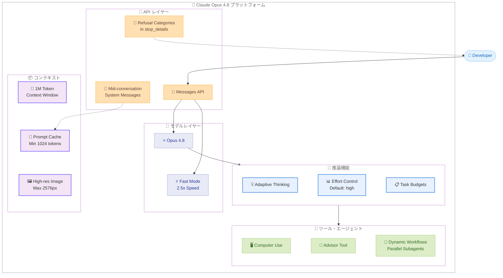

# Claude Opus 4.8: より効果的なコラボレーターへの進化

## メタデータ

| 項目 | 内容 |
|------|------|
| 発表日 | 2026-05-28 |
| ソース | Anthropic News / Claude API Release Notes |
| カテゴリ | モデルアップデート |
| 公式リンク | https://www.anthropic.com/news/claude-opus-4-8 |

## 概要

Anthropic は 2026 年 5 月 28 日、Claude Opus 4.7 の後継モデルとなる Claude Opus 4.8 を発表した。「より効果的なコラボレーター」と位置付けられる本モデルは、コードレビュー精度の大幅な向上、適応的思考 (Adaptive Thinking) による効率的なトークン消費、会話途中でのシステムメッセージ挿入など、多数の新機能を搭載している。

料金は Opus 4.7 と同一の入力 $5/MTok、出力 $25/MTok を維持しながら、Databricks のテストでは実質的なトークンコストが Opus 4.7 比で 61% 削減されたと報告されている。API モデル識別子は `claude-opus-4-8` で、既存の全ツールおよびプラットフォーム機能をサポートする。

## 詳細

### 背景

Claude Opus 4.7 は高い推論能力を持つモデルとして広く利用されてきたが、不要な場面でも思考トークンを消費する傾向や、コードレビューで欠陥を見逃すケースが課題として指摘されていた。Claude Opus 4.8 はこれらの課題を解決し、パートナー企業からのフィードバックを反映した実用性重視の改善が施されている。

### 主な変更点

1. **適応的思考 (Adaptive Thinking)**: 推論が必要な場合にのみ思考を起動し、不要なトークン消費を削減
2. **会話途中のシステムメッセージ**: メッセージ配列の先頭以外の位置に `role: "system"` を配置可能。プロンプトキャッシュを維持したまま指示を更新できる
3. **拒否カテゴリの詳細化**: `stop_details` にリフューザルのカテゴリ情報を含む
4. **最小キャッシュ可能プロンプト長の短縮**: 1,024 トークン (Opus 4.7 より低い閾値)
5. **高解像度画像入力**: 最大 2,576px までの画像をサポート
6. **Fast モード**: リサーチプレビューとして提供。入力 $10/MTok、出力 $50/MTok で 2.5 倍の速度
7. **effort パラメータのデフォルト値**: `"high"` に設定
8. **Dynamic Workflows**: Claude Code 内で数百の並列サブエージェントを実行可能 (リサーチプレビュー)

### 技術的な詳細

**モデルスペック:**

| 項目 | 値 |
|------|-----|
| モデル ID | `claude-opus-4-8` |
| コンテキストウィンドウ | 1M トークン |
| 最大出力トークン | 128k |
| 入力料金 | $5/MTok |
| 出力料金 | $25/MTok |
| Fast モード入力 | $10/MTok |
| Fast モード出力 | $50/MTok |
| 最小キャッシュ長 | 1,024 トークン |
| 最大画像解像度 | 2,576px |

**パフォーマンス比較 (vs Opus 4.7):**

- コードの欠陥を見逃す確率が約 4 分の 1 に低減
- 不確実性のフラグ付けがより積極的
- ミスアラインメント行動率が大幅に低下 (Claude Mythos Preview と同等)
- Online-Mind2Web (ブラウザエージェントベンチマーク): 84%
- Harvey Legal Agent Benchmark: 全モデル初の 10% all-pass 超え
- Databricks テストでトークンコスト 61% 削減

**制限事項:**

- `temperature`、`top_p`、`top_k` をデフォルト以外に設定すると 400 エラーを返す (Opus 4.7 と同様)
- Opus 4.6 の Fast モードは本モデルのリリースから約 30 日後に廃止予定

**安全性:**

- 完全なアラインメント評価を実施
- System Card にデプロイ前安全性テストを公開
- ミスアラインメント行動率は Claude Mythos Preview と同等の水準

## 開発者への影響

### 対象

- Claude API を利用する全ての開発者
- コードレビューやエージェント機能を活用するチーム
- 長いコンテキストを使用するアプリケーション開発者
- Claude Code ユーザー (Dynamic Workflows)

### 必要なアクション

1. **モデル ID の更新**: `claude-opus-4-7` から `claude-opus-4-8` への切り替えを検討
2. **温度パラメータの確認**: デフォルト以外の `temperature`/`top_p`/`top_k` を使用している場合はエラーが発生するため確認が必要
3. **Fast モード移行**: Opus 4.6 の Fast モードを利用している場合は約 30 日以内に Opus 4.8 Fast モードへ移行
4. **適応的思考の活用**: 不要な思考トークンの削減により、コスト最適化が見込める

### 移行ガイド

**Opus 4.7 からの移行:**

Opus 4.8 は Opus 4.7 の全機能を上位互換でサポートするため、基本的にはモデル ID の変更のみで移行可能。

```python
# Before
model = "claude-opus-4-7-20250301"

# After
model = "claude-opus-4-8-20260528"
```

**新機能の活用:**

- 会話途中のシステムメッセージを利用する場合、メッセージ配列内の任意の位置に `role: "system"` を追加
- `stop_details` の拒否カテゴリを活用して、より細やかなエラーハンドリングを実装

## コード例

```python
import anthropic

client = anthropic.Anthropic()

# 会話途中のシステムメッセージ (Mid-conversation System Messages)
# プロンプトキャッシュを維持したまま指示を動的に更新
response = client.messages.create(
    model="claude-opus-4-8-20260528",
    max_tokens=4096,
    system="あなたは優秀なソフトウェアエンジニアです。コードレビューを行います。",
    messages=[
        {
            "role": "user",
            "content": "以下の Python コードをレビューしてください:\n\ndef calc(x):\n    return x/0"
        },
        {
            "role": "assistant",
            "content": "このコードにはゼロ除算の問題があります..."
        },
        # 会話途中でシステムメッセージを挿入
        # プロンプトキャッシュが維持される
        {
            "role": "system",
            "content": "今後はセキュリティの観点からもレビューしてください。"
        },
        {
            "role": "user",
            "content": "次のコードもレビューしてください:\n\nimport subprocess\nsubprocess.run(user_input, shell=True)"
        }
    ]
)

print(response.content[0].text)

# stop_details で拒否カテゴリを確認
print(f"Stop reason: {response.stop_reason}")
if hasattr(response, 'stop_details'):
    print(f"Stop details: {response.stop_details}")
```

## アーキテクチャ図



## 関連リンク

- [Claude Opus 4.8 公式発表](https://www.anthropic.com/news/claude-opus-4-8)
- [Claude API Release Notes](https://platform.claude.com/docs/en/release-notes/overview)
- [Claude モデル一覧](https://docs.anthropic.com/en/docs/about-claude/models)
- [Messages API ドキュメント](https://docs.anthropic.com/en/api/messages)
- [Claude Code Changelog](https://github.com/anthropics/claude-code/blob/main/CHANGELOG.md)

## まとめ

Claude Opus 4.8 は、Opus 4.7 の全機能を継承しつつ、実用性を大幅に向上させた次世代モデルである。適応的思考によるトークン効率の改善、会話途中のシステムメッセージによるプロンプトキャッシュの活用、コードレビュー精度の約 4 倍の改善など、開発者にとって即座に恩恵を受けられる改善が多い。

料金据え置きかつ実質コスト 61% 削減という点は、大規模なエージェントワークロードを運用するチームにとって特に魅力的である。Dynamic Workflows によるサブエージェントの並列実行は、Claude Code でのソフトウェア開発ワークフローを根本的に変える可能性を持つ。

Opus 4.6 の Fast モードが約 30 日後に廃止される点に注意し、該当する開発者は早めの移行を推奨する。Anthropic は今後、同等の能力を低コストで提供するモデルや、Mythos クラスのモデルの一般提供を予定しており、更なる進化が期待される。
