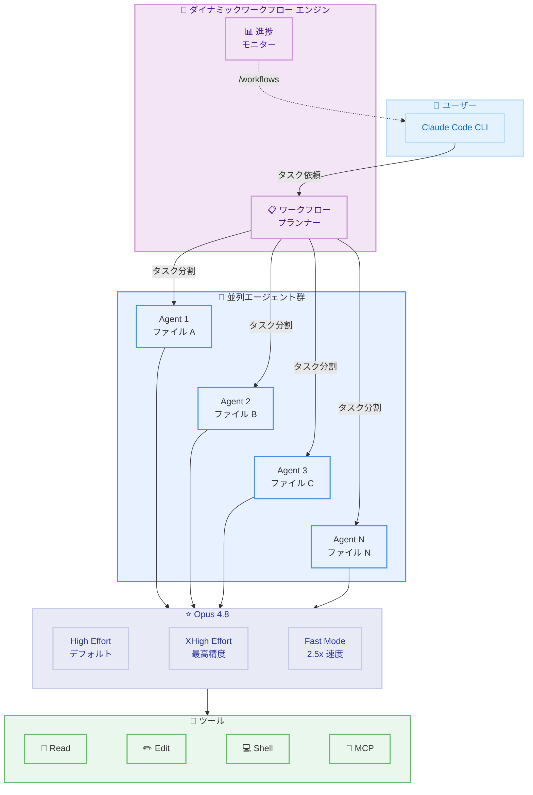

# Claude Code v2.1.154 - Opus 4.8 対応 & ダイナミックワークフロー

## メタデータ

| 項目 | 内容 |
|------|------|
| 発表日 | 2026-05-29 |
| ソース | Claude Code Changelog |
| カテゴリ | Claude Code アップデート |
| 公式リンク | https://github.com/anthropics/claude-code/blob/main/CHANGELOG.md |

## 概要

Claude Code v2.1.154 は、Opus 4.8 モデルへの対応とダイナミックワークフロー機能を中心とした大型アップデートである。ダイナミックワークフローにより、数十から数百のエージェントをバックグラウンドでオーケストレーションし、複雑なタスクを並列処理できるようになった。また、Opus 4.8 のファストモードが従来の 2.5 倍の速度で動作し、コストも大幅に削減された。v2.1.156 ホットフィックスでは、Opus 4.8 使用時の thinking ブロック修正による API エラーが解消されている。

## 詳細

### 背景

Claude Code は開発者向けの AI コーディングアシスタントとして急速に進化を続けている。前バージョンまでは単一エージェントによるタスク処理が基本だったが、大規模なリファクタリングや複数ファイルにまたがる変更など、複雑なタスクに対するスケーラビリティが課題であった。本リリースでは、Opus 4.8 の高性能モデルを基盤としたマルチエージェントオーケストレーション機能が導入され、開発者の生産性が飛躍的に向上する。

### 主な変更点

#### 1. Opus 4.8 対応

- デフォルトで high effort に設定
- 最も困難なタスクには `/effort xhigh` で対応
- Lean システムプロンプトが Haiku、Sonnet、Opus 4.7 以前を除く全モデルでデフォルト化

#### 2. ダイナミックワークフロー

- Claude にワークフロー作成を依頼すると、数十から数百のエージェントをバックグラウンドでオーケストレーション
- `/workflows` コマンドで実行状況を確認可能
- 複雑なタスクの並列処理による大幅な時間短縮

#### 3. ファストモード (Opus 4.8)

- 標準レートの 2 倍で利用可能
- 2.5 倍の速度を実現
- 従来コストの大幅削減

#### 4. エージェント改善

- `claude agents` でシェルコマンドをバックグラウンドセッションとして実行 (`! <command>`)
- `/logout` がバックグラウンドセッションに送信されず正しくサインアウト
- エージェントビュー (`←←`) が Bedrock、Vertex、Foundry、テレメトリ無効環境で動作

#### 5. プラグインシステム

- `plugin.json` で `defaultEnabled: false` を宣言可能
- `/plugin` Discover タブがカレントディレクトリに適したプラグインをピン表示

#### 6. その他の新機能

- `/simplify` コマンド: クリーンアップ専用レビュー (再利用、簡素化、効率化、抽象度) を実行し修正を適用
- `/effort` スライダー: ラベルが "Speed"/"Intelligence" から "Faster"/"Smarter" に変更
- スマートな質問処理: Claude が自分で判断できない選択に限り多肢選択プロンプトを表示
- Chrome 統合: `/chrome` から接続ブラウザを選択可能

### 技術的な詳細

#### ストリーミングツール実行

全プロバイダー (Bedrock、Vertex、Foundry を含む) でストリーミングツール実行が常時有効化された。これにより、ツール呼び出し結果がリアルタイムで表示される。

#### MCP サーバー環境変数

MCP サーバーサブプロセスに `CLAUDE_CODE_SESSION_ID` と `CLAUDECODE=1` が渡されるようになった。これにより、MCP サーバー側で Claude Code セッションを識別し、適切な動作を行える。

#### セキュリティ改善

- 自動モードのデータ漏洩検知が改善
- `rm -rf $HOME` が HOME に末尾スラッシュがある場合もブロック
- サブエージェントがバックグラウンドセッションで worktree 分離ガードをバイパスする問題を修正
- 安全分類器がトークン不足の際に自動モードが誤ってアクションをブロックする問題を修正

#### 非推奨化

- `CLAUDE_CODE_OPUS_4_6_FAST_MODE_OVERRIDE` は非推奨 (2026-06-01 に削除予定)

#### バグ修正 (24 件以上)

- `$TMPDIR` がサンドボックス内外で異なるパスに解決される問題を修正
- バックグラウンドエージェント完了通知が早期の "out of context" を引き起こす問題を修正
- ピン留めされたバックグラウンドセッションがアップデート後に毎分再生成される問題を修正
- macOS で `claude --bg-pty-host` プロセスが 100% CPU になる問題を修正
- VS Code でのターミナルレンダリング破損を修正
- effort パラメータ未対応モデルでの API 400 エラーを修正
- v2.1.156 ホットフィックス: Opus 4.8 使用時に thinking ブロックが変更され API エラーが発生する問題を修正

## 開発者への影響

### 対象

- Claude Code を使用する全開発者
- マルチエージェントワークフローを活用したい大規模プロジェクトの開発チーム
- Opus 4.8 の高速処理を活用したいユーザー
- MCP サーバーを開発しているプラグイン作者
- Bedrock、Vertex、Foundry 経由で Claude Code を利用するエンタープライズユーザー

### 必要なアクション

1. **Claude Code のアップデート**: `claude update` または `npm install -g @anthropic-ai/claude-code@latest` で v2.1.154 以上に更新
2. **ファストモード環境変数の移行**: `CLAUDE_CODE_OPUS_4_6_FAST_MODE_OVERRIDE` を使用している場合は、2026-06-01 までに新しい設定方式に移行
3. **MCP サーバーの更新** (任意): 新しい環境変数 `CLAUDE_CODE_SESSION_ID` と `CLAUDECODE=1` を活用してセッション認識機能を実装
4. **プラグインの更新** (プラグイン作者): `defaultEnabled: false` オプションの活用を検討

### 移行ガイド (該当する場合)

#### ファストモード環境変数の移行

```bash
# 非推奨 (2026-06-01 に削除予定)
export CLAUDE_CODE_OPUS_4_6_FAST_MODE_OVERRIDE=true

# 新しい方法: Opus 4.8 ファストモードは組み込みで利用可能
# 特別な環境変数は不要。標準レートの 2 倍で自動的に有効化
```

#### effort ラベルの変更

| 旧ラベル | 新ラベル |
|---------|---------|
| Speed | Faster |
| Intelligence | Smarter |

## コード例

```bash
# ダイナミックワークフローの使用例
# Step 1: Claude にワークフローの作成を依頼
> 全テストファイルをリファクタリングして、共通のヘルパー関数を抽出してください

# Claude がワークフローを作成し、複数のエージェントを並列起動
# Step 2: ワークフローの実行状況を確認
/workflows

# 出力例:
# Workflow: "テストリファクタリング" (running)
#   Agent 1: tests/auth.test.ts - extracting helpers [done]
#   Agent 2: tests/api.test.ts - extracting helpers [in progress]
#   Agent 3: tests/db.test.ts - extracting helpers [in progress]
#   ...
#   Agent 12: tests/e2e.test.ts - waiting

# バックグラウンドセッションでシェルコマンドを実行
claude agents
> ! npm run test:watch

# effort レベルの変更
/effort xhigh

# simplify コマンドでコードクリーンアップ
/simplify
```

## アーキテクチャ図 (該当する場合)



## 関連リンク

- [Claude Code Changelog](https://github.com/anthropics/claude-code/blob/main/CHANGELOG.md)
- [Claude Code ドキュメント](https://docs.anthropic.com/en/docs/claude-code)
- [Opus 4.8 モデル情報](https://www.anthropic.com/news)
- [MCP プロトコル仕様](https://modelcontextprotocol.io)

## まとめ

Claude Code v2.1.154 は、ダイナミックワークフローと Opus 4.8 対応を柱とする大型リリースである。ダイナミックワークフローにより、複雑なタスクを数十から数百のエージェントで並列処理できるようになり、大規模リファクタリングやコードベース全体の変更が劇的に効率化される。Opus 4.8 のファストモードは従来の 2.5 倍の速度を実現しつつコストを削減し、日常的な開発タスクの応答性を大幅に向上させる。プラグインシステムや Chrome 統合の改善、24 件以上のバグ修正も含まれており、全体的な安定性と使い勝手が向上している。`CLAUDE_CODE_OPUS_4_6_FAST_MODE_OVERRIDE` 環境変数を使用している開発者は、2026-06-01 の削除期限までに移行を完了する必要がある。
