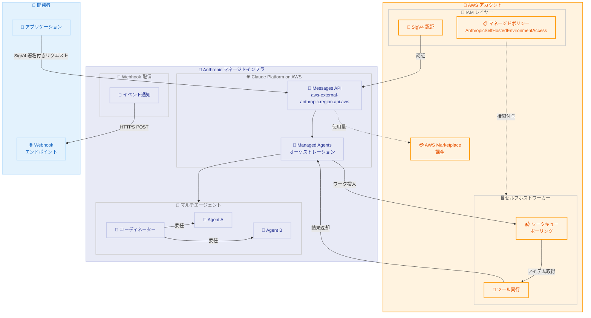

# Claude Managed Agents の Webhooks、マルチエージェント、セルフホストサンドボックスが Claude Platform on AWS で利用可能に

## メタデータ

| 項目 | 内容 |
|------|------|
| 発表日 | 2026-05-29 |
| ソース | Claude API Release Notes |
| カテゴリ | プラットフォームアップデート |
| 公式リンク | https://platform.claude.com/docs/en/release-notes/overview |

## 概要

Claude Managed Agents の主要機能である Webhooks、マルチエージェントオーケストレーション、セルフホストサンドボックスが Claude Platform on AWS で利用可能になった。これにより、AWS 経由で Claude を利用するエンタープライズユーザーは、ポーリング不要のイベント通知、複数エージェントの協調動作、自社インフラでのツール実行を組み合わせた高度なエージェントワークフローを構築できる。新たに追加された IAM アクションと `AnthropicSelfHostedEnvironmentAccess` マネージドポリシーにより、AWS IAM を通じたきめ細かいアクセス制御も実現される。

## 詳細

### 背景

Claude Platform on AWS は 2026 年 5 月 11 日に発表されたサービスであり、Anthropic が管理するインフラストラクチャを通じて Claude API の全機能を AWS アカウントから利用できるプラットフォームである。Amazon Bedrock とは異なり、Anthropic がインフラを運用し、AWS は認証レイヤー (SigV4 または API キー)、IAM ベースのアクセス制御、AWS Marketplace を通じた課金統合を提供する。

Claude Managed Agents は 2026 年 4 月 8 日にパブリックベータとして発表され、フルマネージドなエージェントハーネスとして、セキュアなサンドボックス内での自律的なタスク実行を可能にしている。その後、5 月 6 日に Webhooks とマルチエージェントセッションが、5 月 19 日にセルフホストサンドボックスがそれぞれ追加された。今回のアップデートにより、これらの機能が Claude Platform on AWS でも完全に利用可能となった。

### 主な変更点

#### 1. Webhooks の AWS 対応

- セッションのライフサイクルイベント (開始、アイドル、リスケジュール、終了) を HTTPS エンドポイントで受信可能
- Vault (認証情報管理) のイベント通知にも対応
- ポーリング不要でリアルタイムにエージェントの状態変化を検知
- SDK の `unwrap()` ヘルパーによる署名検証

#### 2. マルチエージェントオーケストレーションの AWS 対応

- コーディネーターエージェントが複数のサブエージェントに作業を委任
- 各エージェントは独自のスレッド (コンテキスト分離されたイベントストリーム) で実行
- 最大 25 スレッドの同時実行に対応
- エージェント間でサンドボックスとファイルシステムを共有しつつ、コンテキストは分離

#### 3. セルフホストサンドボックスの AWS 対応

- ツール実行を自社インフラで実行可能
- オーケストレーションは Anthropic 側で管理し、実行環境のみ自社に配置
- `AnthropicSelfHostedEnvironmentAccess` マネージドポリシーで IAM 認証
- 環境キーではなく AWS IAM (SigV4) で認証

#### 4. 新しい IAM アクションとマネージドポリシー

- セルフホストサンドボックス用の IAM アクションが追加
- `AnthropicSelfHostedEnvironmentAccess` マネージドポリシーにより、ワーカーホストに必要な最小権限を一括付与

### 技術的な詳細

#### Claude Platform on AWS の認証方式

Claude Platform on AWS では 2 つの認証方式が利用可能である。

| 認証方式 | 用途 | ヘッダー |
|---------|------|---------|
| AWS IAM / SigV4 | エンタープライズ本番環境 | AWS 標準の署名ヘッダー |
| API キー | ローカル開発、スクリプト | `x-api-key` ヘッダー |

ベース URL は `aws-external-anthropic.{region}.api.aws` であり、すべてのリクエストに `anthropic-workspace-id` ヘッダーが必要である。

#### Webhook イベントタイプ

**セッションイベント:**

| イベント | トリガー |
|---------|---------|
| `session.status_run_started` | エージェント実行開始 |
| `session.status_idled` | 入力待ち状態 |
| `session.status_rescheduled` | 一時的エラーで自動リトライ |
| `session.status_terminated` | ターミナルエラー |
| `session.thread_created` | マルチエージェントスレッド作成 |
| `session.thread_idled` | サブエージェントが入力待ち |
| `session.thread_terminated` | スレッドアーカイブ |
| `session.outcome_evaluation_ended` | アウトカム評価完了 |

**Vault イベント:**

| イベント | トリガー |
|---------|---------|
| `vault.created` | Vault 作成 |
| `vault.archived` | Vault アーカイブ |
| `vault.deleted` | Vault 削除 |
| `vault_credential.created` | 認証情報作成 |
| `vault_credential.archived` | 認証情報アーカイブ |
| `vault_credential.deleted` | 認証情報削除 |
| `vault_credential.refresh_failed` | OAuth リフレッシュ失敗 |

#### Webhook の登録と検証

- **登録先**: Console の Manage > Webhooks
- **URL 要件**: HTTPS、ポート 443、パブリックに解決可能なホスト名
- **署名シークレット**: `whsec_` プレフィックス付きの 32 バイトシークレット (作成時に 1 回のみ表示)
- **署名ヘッダー**: `X-Webhook-Signature`
- **リトライ**: 最低 1 回。約 20 回連続失敗でエンドポイントが自動無効化
- **リダイレクト不可**: 3xx レスポンスは失敗として扱われる

#### マルチエージェントの構成

コーディネーターエージェントの定義で `multiagent` フィールドを設定する。

```json
{
  "multiagent": {
    "type": "coordinator",
    "agents": [
      {"type": "agent", "id": "agent_reviewer_id"},
      {"type": "agent", "id": "agent_tester_id"}
    ]
  }
}
```

制約事項。

- 委任は 1 階層のみ (深さ > 1 は無視)
- `multiagent.agents` に最大 20 エージェントを登録可能
- 最大 25 スレッドの同時実行

#### セルフホストサンドボックスのアーキテクチャ

セルフホストサンドボックスは「ワークキュー」パターンで動作する。

1. セッション作成時に `self_hosted` 環境を指定
2. Anthropic がツール実行リクエストをキューに投入
3. ワーカーがキューからアイテムを取得
4. ワーカーがローカル環境でツールを実行
5. 結果を Anthropic にポスト

#### AWS 固有の制約事項

Claude Platform on AWS でのセッション動作には 1 つの違いがある。

- **自律セッションの再認証**: ユーザーイベントなしで最大 6 時間実行可能。6 時間後に再認証が必要 (ファーストパーティ版には時間制限なし)

## 開発者への影響

### 対象

- Claude Platform on AWS を利用してエージェントワークフローを構築するエンタープライズ開発者
- AWS IAM を活用した細粒度のアクセス制御を必要とする組織
- 自社インフラ内でツール実行を行いたいセキュリティ要件の厳しい環境
- Managed Agents のイベント駆動型アーキテクチャを構築する開発チーム
- Amazon Bedrock から Claude Platform on AWS への移行を検討しているユーザー

### 必要なアクション

1. **IAM ポリシーの更新**: セルフホストサンドボックスを使用する場合、ワーカーホストの IAM ロールに `AnthropicSelfHostedEnvironmentAccess` マネージドポリシーをアタッチ
2. **Webhook エンドポイントの設定**: Console の Settings > Webhooks からエンドポイント URL とイベントタイプを登録
3. **署名検証の実装**: `ANTHROPIC_WEBHOOK_SIGNING_KEY` 環境変数を設定し、SDK の `unwrap()` ヘルパーで署名を検証
4. **SDK のアップデート**: 最新の Anthropic SDK をインストール (`pip install -U "anthropic[aws]"` または `npm install @anthropic-ai/aws-sdk`)
5. **ベータヘッダーの確認**: すべての Managed Agents API リクエストに `managed-agents-2026-04-01` ベータヘッダーが必要 (SDK は自動設定)

### 移行ガイド (該当する場合)

#### ファーストパーティ API からの移行

既に Anthropic の直接 API で Managed Agents を使用している場合、Claude Platform on AWS への移行で必要な変更は以下の通りである。

| 変更項目 | ファーストパーティ API | Claude Platform on AWS |
|---------|---------------------|----------------------|
| ベース URL | `api.anthropic.com` | `aws-external-anthropic.{region}.api.aws` |
| 認証 | API キー | SigV4 または API キー |
| 追加ヘッダー | なし | `anthropic-workspace-id` 必須 |
| SDK クライアント | `Anthropic()` | `AnthropicAWS()` |
| セルフホストサンドボックス認証 | 環境キー | IAM / SigV4 |
| 自律セッション制限 | 制限なし | 6 時間 |

#### セルフホストサンドボックスのワーカー認証

```bash
# ファーストパーティ API (環境キーで認証)
export ANTHROPIC_ENVIRONMENT_KEY="sk-ant-oat01-..."

# Claude Platform on AWS (IAM で認証)
# AnthropicSelfHostedEnvironmentAccess マネージドポリシーをアタッチ
# 環境キーは使用しない
```

## コード例

### Python: Webhook 署名検証と処理

```python
from flask import Flask, request
import anthropic

# ANTHROPIC_WEBHOOK_SIGNING_KEY 環境変数から自動読み取り
client = anthropic.Anthropic()
app = Flask(__name__)


@app.route("/webhook", methods=["POST"])
def webhook():
    try:
        # unwrap() は署名が無効またはペイロードが 5 分以上古い場合に例外を送出
        event = client.beta.webhooks.unwrap(
            request.get_data(as_text=True),
            headers=dict(request.headers),
        )
    except Exception:
        return "invalid signature", 400

    # イベントタイプに応じた処理
    if event.data.type == "session.status_idled":
        # セッションの詳細を取得して処理
        session = client.beta.sessions.retrieve(event.data.id)
        print(f"session idled: {session.id}")
    elif event.data.type == "session.thread_created":
        print(f"new thread created: {event.data.id}")
    elif event.data.type == "vault_credential.refresh_failed":
        print(f"credential refresh failed: {event.data.id}")

    return "", 200
```

### Python: マルチエージェントコーディネーターの作成 (AWS)

```python
from anthropic import AnthropicAWS

client = AnthropicAWS()  # SigV4 認証を自動処理

# サブエージェントの作成
reviewer = client.beta.agents.create(
    name="Code Reviewer",
    model="claude-opus-4-8",
    system="You review code for bugs and security issues.",
    tools=[{"type": "agent_toolset_20260401"}],
)

# コーディネーターの作成
coordinator = client.beta.agents.create(
    name="Engineering Lead",
    model="claude-opus-4-8",
    system="You coordinate engineering work.",
    tools=[{"type": "agent_toolset_20260401"}],
    multiagent={
        "type": "coordinator",
        "agents": [
            {"type": "agent", "id": reviewer.id},
        ],
    },
)

# セッションの作成
session = client.beta.sessions.create(
    agent=coordinator.id,
    environment_id="env_...",
)
```

## アーキテクチャ図 (該当する場合)



## 関連リンク

- [Claude Platform on AWS ドキュメント](https://platform.claude.com/docs/en/build-with-claude/claude-platform-on-aws)
- [Claude Managed Agents 概要](https://platform.claude.com/docs/en/managed-agents/overview)
- [Webhooks ドキュメント](https://platform.claude.com/docs/en/managed-agents/webhooks)
- [マルチエージェントセッション](https://platform.claude.com/docs/en/managed-agents/multi-agent)
- [セルフホストサンドボックス](https://platform.claude.com/docs/en/managed-agents/self-hosted-sandboxes)
- [IAM アクション リファレンス](https://platform.claude.com/docs/en/api/claude-platform-on-aws-iam-actions)
- [Claude Platform on AWS 料金](https://platform.claude.com/docs/en/about-claude/pricing#claude-platform-on-aws-pricing)

## まとめ

今回のアップデートにより、Claude Managed Agents のコア機能 3 つ (Webhooks、マルチエージェントオーケストレーション、セルフホストサンドボックス) が Claude Platform on AWS で完全に利用可能となった。これは、AWS エコシステム内で高度なエージェントワークフローを構築したいエンタープライズユーザーにとって重要な進展である。特にセルフホストサンドボックスでは、`AnthropicSelfHostedEnvironmentAccess` マネージドポリシーを通じて AWS IAM ネイティブな認証が可能となり、環境キーの管理が不要になる点がファーストパーティ API との大きな差別化ポイントである。Webhooks によるイベント駆動型アーキテクチャ、マルチエージェントによる複雑なタスクの並列処理、セルフホストサンドボックスによるデータ主権の確保を組み合わせることで、規制産業やセキュリティ要件の厳しい環境でも本格的なエージェントシステムの構築が可能になる。
