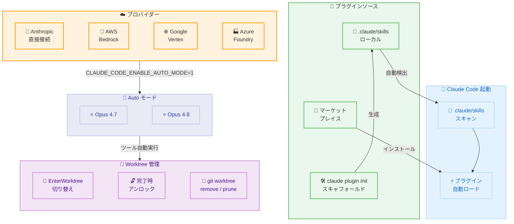

# Claude Code v2.1.157 / v2.1.158 - プラグイン自動ロード & Auto モード拡張

## メタデータ

| 項目 | 内容 |
|------|------|
| 発表日 | 2026-05-30 |
| ソース | Claude Code Changelog |
| カテゴリ | Claude Code アップデート |
| 公式リンク | https://github.com/anthropics/claude-code/blob/main/CHANGELOG.md |

## 概要

Claude Code v2.1.157 および v2.1.158 は、プラグインシステムの大幅な改善と Auto モードの対応範囲拡張を中心としたリリースである。v2.1.157 では `.claude/skills` ディレクトリに配置されたプラグインが自動的にロードされるようになり、`claude plugin init` コマンドによるスキャフォールディング機能も追加された。また、`claude agents` の機能強化、worktree 管理の改善、16 件以上のバグ修正が含まれている。v2.1.158 では Auto モードが Bedrock、Vertex、Foundry での Opus 4.7 および Opus 4.8 に対応し、エンタープライズ環境での自動化が大幅に強化された。

## 詳細

### 背景

Claude Code のプラグインシステムは、これまでマーケットプレイスからの明示的なインストールが必要であり、プロジェクト固有のスキルを配布・共有する際に手順が煩雑であった。本リリースでは `.claude/skills` ディレクトリに配置するだけで自動的にプラグインが認識されるようになり、チーム内でのスキル共有がリポジトリのコミットだけで完結する。また、Bedrock、Vertex、Foundry 経由で Claude Code を利用するエンタープライズユーザーは、これまで Auto モードを利用できなかったが、v2.1.158 で Opus 4.7 / 4.8 に対して環境変数を設定するだけで有効化できるようになった。

### 主な変更点

#### v2.1.158: Auto モードの拡張

- **Bedrock / Vertex / Foundry 対応**: Auto モードが Opus 4.7 および Opus 4.8 で利用可能に
- **有効化方法**: 環境変数 `CLAUDE_CODE_ENABLE_AUTO_MODE=1` を設定

#### v2.1.157: 新機能

##### 1. プラグイン自動ロード

- `.claude/skills` ディレクトリ内のプラグインがマーケットプレイス不要で自動的にロード
- プロジェクト固有のスキルを Git リポジトリにコミットするだけでチーム全体で共有可能

##### 2. プラグインスキャフォールディング

- `claude plugin init <name>` コマンドで `.claude/skills` に新規プラグインのテンプレートを生成
- ボイラープレートの手動作成が不要に

##### 3. プラグインオートコンプリート

- `/plugin` コマンドでサブコマンド、インストール済みプラグイン名、マーケットプレイスのプラグインが補完候補として表示

##### 4. claude agents の改善

- `settings.json` の `agent` フィールドがディスパッチされたセッションで尊重される
- `--agent <name>` オプションで上書き可能
- スラッシュコマンドのオートコンプリートがサブストリングマッチに対応

##### 5. Worktree 管理の改善

- `EnterWorktree` がセッション途中で Claude 管理の worktree 間の切り替えに対応
- Claude 管理の worktree がエージェント完了時にアンロック状態で残されるようになり、`git worktree remove` / `prune` でのクリーンアップが可能に

##### 6. テレメトリ強化

- `tool_decision` テレメトリイベントに `tool_parameters` (bash コマンド、MCP / スキル名) が含まれるように
- 有効化: `OTEL_LOG_TOOL_DETAILS=1`

#### v2.1.157: バグ修正

| 修正内容 | 影響範囲 |
|---------|---------|
| 処理不能な画像 (0 バイト、破損) がリクエストをクラッシュさせる問題 | ペースト、MCP、ダイアログ |
| サンドボックスネットワーク権限プロンプトが Auto / bypass-permissions モードで表示される問題 | デスクトップアプリ、IDE 拡張、SDK |
| 完了した `claude agents` セッションがアイドルサブエージェントにより退役しない問題 | claude agents |
| Esc キーで遅い "opening..." がキャンセルされない問題 | claude agents |
| `.claude/worktrees/` 以下の worktree が 30 日ジョブ保持スイープ後に孤立する問題 | バックグラウンドエージェント |
| スリープ / ウェイク後に再接続したセッションの日付が不正 | バックグラウンドセッション |
| tmux 内の copy-on-select がシステムクリップボードに届かない問題 | tmux 環境 (2.1.153 回帰) |
| `--resume` がバックグラウンドサブエージェントを報告しない問題 | セッション再開 |
| `--resume` セッションピッカーがフルスクリーンモードで残骸を残す問題 | ターミナル UI |
| `--worktree` がカレント worktree ではなくリポジトリルートに戻る問題 | worktree 操作 |
| `/model` ピッカーの "Newer version available" ヒントが不正 | モデル選択 |
| フルスクリーンモードでマークダウンマーカーが表示される問題 | UI レンダリング |
| マネージド設定セキュリティダイアログ承認後にターミナルがフリーズする問題 | 起動時 |
| スクロールバックで重複行が表示されるレアケース | ターミナル UI |
| VS Code / Cursor / Windsurf で右クリックペーストがクリップボードを複製する問題 | IDE 統合 |
| WSL: 画像ペースト、スクリーンショットペースト、Windows Explorer からのドラッグ | WSL 環境 |

#### v2.1.157: 改善

- **パフォーマンス向上**: 長い会話や再開された会話で冗長なメッセージレンダリング再計算を排除
- **`/terminal-setup`**: VS Code / Cursor / Windsurf 統合ターミナルで GPU アクセラレーションを無効化し、テキスト化けを防止
- **Feature of the Week**: クレジット請求ステータスがプロンプト上部ではなくステータスエリアの通知として表示
- **起動バナー削除**: "bash commands will be sandboxed" バナーを削除 (ステータスは `/status` で確認可能)
- **起動ヒントトースト削除**: "/ide for ..." ヒントを削除

#### v2.1.157: IDE 固有の変更

- Stop クリック時にバックグラウンドサブエージェントが実際に停止しない問題を修正
- VS Code で Opus 4.8 のファストモードインジケーターが表示されない問題を修正
- ワークフロートリガーキーワード直後の Backspace が文字削除ではなくリクエスト解除として動作
- `/config` に「ワークフローキーワードトリガー」設定を追加 ("workflow" という単語によるトリガーを無効化可能)

### 技術的な詳細

#### プラグイン自動ロードの仕組み

v2.1.157 以前はプラグインの利用にマーケットプレイスでの公開とインストールが必要であったが、新しいアーキテクチャでは Claude Code 起動時に `.claude/skills` ディレクトリをスキャンし、検出されたプラグインを自動的にロードする。これにより以下の利点が得られる。

- プロジェクト固有のスキルを `git commit` だけでチーム共有
- プライベートなスキルをマーケットプレイスに公開せずに利用可能
- CI/CD パイプラインでのカスタムスキル活用が容易に

#### Auto モードの Bedrock / Vertex / Foundry 対応

Auto モードは、Claude Code がユーザーの承認なしにツール呼び出しを自動実行するモードである。これまでは Anthropic 直接接続のみで利用可能であったが、v2.1.158 でエンタープライズ向けプロバイダーでも利用可能になった。Opus 4.7 と Opus 4.8 が対象モデルとなっている。

#### Worktree ライフサイクルの改善

従来、Claude 管理の worktree はエージェント完了後もロック状態が維持され、手動でのクリーンアップが困難であった。本リリースでは以下の問題が解消された。

- エージェント完了時に自動アンロック
- 30 日ジョブ保持スイープ後の孤立防止
- `--worktree` フラグ使用時の正しいディレクトリ復帰

#### テレメトリの詳細化

`OTEL_LOG_TOOL_DETAILS=1` を設定することで、`tool_decision` イベントに実行された bash コマンドや MCP / スキル名が記録される。これにより、エンタープライズ環境でのツール使用状況の監査やデバッグが容易になる。

## 開発者への影響

### 対象

- Claude Code を使用する全開発者
- プロジェクト固有のスキル / プラグインを開発・共有するチーム
- Bedrock、Vertex、Foundry 経由で Claude Code を利用するエンタープライズユーザー
- Auto モードを活用して開発ワークフローを自動化したいユーザー
- WSL 環境で Claude Code を使用する Windows 開発者
- tmux 環境で作業する開発者

### 必要なアクション

1. **Claude Code のアップデート**: `claude update` または `npm install -g @anthropic-ai/claude-code@latest` で v2.1.158 に更新
2. **Auto モードの有効化** (Bedrock / Vertex / Foundry ユーザー): 環境変数 `CLAUDE_CODE_ENABLE_AUTO_MODE=1` を設定
3. **プラグイン移行** (任意): マーケットプレイスからインストールしたプロジェクト固有プラグインを `.claude/skills` ディレクトリに移動
4. **テレメトリ設定** (監査目的): `OTEL_LOG_TOOL_DETAILS=1` を設定してツール使用状況を記録
5. **`/terminal-setup` の再実行** (IDE ユーザー): GPU アクセラレーション無効化設定を適用してテキスト化けを防止

### 移行ガイド (該当する場合)

#### マーケットプレイスプラグインからローカルプラグインへの移行

```bash
# Step 1: 既存のプラグインを .claude/skills にコピー
cp -r ~/.claude/plugins/my-plugin .claude/skills/my-plugin

# Step 2: または新規にスキャフォールディング
claude plugin init my-custom-skill

# Step 3: Git にコミットしてチーム共有
git add .claude/skills/my-custom-skill
git commit -m "Add custom skill for project"

# マーケットプレイスからのインストールは不要になる
```

#### Auto モードの有効化 (Bedrock / Vertex / Foundry)

```bash
# 環境変数を設定
export CLAUDE_CODE_ENABLE_AUTO_MODE=1

# Bedrock の場合
export AWS_REGION=us-east-1
export CLAUDE_CODE_USE_BEDROCK=1

# Claude Code を起動
claude
```

## コード例

```bash
# 新規プラグインのスキャフォールディング
claude plugin init code-review-helper
# -> .claude/skills/code-review-helper/ が生成される

# プラグインの構造確認
tree .claude/skills/code-review-helper/
# .claude/skills/code-review-helper/
# ├── SKILL.md
# └── ...

# プラグインのオートコンプリート確認
# /plugin と入力すると、サブコマンドとインストール済みプラグインが補完表示される

# claude agents でエージェント設定を指定して起動
claude agents --agent my-review-agent

# Worktree 間の切り替え (セッション中)
# EnterWorktree コマンドで別の worktree に移動可能

# テレメトリ詳細の有効化
export OTEL_LOG_TOOL_DETAILS=1
claude
# -> tool_decision イベントに bash コマンドや MCP/スキル名が記録される

# ワークフローキーワードトリガーの無効化
# /config -> "Workflow keyword trigger" を Off に設定
# "workflow" という単語がプロンプト内にあってもトリガーされなくなる
```

## アーキテクチャ図 (該当する場合)



## 関連リンク

- [Claude Code Changelog](https://github.com/anthropics/claude-code/blob/main/CHANGELOG.md)
- [Claude Code ドキュメント](https://docs.anthropic.com/en/docs/claude-code)
- [Claude Code プラグイン開発ガイド](https://docs.anthropic.com/en/docs/claude-code/plugins)
- [Auto モードの詳細](https://docs.anthropic.com/en/docs/claude-code/auto-mode)
- [AWS Bedrock での Claude Code](https://docs.aws.amazon.com/bedrock/latest/userguide/claude-code.html)
- [OpenTelemetry テレメトリ設定](https://docs.anthropic.com/en/docs/claude-code/telemetry)

## まとめ

Claude Code v2.1.157 / v2.1.158 は、プラグインエコシステムの民主化と Auto モードのエンタープライズ対応を実現するリリースである。`.claude/skills` ディレクトリへの配置だけでプラグインが自動ロードされる仕組みにより、チーム固有のスキルを Git リポジトリで管理・共有する運用が標準化される。`claude plugin init` コマンドによるスキャフォールディングも提供され、プラグイン開発のハードルが大幅に下がった。Auto モードが Bedrock、Vertex、Foundry で利用可能になったことで、エンタープライズ環境でもツール呼び出しの自動実行が可能となり、CI/CD パイプラインやバッチ処理での活用が期待される。16 件以上のバグ修正では、WSL 環境の画像ペースト、tmux でのクリップボード連携、IDE でのペースト重複など、日常的な開発体験を損なっていた問題が解消されている。worktree 管理の改善により、マルチブランチ開発ワークフローの信頼性も向上した。
