# Claude Code v2.1.159 / v2.1.160 - セキュリティ強化とバックグラウンドエージェント安定化

## メタデータ

| 項目 | 内容 |
|------|------|
| 発表日 | 2026-06-01 |
| ソース | Claude Code Changelog |
| カテゴリ | Claude Code アップデート |
| 公式リンク | https://github.com/anthropics/claude-code/blob/main/CHANGELOG.md |

## 概要

Claude Code v2.1.159 および v2.1.160 は、セキュリティ強化とバックグラウンドエージェントの安定性向上を中心としたリリースである。v2.1.159 は内部インフラストラクチャの改善のみであり、ユーザーに影響する変更はない。v2.1.160 では、シェル起動ファイル (`.zshenv`、`.zlogin`、`.bash_login`) や `~/.config/git/` への書き込み時にプロンプトを表示する安全機構が追加され、意図しないコマンド実行のリスクが軽減された。また、ダイナミックワークフローのトリガーキーワードが `workflow` から `ultracode` に変更され、WSL / Windows 環境での多数のバグ修正、バックグラウンドセッションの信頼性向上が含まれている。

## 詳細

### 背景

Claude Code の利用が拡大する中で、シェル起動ファイルやビルドツール設定ファイルへの書き込みがセキュリティリスクとなるケースが報告されていた。`.zshenv` や `.npmrc` などのファイルは、書き込み内容次第でシェル起動時やパッケージインストール時に任意のコマンドが実行される可能性がある。本リリースでは、これらの高リスクファイルへの書き込み時に明示的なユーザー確認を求めるようになり、サプライチェーン攻撃や意図しない設定変更への防御が強化された。

また、バックグラウンドエージェント機能 (`claude agents`) は v2.1.150 以降で急速に進化しているが、セッションの再接続やリタイア処理で会話履歴が失われる問題や、Windows 環境での入力応答性の問題が報告されていた。v2.1.160 ではこれらの問題が包括的に修正されている。

### 主な変更点

#### セキュリティ & セーフティ

1. **シェル起動ファイルへの書き込み保護**: `.zshenv`、`.zlogin`、`.bash_login` および `~/.config/git/` への書き込み前にプロンプトを表示。これにより、意図しないコマンド実行を防止する
2. **ビルドツール設定ファイルの保護** (`acceptEdits` モード): `.npmrc`、`.yarnrc*`、`bunfig.toml`、`.bazelrc`、`.pre-commit-config.yaml`、`.devcontainer/` などのコード実行権限を付与しうる設定ファイルへの書き込み前にプロンプトを表示

#### パフォーマンス & 改善

3. **grep 後の Read 不要化**: 単一ファイルに対する `grep` / `egrep` / `fgrep` コマンドの実行が read-before-edit チェックを満たすようになり、Edit ツール使用前の別途 Read が不要に
4. **バックグラウンドセッションの起動高速化**: 長時間非アクティブだったバックグラウンドエージェントセッションのオープン性能が向上
5. **Auto モード分類器のレイテンシ改善**: ルーチンアクションでの推論量を削減し、"could not evaluate this action" ブロックの発生頻度を低減
6. **シグナル処理の改善**: バックグラウンドセッションの終了時 (`claude rm` / `stop`、アイドルリープ) に、シェルサブプロセスへ SIGKILL の前に SIGTERM を送信し、クリーンアップハンドラが確実に実行されるように改善

#### 破壊的変更

7. **`CLAUDE_CODE_OPUS_4_6_FAST_MODE_OVERRIDE` の削除**: この環境変数は no-op になった。設定していても動作に影響しない
8. **ワークフロートリガーキーワードの変更**: ダイナミックワークフローのトリガーキーワードが `workflow` から `ultracode` に変更。"workflow" という単語はトリガーとして機能しなくなった。ただし、ワークフローの実行を自分の言葉で依頼する場合は引き続き動作する。新しいキーワードはプロンプト入力欄でバイオレット色にハイライト表示される
9. **JetBrains プラグインインストール提案の削除**: 起動時の提案メッセージが表示されなくなった

#### バグ修正

##### WSL / Windows 環境

| 修正内容 | 詳細 |
|---------|------|
| copy-on-select が Windows クリップボードに書き込まれない | OSC 52 の代わりに PowerShell interop を使用するように変更。MobaXterm などの OSC 52 非対応ターミナルでも動作 |
| Esc、矢印キー、タイピングが無応答になる | バックグラウンドセッション接続中やエージェントビューで、ホスト CPU 高負荷時に発生していた問題を修正 |
| `file:///C:/...` リンクが壊れる | ハイパーリンク対応の Windows ターミナルで有効なパスが不正に書き換えられる問題を修正 |
| バックグラウンドセッションのディレクトリが削除できない | `claude rm` 後もバックグラウンドデーモン終了までディレクトリがロックされる問題を修正 |

##### バックグラウンドエージェント

| 修正内容 | 詳細 |
|---------|------|
| 完了セッションの復元で会話履歴が消失 | `claude agents` から完了セッションを開くと、元のプロンプトが再実行される問題を修正 |
| 一晩のリタイア後に会話が消失 | バックグラウンドセッション再接続時に会話が失われ、元のプロンプトが再実行される問題を修正 |
| `claude --bg` が "socket missing" で失敗 | バックグラウンドデーモンのコールドスタート時に発生していた問題を修正 |
| 再開エージェントが Completed に表示される | 作業再開したバックグラウンドエージェントが完了済みリストに誤表示される問題を修正 |
| セッションリスト表示が数秒間フリーズ | 自動アップデーターが毎回の exit 時に再チェックしていた問題を修正 |

##### UI / ターミナル

| 修正内容 | 詳細 |
|---------|------|
| ターミナル同期マーカーのレンダリングアーティファクト | Apple Terminal、tmux で実行中エージェントへ入る際に表示崩れが発生する問題を修正 |
| マウスホイールでプロンプト履歴がスクロール | セッションリストからセッションを開いた直後にトランスクリプトではなく履歴がスクロールされる問題を修正 |
| CJK IME 変換の表示位置が不正 | `claude agents` ビューで入力カーソル位置ではなく画面左下に表示される問題を修正 |
| brief モードの返答が消失 | brief モードオフで再開したセッションで過去の返答がスクロールバックから消える問題を修正 |
| vim モードの `p` ペースト位置 | `v$` でヤンクしたレジスタのペーストがカーソル位置ではなく次行に配置される問題を修正 |

##### その他

| 修正内容 | 詳細 |
|---------|------|
| ボイスモードの接続失敗 | プロジェクトディレクトリまたはブランチ名に非 ASCII 文字や特殊文字が含まれる場合に接続できない問題を修正 |
| Auto モードの無効メッセージが不正 | サードパーティプロバイダーでの表示が `CLAUDE_CODE_ENABLE_AUTO_MODE` opt-in を案内するように修正 |
| `/effort ultracode` のエラーメッセージ | モデルが xhigh を実行できない場合に dynamic workflows 設定を誤って非難するメッセージを修正。ultracode は非対応モデルでは提供されなくなった |
| model-not-found のエラーメッセージ | SDK やその他ホストで実行中に `--model` を提案するメッセージを修正 |

### 技術的な詳細

#### シェル起動ファイル保護の仕組み

v2.1.160 では、以下のファイルパスへの Write / Edit 操作時に、通常の権限チェックとは別に追加の確認プロンプトが表示される。

**保護対象ファイル:**

- シェル起動ファイル: `.zshenv`、`.zlogin`、`.bash_login`
- Git 設定: `~/.config/git/` 配下のファイル

**`acceptEdits` モードでの追加保護対象:**

- npm / yarn: `.npmrc`、`.yarnrc`、`.yarnrc.yml`
- Bun: `bunfig.toml`
- Bazel: `.bazelrc`
- Pre-commit: `.pre-commit-config.yaml`
- Dev Container: `.devcontainer/` 配下のファイル

これらのファイルは、パッケージインストール時のスクリプト実行やシェル起動時のコマンド実行を制御するため、不正な内容が書き込まれた場合にサプライチェーン攻撃のベクターとなりうる。

#### ダイナミックワークフロートリガーの変更

ダイナミックワークフロー機能のトリガーキーワードが `workflow` から `ultracode` に変更された。これは "workflow" という一般的な単語が通常の会話で意図せずトリガーされるケースを防ぐための変更である。

- **旧**: `workflow` と入力するとダイナミックワークフローがトリガー
- **新**: `ultracode` と入力するとトリガー (バイオレット色でハイライト表示)
- **自然言語での要求**: 引き続き動作する (例: 「ワークフローを実行して」)

#### grep による read-before-edit チェックの充足

従来、ファイルを編集する前に必ず Read ツールでファイルの内容を読む必要があった。v2.1.160 では、単一ファイルに対する `grep`、`egrep`、`fgrep` コマンドの実行がこの要件を満たすようになった。これにより、grep でファイル内容を確認した後に即座に Edit を実行できるようになり、ワークフローが効率化された。

#### SIGTERM / SIGKILL のシグナル処理

バックグラウンドセッションの終了処理が改善され、以下の順序でシグナルが送信される。

1. SIGTERM を実行中のシェルサブプロセスに送信
2. クリーンアップハンドラの実行を待機
3. タイムアウト後に SIGKILL を送信

これにより、一時ファイルの削除やデータベース接続のクローズなど、プロセスのクリーンアップ処理が確実に実行される。

## 開発者への影響

### 対象

- Claude Code を使用する全開発者
- `acceptEdits` モードを利用する CI/CD パイプラインや自動化環境
- WSL / Windows 環境で Claude Code を使用する開発者
- バックグラウンドエージェント (`claude agents`、`claude --bg`) を利用するユーザー
- ダイナミックワークフロー機能を利用するユーザー
- CJK 入力環境 (日本語 IME) で Claude Code を使用する開発者

### 必要なアクション

1. **Claude Code のアップデート**: `claude update` または `npm install -g @anthropic-ai/claude-code@latest` で v2.1.160 に更新
2. **ワークフロートリガーの移行**: ダイナミックワークフローを `workflow` キーワードでトリガーしていた場合は `ultracode` に変更
3. **環境変数の削除** (任意): `CLAUDE_CODE_OPUS_4_6_FAST_MODE_OVERRIDE` を設定している場合は削除可能 (no-op のため残しても害はない)
4. **セキュリティプロンプトへの対応**: シェル起動ファイルやビルドツール設定への書き込み時に新しい確認プロンプトが表示されるため、自動化スクリプトで影響がないか確認

### 移行ガイド (該当する場合)

#### ワークフロートリガーキーワードの移行

```bash
# 旧: "workflow" でトリガー (v2.1.160 以降は動作しない)
# 新: "ultracode" でトリガー

# 自然言語での要求は引き続き動作する
# 例: "このリポジトリのテストを全部実行して修正するワークフローを実行して"
```

#### 環境変数の整理

```bash
# 削除可能 (no-op になった)
# export CLAUDE_CODE_OPUS_4_6_FAST_MODE_OVERRIDE=...
unset CLAUDE_CODE_OPUS_4_6_FAST_MODE_OVERRIDE

# 設定ファイルからも削除可能
# .bashrc, .zshrc, .env などから該当行を削除
```

## コード例

```bash
# v2.1.160 へのアップデート
claude update

# ダイナミックワークフローのトリガー (新しいキーワード)
# プロンプト入力欄で "ultracode" と入力 (バイオレット色にハイライトされる)
# -> ダイナミックワークフローがトリガーされる

# "workflow" は通常のテキストとして扱われる (トリガーされない)
# ただし自然言語での要求は引き続き動作する:
# "テストを修正するワークフローを組んで" -> 動作する

# grep 後に直接 Edit が可能に (Read 不要)
# 従来: grep -> Read -> Edit (3 ステップ)
# 新: grep -> Edit (2 ステップ)
grep -n "old_function" src/main.py
# -> Edit ツールで即座に編集可能

# バックグラウンドセッションの安全な終了
claude rm <session-id>
# -> SIGTERM が送信され、クリーンアップハンドラ実行後に SIGKILL

# シェル起動ファイルへの書き込み時の動作
# Claude が .zshenv を編集しようとすると:
# "⚠️ This file is a shell startup file that could execute commands.
#  Are you sure you want to write to .zshenv? [y/N]"
# のような確認プロンプトが表示される
```

## アーキテクチャ図 (該当する場合)

```mermaid
flowchart TD
    subgraph Security["🔒 セキュリティ強化"]
        direction LR
        Shell["🐚 シェル起動ファイル<br/>.zshenv, .zlogin,<br/>.bash_login"]
        Git["📝 Git 設定<br/>~/.config/git/"]
        Build["🏗️ ビルドツール設定<br/>.npmrc, .bazelrc,<br/>.pre-commit-config.yaml"]
        Shell ~~~ Git ~~~ Build
    end

    subgraph Trigger["🎨 ワークフロートリガー"]
        direction LR
        Old["❌ workflow<br/>無効化"]
        New["✅ ultracode<br/>バイオレット表示"]
        NL["💬 自然言語<br/>引き続き動作"]
        Old ~~~ New ~~~ NL
    end

    subgraph BgAgent["🤖 バックグラウンドエージェント"]
        direction LR
        Resume["🔄 セッション再開<br/>会話履歴保持"]
        Signal["📡 SIGTERM 送信<br/>クリーンアップ実行"]
        Perf["⚡ 起動高速化<br/>フリーズ解消"]
        Resume ~~~ Signal ~~~ Perf
    end

    subgraph WSL["🪟 WSL / Windows"]
        direction LR
        Clip["📋 クリップボード<br/>PowerShell interop"]
        Input["⌨️ 入力応答性<br/>CPU 高負荷対応"]
        Path["🔗 パスリンク<br/>file:/// 修正"]
        Clip ~~~ Input ~~~ Path
    end

    User(["👤 ユーザー"]) --> Security
    User --> Trigger
    User --> BgAgent
    User --> WSL

    Security -->|"確認プロンプト"| Prompt["✋ 書き込み前に<br/>ユーザー確認"]

    classDef security fill:#FFEBEE,stroke:#F44336,stroke-width:2px,color:#B71C1C
    classDef trigger fill:#F3E5F5,stroke:#CE93D8,stroke-width:2px,color:#4A148C
    classDef agent fill:#E3F2FD,stroke:#BBDEFB,stroke-width:2px,color:#1565C0
    classDef wsl fill:#E8F5E9,stroke:#81C784,stroke-width:2px,color:#1B5E20
    classDef user fill:#FFF3E0,stroke:#FF9800,stroke-width:2px,color:#E65100
    classDef prompt fill:#FFF9C4,stroke:#FBC02D,stroke-width:2px,color:#F57F17

    class Security security
    class Trigger trigger
    class BgAgent agent
    class WSL wsl
    class User user
    class Prompt prompt
    class Shell,Git,Build security
    class Old,New,NL trigger
    class Resume,Signal,Perf agent
    class Clip,Input,Path wsl
```



## 関連リンク

- [Claude Code Changelog](https://github.com/anthropics/claude-code/blob/main/CHANGELOG.md)
- [Claude Code ドキュメント](https://docs.anthropic.com/en/docs/claude-code)
- [Claude Code バックグラウンドエージェント](https://docs.anthropic.com/en/docs/claude-code/background-agents)
- [Claude Code セキュリティモデル](https://docs.anthropic.com/en/docs/claude-code/security)
- [WSL での Claude Code 利用](https://docs.anthropic.com/en/docs/claude-code/troubleshooting#wsl)

## まとめ

Claude Code v2.1.159 / v2.1.160 は、セキュリティ、安定性、開発体験の 3 軸で大幅な改善を実現するリリースである。セキュリティ面では、シェル起動ファイルやビルドツール設定ファイルへの書き込み時に確認プロンプトを表示する仕組みが導入され、サプライチェーン攻撃や意図しない設定変更のリスクが軽減された。バックグラウンドエージェントの安定性では、セッション再接続時の会話履歴消失、セッションリストのフリーズ、ソケットエラーなど複数の重要な問題が修正され、長時間実行タスクの信頼性が大幅に向上した。WSL / Windows 環境では、クリップボード連携、入力応答性、パスリンクの問題が修正され、Windows 開発者の体験が改善されている。ダイナミックワークフローのトリガーキーワードが `ultracode` に変更された点は、既存ユーザーへの影響があるため注意が必要である。grep 結果による read-before-edit チェックの充足や Auto モード分類器のレイテンシ改善など、日常的な開発ワークフローの効率化も含まれており、全体として Claude Code の実用性と信頼性を着実に高めるアップデートとなっている。
