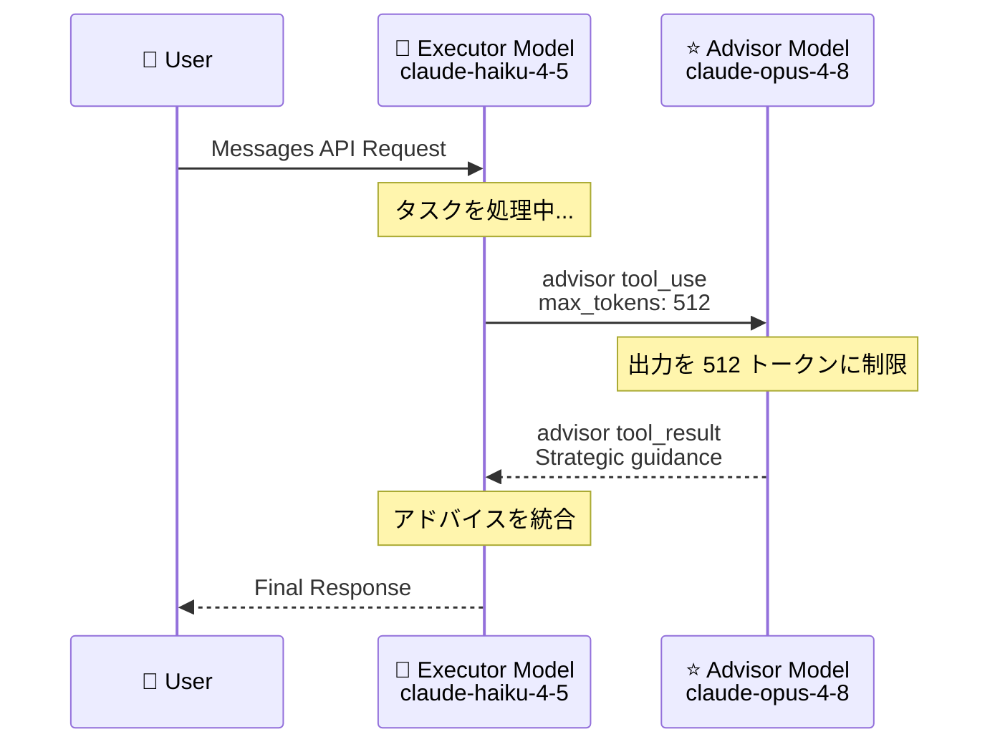

# Claude API アップデート: Advisor Tool の max_tokens パラメータと Refusal 課金の廃止

## メタデータ

| 項目 | 内容 |
|------|------|
| 発表日 | 2026-06-02 |
| ソース | Claude API Release Notes |
| カテゴリ | API アップデート |
| 公式リンク | [Claude API Release Notes](https://platform.claude.com/docs/en/release-notes/overview) |

## 概要

Claude API に 2 つの重要なアップデートが追加された。Advisor Tool に `max_tokens` パラメータが追加されレイテンシとコストの最適化が可能になったこと、および Refusal レスポンス時の課金が廃止されたこと。

## 詳細

### 背景

- Advisor Tool は 2026 年 4 月 9 日にパブリックベータとして発表
- エグゼキューターモデルとアドバイザーモデルのペアリングにより、効率的なエージェントワークロードを実現
- Beta header: `advisor-tool-2026-03-01`

### 主な変更点

#### 1. Advisor Tool の max_tokens パラメータ

- `tools[].max_tokens` でアドバイザーモデルの出力をキャップ可能
- フルレングスのレスポンスが不要なワークロードでレイテンシと出力トークンコストを削減
- ドキュメント: [Capping advisor output](https://platform.claude.com/docs/en/agents-and-tools/tool-use/advisor-tool#capping-advisor-output)

#### 2. Refusal 課金の廃止

- `stop_reason: "refusal"` を返し、出力を生成しなかったリクエストは課金対象外に
- ドキュメント: [Streaming refusals](https://platform.claude.com/docs/en/test-and-evaluate/strengthen-guardrails/handle-streaming-refusals)

### 技術的な詳細

#### Advisor Tool の使用例

```json
{
  "model": "claude-haiku-4-5",
  "tools": [
    {
      "type": "advisor",
      "model": "claude-opus-4-8",
      "max_tokens": 512,
      "description": "Strategic guidance for complex decisions"
    }
  ],
  "messages": [...]
}
```

#### Refusal の検出

```python
response = client.messages.create(...)
if response.stop_reason == "refusal":
    # No billing for this request
    print(f"Refusal category: {response.stop_details.category}")
    print(f"Explanation: {response.stop_details.explanation}")
```

## 開発者への影響

### 対象

- Advisor Tool を使用するエージェントワークロード開発者
- コスト最適化を行うすべての API ユーザー

### 必要なアクション

1. **Advisor Tool ユーザー**: `max_tokens` パラメータの追加を検討してコストとレイテンシを最適化
2. **すべてのユーザー**: Refusal ハンドリングの確認 (課金されなくなったが、適切なフォールバック処理は引き続き必要)

### コスト影響

- **Advisor Tool**: `max_tokens` 設定により、不要な長いアドバイザーレスポンスのトークンコストを削減
- **Refusal**: 出力なしの拒否で無駄な課金がなくなる

## アーキテクチャ図



## 関連リンク

- [Advisor Tool ドキュメント](https://platform.claude.com/docs/en/agents-and-tools/tool-use/advisor-tool)
- [Capping advisor output](https://platform.claude.com/docs/en/agents-and-tools/tool-use/advisor-tool#capping-advisor-output)
- [Streaming refusals](https://platform.claude.com/docs/en/test-and-evaluate/strengthen-guardrails/handle-streaming-refusals)
- [stop_details フィールド](https://platform.claude.com/docs/en/build-with-claude/handling-stop-reasons#refusal-categories)

## まとめ

今回のアップデートにより、Advisor Tool のコスト効率が向上し、Refusal 時の不要課金が解消された。エージェントワークロードの本番運用におけるコスト管理が改善される。
