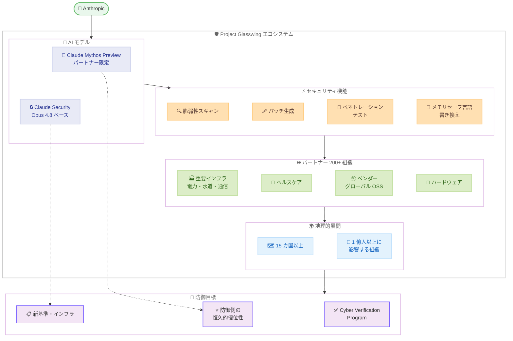

# Expanding Project Glasswing: Anthropic のサイバーセキュリティイニシアチブが 150 以上の組織に拡大

## メタデータ

| 項目 | 内容 |
|------|------|
| 発表日 | 2026-06-02 |
| ソース | Anthropic News |
| カテゴリ | セキュリティ / サイバーセキュリティ |
| 公式リンク | https://www.anthropic.com/news/expanding-project-glasswing |

## 概要

Anthropic は 2026 年 6 月 2 日、サイバーセキュリティイニシアチブ「Project Glasswing」の大幅な拡大を発表した。2026 年 4 月初旬に約 50 の初期パートナーで発足した同プログラムは、約 150 の新規組織を追加し、15 カ国以上にまたがる規模に成長した。対象は電力、水道、ヘルスケア、通信、ハードウェアなどの重要インフラ産業に拡大されている。

初期パートナーは Claude Mythos Preview モデルを活用し、合計 10,000 以上の高・重大レベルのセキュリティ欠陥を発見しており、プログラムの有効性が実証されている。Anthropic は「6〜12 カ月以内に多くの AI 企業が Mythos クラスのモデルを持つ」と警告し、防御側に恒久的な優位性を確立するための取り組みを加速している。

## 詳細

### 背景

Project Glasswing は 2026 年 4 月初旬に発足した Anthropic のサイバーセキュリティプログラムである。Claude Mythos Preview モデルを使用してソフトウェアの脆弱性を特定することを目的とし、約 50 の初期パートナー組織と共に開始された。発足からわずか 2 カ月で、パートナーは合計 10,000 以上の高・重大レベルのセキュリティ欠陥を発見するという成果を上げている。

現在のサイバーセキュリティにおけるボトルネックは「大量の脆弱性の検証、開示、パッチ適用」に移行しており、AI による脆弱性発見の速度が人間の対応能力を上回りつつある状況が背景にある。

### 主な変更点

1. **約 150 の新規組織を追加**: 初期の約 50 パートナーから大幅に規模を拡大
2. **15 カ国以上に地理的拡大**: グローバルな展開により、国際的なセキュリティ連携を強化
3. **新産業の追加**: 電力、水道、ヘルスケア、通信、ハードウェアなどの重要インフラ産業をカバー
4. **ベンダーの参加**: 多くの新パートナーはグローバルに使用されるコードベースを維持する企業・非営利団体
5. **セキュリティ要件**: 各パートナーは Anthropic のセキュリティ要件を満たす必要あり
6. **影響規模の基準**: 「主要な攻撃が 1 億人以上に影響する可能性がある」組織が対象

### 技術的な詳細

**Claude Mythos Preview モデル:**

パートナーに提供される中核的なツールであり、以下の用途に使用される。

- コードベースの脆弱性スキャン
- パッチの作成と提案
- リリース前のセキュリティチェック
- ペネトレーションテスト
- 脅威検出・対応の自動化
- レガシーコードベースのメモリセーフ言語への書き換え

**Claude Security 製品:**

| 項目 | 内容 |
|------|------|
| ベースモデル | Claude Opus 4.8 |
| 機能 | コードベースのスキャンとパッチ提案 |
| 提供形態 | 一般公開製品 |
| URL | claude.com/product/claude-security |

Claude Security は最近リリースされた製品であり、Claude Opus 4.8 をベースとしてコードベースをスキャンし、セキュリティパッチを提案する機能を提供する。Project Glasswing パートナーには、これに加えて内部ツールも提供される。

### 脅威への対応

Anthropic は以下の警告を発している。

- **短期的脅威**: 「6〜12 カ月以内に、多くの他の AI 企業が Mythos クラスのモデルを持つ」
- **ミスユースリスク**: これらのモデルがミスユースセーフガードなしでリリースされる可能性がある
- **攻撃の増加**: 安価で高速な AI モデルによりサイバー攻撃がより頻繁で予測不能になる
- **セーフガードの課題**: サイバーセキュリティは有益な用途と破壊的な用途の両方を持つため、堅牢なセーフガードの開発は Anthropic を含む全ての AI 開発者にとって未解決の課題

### 長期目標

1. **AI によるソフトウェアセキュリティの向上**: 全てのソフトウェアをより安全にする
2. **業界適応の支援**: AI がコアサイバーセキュリティの前提を変える方法に業界が適応することを支援
3. **防御側の恒久的優位性**: 攻撃的 AI 能力の拡散に対し、防御側に恒久的な優位性を確立
4. **新たな基準とインフラ**: 強力なサイバーモデル時代に向けた新しいイニシアチブ、基準、インフラの構築

### 製品・ツール

- **Claude Security** (claude.com/product/claude-security): Claude Opus 4.8 ベースの一般公開製品
- **Claude Mythos Preview**: Project Glasswing パートナー限定の高度なセキュリティモデル
- **内部ツール**: セキュリティチーム向けに提供される専用ツール群

### 今後の計画

- 重要インフラプロバイダーの追加
- 重要な OSS メンテナーの参加
- セーフティテスターの拡充
- 米国内外の組織への展開
- Cyber Verification Program の拡大によるより広範なアクセス提供
- Mythos レベル能力の一般公開 (堅牢なミスユースセーフガード開発後)

## アーキテクチャ図

## 開発者への影響

### 対象

- セキュリティチームおよびセキュリティエンジニア
- 重要インフラのソフトウェア開発者
- OSS メンテナー
- サイバーセキュリティ研究者

### 必要なアクション

1. **Claude Security の活用**: セキュリティチームは Claude Security 製品 (Claude Opus 4.8 ベース) にアクセスし、コードベースのスキャンを開始可能
2. **プログラム参加の検討**: 重要インフラを運用する組織や OSS メンテナーは、今後の拡大フェーズでの参加を検討
3. **セキュリティ体制の見直し**: AI によるサイバー攻撃の増加に備え、防御的 AI ツールの導入を検討

### 今後の機会

- OSS メンテナーは将来的に Project Glasswing への参加機会あり
- Cyber Verification Program の拡大により、より多くの組織がサイバー防御タスクへのアクセスを得られる見込み
- 防御的サイバーセキュリティ分野での AI 活用が加速する中、関連スキルの需要が増大

## 関連リンク

- [Expanding Project Glasswing 公式発表](https://www.anthropic.com/news/expanding-project-glasswing)
- [Project Glasswing](https://www.anthropic.com/glasswing)
- [初期アップデート](https://www.anthropic.com/research/glasswing-initial-update)
- [Claude Security](https://claude.com/product/claude-security)

## まとめ

Anthropic は攻撃的 AI サイバー能力の急速な拡散に対抗するため、Project Glasswing を約 50 の初期パートナーから約 200 組織規模へと大幅に拡大した。15 カ国以上、電力・水道・ヘルスケア・通信・ハードウェアなどの重要インフラ産業を網羅し、「主要な攻撃が 1 億人以上に影響する可能性がある」組織を対象としている。

初期パートナーによる 10,000 以上の高・重大レベル脆弱性の発見は、AI を活用した防御的セキュリティの有効性を実証している。一方で Anthropic は「6〜12 カ月以内に多くの AI 企業が Mythos クラスのモデルを持つ」と警告しており、ミスユースセーフガードなしでリリースされるリスクを懸念している。

防御側に恒久的な優位性を確立するという目標のもと、Anthropic は Claude Mythos Preview と Claude Security を中核とした包括的なセキュリティエコシステムを構築し、業界全体のサイバーセキュリティ体制の変革を推進している。
