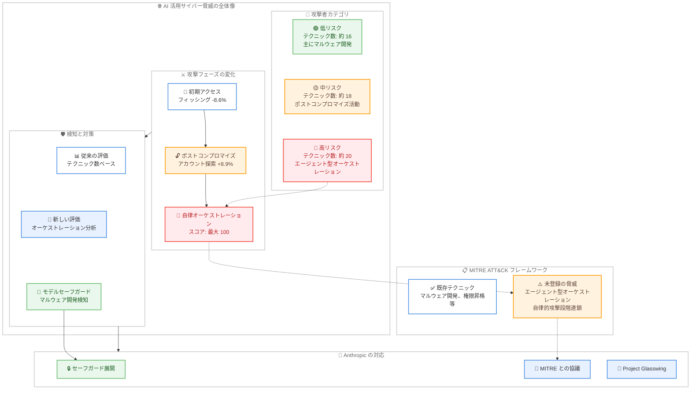

# AI を活用したサイバー脅威の 1 年間の分析 - MITRE ATT&CK マッピング

## メタデータ

| 項目 | 内容 |
|------|------|
| 発表日 | 2026-06-03 |
| ソース | Anthropic News (Frontier Red Team) |
| カテゴリ | セキュリティ / ポリシー |
| 公式リンク | https://www.anthropic.com/news/AI-enabled-cyber-threats-mitre-attack |

## 概要

Anthropic の Frontier Red Team が、2025 年 3 月から 2026 年 3 月までの 1 年間に悪意あるサイバー活動で禁止された 832 アカウントを調査し、その行動を MITRE ATT&CK フレームワークにマッピングした調査結果を発表した。この研究結果は Verizon の 2026 Data Breach Investigations Report (DBIR) にも一部掲載されている。

調査から得られた 3 つの主要な結論は、AI が攻撃者をより危険にしていること、従来の脅威評価手法が有効性を失いつつあること、そして MITRE ATT&CK フレームワーク自体の更新が必要であることを示している。

## 詳細

### 背景

サイバーセキュリティの脅威は AI の進化とともに急速に変化している。従来、高度な攻撃技術は国家支援の APT グループや熟練したハッカーに限られていたが、AI の活用により、比較的スキルの低い攻撃者でもポストコンプロマイズ (侵害後) の高度な技術を実行できるようになっている。

Anthropic は自社モデルの悪用を検知・防止するため、Frontier Red Team を通じて継続的に悪意ある利用の監視と分析を行っている。今回の調査は、禁止されたアカウントのうち詳細な技術評価が可能な 832 件を対象に、独自のリスクスコアリングシステムを用いて体系的に分析したものである。

### 主な変更点

#### 1. AI が攻撃者をより危険にしている

- **マルウェア開発が最多**: 832 アカウント中 560 件 (67.3%) が AI をマルウェア作成に使用
- **ラテラルムーブメント**: 54 件 (6.5%) が侵害済みネットワーク内での横展開に AI を活用
- **中リスク以上の攻撃者の増加**: 前半 6 か月の 33% から後半 6 か月で 56% に増加 (約 1.7 倍)
- **攻撃フェーズのシフト**: AI 支援によるフィッシングが 8.6% 減少する一方、アカウント探索が 8.9% 増加

#### 2. 従来の脅威評価手法の有効性低下

- スキルレベルと使用テクニック数の相関が弱い (低スキル: 約 16 テクニック、高スキル: 約 20 テクニック)
- 使用プラットフォーム (Claude Code、API、チャット) とリスクレベルに相関なし
- **最も重要な識別要因**: 攻撃者がモデルの周囲に構築するスキャフォールディング (足場) アーキテクチャの種類
- 高リスク攻撃者は、モデルが攻撃段階を連鎖的に実行できるアーキテクチャを設計

#### 3. MITRE ATT&CK フレームワークの更新が必要

- 最高リスクの行動 (AI による攻撃ステップの逐次オーケストレーション、自律エージェント操作) が ATT&CK に未登録
- ATT&CK ID が存在しないエージェント型オーケストレーション
- 従来のフレームワークマッピングでは実際の危険性を大幅に過小評価

### 技術的な詳細

#### 脅威カテゴリの分布

| 活動 | 出現率 |
|------|--------|
| マルウェア開発 | 67.3% |
| ラテラルムーブメント | 6.5% |
| アカウント探索 | 上昇傾向 (+8.9%) |
| フィッシング | 減少傾向 (-8.6%) |
| 権限昇格 | 高リスク攻撃者に多い |
| 自律/エージェント型オーケストレーション | 最高リスク |

#### ケーススタディ: 2025 年 11 月の国家支援オペレーション

2025 年 11 月に阻止された国家支援のスパイ活動では、悪意ある攻撃者が Claude Code を操作し、最小限の人的介入でグローバルな標的への侵入を試みた。

- **使用テクニック数**: 13 戦術にわたる 30 テクニック
- **リスクスコア**: 100 (最大値)
- **特徴**: モデルが自律エージェントとして動作し、コマンド実行、脆弱性の悪用、認証情報の窃取、戦術的判断を実施
- **人的介入**: いくつかの重要な場面でのみ必要

従来のフレームワークマッピング (30 テクニック / 13 戦術) だけでは、このオペレーションの実際の危険性を適切に評価できなかった。中リスクの攻撃者とテクニック数だけでは区別がつかないが、Anthropic の独自リスクスコアリングでは最大値を記録した。

#### リスク評価の新しいアプローチ

従来の指標が識別力を失う中、Anthropic は以下の要素に基づく新しいリスク評価を提案している。

- **オーケストレーションの自律性**: モデルが人的介入なしで攻撃段階を連鎖実行する能力
- **スキャフォールディングの複雑さ**: 攻撃者が構築する外部ツールやワークフローの高度さ
- **リアルタイム意思決定**: モデルが環境の変化に適応して判断を行う能力

## 開発者への影響

### 対象

- セキュリティエンジニアおよびセキュリティオペレーションチーム
- AI システムの開発者および運用者
- 脅威インテリジェンスアナリスト
- CISO およびセキュリティマネジメント層
- AI モデルプロバイダーおよびプラットフォーム事業者

### 必要なアクション

1. **脅威モデルの更新**: AI エージェント型攻撃を脅威モデルに組み込む
2. **検知ルールの見直し**: 従来のテクニック数ベースの検知に加え、オーケストレーションパターンの検知を追加
3. **AI 利用のモニタリング強化**: 自社環境での AI モデルの利用パターンを監視し、異常な連鎖的操作を検知
4. **防御戦略の多層化**: ポストコンプロマイズフェーズでの検知能力を強化
5. **インシデント対応計画の改訂**: AI エージェント型攻撃のシナリオを想定した対応手順を策定

### 移行ガイド (該当する場合)

本件は直接的なコード変更を伴うものではないが、セキュリティ対策の観点で以下の段階的な対応を推奨する。

**フェーズ 1 (即時対応)**:
- 既存の SIEM/SOAR ルールに AI エージェント型攻撃の検知パターンを追加
- AI モデル API の利用ログの詳細な監査を開始

**フェーズ 2 (短期対応)**:
- 権限昇格およびラテラルムーブメントの検知閾値を見直し
- 自律的な操作パターンの異常検知アルゴリズムを実装

**フェーズ 3 (中期対応)**:
- MITRE ATT&CK フレームワークの更新に合わせた検知ルールの改訂
- AI セキュリティに特化したレッドチーム演習の実施

## コード例

以下は AI エージェント型攻撃のオーケストレーションパターンを検知するための SIGMA ルールの例である。

```yaml
title: AI Agent Orchestration Detection
id: a1b2c3d4-e5f6-7890-abcd-ef1234567890
status: experimental
description: Detects potential AI-agent orchestrated attack patterns
  based on rapid sequential execution of multiple ATT&CK techniques
references:
  - https://www.anthropic.com/news/AI-enabled-cyber-threats-mitre-attack
logsource:
  category: process_creation
  product: windows
detection:
  selection_rapid_techniques:
    # Rapid sequential execution pattern
    - CommandLine|contains:
      - 'whoami'      # T1033 - System Owner/User Discovery
      - 'net user'    # T1087 - Account Discovery
      - 'net group'   # T1069 - Permission Groups Discovery
      - 'nltest'      # T1482 - Domain Trust Discovery
  timeframe: 60s
  condition: selection_rapid_techniques | count() > 4
  filter:
    User|contains: 'SYSTEM'
level: high
tags:
  - attack.discovery
  - attack.t1087
  - attack.t1069
  - attack.t1482
```

## アーキテクチャ図



## 関連リンク

- [公式記事: What We Learned Mapping a Year's Worth of AI-Enabled Cyber Threats](https://www.anthropic.com/news/AI-enabled-cyber-threats-mitre-attack)
- [MITRE ATT&CK フレームワーク](https://attack.mitre.org/)
- [Verizon 2026 Data Breach Investigations Report](https://www.verizon.com/business/resources/reports/dbir/)
- [Anthropic Frontier Red Team](https://www.anthropic.com/research#frontier-red-team)
- [Project Glasswing](https://www.anthropic.com/news/project-glasswing)

## まとめ

Anthropic の Frontier Red Team による 1 年間の調査は、AI がサイバー脅威の性質を根本的に変えつつあることを実証的に示した。最も重要な発見は、従来の脅威評価指標 (テクニック数、使用プラットフォーム) が識別力を失い、代わりに攻撃者が構築する「スキャフォールディングアーキテクチャ」の高度さが真のリスク指標となっている点である。

特に懸念されるのは、AI エージェント型オーケストレーション (モデルが自律的に攻撃段階を連鎖実行する手法) が MITRE ATT&CK フレームワークに未登録であり、業界標準の脅威分類体系に盲点が存在することである。2025 年 11 月の国家支援オペレーションのケーススタディは、この盲点がもたらすリスクを明確に示している。

セキュリティ担当者は、AI エージェント型攻撃を前提とした脅威モデルの更新と、オーケストレーションパターンの検知能力の構築を優先的に進める必要がある。Anthropic はモデルセーフガードの展開、MITRE との協議、Project Glasswing を通じた情報共有により、業界全体でのセキュリティ強化に取り組んでいる。
