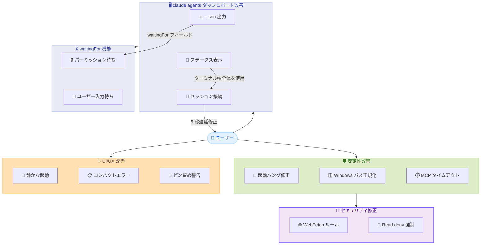

# Claude Code v2.1.162: エージェントダッシュボード強化、起動安定性の大幅改善、Windows パス対応の修正

## メタデータ

| 項目 | 内容 |
|------|------|
| 発表日 | 2026-06-03 |
| ソース | Claude Code Changelog |
| カテゴリ | Claude Code アップデート |
| 公式リンク | https://github.com/anthropics/claude-code/blob/main/CHANGELOG.md |

## 概要

Claude Code v2.1.162 は、`claude agents` ダッシュボードの大幅な機能強化、起動時の安定性改善、Windows パス処理の修正、MCP タイムアウト設定の正規化、UI/UX の洗練を含む大型リリースである。新機能として `claude agents --json` に `waitingFor` フィールドが追加され、待機中セッションが何にブロックされているかをプログラマティックに把握可能になった。バグ修正は 15 件以上に及び、設定ディレクトリが読み取り専用の場合に起動がハングする致命的な問題、WebFetch のパーミッションルール適用漏れ、Windows 環境でのバックスラッシュパスの不一致問題など、幅広いプラットフォームでの安定性が向上している。UI 面では起動メッセージが大幅に整理され、よりクリーンで静かな起動体験が実現された。

## 詳細

### 背景

v2.1.161 で並列ツール呼び出しの独立性や OTEL メトリクス対応が行われた後、v2.1.162 ではエージェントダッシュボード (`claude agents`) の実用性と、クロスプラットフォームでの動作安定性に焦点が移った。企業環境では `claude agents` を使って複数のバックグラウンドセッションを管理するワークフローが主流になりつつあり、ターミナル幅に応じた情報表示の最適化や、待機理由の可視化が強く求められていた。また、Windows ユーザーからはパーミッションルールがバックスラッシュパスで一致しないという深刻な問題が報告されており、本リリースで包括的に対応された。

### 主な変更点

#### New Features (新機能)

| 機能 | 詳細 |
|------|------|
| `claude agents --json` の `waitingFor` | 待機中セッションが何にブロックされているかを表示 (例: パーミッションプロンプト) |
| `--tools` での Grep/Glob 明示指定 | ネイティブビルドで埋め込み検索ツールが正しく提供されるように改善 |
| `/effort` の永続化確認 | 選択したレベルが新しいセッションのデフォルトとして永続化されることを確認表示 |
| スラッシュコマンドのオートコンプリート改善 | クリックでプロンプトに入力、Enter で実行する 2 段階方式に変更 |
| Remote Control のフッター表示 | 起動メッセージではなく、セッションリンク付きの永続フッターピルとして表示 |
| Windsurf を Devin Desktop にリネーム | `/ide`、`/terminal-setup`、`/scroll-speed` メニューでエディタのリブランドに追従 |

#### Bug Fixes (バグ修正)

##### 起動 / 設定

| 修正内容 | 詳細 |
|---------|------|
| 読み取り専用設定ディレクトリでの起動ハング | インメモリ設定で起動し、エラーを表面化するように修正。ブランク画面が表示される問題を解消 |

##### セキュリティ / パーミッション

| 修正内容 | 詳細 |
|---------|------|
| WebFetch パーミッションルールの適用漏れ | 事前承認済みドメインに対しても明示的な `WebFetch(domain:...)` の deny/ask/allow ルールが優先されるように修正 |
| Windows パスの不一致 | バックスラッシュ (`~\`、`\\server\share`) やケースバリアントパスでルールが一致しない問題を修正。Read deny ルールが Glob/Grep 結果からファイルを隠すように対応 |

##### ストリーミング / セッション

| 修正内容 | 詳細 |
|---------|------|
| ターン開始直後の Esc 割り込み消失 | stream-json/SDK セッションで割り込みが黙って破棄され「Interrupted」フィードバックが表示されない問題を修正 |
| API 400 `no low surrogate in string` エラー | 分類器サイドクエリや MCP サーバー記述で絵文字がトランケーション境界付近にある場合のサロゲートペアエラーを修正 |

##### MCP

| 修正内容 | 詳細 |
|---------|------|
| サーバータイムアウト 1000ms 未満の扱い | 1 秒ウォッチドッグに切り上げられ全ツール呼び出しが中断される問題を修正。1000ms 未満の値は無視されフォールバックする |
| LSP ツールの `workspaceSymbol` | `query` パラメータを受け付けて言語サーバーに渡すように修正。結果が返らない問題を解消 |

##### `claude agents` ダッシュボード

| 修正内容 | 詳細 |
|---------|------|
| ステータステキストの 60-120 カラム切り詰め | ワイドターミナルでターミナル幅全体を使用するように修正 |
| セッション名の 40 カラム切り詰め | 名前カラムがターミナル幅に応じて拡張されるように修正 |
| 初回アタッチのバウンス問題 | バックグラウンドサービス再起動後の初回接続時にセッションリストに戻される問題を修正 |
| Ctrl+V 画像ペーストの無反応 | ディスパッチ入力とセッション返信ボックスで動作するように修正。画像なしペースト時はヒントを表示 |
| `<-` でのセッション消失 | バックグラウンドサービスが起動できない場合に会話が失われる問題を修正。失敗行として表示し Enter で復帰可能に |
| 送信失敗した返信の消失 | 次回セッション開始時に配信されるようキューイングするように修正 |
| `SendMessage` のクロスセッション通信破壊 | `CLAUDE_CODE_TMPDIR` や `$TMPDIR` が深いディレクトリを指す場合の問題を修正 |
| アタッチ時の 5 秒遅延 | 実行中のバックグラウンドセッションを開く際のストールを修正 |

#### UI/UX Improvements (UI/UX 改善)

| 改善内容 | 詳細 |
|---------|------|
| 起動メッセージの整理 | 通知を重要度でグループ化、セッション情報とアナウンスを 1 行に統合 |
| 起動警告の簡潔化 | より短く明確な表現に書き直し、具体的な修正方法を付記 |
| ディープリンク/プリフィルプロンプト警告のピン留め | スクロールで消えず、入力欄の下に固定表示 |
| 失敗ターンのコンパクト表示 | 複数行の赤エラーブロックではなく、1 行の警告表示に変更 |
| バイナリスキャン待機の改善 | エンドポイントセキュリティによるバイナリスキャン完了を待機するように改善 |
| ディスパッチ起動失敗の詳細表示 | errno がない場合にエラークラス名を表示 |
| 不要な起動メッセージの削除 | 「Claude in Chrome enabled」「marketplace installed」メッセージを削除。モデル自動更新やチームオンボーディングヒントは静かな通知として表示 |

### 技術的な詳細

#### `waitingFor` フィールドによるエージェント監視

`claude agents --json` の出力に `waitingFor` フィールドが追加された。これにより、自動化スクリプトやダッシュボードがセッションの待機理由をプログラマティックに検出し、適切なアクション (パーミッション承認の自動化など) を取ることが可能になる。

```json
{
  "sessions": [
    {
      "id": "session-abc123",
      "name": "refactor-auth-module",
      "status": "waiting",
      "waitingFor": "permission_prompt",
      "waitingDetails": "Bash(npm test) requires approval"
    }
  ]
}
```

#### WebFetch パーミッションの優先順位修正

従来、事前承認済みドメイン (例: docs.anthropic.com) に対する WebFetch は、ユーザーが明示的に deny ルールを設定していても自動許可されていた。v2.1.162 では、パーミッション評価の優先順位が以下のように正規化された。

```
ユーザー明示ルール (deny/ask/allow) > 事前承認ホストリスト > デフォルト (ask)
```

#### Windows パスの正規化

Windows 環境では、パスが以下の形式で記述される場合がある。

- `~\Documents\project`
- `\\server\share\path`
- `C:\Users\name` vs `c:\users\name`

v2.1.162 では、パーミッションルールのマッチング時にパスを正規化し、バックスラッシュをフォワードスラッシュに変換、大文字小文字を無視してマッチングを行うようになった。また、Read deny ルールが適用されたパスは Glob/Grep の結果からも除外される。

#### MCP タイムアウト設定の正規化

MCP サーバーの `timeout` 設定値が 1000ms 未満の場合の挙動が修正された。

**変更前:**

```json
{
  "mcpServers": {
    "my-server": {
      "command": "my-mcp-server",
      "timeout": 500
    }
  }
}
```

上記設定では 1 秒ウォッチドッグに切り上げられ、全てのツール呼び出しが 1 秒で中断されていた。

**変更後:**

1000ms 未満の値は無視され、`MCP_TOOL_TIMEOUT` 環境変数またはデフォルト値にフォールバックする。`claude mcp get` コマンドでは該当する設定にアノテーションが付与される。

## 開発者への影響

### 対象

- Claude Code CLI ユーザー全般
- `claude agents` でバックグラウンドセッションを管理するユーザー
- Windows 環境で Claude Code を使用するユーザー
- MCP サーバーを設定しているユーザー
- WebFetch のパーミッションルールをカスタマイズしているユーザー
- 自動化スクリプトで `claude agents --json` を使用するユーザー

### 必要なアクション

1. **アップデートの実行**:

   ```bash
   npm update -g @anthropic-ai/claude-code
   ```

2. **Windows ユーザー**: パーミッションルールがバックスラッシュパスで正しく動作するようになったため、ワークアラウンドとしてフォワードスラッシュを使用していた設定を確認し、必要に応じて元のパス形式に戻す

3. **MCP タイムアウト設定の確認**: `timeout` を 1000ms 未満に設定していた場合、意図通りの動作になっているか確認。必要に応じて `MCP_TOOL_TIMEOUT` 環境変数を設定する

4. **WebFetch ルールの確認**: 事前承認済みドメインに対して deny ルールを設定しているにもかかわらず通信が行われていた場合、本修正で正しくブロックされるようになる

5. **自動化スクリプトの更新**: `claude agents --json` を使用している場合、`waitingFor` フィールドを活用してより高度な監視やアクションの自動化を検討する

### 移行ガイド (該当する場合)

本リリースには破壊的変更は含まれていない。MCP タイムアウトの挙動変更により、1000ms 未満の値を意図的に設定していた場合は動作が変わるが、実質的にそのような設定は全ツール呼び出しを中断させる不具合であったため、正常化と見なせる。

## コード例

```bash
# v2.1.162 へのアップデート
npm update -g @anthropic-ai/claude-code

# バージョン確認
claude --version

# エージェント待機理由の確認 (JSON 出力)
claude agents --json | jq '.sessions[] | select(.status == "waiting") | {name, waitingFor, waitingDetails}'

# /effort の永続化設定
# Claude Code 内で以下を実行:
# /effort high
# -> "Your effort level 'high' will persist as the default for new sessions"

# MCP タイムアウト設定の確認
claude mcp get my-server
# timeout: 500 (ignored: below 1000ms minimum, using MCP_TOOL_TIMEOUT or default)

# --tools での Grep/Glob 明示指定 (ネイティブビルド)
claude -p --tools Grep,Glob,Read,Write "src/ ディレクトリ内の TODO コメントを見つけて"
```

## アーキテクチャ図



## 関連リンク

- [Claude Code Changelog](https://github.com/anthropics/claude-code/blob/main/CHANGELOG.md)
- [Claude Code ドキュメント](https://docs.anthropic.com/en/docs/claude-code)
- [Claude Code バックグラウンドエージェント](https://docs.anthropic.com/en/docs/claude-code/background-agents)
- [Claude Code MCP 設定](https://docs.anthropic.com/en/docs/claude-code/mcp)
- [Claude Code パーミッション設定](https://docs.anthropic.com/en/docs/claude-code/permissions)

## まとめ

v2.1.162 は `claude agents` ダッシュボードの実用性向上とクロスプラットフォーム安定性に大きく貢献するリリースである。`waitingFor` フィールドの追加により、複数のバックグラウンドセッションを管理する際にどのセッションがユーザーの介入を待っているかを即座に判別でき、自動化パイプラインとの統合が容易になった。ダッシュボード自体も、ワイドターミナルでの表示改善、アタッチ時の遅延修正、画像ペースト対応、返信キューイングなど多数の改善により、日常的なエージェント管理がよりスムーズになっている。

安定性面では、読み取り専用設定ディレクトリでの起動ハング、Windows パスのマッチング不具合、MCP タイムアウト設定の誤処理など、特定環境で致命的だった問題が解消された。特に WebFetch パーミッションルールの優先順位修正は、セキュリティポリシーの意図通りの適用を保証する重要な修正である。

UI/UX 面では「静かな起動」をテーマに、起動メッセージの大幅な整理と警告表示のコンパクト化が行われ、ユーザーが本質的な作業に集中できる環境が整備された。全体として、Claude Code のエージェント機能を本格的に運用するユーザーにとって必須のアップデートと言える。
