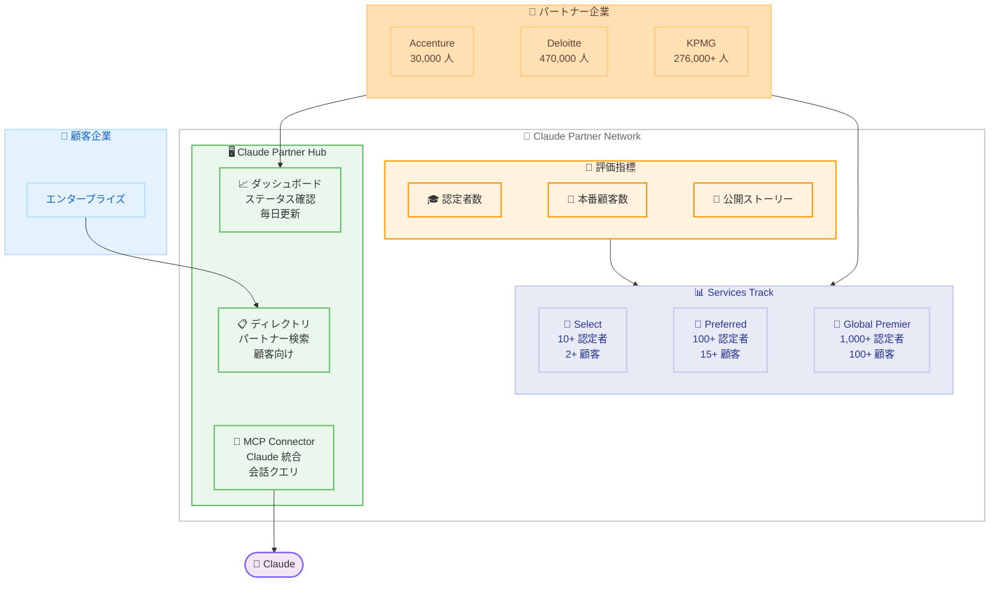

# Claude Partner Network: Services Track と Partner Hub の発表

## メタデータ

| 項目 | 内容 |
|------|------|
| 発表日 | 2026-06-03 |
| ソース | Anthropic News |
| カテゴリ | パートナーシップ / エコシステム |
| 公式リンク | https://www.anthropic.com/news/services-track-partner-hub |

## 概要

Anthropic は Claude Partner Network の新たな 2 つのコンポーネントとして、**Services Track** と **Claude Partner Hub** を発表した。2026 年 3 月に 1 億ドルの投資とともに開始された Claude Partner Network は、開始以来 40,000 社以上の申請と 10,000 人以上の認定コンサルタントを輩出しており、今回の発表でパートナーエコシステムの構造化がさらに進展する。

Services Track は 3 段階のティア構造 (Select、Preferred、Global Premier) を導入し、パートナー企業の実績に基づく明確な昇格基準を定義している。Claude Partner Hub はパートナー向けのダッシュボードと顧客向けのディレクトリを提供し、MCP Connector による Claude との統合も実現している。

## 詳細

### 背景

2026 年 3 月、Anthropic は Claude Partner Network を 1 億ドルの投資とともに立ち上げた。この資金はパートナートレーニング、テクニカルサポート、共同マーケティングに充てられている。

立ち上げからの実績は以下の通りである。

- 40,000 社以上がネットワークへの参加を申請
- 10,000 人以上のコンサルタントが Claude 認定を取得
- 主要パートナー企業が大規模な展開を推進

**主要パートナーの展開状況:**

| パートナー | 展開規模 |
|-----------|---------|
| Accenture | 30,000 人のプロフェッショナルをトレーニング中 |
| Cognizant | 約 350,000 人のアソシエイトに Claude を展開 |
| Deloitte | グローバルで 470,000 人が利用可能 |
| KPMG | 276,000 人以上のワークフォースに統合 |
| Infosys | 特定業界向け Claude エージェントを構築 |
| PwC | Claude Code と Cowork を展開中 |

### 主な変更点

#### Services Track の導入

パートナー企業の実績を評価する 3 段階のティア構造が導入された。

**1. Select (エントリーレベル):**

- 10 人以上のアクティブな認定者
- 2 社以上の共同顧客が本番環境で稼働 (過去 12 か月)
- 1 件以上の公開カスタマーストーリー

**2. Preferred (中級):**

- 100 人以上のアクティブな認定者
- 15 社以上のデプロイ済み共同顧客
- 3 件以上の公開ストーリー

**3. Global Premier (最上位):**

- 1,000 人以上のアクティブな認定者
- 100 社以上の共同顧客が 3 つ以上のリージョンで稼働
- 15 件以上の公開カスタマーストーリー
- 名前付きエグゼクティブスポンサーによる共同ビジネスプラン

#### Claude Partner Hub の提供

- **パートナー向け**: 自社のステータス、ティア進捗、認定チームサイズをリアルタイムで確認できるダッシュボード (毎日更新)
- **顧客向け**: プロジェクト規模に応じた適切なパートナーを検索できるディレクトリ
- **MCP Connector**: Partner Hub を Claude に接続し、パートナーシップ状況を会話形式でクエリ可能

#### 昇格・降格スケジュール

- **昇格**: 年 2 回 (1 月 1 日および 7 月 1 日) に処理
- **初年度追加レビュー**: 2026 年 10 月 1 日
- **降格**: 年次レビュー (12 月 31 日) でのみ実施。90 日間の事前通知と改善期間が設けられる

### 技術的な詳細

#### 評価指標

すべてのパートナー企業に対して同一の基準が適用される。

1. **認定プラクティショナー**: 現在の Anthropic 認定を保持し、過去 90 日以内に Claude を使用した個人。認定は企業ではなく個人に帰属し、Anthropic Partner Academy の試験で取得する
2. **本番稼働中の顧客数**: Claude を使用して本番環境に移行した顧客の数
3. **公開エンドースメント**: 公開ストーリーで推薦を行った顧客数

ステータスは**四半期ごと**に検証される。企業規模は要件に影響せず、小規模企業でも認定ベンチを拡大することで昇格可能である。

#### MCP Connector の技術仕様

MCP Connector は `mcp.eulerapp.com/public/partner-capabilities` でホストされている。以下のようなクエリに対応する。

- 次のティアに対する現在の進捗状況
- ディール登録のステータス
- アクティブな認定を持つコンサルタントの数
- クエリ結果に基づくアクション実行

## 開発者への影響

### 対象

- **コンサルティング企業**: Claude を活用したサービスを提供する SI・コンサルファーム
- **エンタープライズ顧客**: Claude 導入を検討する企業の技術リーダー・意思決定者
- **個人コンサルタント**: Claude 認定の取得を目指す技術者
- **ISV / テクノロジーパートナー**: Claude エコシステムで製品を構築する企業

### 必要なアクション

1. **パートナー企業向け:**
   - Claude Partner Network への申請 (無料)
   - Anthropic Partner Academy で認定試験を受験
   - 最低 10 人の認定プラクティショナーを確保して Select ティアを目指す

2. **顧客企業向け:**
   - Claude Partner Hub のディレクトリで適切なパートナーを検索
   - ティアと実績に基づいてパートナーを評価

3. **開発者個人向け:**
   - Anthropic Partner Academy で認定を取得
   - 過去 90 日以内の Claude 使用実績を維持

### 移行ガイド (該当する場合)

既存のパートナー企業は以下のステップで移行する。

1. Partner Hub にログインして現在のステータスを確認
2. ティア要件と現在の実績のギャップを分析
3. 認定者数の拡大計画を策定
4. 次回の昇格審査 (2026 年 7 月 1 日) に向けて準備

新規申請企業は **Registered** (登録済み) からスタートし、要件を満たすことで Select 以上に昇格する。

## コード例

```python
# MCP Connector を使用した Partner Hub へのクエリ例
# Claude Desktop や Claude Code から MCP 経由で接続

# MCP サーバー設定例 (claude_desktop_config.json)
{
    "mcpServers": {
        "partner-hub": {
            "url": "https://mcp.eulerapp.com/public/partner-capabilities"
        }
    }
}
```

```
# Claude での会話クエリ例
User: "当社の次のティアへの進捗状況を教えてください"
Claude: "現在 Select ティアです。Preferred への昇格には、
         認定者数をあと 72 人、共同顧客を 11 社増やす必要があります。
         次回の昇格審査は 2026 年 7 月 1 日です。"
```

## アーキテクチャ図



## 関連リンク

- [Claude Partner Network 公式ページ](https://www.anthropic.com/news/services-track-partner-hub)
- [Claude Partner Network 立ち上げ発表 (2026 年 3 月)](https://www.anthropic.com/news/claude-partner-network)
- [Anthropic Partner Academy](https://www.anthropic.com/partners)
- [MCP Connector](https://mcp.eulerapp.com/public/partner-capabilities)

## まとめ

今回の Services Track と Partner Hub の発表により、Claude Partner Network は以下の点で大きく進化した。

1. **明確な成長パス**: 3 段階のティア構造により、パートナー企業は次のステップに向けた具体的な目標を持てるようになった
2. **透明性の確保**: ダッシュボードで Anthropic と同じデータを毎日確認でき、四半期ごとの検証により公平性が担保される
3. **顧客とのマッチング**: ディレクトリを通じて、顧客企業は実績に基づいて適切なパートナーを見つけられる
4. **AI ネイティブな統合**: MCP Connector により、パートナーシップ管理自体が Claude を活用した体験となる

1 億ドルの投資、40,000 社以上の申請、主要コンサルティングファームの大規模展開という実績は、エンタープライズ AI 導入における Claude のポジションの強さを示している。今後はSpecializations (業界・ユースケース特化) の追加も予定されており、エコシステムのさらなる拡大が見込まれる。
