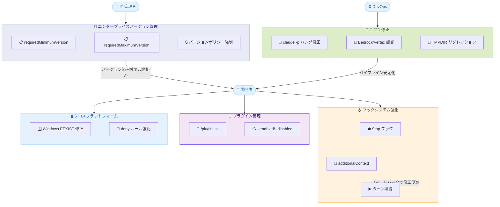

# Claude Code v2.1.163: エンタープライズバージョン管理、プラグイン管理強化、フック出力改善、CI/CD およびクロスプラットフォーム修正

## メタデータ

| 項目 | 内容 |
|------|------|
| 発表日 | 2026-06-05 |
| ソース | Claude Code Changelog |
| カテゴリ | Claude Code アップデート |
| 公式リンク | https://github.com/anthropics/claude-code/blob/main/CHANGELOG.md |

## 概要

Claude Code v2.1.163 は、エンタープライズ向けバージョン管理機能、プラグイン管理の改善、フックシステムの拡張、および CI/CD パイプラインやクロスプラットフォーム環境での重要なバグ修正を含むリリースである。新たに追加された `requiredMinimumVersion` / `requiredMaximumVersion` マネージド設定により、組織は承認済みバージョン範囲を強制でき、許可範囲外のバージョンでは起動が拒否される。また、`claude -p` のハング問題や Bedrock/Vertex/Foundry 環境での認証エラー、`$TMPDIR` の不適切なオーバーライドによる Bazel/EDR 環境でのコマンド失敗など、CI/CD パイプラインに影響する致命的な問題が複数修正された。フックシステムでは Stop/SubagentStop フックが `additionalContext` を返却可能になり、ターンを継続させる柔軟な制御が実現されている。

## 詳細

### 背景

v2.1.162 でエージェントダッシュボードの強化や起動安定性の改善が行われた後、v2.1.163 ではエンタープライズ環境での運用管理と、CI/CD パイプラインでの信頼性向上に焦点が当てられた。大規模な組織では、セキュリティポリシーやコンプライアンス要件から特定バージョンの使用を義務付ける必要があり、`requiredMinimumVersion` / `requiredMaximumVersion` はこの要件に直接応える機能である。また、v2.1.154 で導入された `$TMPDIR` オーバーライドのリグレッションが Bazel ビルドや EDR (Endpoint Detection and Response) 保護環境での Go ワークフローを破壊していた問題が報告されており、本リリースで根本的に修正された。

### 主な変更点

#### New Features (新機能)

| 機能 | 詳細 |
|------|------|
| `requiredMinimumVersion` / `requiredMaximumVersion` | マネージド設定により、許可されたバージョン範囲外では Claude Code の起動を拒否。承認済みバージョンへのアップデート/ダウングレードを案内する |
| `/plugin list` コマンド | インストール済みプラグインの一覧表示。`--enabled` / `--disabled` フィルターでステータス別に絞り込み可能 |
| `/btw` に "c to copy" ショートカット | `/btw` の回答を Raw Markdown 形式でクリップボードにコピー。他のアプリへのペースト時にフォーマットが保持される |
| フック `additionalContext` | Stop/SubagentStop フックが `hookSpecificOutput.additionalContext` を返却可能になり、Claude にフィードバックを与えつつターンを継続させる |
| スキルの `\$` エスケープ構文 | コマンドボディ内で数字の前にリテラルな `$` を含めるための `\$` エスケープ構文を追加 |
| stdio MCP サーバーへの `CLAUDE_CODE_SESSION_ID` 配信 | `--resume` 使用時、フックや Bash と同じセッション ID が stdio MCP サーバーにも渡されるように |

#### Bug Fixes (バグ修正)

##### CI/CD / パイプライン

| 修正内容 | 詳細 |
|---------|------|
| `claude -p` のハング問題 | バックグラウンドコマンドが終了しない場合、最終結果出力後に永久にハングしていた問題を修正。stdin クローズ後 約 5 秒でバックグラウンドシェルを停止する |
| Bedrock/Vertex/Foundry での認証エラー | `CI=true` かつ Anthropic API キー未設定時に "ANTHROPIC_API_KEY required" で失敗する問題を修正 |
| `$TMPDIR` オーバーライドのリグレッション | v2.1.154 で全コマンドに対して `$TMPDIR` が `/tmp/claude-{uid}` にオーバーライドされていた問題を修正。サンドボックスコマンドのみに限定するように変更 |

##### クロスプラットフォーム / Windows

| 修正内容 | 詳細 |
|---------|------|
| Windows "EEXIST" エラー | セッション環境ディレクトリに読み取り専用属性がある場合、または OneDrive 内にある場合に "EEXIST: file already exists" で Bash コマンドが失敗する問題を修正 |

##### セキュリティ / パーミッション

| 修正内容 | 詳細 |
|---------|------|
| org マネージド権限ルールの適用漏れ | 新規設定ディレクトリで起動中にマネージド設定のフェッチが完了した場合、セッション全体にルールが適用されない問題を修正 |
| deny ルールの `$HOME` バイパス | ホームディレクトリパス (例: `Read(~/Desktop/**)`) の deny ルールが、`$HOME` 経由で参照する Bash コマンドをブロックしない問題を修正 |

##### フック / パターンマッチング

| 修正内容 | 詳細 |
|---------|------|
| フック `if: "Bash(...)"` の誤発火 | `$()` や `$VAR` を含む全ての Bash コマンドで条件が発火する問題を修正。サブシェルやバックティック内のコマンドにも正しくマッチするように |

##### UI/UX

| 修正内容 | 詳細 |
|---------|------|
| バックグラウンドセッションのタスク消失 | `claude agents` でアップデート後に再アタッチした際、実行中のバックグラウンドタスクが失われる問題を修正 |
| エージェントビュー終了時のハング | Esc 押下時にターミナルのアラインメントがずれ、数秒間ハングする問題を修正 |
| デスクトップアプリの Stop ボタン | プロセスが既に終了しているバックグラウンドタスクチップの Stop クリック時にチップがクリアされない問題を修正 |
| キーボード入力の無応答 | ペースト操作の終了マーカーがターミナルによってドロップされた場合にキーボード入力が永久に無応答になる問題を修正 |
| トランスクリプトの "(no content)" 行 | /mcp や /plugins などのパネルダイアログを閉じた後にトランスクリプトに不要な行が残る問題を修正 |

#### Improvements (改善)

| 改善内容 | 詳細 |
|---------|------|
| バックグラウンドセッションの自動アップデート | バックグラウンドエージェントセッションが新バージョンにバックグラウンドで更新され、アップデート後のセッション再開時にコールドリスタートの待機が不要に |
| 組み込みコマンド/スキルの説明改善 | `/` メニューでの組み込みコマンドとスキルの説明がより明確に |
| サブスクリプション切替提案の表示位置改善 | トーストではなく起動アナウンスメントスロットに表示 |
| `claude agents` のディレクトリ引き継ぎ | ステートグループビューからのディスパッチ時、エージェントビューを開いたディレクトリでセッションを開始するように |

### 技術的な詳細

#### エンタープライズバージョン管理の仕組み

`requiredMinimumVersion` と `requiredMaximumVersion` はマネージド設定 (組織管理者が配布する設定) として提供される。Claude Code の起動時にバージョンチェックが行われ、現在のバージョンが許可範囲外であれば、起動を拒否してユーザーに承認済みバージョンへの移行を案内する。

```json
{
  "managedSettings": {
    "requiredMinimumVersion": "2.1.160",
    "requiredMaximumVersion": "2.1.170"
  }
}
```

この仕組みにより、セキュリティパッチが適用されていない古いバージョンの使用を防止し、同時にまだ検証が完了していない最新バージョンへの自動アップデートも制御できる。

#### フック `additionalContext` による柔軟な制御

従来、Stop/SubagentStop フックがエラーを返すとフックエラーとして処理されターンが終了していた。v2.1.163 では、`hookSpecificOutput.additionalContext` を返却することで、エラーラベルを付与せずに Claude にフィードバックを提供し、ターンを継続させることが可能になった。

```json
{
  "hooks": {
    "Stop": [
      {
        "command": "python3 validate_output.py",
        "hookSpecificOutput": {
          "additionalContext": "出力にセキュリティ上の問題があります。修正してください。"
        }
      }
    ]
  }
}
```

これにより、品質ゲートやセキュリティチェックをフック内で実装し、問題がある場合に Claude に修正を促すワークフローが実現できる。

#### `$TMPDIR` オーバーライドの修正詳細

v2.1.154 で導入されたセキュリティ強化により、全ての Bash コマンドで `$TMPDIR` が `/tmp/claude-{uid}` にオーバーライドされていた。しかし、Bazel のビルドシステムや EDR ソフトウェアが保護する Go ワークフローでは、`$TMPDIR` が特定のディレクトリを指すことを前提としているため、コマンドが失敗していた。v2.1.163 では、このオーバーライドをサンドボックス化されたコマンドのみに限定し、通常のコマンド実行では元の `$TMPDIR` が保持される。

#### `claude -p` バックグラウンドプロセスの停止

`claude -p` (パイプモード) で最終結果を出力した後、バックグラウンドで起動されたプロセス (例: `npm run dev &`) が終了しない場合にパイプが永久にハングしていた。v2.1.163 では、stdin がクローズされてから約 5 秒後にバックグラウンドシェルを強制停止する仕組みが導入された。

## 開発者への影響

### 対象

- エンタープライズ環境で Claude Code を管理する IT 管理者
- CI/CD パイプラインで `claude -p` を使用しているチーム
- Bedrock/Vertex/Foundry 経由で Claude Code を利用しているユーザー
- Bazel を使用したビルド環境で Claude Code を利用する開発者
- Windows (特に OneDrive 環境) で Claude Code を使用するユーザー
- フックシステムを活用してカスタムワークフローを構築しているユーザー
- プラグインを利用している Claude Code ユーザー

### 必要なアクション

1. **アップデートの実行**:

   ```bash
   npm update -g @anthropic-ai/claude-code
   ```

2. **エンタープライズ管理者**: `requiredMinimumVersion` / `requiredMaximumVersion` を活用してバージョンポリシーを設定。セキュリティパッチ適用済みの最小バージョンと、検証完了済みの最大バージョンを定義する

3. **CI/CD ユーザー**: Bedrock/Vertex/Foundry を使用している場合、`ANTHROPIC_API_KEY` 未設定でも正常に動作することを確認。`claude -p` でバックグラウンドプロセスを起動していた場合、約 5 秒後に停止される新しい挙動に留意する

4. **Bazel/EDR 環境ユーザー**: v2.1.154 以降で `$TMPDIR` 関連の問題が発生していた場合、本リリースで解消される

5. **フック利用者**: Stop/SubagentStop フックで `additionalContext` を活用した品質ゲートの実装を検討する

6. **プラグイン利用者**: `/plugin list` コマンドでインストール済みプラグインの状態を確認する

### 移行ガイド (該当する場合)

本リリースには破壊的変更は含まれていない。ただし、以下の挙動変更に留意が必要である。

- **`claude -p` でのバックグラウンドプロセス**: 最終結果出力後、約 5 秒でバックグラウンドシェルが停止される。バックグラウンドプロセスの永続化が必要な場合は、別途プロセス管理を行う必要がある
- **`$TMPDIR` オーバーライド**: v2.1.154 以降の挙動がロールバックされ、サンドボックスコマンドのみにオーバーライドが限定された。v2.1.154 の挙動に依存するワークアラウンドを実装していた場合は見直しが必要
- **フック `if: "Bash(...)"` 条件**: `$()` や `$VAR` を含むコマンドでの誤発火が修正されたため、意図せず全コマンドで発火していたフックが正しい条件でのみ発火するようになる

## コード例

```bash
# v2.1.163 へのアップデート
npm update -g @anthropic-ai/claude-code

# バージョン確認
claude --version

# インストール済みプラグインの確認
claude
# Claude Code 内で:
# /plugin list
# /plugin list --enabled
# /plugin list --disabled

# /btw の回答をクリップボードにコピー
# /btw の回答表示後に "c" を押下

# マネージド設定でバージョン範囲を指定 (IT 管理者向け)
# managed_settings.json:
# {
#   "requiredMinimumVersion": "2.1.160",
#   "requiredMaximumVersion": "2.1.170"
# }

# Stop フックで additionalContext を返却する例
# hooks.json:
# {
#   "hooks": {
#     "Stop": [
#       {
#         "command": "python3 check_quality.py"
#       }
#     ]
#   }
# }

# check_quality.py の出力例:
# {
#   "hookSpecificOutput": {
#     "additionalContext": "コードにハードコードされた認証情報が含まれています。環境変数を使用してください。"
#   }
# }

# CI/CD での Bedrock 使用例 (API キー不要)
CI=true AWS_REGION=us-east-1 claude -p "テストを実行してください"

# スキルコマンドでのリテラル $ エスケープ
# command: "echo Price is \$5"
# -> 出力: "Price is $5"
```

## アーキテクチャ図



## 関連リンク

- [Claude Code Changelog](https://github.com/anthropics/claude-code/blob/main/CHANGELOG.md)
- [Claude Code ドキュメント](https://docs.anthropic.com/en/docs/claude-code)
- [Claude Code フック設定](https://docs.anthropic.com/en/docs/claude-code/hooks)
- [Claude Code パーミッション設定](https://docs.anthropic.com/en/docs/claude-code/permissions)
- [Claude Code バックグラウンドエージェント](https://docs.anthropic.com/en/docs/claude-code/background-agents)
- [Claude Code MCP 設定](https://docs.anthropic.com/en/docs/claude-code/mcp)

## まとめ

v2.1.163 は、エンタープライズ環境での組織的なバージョン管理、CI/CD パイプラインでの信頼性、フックシステムの柔軟性という 3 つの軸で大きな進展を遂げたリリースである。

`requiredMinimumVersion` / `requiredMaximumVersion` の導入により、組織管理者はセキュリティポリシーに準拠したバージョン範囲を強制できるようになった。これは、大規模な開発チームで Claude Code を統一的に管理するための基盤となる機能である。

CI/CD 面では、`claude -p` のハング問題、Bedrock/Vertex/Foundry での認証エラー、`$TMPDIR` オーバーライドによる Bazel/EDR 環境での失敗という 3 つの致命的な問題が修正された。特に `$TMPDIR` の問題は v2.1.154 からのリグレッションであり、Go 開発者や Bazel ユーザーに広く影響していたため、本修正は大きな安心材料となる。

フックシステムでは、`additionalContext` の導入により Stop フックが「エラーで停止」か「成功で継続」かの二者択一ではなくなり、「フィードバックを与えて修正を促す」という中間的な制御が可能になった。これにより、品質ゲートやセキュリティチェックをフックで実装し、問題がある場合に自動的に修正サイクルを回すワークフローが実現できる。

全体として、Claude Code を組織的に運用する環境、CI/CD パイプラインに統合する環境、カスタムフックで高度なワークフローを構築する環境のいずれにおいても、信頼性と管理性が大きく向上したリリースと言える。
