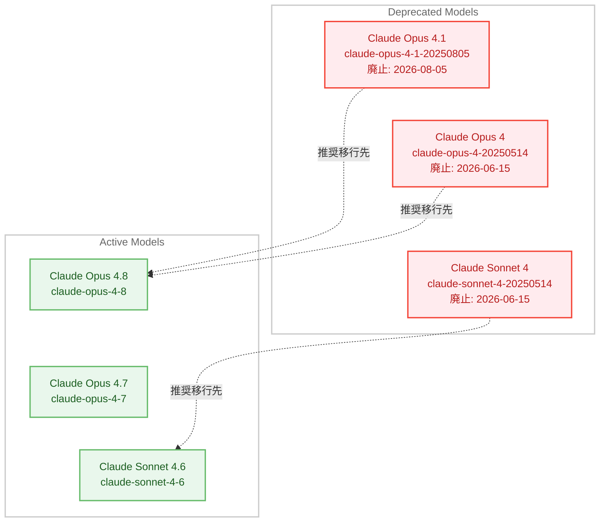

# Claude Opus 4.1 モデルの非推奨化と廃止予定

## メタデータ

| 項目 | 内容 |
|------|------|
| 発表日 | 2026-06-05 |
| ソース | Claude API Release Notes |
| カテゴリ | モデル非推奨化 |
| 公式リンク | https://platform.claude.com/docs/en/about-claude/model-deprecations |

## 概要

2026 年 6 月 5 日、Anthropic は Claude Opus 4.1 モデル (`claude-opus-4-1-20250805`) の非推奨化を発表した。Claude API 上での廃止日は 2026 年 8 月 5 日に予定されており、推奨される移行先は Claude Opus 4.8 (`claude-opus-4-8`) である。

この非推奨化は、Anthropic が定期的に実施しているモデルライフサイクル管理の一環であり、2026 年 4 月 14 日に発表された Claude Sonnet 4 および Claude Opus 4 (初代) の非推奨化に続くものである。開発者は廃止日までに最新モデルへの移行を完了する必要がある。

## 詳細

### 背景

Anthropic はより安全で高性能なモデルをリリースするに伴い、古いモデルを定期的に廃止している。モデルのライフサイクルは以下の 4 段階で管理される。

1. **Active**: 完全にサポートされ、使用が推奨される状態
2. **Legacy**: アップデートは提供されないが、将来的に非推奨化される可能性がある状態
3. **Deprecated**: 動作はするが推奨されない状態。推奨代替モデルと廃止日が設定される
4. **Retired**: 使用不可。リクエストは失敗する

Claude Opus 4.1 は 2025 年 8 月 5 日にリリースされたモデルであり、約 10 か月の運用を経て非推奨化された。後継として 2026 年 5 月 28 日にリリースされた Claude Opus 4.8 が推奨されている。

### 主な変更点

| 項目 | 内容 |
|------|------|
| 非推奨化対象 | `claude-opus-4-1-20250805` |
| 非推奨化日 | 2026 年 6 月 5 日 |
| 廃止予定日 | 2026 年 8 月 5 日 |
| 推奨移行先 | `claude-opus-4-8` |
| 通知方法 | メールおよびドキュメント |

Claude Opus 4.1 から Claude Opus 4.8 への移行には、中間バージョン (Claude Opus 4.5、4.6、4.7) で導入された破壊的変更への対応も必要となる。

### 技術的な詳細

Claude Opus 4.1 から Claude Opus 4.8 への移行は複数世代をまたぐため、以下の破壊的変更に対応する必要がある。

**Claude Opus 4.7 以降で導入された破壊的変更。**

1. **サンプリングパラメータの廃止**: `temperature`、`top_p`、`top_k` を非デフォルト値に設定すると 400 エラーが返される。プロンプトでモデルの動作を制御することが推奨される
2. **Extended Thinking の廃止**: `thinking: {type: "enabled", budget_tokens: N}` は 400 エラーを返す。代わりに Adaptive Thinking (`thinking: {type: "adaptive"}`) と effort パラメータを使用する
3. **プリフィルの廃止**: アシスタントメッセージのプリフィルは 400 エラーを返す。Structured Outputs や `output_config.format` を使用する
4. **新しいトークナイザー**: Claude Opus 4.7 以降は新しいトークナイザーを使用し、テキスト処理で最大約 35% 多くのトークンを消費する可能性がある

**Claude Opus 4.8 の主な特徴。**

- 1M トークンコンテキストウィンドウ (デフォルトで有効、ベータヘッダー不要)
- 128k 最大出力トークン
- Adaptive Thinking 対応
- effort パラメータのデフォルトが `high`
- Mid-conversation system messages のサポート
- Refusal stop details の公開ドキュメント化
- プロンプトキャッシュの最小長が 1,024 トークンに低下

## 開発者への影響

### 対象

- Claude API で `claude-opus-4-1-20250805` を使用しているすべての開発者
- Anthropic が運営するプラットフォーム (Claude API、Claude Platform on AWS、Microsoft Foundry) のユーザー
- Amazon Bedrock や Vertex AI のユーザーはパートナー独自のスケジュールに従う

### 必要なアクション

1. **使用状況の確認**: Claude Console の Usage ページからエクスポートした CSV で、`claude-opus-4-1-20250805` の利用箇所を特定する
2. **モデル ID の更新**: `claude-opus-4-1-20250805` を `claude-opus-4-8` に変更する
3. **破壊的変更への対応**: サンプリングパラメータの削除、Extended Thinking から Adaptive Thinking への移行、プリフィルの代替手段への切り替え
4. **テストの実施**: 廃止日 (2026 年 8 月 5 日) より十分前に新モデルでのテストを完了する
5. **コスト・レイテンシの再評価**: 新しいトークナイザーと effort レベルの再調整により、コストとレイテンシが変動する可能性がある

### 移行ガイド

Anthropic は公式の移行ガイドを提供している。Claude Opus 4.1 からの移行では、Claude Opus 4.7 の移行手順を先に適用し、その後 Claude Opus 4.8 の移行手順を適用する必要がある。

**Claude Code を使用した自動移行。**

```text
/claude-api migrate this project to claude-opus-4-8
```

このスキルはモデル ID の差し替え、破壊的パラメータの変更、プリフィルの置換、effort の調整をコードベース全体に適用し、手動確認が必要な項目のチェックリストを生成する。Amazon Bedrock、Vertex AI、Claude Platform on AWS、Microsoft Foundry のクライアントも検出して適切に調整される。

## コード例

```python
# Before: Claude Opus 4.1
import anthropic

client = anthropic.Anthropic()

response = client.messages.create(
    model="claude-opus-4-1-20250805",
    max_tokens=16000,
    temperature=0.7,  # Opus 4.7 以降では 400 エラー
    thinking={"type": "enabled", "budget_tokens": 10000},  # Opus 4.7 以降では 400 エラー
    messages=[{"role": "user", "content": "Hello, Claude!"}],
)

# After: Claude Opus 4.8
response = client.messages.create(
    model="claude-opus-4-8",
    max_tokens=16000,
    # temperature, top_p, top_k は削除
    thinking={"type": "adaptive"},  # Adaptive Thinking を使用
    output_config={"effort": "high"},  # effort パラメータで思考の深さを制御
    messages=[{"role": "user", "content": "Hello, Claude!"}],
)
```

## アーキテクチャ図



## 関連リンク

- [Model Deprecations](https://platform.claude.com/docs/en/about-claude/model-deprecations) - 非推奨モデルの一覧と廃止スケジュール
- [Migration Guide - Migrating from Claude Opus 4.7](https://platform.claude.com/docs/en/about-claude/models/migration-guide#migrating-from-claude-opus-47) - Claude Opus 4.8 への移行手順
- [Migration Guide - Migrating to Claude Opus 4.7](https://platform.claude.com/docs/en/about-claude/models/migration-guide#migrating-to-claude-opus-4-7) - 中間バージョンの破壊的変更への対応
- [Claude API Release Notes - June 5, 2026](https://platform.claude.com/docs/en/release-notes/overview) - リリースノートでの告知
- [Commitments on Model Deprecation and Preservation](https://www.anthropic.com/research/deprecation-commitments) - モデル廃止と保存に関する Anthropic のコミットメント

## まとめ

Claude Opus 4.1 の非推奨化は、Anthropic のモデルライフサイクル管理の標準的なプロセスに従ったものである。廃止日は 2026 年 8 月 5 日であり、約 2 か月の移行期間が設けられている。

移行先の Claude Opus 4.8 は 2026 年 5 月 28 日にリリースされた最新の最高性能モデルであり、1M トークンコンテキストウィンドウ、128k 最大出力トークン、Adaptive Thinking など多くの改善が含まれている。ただし、Claude Opus 4.1 から直接移行する場合は、Claude Opus 4.7 で導入されたサンプリングパラメータの廃止や Extended Thinking の廃止といった破壊的変更にも対応する必要があるため、早期にテストを開始することを推奨する。

Anthropic は公式の移行ガイドと Claude Code による自動移行ツールを提供しているため、これらを活用して計画的に移行を進めることが重要である。
