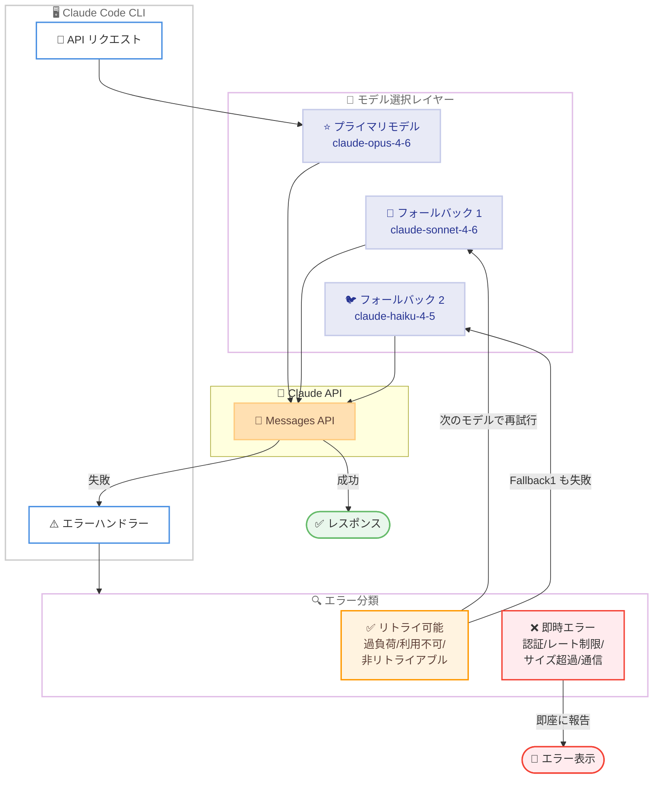

# Claude Code v2.1.166: フォールバックモデル設定とセキュリティ強化

## メタデータ

| 項目 | 内容 |
|------|------|
| 発表日 | 2026-06-06 |
| ソース | Claude Code Changelog |
| カテゴリ | Claude Code アップデート |
| 公式リンク | https://github.com/anthropics/claude-code/blob/main/CHANGELOG.md |

## 概要

Claude Code v2.1.166 がリリースされた。本バージョンでは、プライマリモデルが利用不可の際に自動的に代替モデルへ切り替える `fallbackModel` 設定の導入、deny ルールでのグロブパターンサポート、クロスセッションメッセージングのセキュリティ強化など、7 つの新機能と 15 件のバグ修正が含まれている。特にフォールバックモデル機能は、API の過負荷や障害時にも作業を継続できるようにする重要な耐障害性の改善である。

## 詳細

### 背景

Claude Code は開発者がターミナルから Claude を利用するための CLI ツールであり、頻繁なアップデートにより安定性と機能性が継続的に向上している。v2.1.166 では、特にエンタープライズ環境で求められる高可用性とセキュリティの要件に応える機能が追加された。

### 主な変更点

#### 新機能

1. **`fallbackModel` 設定**: プライマリモデルが過負荷または利用不可の場合に、最大 3 つのフォールバックモデルを順番に試行する設定を追加。`--fallback-model` フラグがインタラクティブセッションにも適用されるようになった

2. **deny ルールでのグロブパターンサポート**: ツール名の位置に `"*"` を指定して全ツールを拒否可能に。allow ルールは非 MCP グロブを拒否し、deny ルール内の不明なツール名は起動時に警告を表示

3. **クロスセッションメッセージングの強化**: `SendMessage` 経由で他の Claude セッションからリレーされたメッセージがユーザー権限を持たなくなった。受信側はリレーされた権限リクエストを拒否し、auto モードではブロックされる

4. **thinking 無効化の対応**: `MAX_THINKING_TOKENS=0`、`--thinking disabled`、およびモデルごとの thinking トグルが、デフォルトで thinking を行うモデルに対して Claude API 経由で thinking を無効化可能に (サードパーティプロバイダーは変更なし)

5. **非リトライアブルエラー時のフォールバック**: API が予期しない非リトライアブルエラーを返した場合、フォールバックモデルで 1 回リトライする。認証、レート制限、リクエストサイズ、トランスポートエラーは即座に表示

6. **`claude update` の改善**: ダウンロード前にターゲットバージョンを表示するようになった (従来は無言でダウンロードしていた)

7. **`claude agents` の URL フィルタ**: セッションリストに URL を入力すると、最初のプロンプトにその URL を含むセッションにフィルタリング

#### バグ修正

1. **画像処理エラーの修正**: 処理不可能な画像送信時に繰り返し発生していた "image could not be processed" エラーと余分なトークン消費を修正

2. **リモートセッションの固着修正**: 起動時のワーカー登録中にバックエンドの短時間障害が発生した際、リモートセッションが永久にスタックする問題を修正

3. **JetBrains IDE ターミナルのちらつき修正**: IntelliJ、PyCharm、WebStorm 等の 2026.1 以降で同期出力を有効にすることで修正

4. **Kitty キーボードプロトコルの修正**: WezTerm、Ghostty、kitty で Shift+非 ASCII 文字 (例: Shift+a -> A) が無視される問題を修正

5. **PowerShell コマンドバリデーション**: Windows で killed プロセスの子プロセスが出力パイプを保持し続ける場合にハングする問題を修正

6. **orphaned プロセスの修正**: macOS でデーモン接続切断後に `claude --bg-pty-host` プロセスが CPU 100% で回転する問題を修正

7. **voice モードの認証修正**: `/voice` トグル後に stale な認証チェックをクリアするために `/login` が必要だった問題を修正

8. **managed settings の修正**: 無効なエントリを含む managed settings が残りの有効なポリシーの適用を無効にしていた問題を修正

9. **`${VAR}` 参照の修正**: managed-settings の `allowedMcpServers`/`deniedMcpServers` で `${VAR}` 参照を使用した述語がマッチしない問題を修正

10. **バックグラウンドエージェントのクラッシュループ修正**: git worktree に入ったバックグラウンドエージェントセッションが "No conversation found" で再開時にクラッシュループする問題を修正

11. **thinking テキストの重複修正**: ストリーミング中に Ctrl+O トランスクリプトビューで thinking テキストが重複する問題を修正

12. **`/doctor` の矛盾表示修正**: リモートセッション内で実行した際に矛盾するチェック結果を表示する問題を修正

13. **カーソル固着の修正**: `claude agents` のディスパッチおよびリプライ入力で複数行プロンプト入力時にカーソルが固着する問題を修正

14. **空白行の修正**: Unicode サポートのないターミナルでバックグラウンドエージェント行の間に空白行が表示される問題を修正

### 技術的な詳細

#### フォールバックモデルの仕組み

`fallbackModel` 設定では、最大 3 つのモデルを優先順位付きで指定できる。プライマリモデルへのリクエストが失敗した場合、以下の順序で処理される。

1. プライマリモデルにリクエスト送信
2. 過負荷/利用不可エラーを検出
3. フォールバックリスト内の次のモデルでリトライ
4. 全モデルが失敗した場合のみエラーを表示

認証エラー、レート制限、リクエストサイズ超過、トランスポートエラーはフォールバック対象外で即座にユーザーに報告される。

#### クロスセッションメッセージングのセキュリティモデル

従来は `SendMessage` で中継されたメッセージがユーザー権限を継承していたが、v2.1.166 以降は以下のように変更された。

- リレーされたメッセージは権限昇格不可
- 受信セッションは権限リクエストを自動拒否
- auto モードでは中継メッセージをブロック

これにより、マルチエージェント環境での権限エスカレーション攻撃のリスクが大幅に低減される。

## 開発者への影響

### 対象

- Claude Code を利用する全ての開発者
- 特にエンタープライズ環境で高可用性が求められるチーム
- マルチエージェント構成を使用しているユーザー
- JetBrains IDE ユーザー (2026.1 以降)
- Windows/PowerShell ユーザー
- macOS でバックグラウンドプロセスを利用するユーザー

### 必要なアクション

1. **フォールバックモデルの設定** (推奨): `settings.json` に `fallbackModel` を追加して耐障害性を向上させる
2. **deny ルールの確認**: グロブパターンサポートにより、既存のルールが意図通りに動作するか確認
3. **managed settings の確認**: `${VAR}` 参照を使用している場合、修正により正しくマッチするようになったことを確認
4. **claude update の実行**: `claude update` で最新版に更新

### 移行ガイド (該当する場合)

#### フォールバックモデルの設定

`settings.json` または `.claude/settings.json` に以下を追加する。

```json
{
  "fallbackModel": [
    "claude-sonnet-4-6",
    "claude-haiku-4-5"
  ]
}
```

#### thinking 無効化

モデルのデフォルト thinking を無効にする方法。

```bash
# 環境変数で無効化
MAX_THINKING_TOKENS=0 claude

# CLI フラグで無効化
claude --thinking disabled
```

#### deny ルールのグロブパターン

全ツールを拒否するルール例。

```json
{
  "permissions": {
    "deny": [
      { "tool": "*", "description": "全ツールを拒否" }
    ]
  }
}
```

## コード例

```json
// settings.json - フォールバックモデルの設定例
{
  "model": "claude-opus-4-6",
  "fallbackModel": [
    "claude-sonnet-4-6",
    "claude-haiku-4-5"
  ],
  "permissions": {
    "deny": [
      { "tool": "*", "description": "デフォルトで全ツール拒否" }
    ],
    "allow": [
      { "tool": "Read", "description": "読み取り許可" },
      { "tool": "Grep", "description": "検索許可" }
    ]
  }
}
```

```bash
# CLI からフォールバックモデルを指定して起動
claude --fallback-model claude-sonnet-4-6

# thinking を無効化して起動
claude --thinking disabled

# バージョン確認付きアップデート
claude update
# 出力例: "Updating to v2.1.166..."
```

## アーキテクチャ図



## 関連リンク

- [Claude Code Changelog](https://github.com/anthropics/claude-code/blob/main/CHANGELOG.md)
- [Claude Code ドキュメント](https://docs.anthropic.com/en/docs/claude-code)
- [Claude Code GitHub リポジトリ](https://github.com/anthropics/claude-code)

## まとめ

Claude Code v2.1.166 は、高可用性とセキュリティを重視したアップデートである。最大 3 つのフォールバックモデルを設定できる `fallbackModel` 機能により、プライマリモデルの障害時にも作業を継続できるようになった。また、クロスセッションメッセージングのセキュリティ強化により、マルチエージェント環境での権限エスカレーションリスクが低減された。deny ルールでのグロブパターンサポートは、より柔軟なアクセス制御を実現する。15 件のバグ修正には、JetBrains IDE のちらつき、macOS での CPU 100% 問題、Windows PowerShell のハングなど、広範なプラットフォーム固有の問題が含まれており、全体的な安定性が大幅に向上している。
