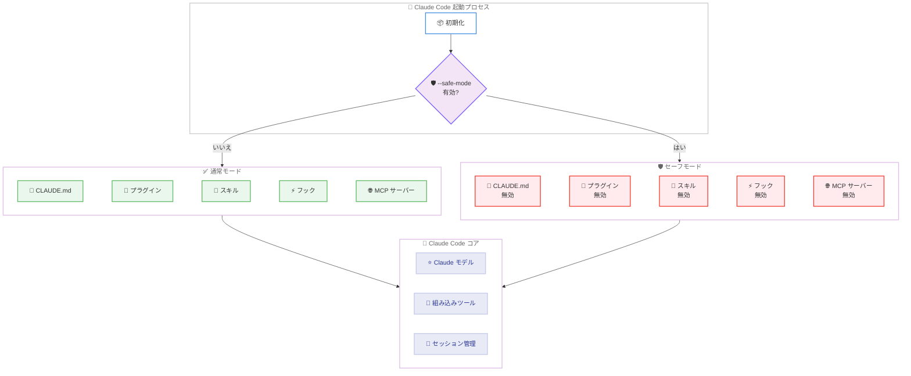

# Claude Code v2.1.169: セーフモード導入と大規模バグ修正

## メタデータ

| 項目 | 内容 |
|------|------|
| 発表日 | 2026-06-09 |
| ソース | Claude Code Changelog |
| カテゴリ | Claude Code アップデート |
| 公式リンク | https://github.com/anthropics/claude-code/blob/main/CHANGELOG.md |

## 概要

Claude Code v2.1.169 が 2026 年 6 月 9 日にリリースされた。本リリースでは、トラブルシューティング用の `--safe-mode` フラグ、セッション中にワーキングディレクトリを変更する `/cd` コマンド、バンドルスキルを無効化する `disableBundledSkills` 設定の 3 つの新機能が追加された。加えて、Windows 環境、エンタープライズ MCP ポリシー、バックグラウンドエージェントに関する 14 件のバグ修正と、CPU 使用率の低減やアイドルタイムアウトの復元を含む 8 件の改善が行われている。カスタマイズの問題を切り分ける必要があるエンタープライズユーザーや、Windows 環境で作業する開発者にとって特に重要なアップデートである。

## 詳細

### 背景

Claude Code は、CLAUDE.md、プラグイン、スキル、フック、MCP サーバーなど多様なカスタマイズ機構を備えている。これらのカスタマイズが複雑に相互作用する環境では、問題の原因を特定するために全てのカスタマイズを一時的に無効にする手段が求められていた。また、v2.1.161 で導入されたスラッシュコマンド/スキルスキャンに起因する Windows 環境でのパフォーマンスリグレッションや、エンタープライズ環境での MCP ポリシー適用漏れなど、複数の重要な問題が報告されていた。v2.1.169 はこれらの課題に包括的に対応するリリースである。

### 主な変更点

#### 新機能 (3 件)

1. **`--safe-mode` フラグ**: `--safe-mode` フラグまたは環境変数 `CLAUDE_CODE_SAFE_MODE` を使用して、全てのカスタマイズ (CLAUDE.md、プラグイン、スキル、フック、MCP サーバー) を無効化した状態で Claude Code を起動できるようになった。問題がカスタマイズに起因するかどうかを迅速に切り分けるためのトラブルシューティング機能である

2. **`/cd` コマンド**: セッション中にワーキングディレクトリを変更するコマンド。プロンプトキャッシュを破壊せずにディレクトリを移動できるため、長時間セッションの効率が向上する

3. **`disableBundledSkills` 設定**: `disableBundledSkills` 設定または環境変数 `CLAUDE_CODE_DISABLE_BUNDLED_SKILLS` により、バンドルされたスキル、ワークフロー、組み込みスラッシュコマンドをモデルから隠すことが可能になった

#### バグ修正 (14 件)

| # | 修正内容 | 影響プラットフォーム |
|---|----------|---------------------|
| 1 | エンタープライズ MCP ポリシー (`allowedMcpServers`/`deniedMcpServers`) が再接続時、IDE 設定、`--mcp-config` サーバー、リモート設定ロード前に適用されない問題。リモート設定のない組織でのコールドスタート遅延も修正 | 全環境 |
| 2 | `claude -p` がスラッシュコマンド/スキルスキャン待機で低速化またはハングする問題 (v2.1.161 のリグレッション) | Windows |
| 3 | 上下矢印キーが長い入力行の折り返し行を飛ばしてコマンド履歴に移動する問題。各行を順に移動するように修正 | 全環境 |
| 4 | claude.ai 資格情報でログイン中の macOS ユーザーで各ターンの開始時に約 30-50ms の UI 停止が発生する問題 | macOS |
| 5 | OAuth トークンのリフレッシュとセッション再開が同時に発生した際にリモートコントロールが "reconnecting" で固着する問題 | 全環境 |
| 6 | バックグラウンド git コマンド実行時に Git Credential Manager の "Connect to GitHub" ポップアップが表示される問題 | Windows |
| 7 | カスタム statusline 使用時にフッターヒント (例: "esc to interrupt") が表示されない問題 | 全環境 |
| 8 | ワーカーが権限/ダイアログプロンプト待機中に死亡した場合、リモートセッション再接続時に古いプロンプトが再表示される問題 | 全環境 |
| 9 | `claude agents --json` がブロックおよびディスパッチ直後のバックグラウンドセッションを省略する問題。`--all` フラグと `id`/`state` フィールドを追加 | 全環境 |
| 10 | WSL の Windows Terminal で agents ビューから戻る際にフレームが garbled になる問題 | WSL |
| 11 | バックグラウンドエージェントがプリウォームワーカーにディスパッチされた際にプロジェクトレベルの `env` 値を無視する問題 | 全環境 |
| 12 | MCPB プラグインキャッシュが不必要に無効化され、再展開が発生する問題 | Windows |
| 13 | プラグインの `.in_use` PID ロックファイルが蓄積する問題。クラッシュしたセッションの古いマーカーは 1 日 1 回クリーンアップされるようになった | 全環境 |
| 14 | 信頼されていないプロジェクト設定が信頼確認なしに OTEL クライアント証明書パスを設定できる問題 | 全環境 |

#### 改善 (8 件)

1. **CPU 使用率の低減**: レスポンスストリーミング中およびスピナーアニメーション中の CPU 使用率を削減
2. **Vertex/Foundry アイドルタイムアウト復元**: ストリームが無限にハングする代わりに 5 分のアイドルタイムアウトをデフォルトで適用 (`API_FORCE_IDLE_TIMEOUT=0` でオプトアウト可能)
3. **`TaskCreate` の信頼性向上**: 不正な入力を自動修復し、未ロードツールに対するバリデーションエラーにスキーマを含めるように改善
4. **API キー認証無効化時のエラーメッセージ改善**: 組織が API キー認証を無効にしている場合、アクティブな API キーの取得元に基づくガイダンスを表示
5. **リモート管理設定の部分適用**: 無効なエントリがある場合でも残りの有効なポリシーを適用し、バリデーションエラーを表示
6. **バックグラウンドセッションのフラグ保持**: `--ide`、`--chrome`、`--bare`、`--remote-control` などのフラグが retire/wake 間で保持されるようになった
7. **CLAUDE.md 警告閾値のスケーリング**: "CLAUDE.md is too long" 警告がモデルのコンテキストウィンドウサイズに応じてスケールするように変更
8. **`/workflows` の即時表示**: ターンが進行中であっても即座に開くように変更

#### その他 (5 件)

1. **Windows 自動アップデーターの改善**: `claude.exe` が別プロセスに保持されている場合、セッション内でのリトライを停止
2. **スキルタグの色コントラスト改善**: スラッシュコマンドメニュー内のスキルタグの視認性を向上
3. **バックグラウンドセッションの worktree 通知**: 共有チェックアウトでの編集がブロックされることを事前に通知し、無駄な拒否編集を回避
4. **プロモクレジット請求の説明改善**: Apple/Google 課金サブスクライバーに支払い方法の追加先を案内
5. **`claude agents` の利用提案**: 複数の同時セッション実行時に `claude agents` コマンドを提案するヒントを追加

### 技術的な詳細

#### セーフモードのアーキテクチャ

`--safe-mode` は Claude Code の起動プロセスにおいて、全てのカスタマイズレイヤーをバイパスする。具体的には以下の 5 つのコンポーネントが無効化される。

1. **CLAUDE.md**: プロジェクト固有の指示やルールの読み込みをスキップ
2. **プラグイン**: 全てのプラグインの初期化とロードを無効化
3. **スキル**: バンドルおよびカスタムスキルのスキャンと登録を無効化
4. **フック**: pre/post フックの実行を無効化
5. **MCP サーバー**: 外部 MCP サーバーへの接続を確立しない

これにより、問題がコアの Claude Code 機能に起因するのか、カスタマイズに起因するのかを迅速に判断できる。

#### エンタープライズ MCP ポリシーの修正

従来は以下のシナリオで MCP ポリシーが適用されていなかった。

- セッション再接続時
- IDE タイプの設定
- 初回インストール後の最初のセッションでの `--mcp-config` サーバー
- リモート設定のロード前

v2.1.169 では、これら全ての経路で一貫してポリシーが適用されるようになり、エンタープライズ環境でのセキュリティ要件が確実に満たされるようになった。

#### バックグラウンドセッションの状態管理

バックグラウンドセッションの retire/wake サイクルにおいて、以下のフラグが正しく保持されるようになった。

- `--ide`: IDE 統合モード
- `--chrome`: Chrome 統合
- `--bare`: 最小限の UI
- `--remote-control`: リモートコントロールモード

respawn 時の状態バリデーションも強化され、セッションの一貫性が向上した。

## 開発者への影響

### 対象

- Claude Code を利用する全ての開発者
- エンタープライズ環境で MCP ポリシーを運用するセキュリティチーム
- Windows/WSL 環境で作業する開発者
- バックグラウンドエージェントを活用するチーム
- Vertex AI/Foundry 経由で Claude Code を利用するユーザー
- カスタムプラグインやスキルを開発しているユーザー

### 必要なアクション

1. **Claude Code のアップデート**: `claude update` で v2.1.169 に更新
2. **Windows ユーザー**: v2.1.161 以降で `claude -p` が遅い問題が解消されたことを確認
3. **エンタープライズ管理者**: MCP ポリシーが全経路で正しく適用されるようになったことを確認。追加の設定変更は不要
4. **Vertex/Foundry ユーザー**: デフォルトの 5 分アイドルタイムアウトが適用される。無限待機が必要な場合は `API_FORCE_IDLE_TIMEOUT=0` を設定
5. **トラブルシューティング時**: 問題が発生した場合は `--safe-mode` で起動し、カスタマイズが原因かどうかを切り分け

### 移行ガイド (該当する場合)

本リリースには破壊的変更は含まれていない。ただし、以下の動作変更に注意が必要である。

#### Vertex/Foundry のアイドルタイムアウト

デフォルトで 5 分のアイドルタイムアウトが復元された。従来、ストリームが無期限にハングする可能性があったが、5 分間レスポンスがない場合は自動的に中断される。この動作を無効にするには以下を設定する。

```bash
export API_FORCE_IDLE_TIMEOUT=0
```

#### OTEL クライアント証明書パスのセキュリティ変更

信頼されていないプロジェクト設定から OTEL クライアント証明書パスを設定する場合、信頼確認が必要になった。既存の設定で信頼確認プロンプトが表示される場合は承認が必要である。

## コード例

```bash
# セーフモードで起動 (全カスタマイズ無効)
claude --safe-mode

# 環境変数でセーフモードを有効化
CLAUDE_CODE_SAFE_MODE=1 claude

# セッション中にワーキングディレクトリを変更
# (プロンプトキャッシュを維持)
/cd /path/to/new/project

# バンドルスキルを無効化して起動
CLAUDE_CODE_DISABLE_BUNDLED_SKILLS=1 claude

# Vertex/Foundry でアイドルタイムアウトを無効化
API_FORCE_IDLE_TIMEOUT=0 claude

# バックグラウンドエージェントの全セッションを表示
claude agents --json --all
```

```json
// settings.json - バンドルスキルの無効化
{
  "disableBundledSkills": true
}
```

## アーキテクチャ図



## 関連リンク

- [Claude Code Changelog](https://github.com/anthropics/claude-code/blob/main/CHANGELOG.md)
- [Claude Code ドキュメント](https://docs.anthropic.com/en/docs/claude-code)
- [Claude Code GitHub リポジトリ](https://github.com/anthropics/claude-code)
- [v2.1.167 / v2.1.168 リリースレポート](./2026-06-07-claude-code-v2-1-167-v2-1-168.md)

## まとめ

Claude Code v2.1.169 は、新しいトラブルシューティング機能と広範なバグ修正を提供するリリースである。`--safe-mode` により全カスタマイズを一時的に無効化して問題の切り分けが容易になり、`/cd` コマンドによりプロンプトキャッシュを維持したままワーキングディレクトリの変更が可能になった。エンタープライズ環境では、MCP ポリシーが全ての経路で一貫して適用されるようになり、セキュリティの信頼性が向上した。Windows ユーザーにとっては、`claude -p` のハング問題、Git Credential Manager のポップアップ、MCPB プラグインキャッシュの無効化など、複数の重要な問題が解消された。バックグラウンドエージェントのフラグ保持や環境変数の適用も修正され、マルチエージェント運用の安定性が向上している。全ユーザーに対して `claude update` による更新を推奨する。
