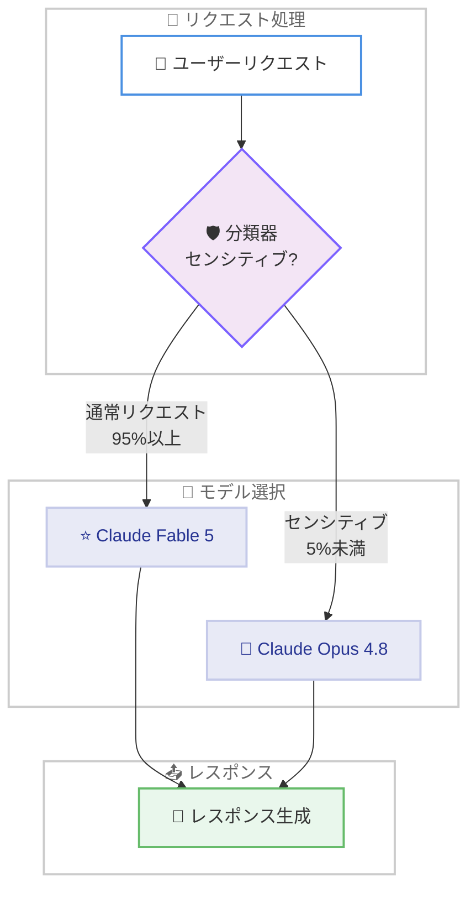
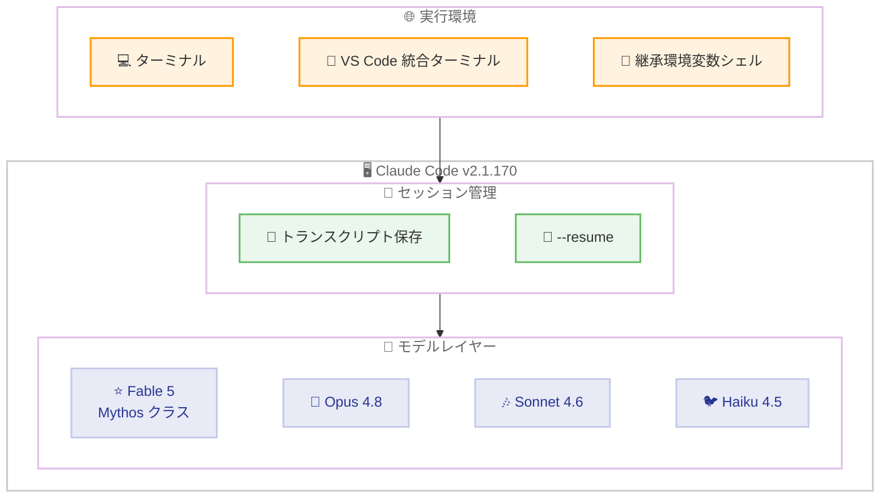

# Claude Code v2.1.170: Claude Fable 5 対応とトランスクリプト保存バグの修正

## メタデータ

| 項目 | 内容 |
|------|------|
| 発表日 | 2026-06-09 |
| ソース | Claude Code Changelog |
| カテゴリ | Claude Code アップデート |
| 公式リンク | https://github.com/anthropics/claude-code/blob/main/CHANGELOG.md |

## 概要

Claude Code v2.1.170 が 2026 年 6 月 9 日にリリースされた。本リリースは同日リリースの v2.1.169 (大規模なバグ修正と新機能追加) に続く集中的なアップデートであり、2 つの変更のみを含む。1 つ目は、Anthropic が新たに一般公開した Mythos クラスモデル「Claude Fable 5」への対応である。Fable 5 は Anthropic がこれまで一般提供してきた中で最も高性能なモデルであり、v2.1.170 にアップデートすることでアクセスが可能になる。2 つ目は、VS Code 統合ターミナルや Claude Code の環境変数を継承したシェルからセッションを起動した際にトランスクリプトが保存されず、`--resume` に表示されない重大なバグの修正である。

## 詳細

### 背景

Anthropic は 2026 年 6 月 9 日に Claude Fable 5 を発表した。Fable 5 は「Mythos クラス」に属するモデルであり、従来の Opus クラスを超える性能階層に位置する。2026 年 4 月に Project Glasswing を通じてリリースされた Claude Mythos Preview に続く第 2 世代の Mythos クラスモデルであり、Claude Mythos 5 に安全性のためのガードレールを追加した一般公開版という位置づけである。

Claude Code v2.1.170 は、この Fable 5 モデルを Claude Code 内から利用可能にするためのアップデートであると同時に、多くの開発者に影響していたトランスクリプト保存の問題を修正する。

### 主な変更点

#### 1. Claude Fable 5 対応

v2.1.170 にアップデートすることで、Claude Code 内から Claude Fable 5 (`claude-fable-5`) にアクセスできるようになった。

**Fable 5 の主な特徴:**

- **Mythos クラス**: Opus クラスを超える最上位の性能階層
- **長時間タスクに最適**: タスクが長く複雑になるほど他のモデルに対するリードが拡大
- **ソフトウェアエンジニアリング**: Cognition の FrontierCode 評価で最高スコアを記録。Stripe は 5,000 万行の Ruby コードベースの全体マイグレーションを 1 日で完了 (通常チームで 2 か月以上)
- **ビジョン**: ビジョンタスクで新たな SOTA を達成
- **長文コンテキスト**: 数百万トークンにわたり集中力を維持
- **自律的研究**: 1 週間以上のほぼ自律的なゲノミクス研究を遂行した実績あり

**料金:**

- 入力: $10 / 100 万トークン
- 出力: $50 / 100 万トークン
- Claude Mythos Preview の半額以下

**安全機構:**

Fable 5 では、センシティブなリクエスト (サイバーセキュリティ、生物学/化学、蒸留) を分類器が検出した場合、拒否する代わりに Claude Opus 4.8 にフォールバックする。このフォールバックは平均してセッションの 5% 未満で発動する。また、全ての Mythos クラスのトラフィックに対して 30 日間のデータ保持が義務付けられている (トレーニングには使用されない)。

#### 2. トランスクリプト保存バグの修正

VS Code 統合ターミナルまたは Claude Code の環境変数を継承したシェルからセッションを起動した際に、トランスクリプトが保存されない問題が修正された。この問題により、該当セッションが `--resume` コマンドの一覧に表示されず、セッションの復元ができなくなっていた。

### 技術的な詳細

#### Claude Fable 5 のモデル選択アーキテクチャ

Claude Code は v2.1.170 で `claude-fable-5` をモデル選択肢として認識するようになった。ユーザーは設定や環境変数を通じて Fable 5 を利用モデルとして指定できる。

#### トランスクリプト保存バグの技術的原因

VS Code 統合ターミナルや Claude Code から派生したシェルでは、親プロセスの環境変数が子プロセスに継承される。この継承された環境変数がトランスクリプトの保存パスやセッション ID の管理ロジックに干渉し、トランスクリプトの書き込みが正常に行われなかった。v2.1.170 では、セッション初期化時に環境変数の状態を適切に検証し、継承された値が保存ロジックに影響しないよう修正が行われた。

#### Fable 5 の安全機構フロー



## 開発者への影響

### 対象

- Claude Code を利用する全ての開発者
- 高性能モデルを必要とするソフトウェアエンジニアリングチーム
- VS Code の統合ターミナルで Claude Code を使用しているユーザー
- セッションの `--resume` 機能を活用しているユーザー
- 長時間の複雑なコーディングタスクを実行するユーザー

### 必要なアクション

1. **Claude Code のアップデート**: `claude update` で v2.1.170 に更新し、Fable 5 へのアクセスを有効化
2. **Fable 5 の利用開始**: アップデート後、モデル設定で `claude-fable-5` を選択可能
3. **VS Code ユーザー**: トランスクリプト保存の問題が解消されたことを確認。アップデート後は `--resume` に全セッションが正しく表示される
4. **料金の確認**: Fable 5 は入力 $10/出力 $50 (100 万トークンあたり)。サブスクリプションプランでは 6 月 22 日まで追加料金なしで利用可能、6 月 23 日以降は使用量クレジットが必要

### 移行ガイド (該当する場合)

本リリースには破壊的変更は含まれていない。Fable 5 の利用はオプトイン方式であり、既存の設定に影響は与えない。

#### Fable 5 を使用する場合

```bash
# Claude Code をアップデート
claude update

# モデル設定で Fable 5 を指定
claude config set model claude-fable-5
```

#### 注意事項

- Fable 5 のセンシティブリクエスト分類器がトリガーされた場合、自動的に Opus 4.8 にフォールバックする (ユーザー操作不要)
- 30 日間のデータ保持ポリシーが適用される (トレーニングには使用されない)
- サブスクリプションプランでの無料利用期間は 2026 年 6 月 22 日まで

## コード例

```bash
# v2.1.170 にアップデート
claude update

# Fable 5 をデフォルトモデルとして設定
claude config set model claude-fable-5

# Fable 5 で複雑なタスクを実行
claude "このコードベースを TypeScript に移行してください"

# セッションの再開 (VS Code ターミナルからのセッションも表示される)
claude --resume
```

```json
// settings.json - Fable 5 をデフォルトモデルに設定
{
  "model": "claude-fable-5"
}
```

## アーキテクチャ図



## 関連リンク

- [Claude Fable 5 発表](https://www.anthropic.com/news/claude-fable-5-mythos-5)
- [Claude Code Changelog](https://github.com/anthropics/claude-code/blob/main/CHANGELOG.md)
- [Claude Code ドキュメント](https://docs.anthropic.com/en/docs/claude-code)
- [Claude Code GitHub リポジトリ](https://github.com/anthropics/claude-code)
- [v2.1.169 リリースレポート](./2026-06-09-claude-code-v2-1-169.md)

## まとめ

Claude Code v2.1.170 は、同日リリースの v2.1.169 に続く集中的なアップデートであり、2 つの重要な変更を含む。最大の目玉は、Anthropic がこれまで一般提供してきた中で最も高性能な Mythos クラスモデル「Claude Fable 5」へのアクセス対応である。Fable 5 はソフトウェアエンジニアリング、ビジョン、長文コンテキスト処理、自律的研究において既存モデルを大幅に上回る性能を発揮し、タスクが長く複雑になるほどその優位性が拡大する。料金は入力 $10/出力 $50 (100 万トークンあたり) で Claude Mythos Preview の半額以下に設定されている。もう 1 つの変更は、VS Code 統合ターミナルや環境変数を継承したシェルからのセッションでトランスクリプトが保存されないバグの修正であり、`--resume` の信頼性が向上した。全ユーザーに対して `claude update` による更新を推奨する。
