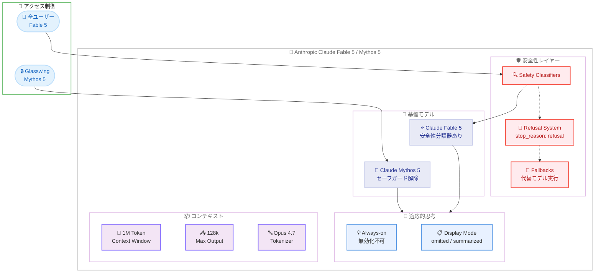

# Claude Fable 5 / Claude Mythos 5: Anthropic 史上最高性能モデルの一般提供開始

## メタデータ

| 項目 | 内容 |
|------|------|
| 発表日 | 2026-06-09 |
| ソース | Anthropic News / Claude API Release Notes |
| カテゴリ | 新モデル |
| 公式リンク | https://www.anthropic.com/news/claude-fable-5-mythos-5 |

## 概要

Anthropic は 2026 年 6 月 9 日、Claude Fable 5 (`claude-fable-5`) および Claude Mythos 5 (`claude-mythos-5`) を発表した。Claude Fable 5 は Anthropic 史上最も高性能な一般公開モデルであり、Mythos クラスの基盤モデルに安全性分類器 (Safety Classifiers) を適用することで、幅広いユーザーに安全に提供できるよう設計されている。

Claude Mythos 5 は同一の基盤モデルからセーフガードを解除したバージョンであり、Project Glasswing の参加者 (サイバーディフェンダー、インフラプロバイダー) に限定して提供される。料金は入力 $10/MTok、出力 $50/MTok で、Claude Mythos Preview の半額以下に設定されている。

SWE、知識作業、ビジョン、リサーチなど、ほぼ全てのベンチマークで最先端のスコアを達成し、Stripe は 5,000 万行規模のコードベース移行を 1 日で完了したと報告している。

## 詳細

### 背景

Anthropic は 2026 年初頭に Claude Mythos Preview を限定公開し、極めて高い能力を持つ「フロンティアモデル」の安全な提供方法を模索してきた。Mythos クラスのモデルはコーディング、科学研究、知識作業において他のモデルを大幅に上回る性能を示す一方、安全上の懸念から一般公開が制限されていた。

Claude Fable 5 は、この課題に対する Anthropic の回答である。安全性分類器を組み込むことで、Mythos クラスの能力を維持しながら、一般ユーザーが安心して利用できる形で提供することに成功した。モデル名の「Fable」は、強力な能力を安全に「物語化」(制御) するという意味が込められている。

### 主な変更点

1. **Mythos クラスの性能を一般公開**: 安全性分類器により、フロンティアモデルの能力を安全に一般提供
2. **常時適応的思考 (Always-on Adaptive Thinking)**: 思考機能を無効化できない仕様。手動での extended thinking バジェット設定や assistant prefill は非対応
3. **Opus 4.7 由来のトークナイザー**: 同一テキストでも pre-Opus 4.7 モデル比で約 30% 多くのトークンを生成
4. **30 日間の強制データ保持**: ゼロデータリテンション (ZDR) 環境では利用不可
5. **拒否時の詳細情報**: `stop_reason: "refusal"` を返し、`stop_details.category` に `"reasoning_extraction"` を含む
6. **fallbacks パラメータ**: 拒否されたリクエストを別モデルで再実行するオプトイン機能
7. **thinking.display の初期値変更**: デフォルトは `"omitted"`。`"summarized"` を設定すると読みやすい要約を返す

### 技術的な詳細

**モデルスペック:**

| 項目 | Claude Fable 5 | Claude Mythos 5 |
|------|----------------|-----------------|
| モデル ID | `claude-fable-5` | `claude-mythos-5` |
| コンテキストウィンドウ | 1M トークン | 1M トークン |
| 最大出力トークン | 128k | 128k |
| 入力料金 | $10/MTok | $10/MTok |
| 出力料金 | $50/MTok | $50/MTok |
| 安全性分類器 | あり | なし |
| 利用対象 | 全ユーザー | Glasswing 参加者のみ |
| データ保持 | 30 日間必須 | 30 日間必須 |
| ZDR 対応 | 非対応 | 非対応 |

**トークナイザーに関する注意:**

Fable 5 / Mythos 5 は Opus 4.7 由来のトークナイザーを使用する。これにより、同一テキストに対して pre-Opus 4.7 モデル (Sonnet 4.5、Haiku 4.5 など) と比較して約 30% 多くのトークンが生成される。コスト見積もりや max_tokens の設定において注意が必要である。

**適応的思考の制約:**

- 思考機能は常時有効 (無効化不可)
- `thinking.budget_tokens` の手動設定は非対応
- `assistant` ロールでの prefill は非対応
- `thinking.display` のデフォルト値は `"omitted"` (思考内容を省略)
- `"summarized"` を設定すると読みやすい要約形式で思考内容を返す

**安全性分類器 (Fable 5):**

- リクエストが拒否された場合、`stop_reason: "refusal"` を返す
- `stop_details.category` に拒否カテゴリが含まれる (`"reasoning_extraction"` など)
- 出力前に拒否された場合は課金されない
- `fallbacks` パラメータで拒否時に代替モデルへフォールバック可能

**ベンチマーク性能:**

| ベンチマーク | 結果 |
|-------------|------|
| SWE-bench | 最先端スコア |
| Cognition FrontierCode | 最高スコア |
| Hebbia Finance Benchmark | 最高スコア |
| 知識作業 | 最先端 |
| ビジョンタスク | スクリーンショットから Web アプリのソースコード再構築に成功 |

**Mythos 5 固有の実績:**

- 創薬設計の速度を約 10 倍に加速
- 科学的仮説の生成: Opus クラスモデルに対して 80% の選好率
- 新規ゲノミクス研究の実施

## 開発者への影響

### 対象

- Claude API を利用する全ての開発者 (Fable 5)
- Project Glasswing 参加者 (Mythos 5)
- 大規模コードベースを扱うエンジニアリングチーム
- 科学研究・創薬分野の研究者 (Mythos 5)
- エンタープライズ契約の組織

### 必要なアクション

1. **トークナイザーの変更への対応**: Opus 4.7 由来のトークナイザーにより約 30% 多くのトークンが生成される。コスト見積もりと max_tokens 設定の見直しが必要
2. **思考機能の仕様理解**: 適応的思考は常時有効であり無効化できない。`thinking.display` を `"summarized"` に設定してデバッグに活用
3. **データ保持要件の確認**: 30 日間の強制データ保持が必要。ZDR 環境では利用不可のため、コンプライアンス要件を確認
4. **拒否ハンドリングの実装**: `stop_reason: "refusal"` と `stop_details.category` を活用したエラーハンドリングの実装
5. **fallbacks パラメータの検討**: 重要なワークフローでは `fallbacks` を設定し、拒否時の代替処理を実装

### 移行ガイド

**既存モデルからの移行:**

```python
# Before (Opus 4.8)
model = "claude-opus-4-8-20260528"

# After (Fable 5)
model = "claude-fable-5"
```

**重要な相違点:**

- 思考機能を無効化できないため、`thinking: {"type": "disabled"}` は使用不可
- `thinking.budget_tokens` の手動設定は非対応
- assistant prefill は非対応
- `thinking.display` のデフォルトが `"omitted"` であるため、思考内容を確認したい場合は明示的に `"summarized"` を設定
- 料金体系が異なる (入力 $10/MTok、出力 $50/MTok)

## コード例

```python
import anthropic

client = anthropic.Anthropic()

# Claude Fable 5 の基本的な使用例
response = client.messages.create(
    model="claude-fable-5",
    max_tokens=16384,
    # 適応的思考は常時有効 (無効化不可)
    # thinking.display を "summarized" に設定すると思考の要約を確認可能
    thinking={
        "type": "enabled",
        "display": "summarized"  # デフォルトは "omitted"
    },
    messages=[
        {
            "role": "user",
            "content": "大規模なマイクロサービスアーキテクチャの設計パターンを分析し、最適な移行戦略を提案してください。"
        }
    ]
)

# 思考内容の確認
for block in response.content:
    if block.type == "thinking":
        print(f"思考要約: {block.thinking}")
    elif block.type == "text":
        print(f"回答: {block.text}")

# 拒否ハンドリング
print(f"Stop reason: {response.stop_reason}")
if response.stop_reason == "refusal":
    print(f"拒否カテゴリ: {response.stop_details.category}")
```

```python
import anthropic

client = anthropic.Anthropic()

# fallbacks パラメータを使用した拒否時のフォールバック
response = client.messages.create(
    model="claude-fable-5",
    max_tokens=8192,
    thinking={
        "type": "enabled",
        "display": "omitted"
    },
    # 拒否された場合に代替モデルで再実行
    fallbacks=["claude-opus-4-8-20260528"],
    messages=[
        {
            "role": "user",
            "content": "セキュリティ脆弱性の分析レポートを作成してください。"
        }
    ]
)

print(f"使用モデル: {response.model}")
print(f"Stop reason: {response.stop_reason}")
```

## アーキテクチャ図



## API 変更点 (2026 年 6 月 9 日リリースノート)

本モデルリリースと同日に、以下の API 変更も発表された。

### Claude Managed Agents

- **スケジュールデプロイメント**: cron ベースのスケジュール実行が可能に
- **環境変数クレデンシャル**: Vault 内での環境変数によるクレデンシャル管理

### Webhook イベント

- `session.thread_*` Webhook イベントに `session_thread_id` が含まれるように

### stop_details の拡張

- Fable 5 で `stop_details.category` に `"reasoning_extraction"` カテゴリが追加

## 提供状況

| 提供形態 | Claude Fable 5 | Claude Mythos 5 |
|----------|---------------|-----------------|
| Claude API | 即時利用可能 | Glasswing のみ |
| Enterprise (従量課金) | 即時利用可能 | 対象外 |
| Pro / Max / Team プラン | 6/9-6/22 無料、以降はクレジット必要 | 対象外 |
| Glasswing パートナー | 利用可能 | 利用可能 |

## 関連リンク

- [Claude Fable 5 / Mythos 5 公式発表](https://www.anthropic.com/news/claude-fable-5-mythos-5)
- [Claude API Release Notes](https://platform.claude.com/docs/en/release-notes/overview)
- [Claude モデル一覧](https://docs.anthropic.com/en/docs/about-claude/models)
- [Messages API ドキュメント](https://docs.anthropic.com/en/api/messages)
- [Project Glasswing について](https://www.anthropic.com/news/expanding-project-glasswing)

## まとめ

Claude Fable 5 は、Anthropic が長らく取り組んできた「フロンティアモデルの安全な一般提供」という課題に対する回答である。Mythos クラスの圧倒的な性能を安全性分類器で制御し、全ユーザーに提供することで、AI の能力と安全性の両立を実現した。

開発者にとっての主な注意点は以下の通りである。

1. **トークナイザーの変更**: 約 30% のトークン増加により、コスト計算と max_tokens 設定の見直しが必要
2. **思考機能の常時有効化**: 無効化できないため、既存の thinking 制御ロジックの修正が必要な場合がある
3. **30 日間データ保持**: ZDR 環境では利用不可であり、コンプライアンス要件との整合性確認が必要
4. **拒否ハンドリング**: 安全性分類器による拒否に対応するコードの実装を推奨

料金は入力 $10/MTok、出力 $50/MTok と Mythos Preview の半額以下に設定されており、Stripe の事例 (5,000 万行のコードベース移行を 1 日で完了) が示すように、大規模なエンジニアリングタスクにおける投資対効果は極めて高い。Pro / Max / Team プランでは 6 月 22 日まで無料で利用可能であり、早期に性能を検証することを推奨する。
