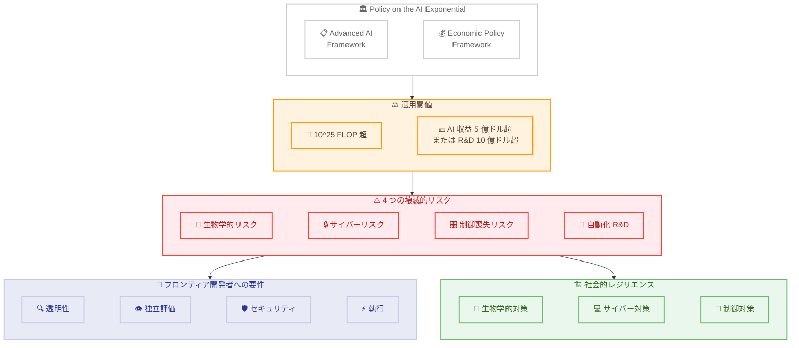

# Policy on the AI Exponential

## メタデータ

| 項目 | 内容 |
|------|------|
| 発表日 | 2026-06-10 |
| ソース | Anthropic News |
| カテゴリ | ポリシー・規制 |
| 公式リンク | https://www.anthropic.com/policy-on-the-ai-exponential |

## 概要

Anthropic は AI の指数関数的な進歩に対応するため、2 つの包括的な政策提案を公表した。1 つ目は高度 AI フレームワーク (Advanced AI Framework: AAIF) で、強力な AI システムのガバナンスと壊滅的リスクの防止を目的とする。2 つ目は経済政策フレームワーク (Economic Policy Framework: EPF) で、労働者の準備と AI がもたらす経済的利益の広範な分配に焦点を当てている。

Anthropic は「AI は指数関数的な速度で進歩しており、政策立案プロセスはより遅い世界のために構築されたものである」と指摘し、透明性だけでは不十分であり、政府には危険な AI 展開を阻止する実質的な規制権限が必要であると主張している。

## 詳細

### 背景

AI の能力は急速に向上しており、数年前にはコードをほとんど書けなかったモデルが、現在では重大なセキュリティ脆弱性を大規模に発見できるレベルに達している。具体的には、Claude Mythos Preview が「すべての主要なオペレーティングシステムとブラウザを含む、数千の重大度の高い脆弱性」を発見したことが報告されている。

Anthropic はこのトレンドが継続する可能性が高いと分析しており、能力の向上に伴い壊滅的な被害のリスクも増大すると警告している。現行法や議会の既存提案を超える規制権限が必要であるとの立場を示している。

### 主な変更点

#### 1. 高度 AI フレームワーク (AAIF)

**適用閾値:**

AAIF は以下の条件を満たすモデルおよび企業にのみ適用される。

- 10^25 FLOP (浮動小数点演算) を超える計算量で訓練されたモデル
- AI 関連収益が 5 億ドル超、または AI 研究開発費が 10 億ドル超の企業

**4 つの壊滅的リスクカテゴリ:**

1. **生物学的リスク**: セーフガードなしでリリースされた AI は生物兵器の開発を「大幅に容易にする」可能性がある。薬物発見を加速する同じ能力が、攻撃者にとって危険なウイルスの開発コストを下げる恐れがある
2. **サイバーリスク**: フロンティアモデルが重大なソフトウェア脆弱性を大規模に発見可能になっている。防御的に使用すれば重要システムを保護できるが、病院や電力網などの重要インフラへのリスクも高める
3. **制御喪失リスク**: AI の改善に伴い、開発者の制御外で行動するシステムの制御がはるかに困難になる可能性がある
4. **自動化された研究開発**: AI システムが AI 自体の研究開発を自動化しており、上記 3 つのリスクをさらに増幅する可能性がある

**フロンティア開発者への要件:**

| 要件カテゴリ | 内容 |
|-------------|------|
| 透明性 | モデルのテスト実施と結果の要約公開、安全性フレームワークの公開、システムカードの公開、定期的なリスクレポートの公開 |
| 独立評価 | 少なくとも 1 名の適格な独立評価者による評価レビューの公開 |
| セキュリティ | 開発環境全体の保護、蒸留攻撃の報告チャネル設置、防御の定期テスト |
| 執行 | 壊滅的リスクを伴う展開の阻止権限、グローバル年間収益に連動した民事罰則 |

#### 2. 経済政策フレームワーク (EPF)

AI の経済的利益を広く分配するための政策枠組みで、以下を扱う。

- 労働者の準備と移行支援
- AI がもたらす経済的利益の公平な分配
- 社会全体への恩恵の最大化

#### 3. 社会的レジリエンス対策

**生物学分野:**
- 遺伝子合成のスクリーニング (予防)
- 新興感染症を発見する早期警戒バイオサーベイランス (検知)
- 防護具の備蓄と空気感染の抑制手段 (備え)

**サイバー分野:**
- インターネット基盤ソフトウェアの堅牢化
- 重要インフラ事業者への技術支援の展開
- 重要インフラにおけるレガシーソフトウェアの置き換え
- フロンティアサイバー能力を追跡する専門政府機能の設置
- 政府と業界によるモデルセーフガードの共同開発

**制御喪失・自動化 R&D 分野:**
- 開発者の制御外で行動する AI システムの検知・対応能力の構築
- そのようなシステムの封じ込めまたは停止のためのインフラ整備

### 技術的な詳細

#### 適用基準の技術的定義

- **計算量閾値**: 10^25 FLOP は現在のフロンティアモデルの訓練規模に相当し、小規模な研究開発組織や既存の小型モデルには適用されない
- **企業規模閾値**: AI 関連収益 5 億ドル超または R&D 支出 10 億ドル超は、最大手 AI 企業のみを対象とする設計

#### セキュリティ要件の詳細

- モデルの重みと訓練インフラは「資金力のある国家機関を含むサイバー攻撃者にとって価値ある標的」
- 外部からの脅威だけでなく、社内からの脅威に対する保護も必要
- セキュリティプログラムの概要を公開で記述
- 指定機関からの要請に応じて詳細を共有

#### 連邦法と州法の関係

- フレームワークは主に米国連邦政府を念頭に設計
- ただし「AI リスクへの対処はワシントンでの行動を待てない」
- **議会は、提案されたフレームワークと同等以上の強度を持つ連邦法を制定しない限り、州法を先取りすべきではない**
- 先取りは「外科的」であるべきで、連邦法がカバーする特定の安全機能以外のすべての問題 (児童安全、消費者保護など) について州が AI を規制することを認めるべき
- カリフォルニア州やニューヨーク州の既存法は既に安全性に関する開示を義務付けている

## 開発者への影響

### 対象

以下に該当する組織と開発者が直接的な影響を受ける。

- **フロンティア AI 開発企業**: 10^25 FLOP 超のモデルを訓練し、AI 関連収益 5 億ドル超または R&D 支出 10 億ドル超の企業 (Anthropic、OpenAI、Google DeepMind など)
- **AI セキュリティ研究者**: 独立評価者としての役割が制度化される可能性
- **重要インフラ事業者**: サイバーレジリエンス対策の強化が求められる
- **バイオテクノロジー企業**: 遺伝子合成スクリーニング要件の影響を受ける可能性
- **AI アプリケーション開発者**: フロンティアモデルの API を利用する場合、安全性フレームワークへの準拠が間接的に求められる可能性

### 必要なアクション

**フロンティア AI 開発者向け:**

1. 安全性フレームワークの策定と公開
2. モデルのテスト体制の構築と結果の要約公開
3. システムカードおよび定期的なリスクレポートの作成
4. 独立評価者との契約と評価の受け入れ
5. 開発環境のセキュリティ強化 (国家レベルの攻撃者を想定)
6. 蒸留攻撃の報告チャネルの設置
7. 防御テストの定期的な実施

**AI アプリケーション開発者向け:**

1. 利用するフロンティアモデルの安全性フレームワークとシステムカードの確認
2. 自社アプリケーションにおけるリスク管理プロセスの見直し
3. 規制動向のモニタリングと準拠体制の構築

### 移行ガイド (該当する場合)

このポリシー提案は現時点では法的拘束力を持つ規制ではなく、立法化に向けた提案である。ただし、以下のステップで準備することが推奨される。

1. **現状評価**: 自社の AI 開発・利用が適用閾値に該当するか確認
2. **ギャップ分析**: 提案されている要件と現在の実施状況の差異を特定
3. **段階的対応**: 透明性要件 (テスト、システムカード) から着手し、セキュリティ要件へ進む
4. **業界動向の追跡**: 州法の動き (カリフォルニア、ニューヨーク) と連邦法案の進捗を監視

## アーキテクチャ図 (該当する場合)

## 関連リンク

- [Policy on the AI Exponential (公式)](https://www.anthropic.com/policy-on-the-ai-exponential)
- [Anthropic News](https://www.anthropic.com/news)
- [Anthropic の安全性へのアプローチ](https://www.anthropic.com/research)

## まとめ

Anthropic は「Policy on the AI Exponential」において、AI の指数関数的な能力向上に対応するための包括的な政策フレームワークを提案した。高度 AI フレームワーク (AAIF) は、10^25 FLOP 超のモデルを開発する大手 AI 企業に対し、透明性、独立評価、セキュリティ、執行の 4 つの柱で規制を課すことを提案している。経済政策フレームワーク (EPF) は AI の経済的利益を広く分配することを目指す。

特筆すべきは、Anthropic が自社を含むフロンティア AI 開発者に対する政府の阻止権限を明確に支持している点である。Claude Mythos Preview による大規模脆弱性発見という具体的事例を挙げ、現在の能力レベルが既に壊滅的リスクの閾値に近づいていることを示唆している。

連邦法と州法の関係については、連邦法が少なくとも同等の強度を持たない限り州法を先取りすべきではないとする立場を取り、段階的かつ外科的なアプローチを推奨している。AI 開発者はこの提案が立法化される可能性を見据え、透明性とセキュリティの要件への準備を進めることが推奨される。
