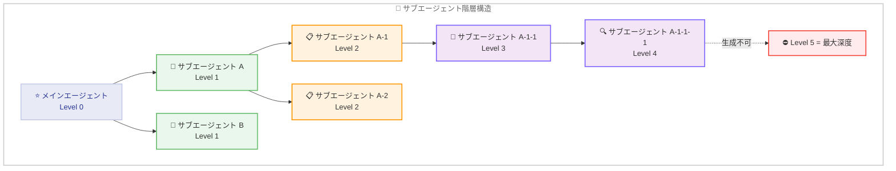
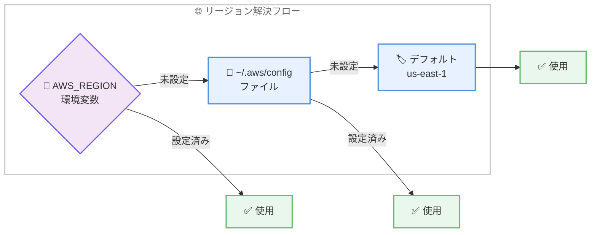

# Claude Code v2.1.172: サブエージェントのネスト対応、大規模バグ修正、パフォーマンス改善

## メタデータ

| 項目 | 内容 |
|------|------|
| 発表日 | 2026-06-11 |
| ソース | Claude Code Changelog |
| カテゴリ | Claude Code アップデート |
| 公式リンク | https://github.com/anthropics/claude-code/blob/main/CHANGELOG.md |

## 概要

Claude Code v2.1.172 が 2026 年 6 月 11 日にリリースされた。本リリースは 30 項目に及ぶ大規模なアップデートであり、新機能 4 件、バグ修正 18 件、改善 8 件を含む。最も注目すべき新機能は、サブエージェントが自身のサブエージェントを生成できるようになったことで、最大 5 階層までのネストが可能になった。これにより、複雑なマルチエージェントワークフローの自律的な分解と並列処理が飛躍的に向上する。また、Amazon Bedrock での AWS リージョン設定の自動検出、1M コンテキスト使用時のセッション固着バグの修正、長い会話でのパフォーマンス改善など、安定性と使い勝手を大幅に向上させる変更が多数含まれている。

## 詳細

### 背景

Claude Code は Anthropic が提供する CLI ベースの AI コーディングアシスタントであり、近年のバージョンではマルチエージェントアーキテクチャの強化が進んでいる。v2.1.169 でバックグラウンドエージェントの大規模な安定化が行われ、v2.1.170 で Claude Fable 5 対応が追加された後、v2.1.172 ではサブエージェントの階層構造サポートという新たなマイルストーンに到達した。

これまでサブエージェントは単一レベルの生成に限定されていたが、実際の開発タスクでは「リサーチエージェントがコードレビューエージェントを呼び出し、さらにテストエージェントを起動する」といった多段構成が求められる場面が増えている。v2.1.172 はこのニーズに応える形で、エージェントアーキテクチャの根本的な拡張を行った。

### 主な変更点

#### 新機能

##### 1. サブエージェントの再帰的生成 (最大 5 階層)

サブエージェントが自身のサブエージェントを生成できるようになり、最大 5 レベルの深さまでネストが可能になった。これにより、複雑なタスクをエージェントが自律的にサブタスクへ分割し、階層的に処理できるようになる。

**ユースケース例:**

- メインエージェントがアーキテクチャ設計を担当し、サブエージェントが各コンポーネントの実装を分担、さらにそのサブエージェントがテスト生成を委託
- リサーチエージェントが複数の情報源を調査するために個別のフェッチエージェントを生成
- コードレビューエージェントがセキュリティ監査、パフォーマンス分析、スタイルチェックを並列で実行

##### 2. Amazon Bedrock の AWS リージョン自動検出

`AWS_REGION` 環境変数が設定されていない場合、`~/.aws/config` ファイルからリージョン情報を読み取るようになった。これは AWS SDK の標準的な優先順位に準拠した動作である。`/status` コマンドでリージョンの取得元が確認できる。

##### 3. プラグインマーケットプレイスの検索バー

`/plugin` コマンドでマーケットプレイスのプラグイン一覧を閲覧する際に、検索バーが追加された。大量のプラグインの中から必要なものを素早く見つけることが可能になった。

##### 4. OTEL メトリクスへの model 属性追加

`claude_code.lines_of_code.count` OpenTelemetry メトリクスに `model` 属性が追加された。これにより、モデルごとのコード生成量を観測・分析できるようになった。

#### バグ修正

##### コンテキストとセッション管理

- **1M コンテキストのセッション固着**: 使用量クレジットなしで 1M コンテキストを使用しているセッションが恒久的にスタックする問題を修正。セッションは自動的に標準コンテキスト上限以下にコンパクト化されるようになった
- **画像処理エラーの反復**: 会話に複数の画像が含まれている場合に「an image in the conversation could not be processed and was removed」エラーが繰り返し表示される問題を修正

##### バックグラウンドエージェントとサブエージェント

- **エージェントビューのスピナー残留**: ワーカーが応答した後も最大 30 秒間 Working スピナーが表示され続ける問題を修正
- **プロジェクト設定の誤読**: バックグラウンドエージェントがプレウォームされたワーカーにディスパッチされた際に、別のディレクトリのプロジェクト設定 (`.mcp.json` の承認やトラスト設定) を読み込む可能性がある問題を修正
- **デーモン自動更新後の接続エラー**: デーモンが自動更新された後、古いバージョンで開始されたセッションへのバックグラウンドセッションアタッチが EAUTH で失敗する問題を修正
- **停止後もアクティブ表示**: ネストされたエージェントが停止された後もバックグラウンドサブエージェントがエージェントパネルで「active」として表示され続ける問題を修正

##### モデル選択と設定

- **`/model` のスラッシュプレフィックス**: `claude agents` ディスパッチ入力での `/model` サジェスションが誤解を招くスラッシュプレフィックスで表示され、組織で無効化されたモデルが表示される問題を修正
- **`availableModels` 制限の適用漏れ**: サブエージェントのモデルオーバーライド、エージェントディスパッチモデルピッカー、アドバイザーモデルに `availableModels` 制限が適用されていない問題を修正
- **バージョン固有 ID での行非表示**: `claude-opus-4-8` のようなバージョン固有 ID を `availableModels` に指定した場合、`/model` ピッカーの Opus および Sonnet 1M 行が非表示になる問題を修正
- **Bedrock 未提供モデルの表示**: `/model` ピッカーが Bedrock で提供されていないモデルを表示し、選択するとセッションモデルがサイレントに切り替わり複数行にセレクションマーカーが表示される問題を修正
- **1M サフィックスの二重化**: `ANTHROPIC_DEFAULT_OPUS_MODEL` に既に 1M サフィックスが含まれている場合にモデル ID が `[1M][1m]` のように二重化される問題を修正
- **opusplan の 1M コンテキスト**: `opusplan` モデル設定が有資格ユーザーのプランモードで 1M コンテキストを有効化しない問題を修正。`opusplan[1m]` ワークアラウンドもプランモードで正しく Opus に切り替わるよう修正

##### パーミッションとワークフロー

- **ワイルドカードドメインルール**: `WebFetch(domain:*.example.com)` のワイルドカードドメインルールが allow、deny、ask 全てのポジションでサブドメインにマッチしない問題を修正。また、パス中間にワイルドカードを含むファイルパーミッションルール (例: `Read(secrets-*/config.json)`) が起動時に拒否される問題も修正
- **ワークフローバリデーション**: プロンプト文字列やコメント内に `Date.now()` や `Math.random()` が含まれるだけでスクリプトが拒否される問題を修正

##### UI とインタラクション

- **プロンプト履歴の表示**: サブエージェントのチャットタブが開いている状態で上矢印キーを押すとメインエージェントのプロンプト履歴が表示される問題を修正
- **リモートセッションのメモリ**: リモートセッションでマウントされたチームメモリストア (`CLAUDE_MEMORY_STORES`) が検出されない問題を修正
- **Windows マウストラッキング**: 完全にサポートしていない Windows コンソールでマウストラッキングを無効化
- **プラグインブラウザの UI**: `/plugin` マーケットプレイスリストで長いプラグインリストから戻った際にカーソルが失われる問題、およびプラグインブラウザから Esc で戻った際に誤ったタブに遷移する問題を修正

#### 改善

##### パフォーマンス

- **長い会話のパフォーマンス向上**: 冗長なメッセージ正規化処理の削除、およびストリーミングツール使用状態が変化していない場合のフルメッセージ履歴変換のスキップにより、長い会話でのパフォーマンスが改善
- **アイドル時 CPU 使用量の削減**: `/goal` ステータスチップがアイドル時に 5 Hz でターミナルを再レンダリングしなくなり、サブエージェントが並列実行中の不要な UI 再レンダリングも削減

##### ユーザーエクスペリエンス

- **Chrome ツール読み込みの改善**: ブラウザツールがツールごとに個別呼び出しではなく、単一のバッチ呼び出しで読み込まれるように改善
- **非対話型拒否メッセージの改善**: Usage Policy の拒否メッセージが新しいセッションの開始またはモデル変更を提案するように改善
- **`/code-review` の ultra オプション**: claude.ai にサインインしていない場合でも `ultra` オプションが表示され、クラウドレビューには claude.ai アカウントが必要である旨の説明が追加
- **リモートコントロールインジケーター**: Remote Control フッターインジケーターが「/rc active」に短縮され、幅の狭いターミナルでは非表示になるよう改善
- **リモートセッションでの `/loop` プロモーション停止**: ペンディングループがコンテナを維持しないリモートセッションで `/loop` の推奨表示を停止

##### VS Code 統合

- **PowerShell コマンドの表示改善**: PowerShell ツール呼び出しが生 JSON ではなく適切なコマンド表示とパーミッションダイアログでレンダリングされるよう修正。シェル出力から ANSI エスケープコードも除去

### 技術的な詳細

#### サブエージェントネストの制御メカニズム

最大 5 階層というネスト制限は、リソースの無限消費やエージェントの暴走を防ぐための安全策である。各階層でエージェントが生成するサブエージェントには現在の深度情報が伝播され、上限に達した場合はサブエージェント生成リクエストが拒否される。



#### AWS リージョン解決の優先順位



#### パフォーマンス改善の技術詳細

長い会話でのパフォーマンス低下は、メッセージ履歴に対して毎回フル変換を適用していたことが主因であった。v2.1.172 では以下の 2 つの最適化が行われた。

1. **冗長なメッセージ正規化の削除**: 既に正規化済みのメッセージに対する重複処理をスキップ
2. **ストリーミング状態の差分検出**: ツール使用状態が前回から変化していない場合、メッセージ履歴全体の再変換を回避

これにより、数百メッセージを超える長時間セッションでのレスポンスタイムが大幅に改善された。

アイドル時の CPU 使用量については、`/goal` ステータスチップが 200ms 間隔 (5 Hz) でターミナル描画を行っていた問題を解消し、状態変更時のみ再レンダリングするイベント駆動方式に変更された。

## 開発者への影響

### 対象

- Claude Code を利用する全ての開発者
- マルチエージェントワークフローを構築しているチーム
- Amazon Bedrock 経由で Claude Code を利用しているユーザー
- 1M コンテキストウィンドウを活用しているユーザー
- `availableModels` で組織のモデルを制限している管理者
- プラグインマーケットプレイスを利用しているユーザー
- VS Code 統合環境で Claude Code を使用しているユーザー
- Windows 環境のユーザー

### 必要なアクション

1. **Claude Code のアップデート**: `claude update` で v2.1.172 に更新
2. **Bedrock ユーザー**: `AWS_REGION` 環境変数を設定せずに `~/.aws/config` のリージョン設定に依存している場合、動作が正しくなったことを確認
3. **1M コンテキスト利用者**: 使用量クレジットなしで 1M コンテキストを使用していてセッションがスタックしていた場合、アップデートにより自動解消される
4. **管理者**: `availableModels` 設定がサブエージェントやアドバイザーにも正しく適用されるようになったことを確認
5. **ワイルドカードパーミッション利用者**: `WebFetch(domain:*.example.com)` やパス中間ワイルドカードのルールが正しく機能するようになったことを確認

### 移行ガイド (該当する場合)

本リリースには破壊的変更は含まれていない。全ての変更は後方互換性を維持している。

#### サブエージェントネスト機能の利用

サブエージェントのネストは自動的に有効化されており、特別な設定は不要である。既存のサブエージェントワークフローは変更なしで動作し、エージェントが必要と判断した場合に自動的に再帰的生成を活用する。

```bash
# v2.1.172 にアップデート
claude update

# サブエージェントのネストは自動的に利用可能
# エージェントが複雑なタスクを自律的に分解
claude "このマイクロサービスアーキテクチャの全サービスにヘルスチェックを追加してください"
```

#### Bedrock リージョン設定の確認

```bash
# /status でリージョンの取得元を確認
# Claude Code 内で実行:
/status

# ~/.aws/config のリージョン設定例
# [default]
# region = ap-northeast-1
```

#### availableModels 設定の影響確認

`availableModels` を使用している組織では、サブエージェント、エージェントディスパッチ、アドバイザーの全てに制限が適用されるようになった。意図しないモデルがブロックされていないか確認することを推奨する。

## 関連リンク

- [Claude Code Changelog](https://github.com/anthropics/claude-code/blob/main/CHANGELOG.md)
- [Claude Code ドキュメント](https://docs.anthropic.com/en/docs/claude-code)
- [Claude Code GitHub リポジトリ](https://github.com/anthropics/claude-code)
- [v2.1.170 リリースレポート](./2026-06-09-claude-code-v2-1-170.md)
- [v2.1.169 リリースレポート](./2026-06-09-claude-code-v2-1-169.md)
- [AWS SDK 認証情報の設定](https://docs.aws.amazon.com/cli/latest/userguide/cli-configure-files.html)

## まとめ

Claude Code v2.1.172 は 30 項目に及ぶ大規模なリリースであり、エージェントアーキテクチャの根本的な進化、広範なバグ修正、そしてパフォーマンスの大幅な改善を含む。最大の新機能であるサブエージェントの再帰的生成 (最大 5 階層) により、複雑なタスクをエージェントが自律的に分解・並列処理する能力が飛躍的に向上した。Bedrock での AWS リージョン自動検出は AWS SDK の標準動作に準拠し、設定の手間を削減する。18 件のバグ修正では、1M コンテキストセッションの固着、バックグラウンドエージェントの設定誤読、`availableModels` 制限の適用漏れ、ワイルドカードパーミッションルールの不具合など、多くの開発者に影響していた問題が解消された。パフォーマンス面では、長い会話でのレスポンスタイム改善とアイドル時 CPU 使用量の削減が実現されている。全ユーザーに対して `claude update` による即座の更新を強く推奨する。
