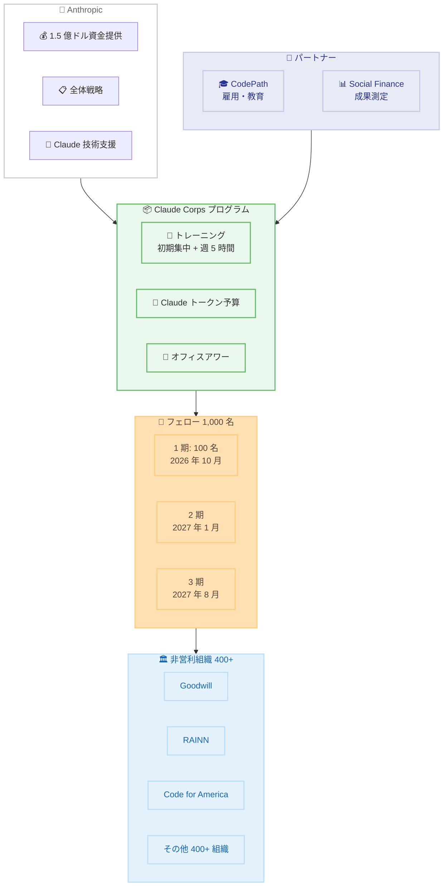

# Claude Corps - Anthropic の AI フェローシッププログラム

## メタデータ

| 項目 | 内容 |
|------|------|
| 発表日 | 2026-06-11 |
| ソース | Anthropic News |
| カテゴリ | 社会貢献・プログラム |
| 公式リンク | https://www.anthropic.com/news/claude-corps |

## 概要

Anthropic は 2026 年 6 月 11 日、全米規模の AI フェローシッププログラム「Claude Corps」を発表した。このプログラムは、キャリア初期の人材を非営利組織とマッチングし、AI を活用した社会課題の解決を支援するものである。Anthropic は本プログラムに 1 億 5,000 万ドル (約 150 億円) を投資し、12 か月間で 1,000 人のフェローを 400 以上の非営利組織に配置する計画を掲げている。

フェローには年俸 85,000 ドルと福利厚生が提供され、Claude を活用した非営利組織の業務改革を推進する。第 1 期の 100 名は 2026 年 10 月に活動を開始する予定である。

## 詳細

### 背景

AI 技術の急速な発展に伴い、その恩恵が社会全体に行き渡ることが重要な課題となっている。多くの非営利組織は AI の潜在的な活用可能性を認識しているものの、技術人材やリソースの不足により導入が進んでいない現状がある。同時に、キャリア初期の若手人材にとって AI スキルを実践的に習得する機会は限られている。

Claude Corps は、この 2 つの課題を同時に解決することを目指している。非営利組織には AI 活用を推進する人材とツールを提供し、フェローには実践的な AI スキルとキャリア形成の機会を提供する、双方向の価値創造モデルである。

### 主な変更点

**プログラム概要。**

- 12 か月間のフルタイム・対面型フェローシップ
- 全米 400 以上の非営利組織にフェローを配置
- 年俸 85,000 ドル + 福利厚生 (必要に応じて転居支援あり)
- 週 5 時間の継続的なトレーニング + 残りの時間はホスト組織での業務

**パートナー構成。**

- **Anthropic**: 資金提供、全体戦略の統括、Claude 技術の専門知識提供
- **CodePath**: フェローの雇用主として機能、プログラミング教育をリード (全米最大の大学向け CS 教育プロバイダー)
- **Social Finance**: 成果測定・評価を担当、スケーリングのための金融手段を構築

**スケジュール。**

| コホート | 開始時期 | 人数 | 応募締切 |
|----------|----------|------|----------|
| 第 1 期 | 2026 年 10 月 | 100 名 | 2026 年 7 月 17 日 |
| 第 2 期 | 2027 年 1 月 | 未公表 | ローリング応募 |
| 第 3 期 | 2027 年 8 月 | 未公表 | ローリング応募 |

**応募資格。**

- 18 歳以上
- フルタイムの職務経験が 2 年未満
- 特定の学歴要件なし
- 米国での就労資格を有すること
- Claude の活用に積極的であること
- 必要に応じて転居が可能であること

### 技術的な詳細

**フェロー向けトレーニング内容。**

- Anthropic と CodePath による集中的な初期トレーニング (Claude の非営利分野での活用方法)
- 週 5 時間の継続的なトレーニングプログラム
- Anthropic によるオフィスアワー (技術的な質問対応)
- 潤沢な Claude トークン予算の付与

**ホスト組織での活動。**

フェローは配置先の非営利組織で、Claude を活用した以下のような業務改革を推進する。

- 業務プロセスの自動化・効率化
- データ分析・レポート作成の高度化
- クライアント対応の改善
- 組織内部の AI リテラシー向上

**参加ホスト組織 (一部)。**

- Goodwill Industries International
- RAINN (性暴力被害者支援)
- Code for America (行政デジタル化)
- Year Up United (若者の就労支援)
- International Rescue Committee (難民支援)
- YMCA
- Braven (シカゴ、就職準備支援)
- Code the Dream (ダーラム、コーディング教育)
- Heartland Forward (ベントンビル、地方経済振興)
- Montgomery County Food Bank (食料支援)
- Team Red, White & Blue (退役軍人支援)
- REEF (海洋保全)

## 開発者への影響

### 対象

- 非営利組織で AI を活用したシステム構築に関心のある開発者
- Claude API を社会貢献プロジェクトに活用したい開発者
- オープンソースの AI インフラストラクチャに貢献したい開発者
- 非営利セクター向けの AI ソリューションを構築するスタートアップ

### 必要なアクション

**非営利組織の開発者向け。**

- Claude Corps のホスト組織として応募を検討し、AI 人材を受け入れる体制を整備する
- フェローと協力し、Claude API を活用した業務システムの構築を計画する
- 既存システムとの統合ポイントを事前に特定しておく

**一般開発者向け。**

- Anthropic がオープンソース化を予定しているプログラムの技術インフラに注目する
- 非営利組織向けの Claude API 活用事例やテンプレートの開発に貢献する
- 将来的な国際展開において、ローカライゼーションや技術支援に参画する機会を模索する

### 移行ガイド

本発表はフェローシッププログラムの開始であり、既存 API やツールの変更は含まれない。ただし、以下の点に留意する必要がある。

- Anthropic は本プログラムのコア技術とインフラストラクチャをオープンソース化する計画を発表している
- 国際展開を視野に入れた複製可能なモデルの構築が進められている
- 非営利組織向けの Claude 活用パターンが蓄積され、今後ベストプラクティスとして公開される可能性がある

## アーキテクチャ図

## 関連リンク

- [Claude Corps 公式ページ](https://www.anthropic.com/news/claude-corps)
- [Claude Corps 応募ページ](https://www.anthropic.com/claude-corps)
- [CodePath 公式サイト](https://www.codepath.org/)
- [Social Finance 公式サイト](https://socialfinance.org/)
- [Anthropic News](https://www.anthropic.com/news)

## まとめ

Claude Corps は、Anthropic が AI の社会的恩恵を最大化するために立ち上げた大規模なフェローシッププログラムである。1 億 5,000 万ドルという巨額の投資と、1,000 名のフェローを 400 以上の非営利組織に配置するという野心的な規模は、AI 企業による社会貢献の新たな形を示している。

開発者コミュニティにとっては、将来的なオープンソース化と国際展開の計画が特に注目に値する。非営利組織向けの AI 活用パターンが体系化され、再利用可能なインフラストラクチャとして公開されることで、社会課題解決に AI を活用する新たなエコシステムが形成される可能性がある。

第 1 期の応募は 2026 年 7 月 17 日に締め切られ、2026 年 10 月から活動が開始される。ホスト組織としての参加も随時受け付けている。
