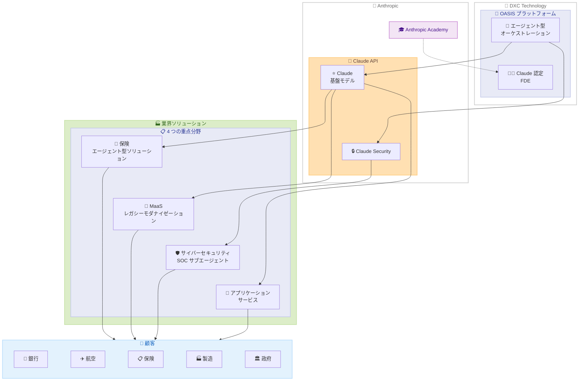

# DXC Technology と Anthropic の戦略的アライアンス

## メタデータ

| 項目 | 内容 |
|------|------|
| 発表日 | 2026-06-11 |
| ソース | Anthropic News |
| カテゴリ | パートナーシップ・エンタープライズ |
| 公式リンク | https://www.anthropic.com/news/dxc-anthropic-alliance |

## 概要

Anthropic と DXC Technology は、Claude をミッションクリティカルなエンタープライズシステムに統合するための複数年にわたるグローバル戦略的アライアンスを発表した。DXC は世界最大級の IT サービス企業 (従業員約 115,000 人、70 か国で事業展開) であり、Claude Partner Network に参加する。本アライアンスにより、数万人規模の Claude 認定フォワードデプロイドエンジニア (FDE) の育成、DXC の AI ネイティブプラットフォーム OASIS への Claude 統合、保険・モダナイゼーション・サイバーセキュリティ・アプリケーションサービスの 4 分野での展開が進められる。

## 詳細

### 背景

DXC Technology は 50 年以上にわたりミッションクリティカルなシステムを運用してきた実績を持つ、世界最大級の IT サービス企業である。銀行、航空会社、保険会社、製造業、政府機関など幅広い業界にサービスを提供している。

Anthropic は 2026 年 3 月に Claude Partner Network を立ち上げ、エンタープライズ向けのパートナーエコシステムを拡大してきた。DXC は自社のオペレーションで Claude を先行導入し、顧客と同等のセキュリティ・コンプライアンス要件の下で実証を完了した上で、今回のアライアンスに至った。

### 主な変更点

本アライアンスの主要な取り組みは以下の通りである。

1. **Claude Partner Network への参加**: DXC が正式にパートナーネットワークに加入
2. **FDE 認定プログラム**: 数万人規模の Claude 認定フォワードデプロイドエンジニアを Anthropic Academy を通じて育成
3. **OASIS プラットフォーム統合**: 2026 年 4 月にローンチした DXC の AI ネイティブオーケストレーションプラットフォームで Claude をデフォルトの基盤モデルとして採用
4. **4 つの重点分野での展開**: 保険、MaaS、サイバーセキュリティ、アプリケーションサービス

### 技術的な詳細

#### OASIS プラットフォーム

DXC の OASIS (AI ネイティブオーケストレーションプラットフォーム) は、マネージドサービス向けのエージェント型ワークフローを提供する。

- **デフォルト基盤モデル**: Claude がプラットフォームのエージェント型ワークフローを駆動
- **コード生成率**: プラットフォームのコードの 95% 以上が Claude により生成され、人間のエンジニアがレビュー
- **開発速度**: Claude により開発速度が推定 10 倍に加速
- **導入実績**: 50 社以上の DXC 顧客が利用中、グローバル展開を計画

#### 4 つの重点分野

1. **保険**: 各顧客のビジネスコンテキストと運用モデルに合わせたエージェント型ソリューションおよびコアシステムのモダナイゼーション
2. **Modernization as a Service (MaaS)**: Claude を使用してレガシーコードベースを分析・リファクタリング・モダナイズ
3. **サイバーセキュリティ**: Claude Security を基盤とした常時稼働のセキュリティエンジニアサブエージェントを DXC のセキュリティオペレーションセンター (SOC) に展開
4. **アプリケーションサービス**: OASIS エージェントが Claude をアプリケーション保守・管理環境に直接組み込み

#### FDE 認定プログラム

- DXC の既存開発チームからエンジニアを選抜
- Anthropic Academy を通じて認定
- DXC 独自のカリキュラム (ミッションクリティカルシステム運用に特化) を追加

## 開発者への影響

### 対象

- DXC の顧客企業の IT 部門およびエンジニアリングチーム
- エンタープライズ AI 統合を検討している大規模組織
- 保険、金融、航空、製造、政府機関の IT リーダー
- レガシーシステムのモダナイゼーションを計画している企業

### 必要なアクション

- **DXC 既存顧客**: OASIS プラットフォームへのアクセスと Claude 統合オプションについて DXC の担当者に確認
- **新規検討企業**: Claude Partner Network を通じた DXC のサービス提供について問い合わせ
- **開発者**: Anthropic Academy の認定プログラムや Claude API の活用方法を確認

### 移行ガイド

本アライアンスは新規パートナーシップの発表であり、既存 API やサービスの変更は含まれない。DXC の顧客は OASIS プラットフォームを通じて段階的に Claude を導入する形となる。

## アーキテクチャ図

## 関連リンク

- [DXC Technology と Anthropic の戦略的アライアンス (公式発表)](https://www.anthropic.com/news/dxc-anthropic-alliance)
- [Claude Partner Network](https://www.anthropic.com/news/claude-partner-network)
- [Anthropic パートナーハブ](https://www.anthropic.com/partners)
- [Claude API ドキュメント](https://docs.anthropic.com/)
- [DXC Technology 公式サイト](https://www.dxc.com/)

## まとめ

DXC Technology と Anthropic の戦略的アライアンスは、エンタープライズ AI 導入の新たなモデルを示している。DXC が自社オペレーションで Claude を先行導入し、OASIS プラットフォームのコードの 95% 以上を Claude で生成するなど、「自ら使って証明する」アプローチを取った点が特筆される。数万人規模の FDE 認定プログラム、10 倍の開発速度向上、50 社以上の顧客への展開実績は、大規模 IT サービス企業における AI 統合の具体的な成果を示している。保険、モダナイゼーション、サイバーセキュリティ、アプリケーションサービスの 4 分野に焦点を当て、銀行・航空・製造・政府機関など幅広い業界への展開が計画されており、Claude のエンタープライズ市場における存在感がさらに拡大することが期待される。
