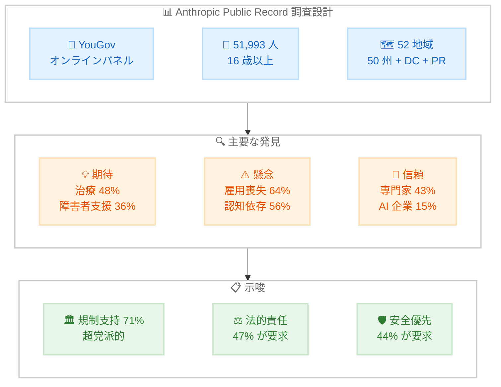

# Anthropic Public Record: 米国民の AI に対する意識調査の初回結果

## メタデータ

| 項目 | 内容 |
|------|------|
| 発表日 | 2026-06-12 |
| ソース | Anthropic News |
| カテゴリ | リサーチ / 公共政策 |
| 公式リンク | https://www.anthropic.com/news/anthropic-public-record |

## 概要

Anthropic は「Anthropic Public Record」と題する新たな調査シリーズの第 1 回結果を公開した。これは Anthropic が初めて一般市民 (AI ユーザー以外を含む) に直接意見を求めた取り組みであり、YouGov が 2025 年 11 月 1 日から 12 月 11 日にかけて米国在住の 16 歳以上 51,993 人を対象に実施した全国代表的オンライン調査である。50 州、ワシントン D.C.、プエルトリコをカバーし、全国レベルの誤差は 95% 信頼区間で +-0.6 ポイントという高精度な調査設計となっている。

調査の主な発見として、米国民は AI に対して「病気の治療」や「障害者支援」への期待を寄せる一方、「雇用喪失」(64%) を最大の懸念事項としており、この傾向は全 50 州で共通していた。また、AI 企業への信頼度はわずか 15% と全機関中最低であり、71% が政府による AI 規制を支持するという結果が示された。

## 詳細

### 背景

Anthropic はこれまで、Anthropic Interviewer や Economic Index といったツールを通じて AI の影響を研究してきたが、一般市民に直接声を聞く大規模調査は今回が初となる。AI 技術が急速に普及する中、開発者やパワーユーザーだけでなく、非ユーザーを含む幅広い層の意見を把握することが、責任ある AI 開発に不可欠であるという認識に基づいている。

### 調査方法

| 項目 | 内容 |
|------|------|
| 実施機関 | YouGov (オンラインパネル) |
| 調査期間 | 2025 年 11 月 1 日 - 12 月 11 日 |
| 回答者数 | 51,993 人 |
| 対象 | 米国在住 16 歳以上 |
| 対象地域 | 50 州 + ワシントン D.C. + プエルトリコ |
| 設計 | 52 の並行サンプル (各州約 1,000 人) |
| 割当 | 年齢、性別、学歴、人種/民族 |
| 全国誤差 | +-0.6 ポイント (95% 信頼区間) |
| 州別誤差 | +-2.6 ~ +-9.1 ポイント |

### 主な調査結果

#### AI への期待 (上位 3 つを選択)

| 期待する項目 | 割合 |
|------------|------|
| 病気の治療 (がん、アルツハイマーなど) | 48% |
| 障害を持つ人の支援 | 36% |
| 技術的進歩の推進 | 23% |
| 生活を全般的に便利にする | 23% |

#### AI への懸念 (5 段階の心配度スケールで 2 以上を「心配」と定義)

| 懸念事項 | 割合 |
|---------|------|
| AI による雇用喪失 | 64% |
| 認知的依存 (独立した思考力の低下) | 56% |
| 偽情報の拡散 | 52% |

**雇用喪失への懸念の特徴。**

- 全 50 州で第 1 位の懸念 (アイオワ州 71% からミシシッピ州 57% まで)
- 学歴が上がるほど心配度が上昇 (大学院卒は高卒以下より約 10 ポイント高い)
- 日常的に AI を使用する人: 54% vs 非ユーザー: 70%
- 民主党支持者: 67% vs 共和党支持者: 62%

**認知的依存への懸念。**

- 56% が心配と回答するが、そのうち AI が消えた場合に大きな影響を感じるのは約 1/5 のみ
- 教育者は最も懸念が高い職業の 1 つ (芸術/デザイン関係者に次ぐ)
- 日常的に AI を使用する人: 46% vs 非ユーザー: 62%

**ミスアライメントよりミスユースへの懸念。**

米国民は AI が「暴走」するリスクよりも、犯罪利用、監視、テロリズムなど AI の悪用に対してより強い懸念を示した。

#### AI の能力に対する認識

| タスク | AI が人間と同等以上と回答 |
|-------|------------------------|
| リサーチ | 75% (最高) |
| サービス/サポート | 44% (最低) |

大半のタスクについて、過半数は自分の仕事に AI が関与することを望まないと回答した。

#### 「統合ユーザー」(全米のわずか 6%)

仕事と私生活の両方で毎日 AI を使用する層 (n=2,717) の特徴。

- 若年、男性、都市部、被雇用者、大卒が多い
- 約 2/3 がテクノロジーの実験者/アーリーアダプターと自認 (一般は 30%)
- すべての懸念項目で心配度が低い
- 政府の関与への支持率は一般とほぼ同等 (74% vs 71%)
- AI 企業を含むすべての機関への信頼度が相対的に高い

### 信頼度

| 機関 | 信頼度 |
|------|-------|
| 独立した専門家 | 43% (最高) |
| 連邦政府 | 20% |
| 国際機関 | 20% |
| 州/地方政府 | 19% |
| AI 企業 | 15% (最低) |

### 規制と統治に対する意見

**政府の関与への支持 (71%、全州で過半数)。**

- 民主党支持者: 79%
- 共和党支持者: 68%
- 無党派: 69%
- 最高: ワシントン D.C. (81%)、最低: ハワイ (63%)

**政府の行動が求められる分野。**

| 分野 | 政府の積極的関与を求める割合 |
|------|--------------------------|
| プライバシー保護 | 56% |
| 子供の安全 | 52% |
| 被害に対する法的責任 | 49% |

**産業界に求めるアクション (上位 3 つを選択)。**

| アクション | 割合 |
|-----------|------|
| AI 企業に被害の法的責任を負わせる | 47% |
| 成長よりも安全性を優先する | 44% |
| 実権を持つ独立監視機関の設置 | 29% |
| 安全のために AI 開発を減速する | 27% |

### 党派間・地域間の分断について

調査の重要な発見の 1 つとして、AI は典型的な党派的、地理的、学歴的な分断線に沿って米国民を大きく分けることはなかったことが挙げられる。意見の相違は主に「程度」の問題にとどまり、広範なコンセンサスが存在した。国家安全保障については民主党と共和党の差はわずか 3 ポイントであった。

## 開発者・業界への影響

### 信頼の欠如が示す課題

AI 企業への信頼度がわずか 15% という結果は、業界全体に対する深刻な警告である。技術的な優秀さだけでは市民の支持は得られず、透明性、説明責任、安全への投資が不可欠であることを示している。

### 規制環境への示唆

71% が政府規制を支持し、これが超党派的なコンセンサスであることは、AI 規制法の制定に向けた強い追い風となる。特にプライバシー (56%)、子供の安全 (52%)、法的責任 (49%) の 3 分野では具体的な立法が期待される。

### 製品開発への示唆

- ユーザーはリサーチ能力 (75%) を最も高く評価しており、この分野は AI 導入の入口となりうる
- 雇用喪失への懸念が最大であるため、「人間の代替」ではなく「人間の拡張」としてのポジショニングが重要
- 認知的依存への懸念に対しては、AI の利用状況の可視化や自律的思考を促す設計が求められる

### 縦断調査としての価値

この調査は将来的な態度変化を追跡するベースラインとして設計されており、AI の能力向上と普及に伴う市民意識の変遷を定量的に把握するための基盤となる。米国外への拡大も計画されている。

## アーキテクチャ図

## 関連リンク

- [Anthropic Public Record (公式発表)](https://www.anthropic.com/news/anthropic-public-record)
- [Anthropic Research](https://www.anthropic.com/research)
- [Anthropic News](https://www.anthropic.com/news)

## まとめ

Anthropic Public Record の第 1 回調査は、AI に対する米国民の意識を包括的に明らかにした。51,993 人という大規模サンプルにより、州レベルまでの詳細な分析が可能となっている。

最も注目すべき発見は、AI に対する懸念が党派や地域を超えた広範なコンセンサスであることと、AI 企業への信頼度が全機関中最低の 15% にとどまることである。市民は AI の恩恵を認識しつつも、雇用喪失 (64%)、認知的依存 (56%)、偽情報 (52%) といった具体的リスクに強い警戒感を持っている。

政府規制への支持 (71%) は超党派的であり、特にプライバシー、子供の安全、法的責任の 3 分野で積極的な政府介入が期待されている。AI 開発企業にとっては、透明性の確保と安全性への投資が社会的信頼の回復に不可欠であることを示す重要なデータとなった。

この調査は縦断的に継続される予定であり、今後の AI 技術の進化に伴う市民意識の変化を追跡する貴重なベースラインとなる。
