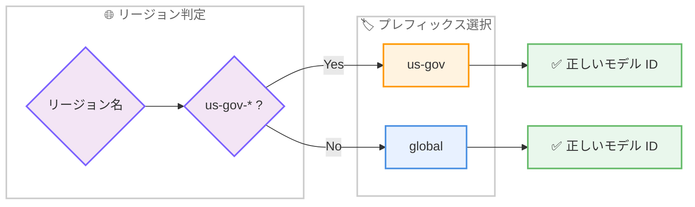

# Claude Code v2.1.173 / v2.1.174: モデルピッカー改善、GovCloud 対応修正、使用量アトリビューション追加

## メタデータ

| 項目 | 内容 |
|------|------|
| 発表日 | 2026-06-12 |
| ソース | Claude Code Changelog |
| カテゴリ | Claude Code アップデート |
| 公式リンク | https://github.com/anthropics/claude-code/blob/main/CHANGELOG.md |

## 概要

Claude Code v2.1.173 および v2.1.174 が 2026 年 6 月 12 日にリリースされた。v2.1.170 で追加された Claude Fable 5 統合に関する複数の不具合修正を中心に、`/model` ピッカーの表示ロジック改善、Bedrock GovCloud リージョンでの推論プロファイルプレフィックス修正、バックグラウンドセッションの環境変数分離、VS Code での使用量アトリビューション機能追加など、合計 15 項目の変更が含まれている。特に Bedrock GovCloud ユーザーにとっては、モデル ID 導出時に `global` ではなく正しい `us-gov` プレフィックスが使用されるようになった重要な修正である。

## 詳細

### 背景

v2.1.170 で Claude Fable 5 および Mythos 5 への対応が追加されたが、その後のユーザーフィードバックにより、Fable 5 のモデル名正規化、使用量クレジットバナーの誤表示、`/model` ピッカーでのモデルファミリ表示の不整合など、複数の統合上の問題が明らかになった。v2.1.173 と v2.1.174 はこれらの問題を迅速に解消するためのフォローアップリリースである。

また、Bedrock GovCloud リージョン (`us-gov-*`) での推論プロファイルプレフィックス誤導出は、政府機関や規制環境で Claude Code を利用するユーザーにとって深刻な障害となっていた 400 エラーの原因であり、本リリースで修正された。

### 主な変更点

#### v2.1.174: 新機能

##### 1. マウスホイールスクロール加速の無効化設定

`wheelScrollAccelerationEnabled` 設定が追加され、フルスクリーンモードでのマウスホイールスクロール加速を無効化できるようになった。高速スクロール時に意図しない位置まで飛んでしまう問題を回避できる。

##### 2. VS Code: 使用量アトリビューションダイアログ

VS Code 拡張機能の Account & usage ダイアログ (`/usage`) に詳細な使用量アトリビューションが追加された。以下の情報が過去 24 時間または 7 日間の期間で表示される。

- キャッシュミス
- ロングコンテキスト使用量
- サブエージェント使用量
- スキル/エージェント/プラグイン/MCP ごとの内訳

#### v2.1.174: バグ修正

##### モデルピッカーの改善

- **モデルファミリの表示修正**: `/model` ピッカーが Default の解決先モデルファミリを非表示にしていた問題を修正。Opus が Max/Team Premium/Enterprise プランで、Sonnet が Pro/Team プランで、Opus が従量課金 API アカウントでそれぞれ独立した行として表示されるようになった
- **Sonnet バージョンラベルのハードコード修正**: `ANTHROPIC_DEFAULT_SONNET_MODEL` で別の Sonnet を指定している場合に、`/model` ピッカーがハードコードされた Sonnet バージョンラベルを表示していた問題を修正

##### Fable 5 関連

- **使用量クレジットバナーの誤表示**: 「Fable 5 is now consuming usage credits」バナーが、使用量ベース課金のエンタープライズアカウントに対して誤って表示されていた問題を修正

##### Bedrock GovCloud

- **推論プロファイルプレフィックスの修正**: Bedrock GovCloud リージョン (`us-gov-*`) で推論プロファイルプレフィックスが `us-gov` ではなく `global` として導出されていた問題を修正。これにより、導出されたモデル ID で 400 エラーが発生していた

##### バックグラウンドセッション

- **環境変数の分離**: バックグラウンドセッションが、バックグラウンドデーモンを起動したシェルの `ANTHROPIC_*` プロバイダ環境変数 (ゲートウェイ URL、カスタムヘッダー、`/model` エイリアス) を継承してしまう問題を修正
- **プレウォームワーカーの認証エラー**: プレウォームされたバックグラウンドワーカーがアイドル状態の後に使用された際、「Could not resolve authentication method」エラーで失敗する問題を修正

##### パフォーマンスと安定性

- **終了時の 1-2 秒の停止**: macOS および Linux で、シェルコマンドが中断またはキルされた直後に Claude Code を終了すると 1-2 秒間停止する問題を修正
- **git commit の共著者名修正**: 一部のモデルで git commit の共著者アトリビューションに誤ったモデル名が表示される問題を修正

##### スキルとワークフロー

- **スキルホットリロードの最適化**: スキルのホットリロード時に、変更された 1 つのスキルだけでなくスキル一覧全体が再送信されていた問題を修正。変更されたスキルのみが再アナウンスされるようになった
- **サブエージェントのアトリビューションヘッダー**: Workflow ツールの `agent()` サブエージェントにエージェントごとのアトリビューションヘッダーが欠落していた問題を修正

##### アドバイザー

- **保存済みアドバイザーモデルの事前選択**: `/advisor` ダイアログが `availableModels` 許可リストでブロックされている保存済みアドバイザーモデルを事前選択してしまう問題を修正

#### v2.1.173: バグ修正

##### Fable 5 モデル名の正規化

- **`[1m]` サフィックスの自動除去**: Fable 5 モデル名に `[1m]` サフィックスが付いている場合に正規化されない問題を修正。Fable 5 はデフォルトで 1M コンテキストを含むため、サフィックスは自動的に除去されるようになった

##### Windows 環境

- **サンドボックス依存関係の警告**: Windows でサンドボックスが設定で有効化されている場合に、起動時に不要な「sandbox dependencies missing」警告が表示される問題を修正

### 技術的な詳細

#### Bedrock GovCloud 推論プロファイルの修正

AWS GovCloud リージョンでは、推論プロファイルのプレフィックスが通常の `global` ではなく `us-gov` である必要がある。v2.1.174 以前では、リージョン名から推論プロファイルプレフィックスを導出するロジックが GovCloud リージョンのパターン (`us-gov-west-1`、`us-gov-east-1`) を考慮しておらず、常に `global` プレフィックスを使用していた。



#### バックグラウンドセッションの環境変数分離

バックグラウンドデーモンはシェルから起動されるため、起動時のシェル環境変数を保持する。しかし、バックグラウンドセッションが別のコンテキスト (異なるプロジェクト、異なるプロバイダ設定) で実行される場合、デーモン起動元の `ANTHROPIC_*` 環境変数が継承されるのは不適切である。v2.1.174 では、各バックグラウンドセッションが独自の環境変数スコープを持ち、起動元シェルの `ANTHROPIC_*` 変数を継承しないよう修正された。

#### Fable 5 モデル名正規化

Fable 5 は 1M コンテキストがデフォルトで有効なモデルであるため、`[1m]` サフィックスは冗長である。v2.1.173 以前では、ユーザーや設定が `fable-5[1m]` のような名前を使用した場合にモデル解決が失敗する可能性があった。v2.1.173 ではモデル名パーサーが `[1m]` サフィックスを自動的に除去し、正しいモデル ID に解決するようになった。

## 開発者への影響

### 対象

- Claude Code を利用する全ての開発者
- Amazon Bedrock GovCloud リージョンで Claude Code を利用している政府機関・規制環境のユーザー
- バックグラウンドセッションを活用しているチーム
- Claude Fable 5 を利用しているユーザー
- `ANTHROPIC_DEFAULT_SONNET_MODEL` を設定しているユーザー
- VS Code 拡張機能で Claude Code を利用しているユーザー
- エンタープライズプランで使用量ベース課金を利用しているユーザー
- Windows 環境のユーザー

### 必要なアクション

1. **Claude Code のアップデート**: `claude update` で v2.1.174 に更新
2. **Bedrock GovCloud ユーザー**: アップデート後にモデル呼び出しが正常に動作することを確認。これまで 400 エラーが発生していた場合は自動的に解消される
3. **バックグラウンドセッション利用者**: デーモンを再起動して環境変数分離の修正を適用。`ANTHROPIC_*` 環境変数が正しく反映されていることを確認
4. **Fable 5 利用者**: `[1m]` サフィックス付きのモデル名を設定で使用している場合、サフィックスの除去が自動的に行われるため特別な対応は不要
5. **VS Code ユーザー**: `/usage` コマンドで新しい使用量アトリビューション機能を確認

### 移行ガイド

本リリースには破壊的変更は含まれていない。全ての変更は後方互換性を維持している。

#### GovCloud 環境での確認

```bash
# Claude Code をアップデート
claude update

# GovCloud リージョンが正しく設定されていることを確認
echo $AWS_REGION
# 出力例: us-gov-west-1

# Claude Code を起動して正常にモデルが呼び出されることを確認
claude "hello"
```

#### wheelScrollAccelerationEnabled の設定

```json
{
  "wheelScrollAccelerationEnabled": false
}
```

フルスクリーンモードでマウスホイールスクロールの加速が不要な場合に `false` を設定する。

## コード例

### バックグラウンドセッションの環境変数確認

```bash
# バックグラウンドセッションの起動
claude --background "テストタスクを実行"

# 環境変数が正しく分離されていることを確認
# v2.1.174 以降、バックグラウンドセッションは起動元シェルの
# ANTHROPIC_* 変数を継承しない

# カスタムゲートウェイを使用している場合の確認
export ANTHROPIC_GATEWAY_URL="https://custom-gateway.example.com"
claude --background "このセッションにはゲートウェイ設定が継承されない"
```

### VS Code 使用量アトリビューションの確認

```
# VS Code 内の Claude Code で実行
/usage

# 表示される情報:
# - キャッシュミス率
# - ロングコンテキスト使用量
# - サブエージェント使用量
# - スキル/エージェント/プラグイン/MCP ごとの内訳
# - 期間: 過去 24 時間 / 7 日間
```

## 関連リンク

- [Claude Code Changelog](https://github.com/anthropics/claude-code/blob/main/CHANGELOG.md)
- [Claude Code ドキュメント](https://docs.anthropic.com/en/docs/claude-code)
- [Claude Code GitHub リポジトリ](https://github.com/anthropics/claude-code)
- [v2.1.172 リリースレポート](./2026-06-11-claude-code-v2-1-172.md)
- [v2.1.170 リリースレポート (Fable 5 対応)](./2026-06-09-claude-code-v2-1-170.md)
- [AWS GovCloud リージョン](https://docs.aws.amazon.com/govcloud-us/latest/UserGuide/using-govcloud.html)

## まとめ

Claude Code v2.1.173 および v2.1.174 は、v2.1.170 での Claude Fable 5 統合後に発覚した複数の問題を迅速に修正するフォローアップリリースである。計 15 項目の変更のうち、新機能 2 件、バグ修正 13 件が含まれる。特に重要な修正として、Bedrock GovCloud リージョンでの推論プロファイルプレフィックス誤導出 (400 エラーの原因)、バックグラウンドセッションの環境変数汚染、`/model` ピッカーでのモデルファミリ表示の不整合が挙げられる。VS Code では使用量アトリビューション機能が追加され、スキル・エージェント・プラグイン・MCP ごとの詳細な使用量内訳を確認できるようになった。全ユーザーに対して `claude update` による即座の更新を推奨する。
