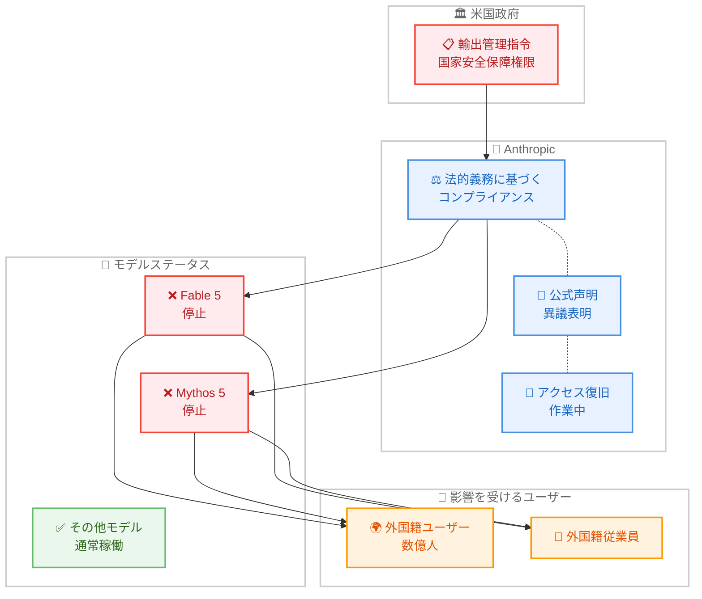

# 米国政府の指令による Fable 5 / Mythos 5 アクセス停止に関する Anthropic の声明

## メタデータ

| 項目 | 内容 |
|------|------|
| 発表日 | 2026-06-12 |
| ソース | Anthropic News |
| カテゴリ | 公式声明 / 規制対応 |
| 公式リンク | https://www.anthropic.com/news/fable-mythos-access |

## 概要

2026 年 6 月 12 日午後 5 時 21 分 (米国東部時間)、Anthropic は米国政府から国家安全保障上の権限に基づく輸出管理指令を受領した。この指令は、Fable 5 および Mythos 5 へのアクセスを、米国内外を問わずすべての外国籍者 (Anthropic の外国籍従業員を含む) に対して停止することを要求するものである。Anthropic は法的義務として指令に従いアクセスを停止したが、その根拠と比例性について公に異議を唱えている。数億人のユーザーが影響を受けている。

## 詳細

### 背景

Anthropic は 2026 年 6 月 9 日に Fable 5 および Mythos 5 をリリースし、わずか 3 日後に米国政府から前例のない輸出管理指令を受領した。政府の懸念は Fable 5 に対する潜在的なジェイルブレイク手法の発見に関連しているとみられるが、指令の文書には国家安全保障上の懸念の具体的な詳細は記載されていなかった。

政府は Anthropic に対し、ジェイルブレイクの証拠を口頭でのみ提供した。これは AI モデルの安全性評価に関する通常のプロセスとは大きく異なる対応である。

### 主な変更点

以下の措置が即時に実施された。

- **Fable 5 へのアクセス停止**: すべてのユーザーに対して即時停止
- **Mythos 5 へのアクセス停止**: すべてのユーザーに対して即時停止
- **その他のモデルは影響なし**: Anthropic の他のすべてのモデル (Opus 4.8、Sonnet 4.6、Haiku 4.5 など) は通常通り利用可能
- **30 日間のデータ保持ポリシー**: Mythos クラスのモデルに対して顧客データの 30 日間保持が実施されている

### 技術的な詳細

#### 問題とされるジェイルブレイクの内容

政府が指摘したジェイルブレイク手法は以下の特徴を持つ。

- **手法**: モデルに特定のコードベースを読み込ませ、ソフトウェアの欠陥を修正するよう依頼する
- **範囲**: 狭域的 (narrow) かつ非普遍的 (non-universal) であり、モデルのセーフガードを広範に回避するものではない
- **結果**: 少数の既知かつ軽微な脆弱性を特定するのみ
- **再現性**: OpenAI の GPT-5.5 を含む他の公開モデルでも同じ脆弱性を発見可能

#### Anthropic の安全対策 (多層防御戦略)

Anthropic は Fable 5 に対して以下の多層防御 (defense in depth) 戦略を採用している。

1. **ジェイルブレイクの困難化**: ジェイルブレイクを狭域的 (非普遍的) にするか、普遍的なものの作成コストを極めて高くする
2. **監視体制**: 成功した攻撃を検出・遮断するための徹底的な監視
3. **レッドチーミング**: リリース前に米国政府、英国 AISI、民間組織、社内チームによる数千時間のテストを実施
4. **検証結果**: デプロイ前に普遍的なジェイルブレイクは発見されなかった

#### Fable 5 のセーフガード性能

Anthropic は Fable 5 のセーフガードを「これまでにデプロイされたどのモデルよりも大幅に効果的」と評価している。

### Anthropic の立場

Anthropic は以下の点について明確に異議を唱えている。

1. **比例性の欠如**: 狭域的なジェイルブレイクの発見が、数億人に提供されている商用モデルの回収を正当化する根拠にはならない
2. **業界への波及効果**: この基準が業界全体に適用されれば「すべてのフロンティアモデルプロバイダーのすべての新規モデルデプロイメントが事実上停止する」
3. **プロセスの不透明性**: 透明性、公正性、明確性、技術的事実に基づく法定プロセスの欠如
4. **技術的根拠の薄弱さ**: 口頭での証拠のみで、有害な結果につながる懸念すべき非普遍的ジェイルブレイクの開示すら受けていない

## 開発者への影響

### 対象

- Fable 5 API を利用しているすべての開発者およびアプリケーション
- Mythos 5 API を利用しているすべての開発者およびアプリケーション
- 上記モデルに依存するサービスを利用しているエンドユーザー (数億人規模)

### 必要なアクション

以下の対応が必要である。

- **即時対応**: Fable 5 / Mythos 5 に依存するワークロードを、Opus 4.8 や Sonnet 4.6 など他の Anthropic モデルに切り替える
- **データ保持の確認**: Mythos クラスモデルに送信したデータが 30 日間保持されることを認識する
- **続報の確認**: Anthropic は 24 時間以内に追加情報を提供すると発表しており、公式アナウンスを注視する

### 移行ガイド

現時点で Anthropic はアクセス復旧に向けて作業中であり、停止は一時的なものとされている。代替モデルへの移行は以下の優先順位で検討可能である。

1. **Opus 4.8**: 最も高い推論能力を持つ代替モデル
2. **Sonnet 4.6**: コストパフォーマンスに優れた代替
3. **他プロバイダーのモデル**: 一時的な代替としての検討

## アーキテクチャ図

## 関連リンク

- [Anthropic 公式声明](https://www.anthropic.com/news/fable-mythos-access)
- [Fable 5 / Mythos 5 リリース発表](https://www.anthropic.com/news/claude-fable-5-mythos-5)

## まとめ

今回の事態は、AI モデルの安全性と国家安全保障の間の緊張関係を浮き彫りにする前例のない出来事である。Anthropic は法的義務に従いつつも、以下の点を強く主張している。

- 狭域的かつ非普遍的なジェイルブレイクの発見は、数億人が利用するモデルの停止を正当化しない
- 同様の能力は他の公開モデルでも利用可能であり、Fable 5 固有の問題ではない
- AI モデルの安全性評価には、透明性があり技術的事実に基づいた法定プロセスが必要である

Anthropic はアクセスの早期復旧に向けて作業を進めており、24 時間以内に追加情報を提供する予定である。開発者は続報を注視しつつ、必要に応じて他のモデルへの一時的な移行を検討すべきである。
