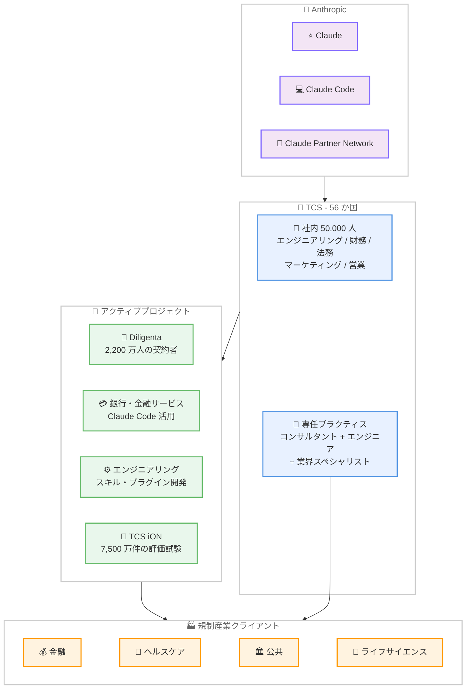

# TCS と Anthropic の戦略的パートナーシップ: 56 か国 50,000 人規模で Claude を展開

## メタデータ

| 項目 | 内容 |
|------|------|
| 発表日 | 2026-06-12 |
| ソース | Anthropic News |
| カテゴリ | パートナーシップ / エンタープライズ |
| 公式リンク | [TCS and Anthropic Partnership](https://www.anthropic.com/news/tcs-anthropic-partnership) |

## 概要

Tata Consultancy Services (TCS) と Anthropic は戦略的パートナーシップを発表した。本提携は 3 つの柱で構成される。TCS が自社の 50,000 人の従業員に Claude を展開すること、規制産業向けの Claude 搭載製品をクライアント向けに構築すること、そして TCS が Claude Partner Network に参加することである。

本パートナーシップにより、金融サービス、ヘルスケア、公共セクター、ライフサイエンス、航空、通信、医療技術など、高い精度と監査可能性が求められる規制産業において、Claude のエンタープライズ展開が大幅に加速する見込みである。

## 詳細

### 背景

Anthropic はインドを「第 2 位の市場」と位置づけており、TCS との提携はこの地域へのコミットメントをさらに深めるものである。TCS は 56 か国にグローバル展開する IT サービス大手であり、規制産業におけるコンプライアンス専門知識とグローバルリーチを活かして、Claude を数千のエンタープライズに届ける役割を担う。

### パートナーシップの 3 つの柱

1. **内部展開 (Customer Zero)**: TCS は自社のエンジニアリング、財務、法務、マーケティング、営業チームに Claude を展開し、その知見を外部クライアント向けソリューションに反映する
2. **クライアント向け製品構築**: 規制産業向けの業界特化型 Claude 搭載ソリューションを開発・提供する
3. **Claude Partner Network 参加**: コンサルタント、エンジニア、業界スペシャリストを組み合わせた専任プラクティスを構築する

### アクティブプロジェクト

以下のプロジェクトが既に進行中である。

- **Diligenta (TCS の英国生命保険・年金事業)**: 2,200 万人以上の契約者に対する顧客体験を Claude で改善
- **銀行・金融サービスプロダクトチーム**: Claude Code を活用してソフトウェアエンジニアリングと IT オペレーションの生産性を向上
- **エンジニアリングチーム**: Claude Code エコシステム向けの再利用可能なスキルとプラグインを開発 (保険金査定、融資アドバイザリー)
- **TCS iON**: インド全土 1,500 都市で年間 7,500 万件以上の評価試験を実施するプラットフォームで Claude のトレーニングと認定を提供

### 技術的な詳細

TCS は Claude を業界特化型のオファリングとしてパッケージ化する方針である。具体的には以下の分野での活用が想定される。

- **保険**: 保険金査定 (claims adjudication) の自動化・効率化
- **銀行**: 融資アドバイザリー (lending advisory) の高度化
- **ライフサイエンス / 医療技術**: 高精度が求められる文書処理と分析
- **公共セクター**: 監査可能性を担保した AI 活用

Claude Code のエコシステムに対しては、業界固有の再利用可能なスキルとプラグインを追加し、開発者が規制産業向けアプリケーションを迅速に構築できる環境を整備する。

## ビジネスインパクト

### 対象

- 規制産業 (金融、ヘルスケア、公共、ライフサイエンス、航空、通信、医療技術) で AI 導入を検討するエンタープライズ
- TCS のグローバルクライアント企業
- Claude Code を活用するソフトウェアエンジニアリングチーム
- インド市場での AI 導入を検討する組織

### スケールと市場影響

- **グローバル展開**: 56 か国、50,000 人の TCS 社員が Claude を利用し、その知見をクライアントに還元
- **インド市場**: Anthropic の第 2 位市場としてのインドにおけるプレゼンスを強化
- **規制産業への浸透**: TCS の規制コンプライアンス専門知識により、これまで AI 導入が困難だった領域へのアクセスを実現
- **マネージドサービス**: TCS がソリューションの実装から運用までを一貫して提供

## エグゼクティブコメント

**K. Krithivasan (CEO & MD, TCS)**:

> Enterprise AI value comes from understanding business context, orchestrating complex systems, and applying deep AI engineering talent

エンタープライズ AI の価値はビジネスコンテキストの理解、複雑なシステムのオーケストレーション、そして深い AI エンジニアリング人材の活用から生まれると述べた。

**Dario Amodei (Co-founder & CEO, Anthropic)**:

> We built Claude to be safe, trusted, and helpful, particularly in contexts where accuracy matters most.

Claude を安全で信頼でき、特に精度が最も重要な場面で有用なものとして構築したと述べ、インドを Anthropic の「第 2 位の市場」と明言した。

## アーキテクチャ図

## 関連リンク

- [TCS and Anthropic Partnership 公式発表](https://www.anthropic.com/news/tcs-anthropic-partnership)
- [Claude Partner Network](https://www.anthropic.com/partners)
- [DXC Technology and Anthropic Alliance](https://www.anthropic.com/news/dxc-anthropic-alliance) - 同時期に発表された類似パートナーシップ

## まとめ

TCS と Anthropic のパートナーシップは、Claude のエンタープライズ展開における大きなマイルストーンである。TCS が「Customer Zero」として自社 50,000 人に Claude を展開し、その知見を規制産業のクライアントに還元するモデルは、AI の大規模エンタープライズ導入における実践的なアプローチを示している。

特に注目すべきは、Anthropic が Dario Amodei CEO 自らインドを「第 2 位の市場」と明言した点であり、TCS iON を通じた 1,500 都市での認定プログラム展開は、インドにおける Claude エコシステムの基盤構築を加速させるものである。DXC Technology との提携と合わせ、Anthropic が規制産業向けパートナーエコシステムの構築を急速に進めていることが明確になった。
