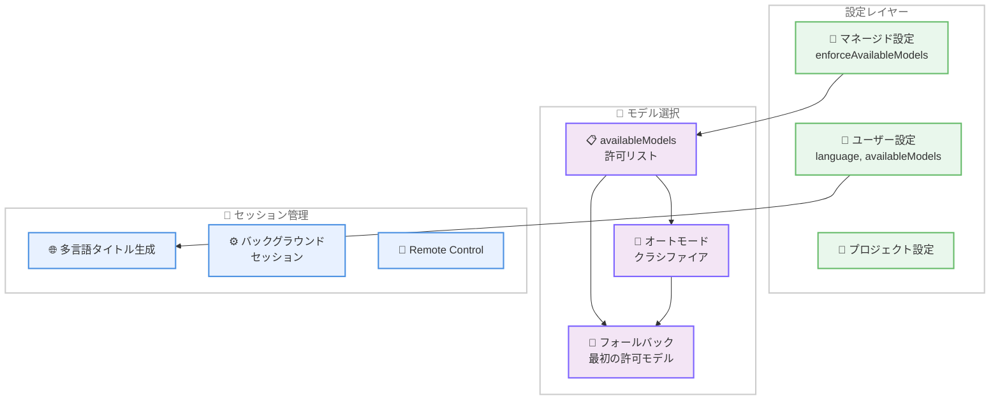

# Claude Code v2.1.175 / v2.1.176 アップデート: セッション多言語対応とモデル制御の強化

## メタデータ

| 項目 | 内容 |
|------|------|
| 発表日 | 2026-06-13 |
| ソース | Claude Code Changelog |
| カテゴリ | Claude Code アップデート |
| 公式リンク | https://github.com/anthropics/claude-code/blob/main/CHANGELOG.md |

## 概要

Claude Code v2.1.175 および v2.1.176 がリリースされた。v2.1.175 ではエンタープライズ管理者向けの `enforceAvailableModels` 設定が追加され、v2.1.176 ではセッションタイトルの多言語対応、Bedrock 認証キャッシュの改善、モデルアクセス制御の強化、そしてバックグラウンドセッションや Remote Control に関する多数のバグ修正が行われた。

## 詳細

### 背景

Claude Code は CLI ベースの AI 開発アシスタントとして、ローカル環境やリモート環境で利用されている。エンタープライズでの利用拡大に伴い、組織レベルでのモデルアクセス制御やマルチリージョン対応の重要性が増している。今回のリリースでは、管理者が許可するモデルを厳密に制御する機能と、国際的なチームが自然に利用できる多言語対応が強化された。

### 主な変更点

#### v2.1.176 の新機能

1. **セッションタイトルの多言語生成**: セッションタイトルが会話で使用している言語で自動生成されるようになった。`language` 設定で特定の言語を固定することも可能。

2. **`footerLinksRegexes` 設定**: フッター行に正規表現でマッチしたリンクバッジを表示する新しい設定が追加された。ユーザー設定またはマネージド設定で構成可能。

3. **Bedrock 認証キャッシュの改善**: `awsCredentialExport` から取得した認証情報が、固定 1 時間ではなく `Expiration` フィールドの有効期限までキャッシュされるようになった。

4. **`availableModels` 制御の強化**: エイリアスモデルの選択が `ANTHROPIC_DEFAULT_*_MODEL` 環境変数経由でブロック対象のモデルにリダイレクトされることがなくなった。`/fast` コマンドもブロック対象モデルへの切り替えを拒否する。

#### v2.1.175 の新機能

1. **`enforceAvailableModels` マネージド設定**: 有効にすると `availableModels` のホワイトリストがデフォルトモデルにも適用される。許可されていないモデルがデフォルトに設定されている場合、ホワイトリストの最初のモデルにフォールバックする。ユーザーやプロジェクト設定ではマネージドリストを拡張できなくなる。

#### v2.1.176 のバグ修正

以下の問題が修正された。

- Fable 5 のオートモード: Opus 4.8 が有効でない組織で失敗していた問題を修正。クラシファイアが利用可能な最適の Opus モデルにフォールバックするようになった
- Hook の `if` 条件: Read/Edit/Write ツールパスのパターンマッチが正しく動作するよう修正
- Linux サンドボックス: `.claude/settings.json` が絶対パスのシンボリックリンクの場合に失敗する問題を修正
- `/copy` とマウス選択コピー: tmux over SSH 環境でシステムクリップボードに到達しない問題を修正
- Remote Control: Web/モバイルから接続時にセッションのモデルが無断で切り替わる問題を修正
- Remote Control: 切断通知に数値コードのみが表示されていた問題を修正し、人間が読める理由を表示
- `/cd` とワークツリー移動: セッションが移動前のディレクトリの git ブランチを報告し続ける問題を修正
- `claude agents`: 1 つのウィンドウで戻る操作をすると他のウィンドウがデタッチされる問題を修正
- バックグラウンドセッション: `/bg` 実行時に残作業がない場合に「Working」表示が永続する問題を修正
- バックグラウンドエージェント: PR URL による検索の問題を修正
- `claude --bg -cn <name>`: セッション名がシードされない問題を修正
- バックグラウンドセッション: Windows ネットワークパスのパーシスト状態を無害化
- バックグラウンドセッション: バージョンスキュー時のガイダンスをより明確に表示

### 技術的な詳細

#### enforceAvailableModels の動作

`enforceAvailableModels` はマネージド設定として管理者が組織レベルで設定する。有効化された場合の動作は以下の通り。

- `availableModels` で指定されたモデルのみが使用可能
- デフォルトモデルが許可リスト外の場合、リストの最初のモデルにフォールバック
- ユーザー設定やプロジェクト設定で許可リストを拡張することは不可

#### Bedrock 認証キャッシュの仕組み

従来は `awsCredentialExport` で取得した認証情報を一律 1 時間でキャッシュしていたが、v2.1.176 では認証情報に含まれる `Expiration` フィールドを参照し、実際の有効期限までキャッシュする。これにより、短期トークンは早期に更新され、長期トークンは不要な再取得が避けられる。

#### Fable 5 オートモードのフォールバック

Fable 5 のオートモードでは内部クラシファイアがタスクの複雑さに応じてモデルを選択する。従来は Opus 4.8 の利用を前提としていたが、組織で Opus 4.8 が有効でない場合に失敗していた。修正後は利用可能な最適の Opus モデル (例: Opus 4.6) にフォールバックする。

## 開発者への影響

### 対象

- Claude Code を利用するすべての開発者
- エンタープライズ環境で Claude Code を管理する IT 管理者
- AWS Bedrock 経由で Claude Code を利用するチーム
- 国際的な開発チーム
- バックグラウンドセッションや Remote Control を活用するリモートワーカー

### 必要なアクション

1. **一般ユーザー**: Claude Code を最新バージョンに更新することで、全修正が自動的に適用される

2. **多言語チーム**: セッションタイトルの言語を固定したい場合は `language` 設定を構成する

3. **エンタープライズ管理者**: モデルアクセスを厳密に制御したい場合は `enforceAvailableModels` を有効にし、`availableModels` リストを適切に設定する

4. **Bedrock ユーザー**: 認証キャッシュの改善は自動的に適用されるため、追加のアクションは不要

### 移行ガイド (該当する場合)

特別な移行作業は不要。アップデートを適用するだけで全ての変更が反映される。ただし、`ANTHROPIC_DEFAULT_*_MODEL` 環境変数でブロック対象モデルを指定していた場合、v2.1.176 以降はその設定が無視されるため、環境変数の見直しを推奨する。

## コード例

```json
{
  "language": "ja",
  "enforceAvailableModels": true,
  "availableModels": [
    "claude-sonnet-4-6-20260514",
    "claude-opus-4-6-20260401"
  ],
  "footerLinksRegexes": [
    "https://github\\.com/.+/pull/\\d+"
  ]
}
```

## アーキテクチャ図 (該当する場合)



## 関連リンク

- [Claude Code Changelog](https://github.com/anthropics/claude-code/blob/main/CHANGELOG.md)
- [Claude Code ドキュメント](https://docs.anthropic.com/en/docs/claude-code)
- [Claude Code GitHub リポジトリ](https://github.com/anthropics/claude-code)

## まとめ

Claude Code v2.1.175 / v2.1.176 は、エンタープライズ管理機能の強化と開発者体験の向上を中心としたリリースである。`enforceAvailableModels` によりモデルアクセスの厳密な管理が可能になり、セッションタイトルの多言語対応により国際チームでの利用がより自然になった。Bedrock 認証キャッシュの改善は AWS 環境での効率性を高め、Fable 5 のフォールバック修正は幅広い組織での安定動作を保証する。多数のバグ修正により、特にバックグラウンドセッションと Remote Control の信頼性が大幅に向上している。
