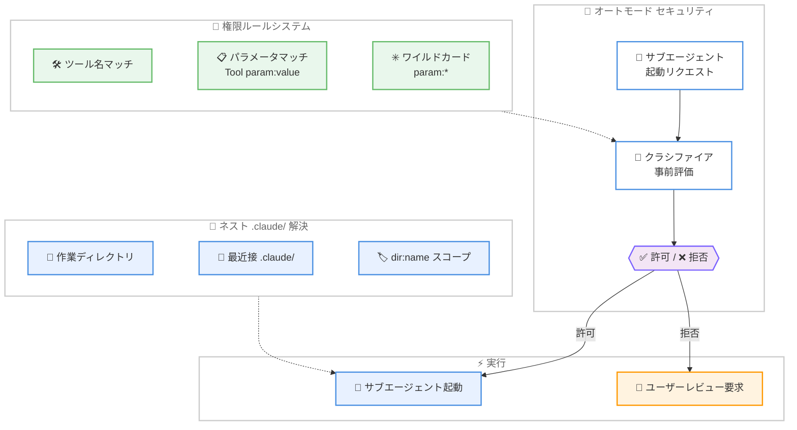

# Claude Code v2.1.178 アップデート: パラメータベース権限ルールとネスト .claude/ ディレクトリサポート

## メタデータ

| 項目 | 内容 |
|------|------|
| 発表日 | 2026-06-15 |
| ソース | Claude Code Changelog |
| カテゴリ | Claude Code アップデート |
| 公式リンク | https://github.com/anthropics/claude-code/blob/main/CHANGELOG.md |

## 概要

Claude Code v2.1.178 がリリースされた。本リリースの最大の特徴は、権限ルールでツールの入力パラメータを条件に指定できる `Tool(param:value)` 構文の追加と、ネストされた `.claude/` ディレクトリの完全サポートである。これにより、モノレポや大規模プロジェクトでのきめ細かなアクセス制御とスキル管理が大幅に改善された。また、オートモードのセキュリティ強化としてサブエージェント起動前のクラシファイア評価が導入され、複数のサブエージェント関連バグの修正、認証・メモリ・MCP に関する重要な安定性修正も含まれている。

## 詳細

### 背景

Claude Code はモノレポや複数プロジェクトを含む大規模リポジトリでの利用が増加している。これまでは単一の `.claude/` ディレクトリでの設定管理が前提であったため、サブディレクトリごとに異なるスキルやワークフローを持つプロジェクト構成では管理が煩雑になっていた。また、権限ルールはツール名単位での制御に限られており、同じツールでもパラメータによってアクセスを制御したいというエンタープライズのニーズに応えられていなかった。

さらに、オートモードにおけるサブエージェントの起動は、クラシファイアによる事前評価なしに行われていたため、ブロック対象のアクションをサブエージェントが要求する可能性があった。今回のリリースではこのセキュリティギャップが解消されている。

### 主な変更点

#### 新機能

1. **パラメータベース権限ルール (`Tool(param:value)` 構文)**: 権限ルールでツールの入力パラメータを条件として指定可能になった。ワイルドカード (`*`) もサポートされており、例えば `Agent(model:opus)` と記述することで Opus モデルを使用するサブエージェントの起動をブロックできる。

2. **ネストされた `.claude/skills` ディレクトリ**: サブディレクトリ内の `.claude/skills` にあるスキルが、そのディレクトリ内のファイルで作業中に自動的に読み込まれるようになった。名前が衝突する場合はネストされたスキルが `<dir>:<name>` 形式で表示され、両方が利用可能な状態を維持する。

3. **ネストされた `.claude/` ディレクトリの優先順位**: エージェント、ワークフロー、出力スタイルは作業ディレクトリに最も近い `.claude/` ディレクトリのものが優先される。プロジェクトスコープのワークフロー保存は、最も近い既存の `.claude/workflows/` をターゲットにする。

#### セキュリティ強化

4. **オートモードのサブエージェント事前評価**: サブエージェントの起動がクラシファイアによる事前評価を経るようになり、ブロック対象のアクションをレビューなしに要求することができなくなった。

#### UX 改善

5. **/doctor の改善**: 全セクションで一貫したフラットツリーレイアウト、より明確なセクションステータスアイコン、ハイライトされたコマンド名が導入された。

6. **スキル一覧の切り捨て警告**: 何件のスキル説明が影響を受けているかを表示するよう改善された。

7. **ワークフロープロンプトキーワード**: パープルシマーハイライトを使用するよう変更され、「run a workflow」「workflow:」などの明示的なフレーズでのみトリガーされ、単語の一般的な言及では反応しなくなった。

8. **Remote Control エラーメッセージ改善**: 接続失敗時にフッターに永続的な赤い "/rc failed" インジケータが表示され、「未有効化」エラーはゲート、チェック失敗、古いエンタイトルメント、組織ポリシーのいずれかを明示する。

9. **/bug コマンド改善**: 送信前に説明の入力が必須になり、モデル拒否テキストが GitHub Issue タイトルとして使用されなくなった。

#### バグ修正

以下の問題が修正された。

- **OOM クラッシュ**: CLI が親プロセスから古い WebSocket/OAuth ファイルディスクリプタ環境変数を継承した際のメモリ不足クラッシュを修正
- **Chrome 連携認証**: OAuth トークンが Claude Code のログインとは異なるアカウントに属する場合、Chrome 上の Claude が接続に失敗する問題を修正
- **ネストスキルの権限**: ディレクトリ修飾名を持つネスト `.claude/skills` スキルが非インタラクティブ実行で権限プロンプトによりブロックされる問題を修正
- **サブエージェントのトランスクリプト**: ツール結果とライブ進捗が表示されるようになり、ターン完了中に送信されたメッセージが破棄されなくなり、実行中のサブエージェントをバックグラウンド化 (Ctrl+B) しても最初から再起動されなくなった
- **claude agents の認証エラー**: `ANTHROPIC_BASE_URL` と `ANTHROPIC_AUTH_TOKEN` によるカスタム API ゲートウェイ設定のシェルからデーモンが起動された場合の `401 Invalid bearer token` エラーを修正
- **コンパクションのフォールバック**: `--fallback-model` が尊重されるようになり、過負荷時やモデル利用不可エラー時に設定されたフォールバックモデルチェーンが使用される
- **認証キャッシュ**: セッション外で認証情報が更新された後もリクエストが古いキャッシュ設定により失敗し続ける問題を修正
- **バックグラウンドセッション**: `/bg` または左左矢印でターン完了後に作成されたセッションがエージェントリストで永久に「Working」と表示される問題を修正
- **マーケットプレイスプラグイン**: `CLAUDE_CODE_PLUGIN_KEEP_MARKETPLACE_ON_FAILURE=1` が新規マーケットプレイスインストールのクローンを妨げる問題を修正
- **MCP サーバーレベル仕様**: サブエージェントの `disallowedTools` における `mcp__server`、`mcp__server__*`、`mcp__*` パターンが無視される問題を修正
- **Vim モード undo**: `u` が NORMAL/VISUAL モードコマンドを 1 つずつ取り消すようになり、短時間の連続コマンドが単一の undo ステップにマージされなくなった
- **ステータスラインリンク**: カスタム URI スキーム (例: `vscode://`) を持つリンクが `claude agents` でクリックしても開かない問題を修正
- **VSCode CJK IME**: Esc キーで CJK IME 候補ウィンドウを閉じると実行中の Claude タスクがキャンセルされる問題を修正

### 技術的な詳細

#### パラメータベース権限ルールの仕組み

`Tool(param:value)` 構文は、ツール呼び出しの入力パラメータに対するパターンマッチングを行う。権限ルールのマッチングフローは以下の通り。

1. ツール名が権限ルールにマッチするか確認
2. パラメータ条件が指定されている場合、ツール呼び出しの実際のパラメータ値と照合
3. ワイルドカード (`*`) は任意の文字列にマッチ
4. 条件がすべて一致した場合、ルール (許可/拒否) が適用される

この機能により、同一ツールであってもパラメータの値に応じて異なるアクセス制御を適用できる。

#### ネストされた .claude/ ディレクトリの解決順序

ネストされた `.claude/` ディレクトリの解決は、ファイルシステムの階層を作業ディレクトリから上方向に走査し、最も近いものを優先する。

1. 作業中のファイルのディレクトリから `.claude/` を探索
2. 見つかった場合、そのディレクトリのスキル・ワークフロー・出力スタイルを優先的に使用
3. 名前衝突時は `<dir>:<name>` でスコープ修飾
4. ワークフロー保存は最も近い既存の `.claude/workflows/` ディレクトリをターゲットにする

#### サブエージェントのクラシファイア事前評価

オートモードにおけるサブエージェント起動の新しいフローは以下の通り。

1. サブエージェント起動リクエストを検出
2. クラシファイアがリクエストの内容を評価
3. ブロック対象のアクションが含まれる場合、起動を拒否しユーザーにレビューを要求
4. 安全と判断された場合のみ、サブエージェントが起動される

## 開発者への影響

### 対象

- Claude Code を利用するすべての開発者
- モノレポや大規模プロジェクトで Claude Code を使用するチーム
- エンタープライズ環境でセキュリティポリシーを管理する IT 管理者
- サブエージェントやオートモードを活用するパワーユーザー
- VSCode 上で Claude Code を使用する CJK 言語圏の開発者

### 必要なアクション

1. **一般ユーザー**: Claude Code を v2.1.178 に更新することで全修正が自動的に適用される

2. **モノレポユーザー**: サブディレクトリごとに `.claude/skills` を配置し、プロジェクト固有のスキルを定義可能。既存の設定は変更不要で、新しいネスト機能は追加的に利用できる

3. **エンタープライズ管理者**: パラメータベースの権限ルールを活用し、より細かいアクセス制御を設定可能。例えば、特定モデルのサブエージェント起動を制限するルールを追加できる

4. **カスタム API ゲートウェイ利用者**: `ANTHROPIC_BASE_URL` と `ANTHROPIC_AUTH_TOKEN` を使用している環境では `claude agents` の認証問題が解消されたため、再試行が可能

### 移行ガイド (該当する場合)

特別な移行作業は不要。アップデートを適用するだけで全ての変更が反映される。

既存の権限ルールはそのまま動作し、新しい `Tool(param:value)` 構文は追加的に使用できる。ネストされた `.claude/` ディレクトリも既存の単一ディレクトリ構成と後方互換性がある。

## コード例

```json
// .claude/settings.json - パラメータベース権限ルールの例
{
  "permissions": {
    "deny": [
      "Agent(model:opus)",
      "Agent(model:*-expensive-*)",
      "Bash(command:rm -rf *)"
    ],
    "allow": [
      "Agent(model:sonnet)",
      "Read",
      "Glob",
      "Grep"
    ]
  }
}
```

```
# モノレポでのネスト .claude/ ディレクトリ構成例

monorepo/
├── .claude/
│   └── skills/
│       └── shared-skill/        # 共有スキル
├── apps/
│   ├── frontend/
│   │   └── .claude/
│   │       ├── skills/
│   │       │   └── react-skill/ # frontend 固有スキル
│   │       └── workflows/
│   └── backend/
│       └── .claude/
│           ├── skills/
│           │   └── api-skill/   # backend 固有スキル
│           └── workflows/
└── packages/
    └── shared/
        └── .claude/
            └── skills/
                └── shared-skill/ # 名前衝突 → "packages/shared:shared-skill"
```

## アーキテクチャ図



## 関連リンク

- [Claude Code Changelog](https://github.com/anthropics/claude-code/blob/main/CHANGELOG.md)
- [Claude Code ドキュメント](https://docs.anthropic.com/en/docs/claude-code)
- [Claude Code GitHub リポジトリ](https://github.com/anthropics/claude-code)
- [Claude Code 権限設定ガイド](https://docs.anthropic.com/en/docs/claude-code/security)

## まとめ

Claude Code v2.1.178 は、権限管理・プロジェクト構成・セキュリティの 3 つの軸で大きな進化を遂げたリリースである。`Tool(param:value)` 構文によるパラメータベースの権限ルールは、エンタープライズ環境での精密なアクセス制御を可能にし、ネストされた `.claude/` ディレクトリのサポートはモノレポや大規模プロジェクトでの開発体験を根本的に改善する。オートモードにおけるサブエージェント起動前のクラシファイア評価は重要なセキュリティギャップを塞ぎ、より安全な自動化を実現している。加えて、OOM クラッシュの修正、認証キャッシュの改善、VSCode CJK IME の修正など、安定性と互換性に関する多数の問題が解決されており、日常的な開発ワークフローの信頼性が向上している。
