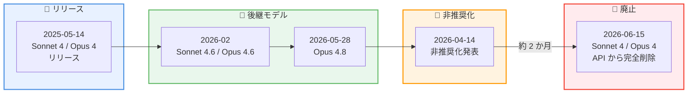
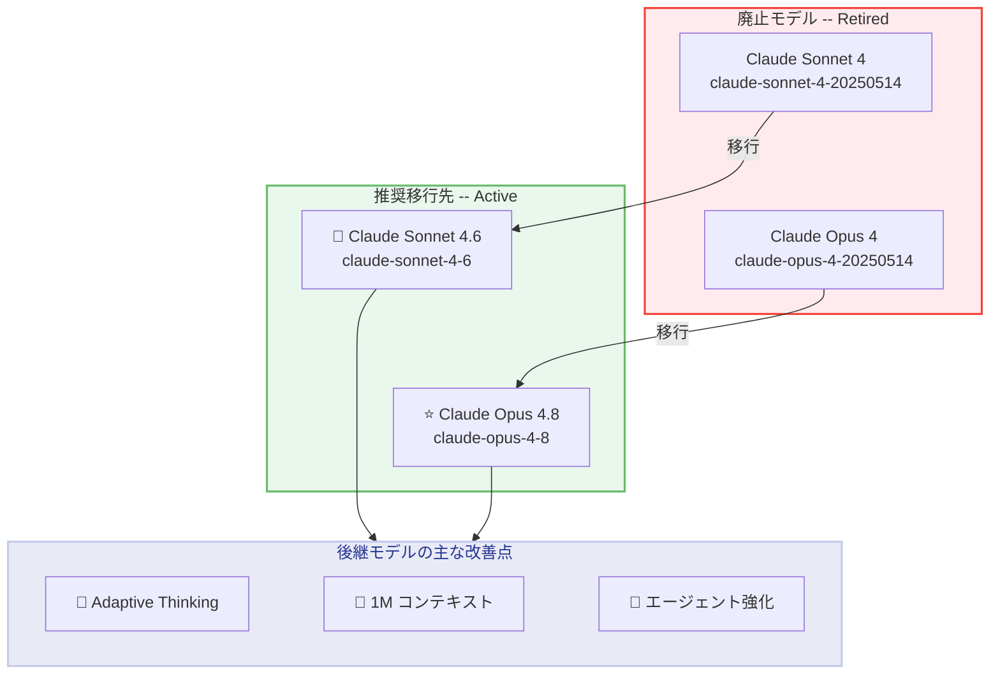

# Claude Sonnet 4 / Opus 4 の廃止 -- API からの完全削除、後継モデルへの移行が必須に

## メタデータ

| 項目 | 内容 |
|------|------|
| 発表日 | 2026-06-15 |
| ソース | Claude API Release Notes |
| カテゴリ | モデル廃止 |
| 公式リンク | [Release Notes](https://platform.claude.com/docs/en/release-notes/overview) |

## 概要

2026 年 6 月 15 日、Anthropic は Claude Sonnet 4 (`claude-sonnet-4-20250514`) および Claude Opus 4 (`claude-opus-4-20250514`) を Claude API から完全に廃止 (retirement) しました。これにより、これらのモデル ID へのすべてのリクエストはエラーを返すようになります。

この廃止は 2026 年 4 月 14 日に発表された非推奨化スケジュールに基づくものであり、約 2 か月の移行期間を経て予定通り実施されました。推奨される移行先として、Claude Sonnet 4.6 および Claude Opus 4.8 が指定されています。なお、研究目的で引き続きアクセスが必要な場合は、External Researcher Access Program を通じてリクエストが可能です。

## 詳細

### 背景

Claude Sonnet 4 と Claude Opus 4 は 2025 年 5 月 14 日にリリースされた Claude 4 世代の初代モデルです。約 13 か月の稼働期間を経て、モデルライフサイクル管理ポリシーに従い廃止されました。

Anthropic のモデルライフサイクルは以下の 4 段階で管理されています。

1. **Active**: 完全にサポートされ、使用が推奨される状態
2. **Legacy**: アップデートは提供されないが、引き続き利用可能な状態
3. **Deprecated**: 動作はするが推奨されない状態。推奨代替モデルと廃止日が設定される
4. **Retired**: 使用不可。リクエストはエラーを返す

今回の廃止により、両モデルは Retired ステータスに移行しました。

#### タイムライン

| 日付 | イベント |
|------|---------|
| 2025 年 5 月 14 日 | Claude Sonnet 4 / Opus 4 リリース |
| 2026 年 2 月 | Claude Sonnet 4.6 / Opus 4.6 リリース |
| 2026 年 4 月 14 日 | 非推奨化 (deprecation) を発表 |
| 2026 年 5 月 28 日 | Claude Opus 4.8 リリース |
| **2026 年 6 月 15 日** | **Claude Sonnet 4 / Opus 4 廃止 (本日)** |

### 主な変更点

1. **Claude Sonnet 4 の廃止**: `claude-sonnet-4-20250514` へのリクエストはすべてエラーを返します
2. **Claude Opus 4 の廃止**: `claude-opus-4-20250514` へのリクエストはすべてエラーを返します
3. **推奨移行先の更新**: Sonnet 4 の移行先は Claude Sonnet 4.6、Opus 4 の移行先は Claude Opus 4.8 に更新されました
4. **研究者向けアクセス**: External Researcher Access Program を通じて、研究目的でのアクセスをリクエスト可能

### 技術的な詳細

#### 廃止モデルと推奨移行先

| 廃止モデル | 推奨移行先 |
|-----------|-----------|
| `claude-sonnet-4-20250514` | `claude-sonnet-4-6` |
| `claude-opus-4-20250514` | `claude-opus-4-8` |

#### エラーレスポンス

廃止されたモデルにリクエストを送信した場合、以下のようなエラーが返されます。

```json
{
  "type": "error",
  "error": {
    "type": "invalid_request_error",
    "message": "The model claude-sonnet-4-20250514 has been retired. Please use claude-sonnet-4-6 instead."
  }
}
```

#### モデル比較: Sonnet 4 vs Sonnet 4.6

| 項目 | Sonnet 4 (廃止) | Sonnet 4.6 (推奨) |
|------|-----------------|-------------------|
| モデル ID | `claude-sonnet-4-20250514` | `claude-sonnet-4-6` |
| ステータス | Retired | Active |
| コンテキストウィンドウ | 200k トークン | 1M トークン (標準) |
| Adaptive Thinking | 非対応 | 対応 |
| アシスタントプレフィル | 対応 | 非対応 |

#### モデル比較: Opus 4 vs Opus 4.8

| 項目 | Opus 4 (廃止) | Opus 4.8 (推奨) |
|------|--------------|-----------------|
| モデル ID | `claude-opus-4-20250514` | `claude-opus-4-8` |
| ステータス | Retired | Active |
| コンテキストウィンドウ | 200k トークン | 1M トークン (標準) |
| Adaptive Thinking | 非対応 | 対応 |
| アシスタントプレフィル | 対応 | 非対応 |

## 開発者への影響

### 対象

以下の開発者が直接影響を受けます。

- `claude-sonnet-4-20250514` を使用しているすべてのアプリケーション
- `claude-opus-4-20250514` を使用しているすべてのアプリケーション
- これらのモデルを Amazon Bedrock、Google Vertex AI、Microsoft Foundry 経由で利用している開発者

### 必要なアクション

**即時対応が必要です。** 廃止日を過ぎたため、まだ移行が完了していない場合は以下を直ちに実施してください。

1. **モデル ID の更新**: コードベース内のすべてのモデル ID を新しいモデルに変更
2. **アシスタントプレフィルの削除**: 4.6 以降のモデルではアシスタントメッセージのプレフィルが 400 エラーを返すため、構造化出力や `output_config.format` に移行
3. **Adaptive Thinking への移行**: `thinking: {type: "enabled", budget_tokens: N}` は非推奨。`thinking: {type: "adaptive"}` と effort パラメータへの移行を推奨
4. **SDK のアップデート**: 最新の Anthropic SDK にアップデートして、新しいモデル ID と機能に対応
5. **テストの実施**: 移行後は十分なテストを実施し、動作に問題がないことを確認

### 移行ガイド

#### モデル ID の変更

| 変更前 | 変更後 |
|--------|--------|
| `claude-sonnet-4-20250514` | `claude-sonnet-4-6` |
| `claude-opus-4-20250514` | `claude-opus-4-8` |

#### 破壊的変更のまとめ

| 変更内容 | 影響度 | 対応 |
|----------|--------|------|
| アシスタントプレフィル非対応 | 高 | 構造化出力または `output_config.format` に移行 |
| Adaptive Thinking への変更 | 中 | `thinking: {type: "adaptive"}` に変更 |
| サンプリングパラメータの制限 (Opus 4.8) | 中 | プロンプトでモデルの動作を制御 |

#### 研究者向けアクセス

学術研究や安全性研究のために廃止モデルへのアクセスが必要な場合は、[External Researcher Access Program](https://support.claude.com/en/articles/9125743-what-is-the-external-researcher-access-program) を通じてリクエストできます。

## コード例

### Python: Sonnet 4 から Sonnet 4.6 への移行

**変更前 (Sonnet 4 -- エラーが発生)**:

```python
import anthropic

client = anthropic.Anthropic()

# このリクエストはエラーを返します
message = client.messages.create(
    model="claude-sonnet-4-20250514",  # Retired
    max_tokens=8192,
    messages=[
        {
            "role": "user",
            "content": "TypeScript で REST API サーバーを作成してください。"
        }
    ]
)
```

**変更後 (Sonnet 4.6)**:

```python
import anthropic

client = anthropic.Anthropic()

message = client.messages.create(
    model="claude-sonnet-4-6",
    max_tokens=8192,
    thinking={"type": "adaptive"},
    output_config={"effort": "medium"},
    messages=[
        {
            "role": "user",
            "content": "TypeScript で REST API サーバーを作成してください。"
        }
    ]
)

print(message.content[0].text)
```

### Python: Opus 4 から Opus 4.8 への移行

**変更前 (Opus 4 -- エラーが発生)**:

```python
import anthropic

client = anthropic.Anthropic()

# このリクエストはエラーを返します
message = client.messages.create(
    model="claude-opus-4-20250514",  # Retired
    max_tokens=16000,
    messages=[
        {
            "role": "user",
            "content": "この論文を分析してください。"
        },
        {
            "role": "assistant",
            "content": "## 分析結果\n\n"  # プレフィルも非対応
        }
    ]
)
```

**変更後 (Opus 4.8)**:

```python
import anthropic

client = anthropic.Anthropic()

message = client.messages.create(
    model="claude-opus-4-8",
    max_tokens=16000,
    thinking={"type": "adaptive"},
    output_config={"effort": "high"},
    system="回答は必ず '## 分析結果' という見出しから開始してください。",
    messages=[
        {
            "role": "user",
            "content": "この論文を分析してください。"
        }
    ]
)

print(message.content[0].text)
```

### curl: Sonnet 4.6 へのリクエスト例

```bash
curl https://api.anthropic.com/v1/messages \
     --header "x-api-key: $ANTHROPIC_API_KEY" \
     --header "anthropic-version: 2023-06-01" \
     --header "content-type: application/json" \
     --data \
'{
    "model": "claude-sonnet-4-6",
    "max_tokens": 8192,
    "thinking": {
        "type": "adaptive"
    },
    "output_config": {
        "effort": "medium"
    },
    "messages": [
        {
            "role": "user",
            "content": "TypeScript で REST API サーバーを作成してください。"
        }
    ]
}'
```

### curl: Opus 4.8 へのリクエスト例

```bash
curl https://api.anthropic.com/v1/messages \
     --header "x-api-key: $ANTHROPIC_API_KEY" \
     --header "anthropic-version: 2023-06-01" \
     --header "content-type: application/json" \
     --data \
'{
    "model": "claude-opus-4-8",
    "max_tokens": 16000,
    "thinking": {
        "type": "adaptive"
    },
    "output_config": {
        "effort": "high"
    },
    "messages": [
        {
            "role": "user",
            "content": "この論文を分析してください。"
        }
    ]
}'
```

## アーキテクチャ図

### 廃止タイムライン



### 移行パス



## 関連リンク

- [Claude Developer Platform Release Notes](https://platform.claude.com/docs/en/release-notes/overview)
- [Claude Model Deprecations](https://platform.claude.com/docs/en/about-claude/model-deprecations)
- [External Researcher Access Program](https://support.claude.com/en/articles/9125743-what-is-the-external-researcher-access-program)
- [Claude Models Overview](https://platform.claude.com/docs/en/about-claude/models/overview)
- [Adaptive Thinking](https://platform.claude.com/docs/en/build-with-claude/adaptive-thinking)
- [Structured Outputs](https://platform.claude.com/docs/en/build-with-claude/structured-outputs)

## まとめ

Claude Sonnet 4 (`claude-sonnet-4-20250514`) と Claude Opus 4 (`claude-opus-4-20250514`) は 2026 年 6 月 15 日をもって Claude API から完全に廃止されました。これらのモデルへのリクエストはすべてエラーを返すため、まだ移行が完了していない場合は直ちに対応が必要です。

推奨される移行先は Claude Sonnet 4.6 (`claude-sonnet-4-6`) および Claude Opus 4.8 (`claude-opus-4-8`) です。後継モデルでは 1M トークンの標準コンテキストウィンドウ、Adaptive Thinking、改善されたエージェント機能など多くの機能強化が提供されています。一方で、アシスタントプレフィルの非対応やサンプリングパラメータの制限など、破壊的変更があるため注意が必要です。

研究目的で廃止モデルへのアクセスが必要な場合は、External Researcher Access Program を通じてリクエストすることが可能です。
