# Anthropic が韓国ソウルにオフィスを開設、韓国 AI エコシステム全体でパートナーシップを発表

## メタデータ

| 項目 | 内容 |
|------|------|
| 発表日 | 2026-06-17 |
| ソース | Anthropic News |
| カテゴリ | 事業拡大・パートナーシップ |
| 公式リンク | https://anthropic.com/news/seoul-office-partnerships-korean-ai-ecosystem |

## 概要

Anthropic は 2026 年 6 月 17 日、韓国ソウルに新オフィスを開設し、政府・企業・学術機関・非営利団体・開発者コミュニティにまたがる包括的なパートナーシップ戦略を発表した。韓国代表取締役として KiYoung Choi 氏が就任し、30 年にわたる韓国テック業界での経験を活かして事業を推進する。科学技術情報通信部との MOU 締結、NAVER・Samsung SDS・LG CNS をはじめとする大手企業との連携、KAIST など有力大学との研究協力など、韓国 AI エコシステム全体を網羅する多層的なアプローチが特徴的である。

## 詳細

### 背景

韓国は Anthropic の Economic Index によると、Claude.ai の利用量で世界上位 12 カ国に入る重要市場であり、技術的・創造的な業務での活用が集中している。2025 年 9 月以降、Claude Meetups には数百名の開発者が参加しており、韓国における AI 活用への関心の高さを示している。

Anthropic のシニアリーダーシップチームがソウルを訪問し、パートナー、顧客、開発者との直接的な関係構築を行った。韓国代表取締役の KiYoung Choi 氏は「韓国のチームはイノベーションと安全性がコインの表裏であることを理解している」と述べ、韓国市場の成熟度を評価している。

### 主な変更点

今回の発表は以下の 5 つの柱で構成されている。

1. **政府パートナーシップ**: 科学技術情報通信部との MOU 締結
2. **企業パートナーシップ**: 6 社以上の大手企業との連携
3. **学術パートナーシップ**: NAIRL (国家 AI 研究所) との研究協力
4. **非営利パートナーシップ**: Good Neighbors Korea での Claude 活用
5. **開発者コミュニティ**: スタートアップ支援、ハッカソン、ミートアップ

### 技術的な詳細

#### 政府連携

科学技術情報通信部との MOU では以下の分野での協力が含まれる。

- 公共セクターにおける安全で責任ある AI 導入
- AI セーフティおよびサイバーセキュリティ
- Korea AI Safety Institute と連携した韓国語でのモデル安全性評価
- AI を活用したサイバー脅威に関する情報交換

#### 企業パートナーシップの詳細

| 企業 | 活用内容 | 規模 |
|------|----------|------|
| NAVER | Claude Code をエンジニアリング組織全体に展開 | 数千名のエンジニア |
| Nexon | ライブサービスゲームのコード作成・レビュー・出荷に Claude Code を活用 | 世界数百万プレイヤー向け |
| LG CNS | ソフトウェア開発・クライアント向け技術ソリューションに Claude を展開、LG グループ全体にも拡大 | 数千名の従業員 |
| Hanwha Solutions | AWS Bedrock 経由で Claude をグローバル従業員に提供 | データレジデンシー・セキュリティ要件対応 |
| Samsung SDS | Claude (Cowork・Code 含む) を Samsung Electronics 従業員に展開 | 知識労働・エージェントワークフロー・ソフトウェア開発 |
| Channel Corp | Claude が Channel Talk (カスタマー AI プラットフォーム) を駆動 | 230,000 社以上が利用 |

#### 学術パートナーシップ

NAIRL (National AI Research Lab) は KAIST、Korea University、Yonsei University、POSTECH で構成されるコンソーシアムである。Anthropic は最大 60 名の NAIRL 所属研究者に Claude へのアクセスを提供し、以下の研究分野で協力する。

- AI 安全性
- モデル評価
- アライメント
- ロバスト性
- フロンティア AI 研究全般

#### 非営利セクター

児童権利 NGO の Good Neighbors Korea は以下の目的で Claude を展開している。

- プログラム成果の分析
- 社会福祉法および内部ガイドラインのナビゲーション
- 管理業務の負担軽減によるフィールドワーク時間の確保

## パートナーシップエコシステム図

```mermaid
flowchart TD
    subgraph Anthropic["🏢 Anthropic Korea"]
        direction LR
        Office["🇰🇷 ソウルオフィス<br/>代表取締役: KiYoung Choi"]
    end

    subgraph Government["🏛️ 政府パートナーシップ"]
        MSIT["📋 科学技術情報通信部<br/>MOU 締結"]
        KAISI["🛡️ Korea AI Safety Institute<br/>モデル安全性評価"]
        MSIT ~~~ KAISI
    end

    subgraph Enterprise["🏭 企業パートナーシップ"]
        direction LR
        NAVER["💻 NAVER<br/>Claude Code 全社展開"]
        Nexon["🎮 Nexon<br/>ゲーム開発"]
        LGCNS["🔧 LG CNS<br/>LG グループ展開"]
        NAVER ~~~ Nexon ~~~ LGCNS
    end

    subgraph Enterprise2["🏭 企業パートナーシップ 続き"]
        direction LR
        Hanwha["☁️ Hanwha Solutions<br/>AWS Bedrock"]
        Samsung["📱 Samsung SDS<br/>Cowork + Code"]
        Channel["💬 Channel Corp<br/>230,000 社以上"]
        Hanwha ~~~ Samsung ~~~ Channel
    end

    subgraph Academic["🎓 学術パートナーシップ"]
        direction LR
        NAIRL["🔬 NAIRL"]
        KAIST["KAIST"]
        KoreaU["Korea Univ"]
        Yonsei["Yonsei"]
        POSTECH["POSTECH"]
        NAIRL ~~~ KAIST ~~~ KoreaU ~~~ Yonsei ~~~ POSTECH
    end

    subgraph Community["👥 開発者コミュニティ"]
        direction LR
        Startups["🚀 Claude for Startups"]
        Meetups["🤝 Claude Meetups"]
        Hackathon["⚡ Push to Prod<br/>ハッカソン"]
        BuildDay["🔨 Claude Build Day"]
        Startups ~~~ Meetups ~~~ Hackathon ~~~ BuildDay
    end

    subgraph Nonprofit["💚 非営利"]
        GoodNeighbors["🏠 Good Neighbors Korea<br/>社会福祉支援"]
    end

    Anthropic --> Government
    Anthropic --> Enterprise
    Anthropic --> Enterprise2
    Anthropic --> Academic
    Anthropic --> Community
    Anthropic --> Nonprofit

    classDef platform fill:none,stroke:#CCCCCC,stroke-width:2px,color:#666666
    classDef govt fill:#E3F2FD,stroke:#BBDEFB,stroke-width:2px,color:#1565C0
    classDef enterprise fill:#FFE0B2,stroke:#FFCC80,stroke-width:2px,color:#5D4037
    classDef academic fill:#E8EAF6,stroke:#C5CAE9,stroke-width:2px,color:#283593
    classDef community fill:#DCEDC8,stroke:#C5E1A5,stroke-width:2px,color:#33691E
    classDef nonprofit fill:#F3E5F5,stroke:#E1BEE7,stroke-width:2px,color:#4A148C

    class Anthropic platform
    class Government,MSIT,KAISI govt
    class Enterprise,Enterprise2,NAVER,Nexon,LGCNS,Hanwha,Samsung,Channel enterprise
    class Academic,NAIRL,KAIST,KoreaU,Yonsei,POSTECH academic
    class Community,Startups,Meetups,Hackathon,BuildDay community
    class Nonprofit,GoodNeighbors nonprofit
```

## 開発者への影響

### 対象

以下の開発者・組織が影響を受ける。

- 韓国で Claude API を利用している開発者
- Claude Code を活用するエンジニアリングチーム
- AI 安全性研究に携わる研究者
- 韓国のスタートアップ企業
- AWS Bedrock 経由で Claude を利用する企業

### 必要なアクション

- **スタートアップ**: Claude for Startups プログラムへの参加を検討 (https://claude.com/programs/startups)
- **企業開発者**: 所属企業での Claude Code 導入の検討
- **研究者**: NAIRL を通じた Claude アクセスの活用
- **開発者全般**: Claude Meetups や Push to Prod ハッカソンへの参加

## 戦略的意義

### 韓国市場の重要性

韓国は以下の理由で Anthropic にとって戦略的に重要な市場である。

1. **高い技術力**: NAVER、Samsung、LG など世界的テック企業が集積
2. **AI 活用の成熟度**: Claude.ai 利用量で世界上位 12 カ国
3. **政府の積極姿勢**: AI 安全性と活用のバランスを重視する政策方針
4. **研究基盤**: KAIST、POSTECH など世界水準の研究機関の存在
5. **ゲーム産業**: Nexon など世界的ゲーム企業のエンジニアリングニーズ

### 包括的アプローチの特徴

Anthropic の韓国戦略は単なる営業拠点の設置ではなく、エコシステム全体への投資である点が特筆される。政府・企業・学術・非営利・開発者コミュニティの 5 層にわたる同時展開は、韓国における AI 基盤技術企業としての長期的ポジショニングを示している。

## 関連リンク

- [ソウルオフィス開設・パートナーシップ発表](https://anthropic.com/news/seoul-office-partnerships-korean-ai-ecosystem)
- [KiYoung Choi 氏就任に関する発表](https://anthropic.com/news/kiyoung-choi-representative-director-anthropic-korea)
- [Anthropic 採用情報](https://www.anthropic.com/careers)
- [Anthropic Economic Index](https://www.anthropic.com/economic-index)
- [Claude for Startups](https://claude.com/programs/startups)

## まとめ

Anthropic のソウルオフィス開設は、アジア太平洋地域における事業拡大の重要なマイルストーンである。30 年の韓国テック業界経験を持つ KiYoung Choi 氏のリーダーシップのもと、政府レベルの MOU から草の根の開発者コミュニティまで、5 つの層にわたる包括的なパートナーシップ戦略が展開される。特に NAVER の全社的な Claude Code 導入や Samsung SDS での Cowork・Code の展開は、韓国の大手テック企業が Anthropic の技術を本格的に採用していることを示しており、今後のアジア市場における Claude のプレゼンス拡大が期待される。
