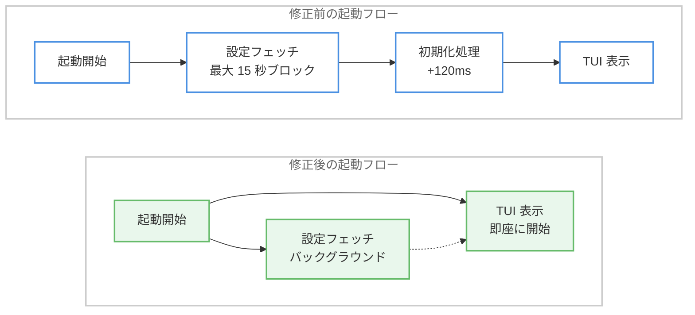

# Claude Code v2.1.181 リリース: 設定コマンド強化、プロンプトキャッシュ修正、ファイル書き込み信頼性向上

## メタデータ

| 項目 | 内容 |
|------|------|
| 発表日 | 2026-06-18 |
| ソース | Claude Code Changelog |
| カテゴリ | Claude Code アップデート |
| 公式リンク | https://github.com/anthropics/claude-code/blob/main/CHANGELOG.md |

## 概要

Claude Code v2.1.181 がリリースされた。本リリースは 3 つの新機能、7 つの改善、12 件以上のバグ修正を含む大規模なアップデートであり、特にプロンプトキャッシュが カスタム `ANTHROPIC_BASE_URL` や Foundry 環境で機能しなかった重大な問題の修正、ネットワークドライブやクラウド同期フォルダでのファイル書き込み時にデータが消失する問題の修正、起動時パフォーマンスの回帰修正など、開発者の日常ワークフローに直接影響する重要な修正が多数含まれている。また、`/config key=value` 構文による設定の即時変更機能や、バンドル Bun ランタイムの 1.4 へのアップグレードなど、利便性とパフォーマンスの向上も実現されている。

## 詳細

### 背景

前バージョン v2.1.179 (6 月 17 日) では接続中断時の部分レスポンス保全や WSL2 スクロール修正などの安定性改善が行われた。今回の v2.1.181 はそれに続く形で、より広範な問題に対処する大規模リリースとなっている。特にプロンプトキャッシュの不具合は、カスタム API エンドポイントや Amazon Bedrock Foundry を利用するエンタープライズユーザーに大きなコスト影響を与えていた問題であり、その修正が最も注目すべき変更点である。

### 主な変更点

#### 新機能

1. **`/config key=value` 構文のサポート**: プロンプトから直接設定を変更できるようになった。例えば `/config thinking=false` でシンキングモードを即座に無効化できる。インタラクティブモード、`-p` フラグ、Remote Control のすべてで動作する。

2. **`sandbox.allowAppleEvents` 設定の追加**: macOS でサンドボックス化されたコマンドが Apple Events を送信できるようにするオプトイン設定。`open` コマンドや `osascript` によるブラウザ操作など、macOS 固有の連携が可能になる。

3. **`CLAUDE_CLIENT_PRESENCE_FILE` 環境変数**: マーカーファイルを指定することで、マシンの前にいる間はモバイルプッシュ通知を抑制できる。リモート作業環境での通知管理に有用である。

#### 改善

4. **バンドル Bun ランタイムを 1.4 にアップグレード**: 内部で使用される JavaScript ランタイムが最新化され、パフォーマンスと安定性が向上した。

5. **長文段落のストリーミング改善**: テキストが最初の改行を待たずに行単位で表示されるようになった。長い説明文の生成中でもリアルタイムに進捗を確認できる。

6. **自動リトライの改善**: シンキング (思考) 中に API 接続が切断された場合、「Connection closed while thinking」エラーを表示する代わりに自動的にリトライするようになった。

7. **サブエージェントパネルの改善**: アイドル状態のサブエージェントが 30 秒後に自動非表示になり、リストは最大 5 行に制限されスクロールヒントが表示される。フッターにはキーボードショートカットのヒントが追加された。

8. **MCP OAuth ブラウザページの改善**: Claude Code のビジュアルスタイルに統一され、認証成功時に自動的にページが閉じるようになった。

9. **フルスクリーンモードの URL 開き方の変更**: Cmd+click (macOS) / Ctrl+click が必要になり、ネイティブターミナルの動作と統一された。

10. **`Improved N memories` 表示の簡略化**: verbose モード以外では個別ファイル名が表示されなくなり、出力がすっきりした。

#### バグ修正 (重要度: 高)

11. **プロンプトキャッシュの修正 (最重要)**: カスタム `ANTHROPIC_BASE_URL` および Foundry 環境でプロンプトキャッシュが読み取られない問題が修正された。原因はリクエストごとのアテステーショントークンが毎ターン変わるため、キャッシュキーが一致しなくなっていたことにある。この修正により、Foundry やプロキシ経由で Claude Code を利用するエンタープライズユーザーの API コストが大幅に削減される。

12. **ネットワークドライブ・クラウド同期フォルダでのファイル書き込み修正**: Write/Edit ツールがネットワークドライブや OneDrive、Dropbox などのクラウド同期フォルダ上で 0 バイトまたは途中で切断されたファイルを生成する問題が修正された。同期タイミングとファイル書き込み操作の競合が原因であった。

13. **macOS Apple Events エラー -600 の修正**: `open`、`osascript`、およびブラウザベースの認証フローが macOS でエラー -600 で失敗する問題が修正された。Apple Events のエンタイトルメント設定が正しく適用されるようになった。

14. **起動時パフォーマンスの回帰修正**: v2.1.169 で導入された起動時の約 120ms の遅延が修正された。フレッシュ環境での起動が高速化された。

15. **起動時ブランクターミナル問題の修正**: アカウント設定の取得が遅い場合に最大 15 秒間ブランクターミナルで起動がブロックされる問題が修正された。

16. **起動クラッシュの修正**: `.claude.json` に破損した null プロジェクトエントリが含まれる場合に発生する `TypeError: Cannot read properties of null` クラッシュが修正された。

17. **macOS TUI フリーズの修正**: Spotlight がリインデックス中にセッション開始時に TUI がフリーズする問題が修正された。

18. **長時間アイドルセッションの履歴消失修正**: 30 日間のトランスクリプトクリーンアップ中に、長時間アイドル状態のセッションの履歴が失われる問題が修正された。

19. **サブエージェントの無限ネスト防止**: フォアグラウンドサブエージェントが無制限にネストされたチェーンを生成する問題が修正され、5 レベルの深度制限が適用されるようになった。

20. **`/recap` とモデル切り替えの修正**: モデルを切り替えた後に `/recap` やフォークが以前のモデルを使用し続ける問題が修正された。

21. **AWS 認証情報のリフレッシュ問題修正**: 短いライフタイムにより 1 分ごとにリフレッシュが発生する問題が修正された。

22. **UI バグの修正**: kitty キーボードプロトコルで大文字が小文字に変換される問題、macOS のテキスト置換の問題、クリップボードの問題が修正された。

### 技術的な詳細

#### プロンプトキャッシュの不具合メカニズム

プロンプトキャッシュは、同一のプロンプトプレフィックスを再利用することで API コストとレイテンシを削減する機能である。カスタム `ANTHROPIC_BASE_URL` や Foundry 環境では、セキュリティのためにリクエストごとにアテステーショントークンが生成される。従来の実装ではこのトークンがキャッシュキーの一部に含まれていたため、毎ターン異なるキーが生成されキャッシュヒットが発生しなかった。修正ではアテステーショントークンをキャッシュキーの計算から除外し、プロンプト内容のみでキャッシュマッチングを行うようになった。

#### ネットワークドライブでのファイル書き込み問題

Write/Edit ツールは従来、ファイルの書き込みに標準的な `write` + `rename` パターンを使用していた。しかし、ネットワークドライブやクラウド同期フォルダ (OneDrive、Dropbox、Google Drive) では、同期プロセスが一時ファイルを検出して同期を試みることで競合が発生し、結果としてファイルが 0 バイトまたは途中で切断される状態になっていた。修正ではファイル書き込み操作にアトミック性を確保する追加の保護メカニズムが実装された。

#### 起動時パフォーマンス

v2.1.169 で導入された変更により、フレッシュ環境での起動時に不要な初期化処理が追加され、約 120ms のオーバーヘッドが発生していた。また、アカウント設定のフェッチがネットワーク遅延により最大 15 秒ブロックする問題は、非同期フェッチへの移行により解消された。



## 開発者への影響

### 対象

以下の開発者に特に大きな影響がある。

- **Foundry / カスタム API エンドポイント利用者**: プロンプトキャッシュが正常に動作するようになり、API コストが大幅に削減される
- **ネットワークドライブ / クラウド同期フォルダで作業する開発者**: ファイルの破損・消失リスクが解消される
- **macOS ユーザー**: Apple Events 関連のエラーが解消され、ブラウザ認証やスクリプト実行が正常に動作する
- **不安定なネットワーク環境の開発者**: シンキング中の接続切断からの自動リカバリが実現
- **AWS Bedrock 利用者**: 認証情報の過剰リフレッシュ問題が解消される
- **長時間セッションを利用する開発者**: アイドルセッションの履歴保全が改善される

### 必要なアクション

Claude Code を最新バージョンに更新する。

```bash
# Claude Code の更新
claude update

# バージョン確認
claude --version
```

新機能を活用するための追加設定 (任意) は以下の通りである。

```bash
# プロンプトから設定を変更する例
/config thinking=false
/config model=claude-sonnet-4-6

# Apple Events を許可する場合 (macOS のみ)
# settings.json に追加:
# "sandbox.allowAppleEvents": true

# プッシュ通知の抑制
export CLAUDE_CLIENT_PRESENCE_FILE="$HOME/.claude-present"
touch "$HOME/.claude-present"
```

### 移行ガイド

本リリースは後方互換性を維持しており、既存の設定やワークフローに変更は不要である。ただし以下の動作変更に注意が必要である。

- **フルスクリーンモードの URL**: 単クリックではなく Cmd+click / Ctrl+click が必要になった
- **メモリ更新表示**: verbose モード以外では個別ファイル名が表示されなくなった

## 補足: v2.1.179 の主な修正 (6 月 17 日)

直前のバージョン v2.1.179 (6 月 17 日リリース) でも重要な修正が行われている。

- **ストリーム中断時の部分レスポンス保全**: 接続切断時にそれまでの受信内容が保持されるようになった
- **WSL2 マウスホイールスクロール修正**: Windows Terminal / VS Code 上の WSL2 で動作するようになった
- **サンドボックス glob 問題修正**: 大規模ディレクトリで Bash ツール説明文が膨大になる問題が解消された
- **リモートセッションのプラグイン読み込み改善**: パフォーマンスが向上した

v2.1.179 と v2.1.181 を合わせると、過去 3 日間で 20 件以上のバグ修正と 10 件以上の改善が実施されており、Claude Code の安定性と信頼性が大幅に向上している。

## 関連リンク

- [Claude Code Changelog](https://github.com/anthropics/claude-code/blob/main/CHANGELOG.md)
- [Claude Code ドキュメント](https://code.claude.com/docs)
- [Claude Code GitHub リポジトリ](https://github.com/anthropics/claude-code)

## まとめ

Claude Code v2.1.181 は新機能、改善、バグ修正のすべてを含む包括的なリリースである。最も影響の大きい修正はプロンプトキャッシュの不具合解消であり、Foundry やカスタム API エンドポイントを利用するエンタープライズユーザーにとって大幅なコスト削減につながる。ネットワークドライブでのファイル破損問題の修正は、クラウド同期フォルダで作業する多くの開発者のデータ安全性を確保する重要な変更である。起動パフォーマンスの改善 (最大 15 秒のブロック解消) と複数の安定性修正により、日常的な開発体験の品質が大幅に向上している。`/config key=value` 構文の追加は、設定変更のワークフローを効率化する便利な新機能である。前日の v2.1.179 と合わせて、Claude Code は過去 3 日間で非常に大きな安定性向上を達成しており、即座のアップデートを推奨する。
