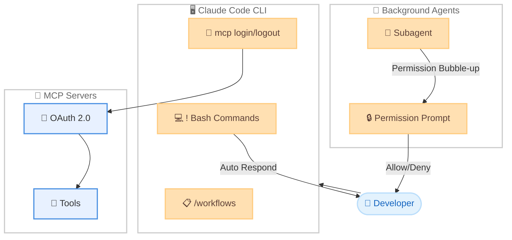

# Claude Code v2.1.186: MCP CLI 認証、Bash 自動応答、バックグラウンドサブエージェント権限の大幅強化

## メタデータ

| 項目 | 内容 |
|------|------|
| 発表日 | 2026-06-23 |
| ソース | Claude Code Changelog |
| カテゴリ | Claude Code アップデート |
| 公式リンク | https://github.com/anthropics/claude-code/blob/main/CHANGELOG.md |

## 概要

Claude Code v2.1.186 は、33 項目の変更を含む大規模リリースである。MCP サーバーへの CLI 認証コマンド (`claude mcp login/logout`)、`!` Bash コマンド実行後の自動応答機能、バックグラウンドサブエージェントからの権限プロンプトのメインセッション表示など、開発者ワークフローを根本的に改善する機能が多数追加された。加えて、スリープ復帰後のストリーミングエラー修正や Agent deny ルールの適用漏れ修正など、安定性に関する重要なバグ修正も 20 件以上含まれている。

## 詳細

### 背景

Claude Code はエージェント型の開発ツールとして急速に進化しており、MCP (Model Context Protocol) サーバーとの連携、バックグラウンドエージェント、ワークフロー機能など、高度な機能が日々追加されている。本リリースでは、特に以下の 3 つの領域に注力している。

1. **CLI からの MCP 認証**: SSH 環境やヘッドレス環境での MCP サーバー接続を簡素化
2. **Bash コマンド統合**: シェルコマンド実行結果に対する自動応答で対話フローを効率化
3. **バックグラウンドエージェント管理**: 権限プロンプトの可視化とサブエージェント制御の強化

### 主な変更点

#### 新機能/追加 (6 件)

1. **`claude mcp login <name>` / `claude mcp logout <name>` コマンド**: インタラクティブな `/mcp` メニューを開かずに CLI から直接 MCP サーバーへの認証が可能に。`--no-browser` オプションで SSH 経由の stdin リダイレクトにも対応する。

2. **`!` Bash コマンドの自動応答**: `!` で実行したシェルコマンドの出力に対して Claude が自動的に応答するようになった。従来のコンテキスト追加のみの動作に戻すには `"respondToBashCommands": false` を設定する。

3. **`/workflows` エージェント詳細ビューのステータスフィルタリング**: `f` キーでエージェントをステータスごとにフィルタリング可能に。

4. **`/plugin` Installed タブに "Skills" セクション追加**: インストール済みプラグインのスキルを一覧表示する専用セクションが追加された。

5. **`teammateMode: "iterm2"` 設定**: iTerm2 バックエンドのチームメイトモードが追加された。`it2` CLI が見つからない場合の警告も表示される。

6. **`/login` に AWS 認証情報リフレッシュオプション**: `awsAuthRefresh` が設定されている場合、「Claude Platform on AWS - refresh credentials」オプションが `/login` に表示される。

#### バグ修正 (20 件)

**ストリーミング/接続系**:

7. **スリープ復帰後のストリーミングエラー修正**: マシンがスリープから復帰した後に「Content block not found」や JSON パースエラーでストリーミングリクエストが失敗する問題を修正。

**UI/表示系**:

8. **サブエージェントのトランスクリプトスクロール位置漏れ修正**: サブエージェントのトランスクリプト終了時にスクロール位置がメインのトランスクリプトに影響する問題を修正。

9. **バックグラウンドタスクプレビューのフラッシュ修正**: エージェントのプランがロードされる前にツール名が一瞬表示される問題を修正。

10. **権限プロンプトのオプション番号ずれ修正**: オプションテキストがオーバーフローした際に番号がずれる問題を修正。

11. **完了済みサブエージェントの `x` キーでの閉じる動作修正**: エージェントパネルで完了したサブエージェントを `x` で閉じられない問題を修正。

12. **MCP サーバー切断の誤通知修正**: 古いセッション再開時に、意図的に廃止されたツールに対して「MCP server disconnected」が表示される問題を修正。

13. **`/plugin` Installed の「more above」インジケータ修正**: 既にトップまでスクロールしているのに「more above」が表示される問題を修正。

14. **`~~strikethrough~~` のレンダリング修正**: アシスタントメッセージで取り消し線がリテラルなチルダとして表示される問題を修正。

15. **ダークテーマフラッシュ修正**: ライトターミナルで `claude agents` からバックグラウンドセッションを開いた際にダークテーマが一瞬表示される問題を修正。

16. **マウス選択テキストのハイライト残留修正**: `claude agents` でテキストを削除した後もハイライトが残る問題を修正。

**バックグラウンドエージェント/セッション系**:

17. **バックグラウンドセッションリキャップの重複修正**: エージェント自身のターン終了サマリーがリキャップ行として正しく表示されるようになった。

18. **`claude agents` からのバックグラウンドセッション展開修正**: 前の画面が背面に描画されたまま残る問題を修正。

19. **Esc/Ctrl+C の応答修正**: メインターン終了後もバックグラウンドエージェントが動作中の場合に Esc/Ctrl+C が反応しない問題を修正。

20. **バックグラウンドジョブステータスの古い表示修正**: `claude agents` で応答後も「needs input」メッセージが表示され続ける問題を修正。

**セキュリティ/権限系**:

21. **Chrome タブグループ分離の修正**: 製品内権限ゲートがオフの場合に、並行 CLI セッションでタブグループ分離が適用されない問題を修正。

22. **`Agent(type)` deny ルールの適用修正**: 名前付きサブエージェントスポーンに対して `Agent(type)` deny ルールと `Agent(x,y)` allowed-types 制限が適用されない問題を修正。

23. **`--tools` のフィーチャーゲート修正**: コールドスタート時にフラグがロードされる前にフィーチャーゲート付きツールが `--tools` で使用可能になる問題を修正。

**その他**:

24. **セッションコスト表示修正**: 使用量ベースの Enterprise および Team サブスクライバーでセッションコストが表示されない問題を修正。

25. **チームメイト `--effort` レベル継承修正**: tmux/pane バックエンドで生成されたチームメイトがリーダーの `--effort` レベルを継承しない問題を修正。

26. **ワークフロー `agent({schema})` の無限ループ修正**: スキーマバリデーション失敗を繰り返した際に無限ループする問題を修正。5 回の試行後にアボートするようになった。

#### 改善 (4 件)

27. **`claude mcp get/remove` のタイポ候補表示**: サーバー名のタイポ時に最も近い名前を提案し、長いサーバーリストを切り詰めて表示するようになった。

28. **メモリコンパクト化リマインダー**: `MEMORY.md` インデックスがサイズ制限に近づくとエージェントにコンパクト化が促されるようになった。

29. **スキルフロントマターの柔軟なキー形式対応**: `display-name`、`default-enabled`、`fallback`、`metadata.*` キーが kebab-case、snake_case、camelCase のいずれでも受け入れられるようになった。

30. **不正な `SKILL.md` YAML フロントマターの処理改善**: 不正なフロントマターがある場合、サイレントに失敗するのではなく、空のメタデータでスキル本体をロードするようになった。

#### 変更 (3 件)

31. **`CLAUDE_CODE_MAX_RETRIES` の上限を 15 に制限**: 無人セッションには代わりに `CLAUDE_CODE_RETRY_WATCHDOG` の使用を推奨。

32. **バックグラウンドサブエージェントの権限プロンプト表示変更**: 自動拒否ではなく、メインセッションに権限プロンプトを表示するよう変更。どのエージェントが要求しているかが表示され、Esc でそのツールのみを拒否可能。

33. **`/review <pr>` のレビューエンジン統一**: `/code-review medium` と同じレビューエンジンを使用するよう変更。

### 技術的な詳細

#### MCP CLI 認証

`claude mcp login` は OAuth 2.0 フローを CLI 上で完結させる。`--no-browser` モードでは、認証 URL を stdout に出力し、トークンを stdin から受け取る。これにより SSH トンネル経由でもブラウザを開かずに認証を完了できる。

```
claude mcp login <server-name>          # ブラウザを開いて認証
claude mcp login <server-name> --no-browser  # stdin/stdout で認証
claude mcp logout <server-name>         # トークンを破棄
```

#### Bash 自動応答メカニズム

`!` プレフィックス付きの Bash コマンドは従来、実行結果をコンテキストに追加するだけだったが、本バージョンからは Claude が結果を解釈して自動的に応答を生成する。これはインタラクティブなデバッグフローの効率を大幅に向上させる。

#### バックグラウンドサブエージェント権限モデル

従来はバックグラウンドサブエージェントの権限要求が自動拒否されていたため、権限を必要とするツールの使用が不可能だった。新しいモデルでは権限プロンプトがメインセッションにバブルアップされ、ユーザーが明示的に判断できる。

## 開発者への影響

### 対象

- Claude Code を日常的に使用するすべての開発者
- SSH/リモート環境で MCP サーバーを使用する開発者
- バックグラウンドエージェントやワークフローを活用する開発者
- チームメイト機能を使用するチーム
- Enterprise/Team プランのユーザー

### 必要なアクション

1. **アップデートの実施**:
   ```bash
   claude update
   ```

2. **Bash 自動応答の確認**: `!` コマンドの動作が変わるため、従来の動作を維持したい場合は設定を追加する。
   ```json
   {
     "respondToBashCommands": false
   }
   ```

3. **`CLAUDE_CODE_MAX_RETRIES` の確認**: 15 を超える値を設定している場合、上限が 15 に制限される。無人セッションでは `CLAUDE_CODE_RETRY_WATCHDOG` への移行を推奨する。

4. **Agent deny ルールの見直し**: 名前付きサブエージェントに対して deny ルールが正しく適用されるようになったため、既存の権限設定が意図通りに動作することを確認する。

### 移行ガイド (該当する場合)

#### `!` Bash コマンドの動作変更

本リリースで最も注意が必要な動作変更である。

- **変更前**: `!` コマンドの出力はコンテキストに追加されるのみ
- **変更後**: Claude が出力に対して自動的に応答を生成

従来の動作に戻す場合は `settings.json` に以下を追加する。

```json
{
  "respondToBashCommands": false
}
```

#### `CLAUDE_CODE_MAX_RETRIES` の変更

15 を超える値は無視される。長時間の無人実行には以下の環境変数を使用する。

```bash
export CLAUDE_CODE_RETRY_WATCHDOG=true
```

#### `/review <pr>` のエンジン変更

`/review <pr>` は `/code-review medium` と同等のレビューエンジンを使用するようになった。レビュー結果のフォーマットや検出項目が変わる可能性があるため、CI に組み込んでいる場合は出力を確認する。

## コード例

```bash
# MCP サーバーへの CLI 認証
claude mcp login my-github-server
# ブラウザが開き OAuth フローを完了

# SSH 環境での認証 (ブラウザなし)
claude mcp login my-server --no-browser
# 認証 URL が表示されるので、別端末でアクセスしてトークンを入力

# MCP サーバーからのログアウト
claude mcp logout my-github-server

# Bash 自動応答の動作例
# プロンプトで ! を使うと Claude が結果を解析して応答
! git status
# => Claude: "3 つのファイルが変更されています。main.py の差分を確認しましょうか?"

# 自動応答を無効にする設定
# ~/.claude/settings.json
{
  "respondToBashCommands": false
}

# MCP サーバー名のタイポ時の候補表示
claude mcp get githbu-server
# => Error: Server "githbu-server" not found.
#    Did you mean "github-server"?

# チームメイトモードの設定 (iTerm2)
# ~/.claude/settings.json
{
  "teammateMode": "iterm2"
}
```

## アーキテクチャ図 (該当する場合)



## 関連リンク

- [Claude Code Changelog](https://github.com/anthropics/claude-code/blob/main/CHANGELOG.md)
- [Claude Code ドキュメント](https://docs.anthropic.com/en/docs/claude-code)
- [Claude Code GitHub リポジトリ](https://github.com/anthropics/claude-code)
- [MCP プロトコル仕様](https://modelcontextprotocol.io/)
- [Claude Code 設定リファレンス](https://docs.anthropic.com/en/docs/claude-code/settings)

## まとめ

Claude Code v2.1.186 は、33 項目の変更を含む本格的なリリースであり、3 つの重要な新機能と 20 件のバグ修正が含まれている。

最も注目すべきは **MCP CLI 認証** (`claude mcp login/logout`) で、SSH やヘッドレス環境での MCP サーバー接続が大幅に簡素化された。**Bash 自動応答機能** により `!` コマンドの実行結果に対して Claude が即座にフィードバックを返すようになり、対話的なデバッグフローが効率化された。また、**バックグラウンドサブエージェントの権限モデル変更** により、従来の自動拒否方式からメインセッションへのプロンプト表示方式に移行し、バックグラウンドエージェントの実用性が飛躍的に向上した。

バグ修正面では、スリープ復帰後のストリーミングエラー、Agent deny ルールの適用漏れ、ワークフローサブエージェントの無限ループなど、安定性と安全性に直結する問題が解消されている。

`!` Bash コマンドの動作変更と `CLAUDE_CODE_MAX_RETRIES` の上限変更は既存のワークフローに影響する可能性があるため、アップデート後に設定を確認することを推奨する。
