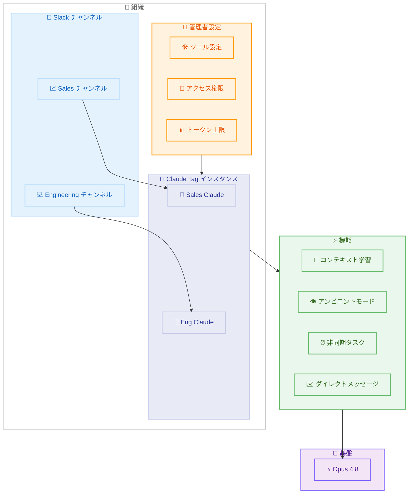

# Introducing Claude Tag: チームワークフローに統合される協調型 AI

## メタデータ

| 項目 | 内容 |
|------|------|
| 発表日 | 2026-06-23 |
| ソース | Anthropic News |
| カテゴリ | 新サービス |
| 公式リンク | https://www.anthropic.com/news/introducing-claude-tag |

## 概要

Anthropic は、Claude をチームワークフローに直接統合する新しい協調型 AI プロダクト「Claude Tag」を発表した。Slack を皮切りに、Claude がチームメンバーとしてチャンネルに参加し、タスクの委任、コンテキストの学習、プロアクティブな情報提供を行う。Opus 4.8 モデルで動作し、Anthropic 社内では「プロダクトチームのコードの 65% が社内版 Claude Tag によって作成されている」と報告されている。

2026 年 6 月 23 日よりベータ版として提供開始され、当初は Claude Enterprise および Team プランの顧客が対象となる。

## 詳細

### 背景

従来の AI アシスタントは、ユーザーが都度コンテキストを提供し、明示的に指示を出す必要があった。Claude Tag はこのパラダイムを転換し、Claude がチームの会話に継続的に参加することで、コンテキストを自律的に蓄積し、チームメンバーのように振る舞うことを可能にする。

既存の「Claude in Slack」アプリの後継として位置づけられており、30 日間の移行期間が設けられている。

### 主な変更点

1. **チャンネル参加型 AI**: Claude が選択された Slack チャンネルにチームメンバーとして参加し、@Claude メンションでタスクを委任可能
2. **コンテキスト学習**: チャンネルの会話を継続的にフォローし、繰り返しの説明なしにコンテキストを構築。許可された他のチャンネルやデータソースからも学習可能
3. **プロアクティブな行動 (アンビエントモード)**: 有効化すると、関連情報の提示、チームメンバーへの必要事項のフラグ付け、停滞スレッドのフォローアップを自発的に実行
4. **非同期タスク実行**: タスクを割り当てると、数時間から数日間にわたり自律的に作業。自身でタスクのスケジューリングも可能
5. **ダイレクトメッセージ**: 個人向けツールやコネクタを使用したプライベートな DM が可能
6. **分離された ID**: 用途別に異なる Claude の「アイデンティティ」を設定可能 (例: セールス用 Claude とエンジニアリング用 Claude は情報を共有しない)

### 技術的な詳細

- **基盤モデル**: Opus 4.8
- **プライバシー制御**: プライベートチャンネルからの情報報告は行わない
- **管理機能**: 管理者がツール、情報アクセス、チャンネルを指定
- **コスト管理**: 組織単位およびチャンネル単位でトークン使用量の上限を設定可能
- **監査**: 全アクティビティの完全なログを保持
- **チャンネルごとの単一インスタンス**: 各チャンネルに 1 つの Claude インスタンスが存在し、全員がそのやり取りを確認可能

## 開発者への影響

### 対象

- Claude Enterprise プランの管理者および利用者
- Claude Team プランの管理者および利用者
- 既存の「Claude in Slack」アプリの利用者
- Slack を業務ツールとして使用している開発チーム

### 必要なアクション

1. **既存の Claude in Slack 利用者**: 30 日以内に Claude Tag への移行オプトインが必要
2. **新規利用者**: Claude Enterprise または Team プランに加入し、ベータアクセスを申請
3. **管理者**: チャンネルごとのアクセス権限、ツール設定、トークン使用上限の設計
4. **セキュリティ担当**: Claude の ID 分離設計とデータアクセスポリシーの確認

### 移行ガイド (該当する場合)

既存の「Claude in Slack」アプリからの移行。

- **移行期間**: 30 日間
- **移行方法**: オプトイン形式 (自動移行ではない)
- **主な変更点**: 単発の応答モデルからチャンネル常駐型モデルへの変更
- **注意事項**: 移行後はアンビエントモード、非同期タスク、コンテキスト学習などの新機能が利用可能になるが、管理者による初期設定が必要

## コード例

```text
# Slack での Claude Tag 利用例

## 基本的なタスク委任
@Claude このスプリントの未完了チケットをまとめて、優先度順に並べてください

## 非同期タスクの割り当て
@Claude 来週の月曜日までに、競合製品の機能比較表を作成してください

## アンビエントモード (自動で Claude が反応する例)
[チームメンバー] デプロイがスタックしている...
[Claude] 関連する情報を確認しました。CI パイプラインのログによると、
ステージング環境のヘルスチェックがタイムアウトしています。
前回同様の問題が発生した際の解決策を共有します: ...

## DM での個人利用
Claude、今週の自分のタスク進捗をまとめて
```

## アーキテクチャ図



## 関連リンク

- [Introducing Claude Tag - 公式発表](https://www.anthropic.com/news/introducing-claude-tag)
- [Claude Enterprise プラン](https://www.anthropic.com/enterprise)
- [Claude Team プラン](https://www.anthropic.com/team)

## まとめ

Claude Tag は、AI アシスタントの利用パラダイムを「都度呼び出す」から「チームに常駐する」へと大きく転換するプロダクトである。Opus 4.8 を基盤とし、コンテキスト学習、プロアクティブな行動、非同期タスク実行という 3 つの柱により、チームの生産性を大幅に向上させることを目指している。

Anthropic 社内での実績 (プロダクトチームのコードの 65% を社内版が生成) は、このアプローチの有効性を示す強力な証拠である。既存の Claude in Slack 利用者は 30 日以内の移行が必要となるため、早期の検証と移行計画の策定が推奨される。

今後は Slack 以外のプラットフォームへの展開も予定されており、チームコラボレーションツール全般に Claude が統合される未来が見えてきた。
