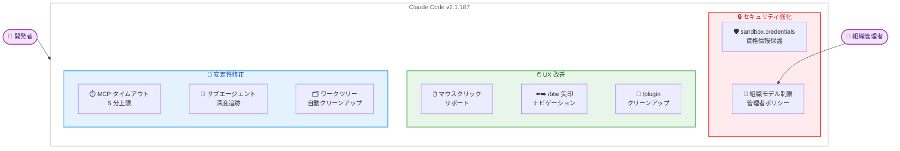

# Claude Code v2.1.187 リリース: サンドボックス資格情報保護、モデル制限、マウスサポートなど

## メタデータ

| 項目 | 内容 |
|------|------|
| 発表日 | 2026-06-24 |
| ソース | Claude Code Changelog |
| カテゴリ | ツールアップデート |
| 公式リンク | https://github.com/anthropics/claude-code/blob/main/CHANGELOG.md |

## 概要

Claude Code v2.1.187 がリリースされた。本リリースでは、サンドボックス環境での資格情報保護機能 (`sandbox.credentials`)、組織レベルのモデル制限設定、フルスクリーンモードでのマウスクリックサポートが新機能として追加された。また、MCP ツール呼び出しのハングアップ修正、韓国語/CJK テキストの文字化け修正、サブエージェントの深度追跡修正など、多数のバグフィックスが含まれている。

## 詳細

### 背景

Claude Code は Anthropic が提供する CLI ベースの AI コーディングアシスタントである。開発者がターミナルから直接 Claude を利用してコードの生成、レビュー、デバッグなどを行える。v2.1.187 では、セキュリティ強化、エンタープライズ向け管理機能、UI/UX 改善の 3 つの柱を中心にアップデートが行われた。

### 主な変更点

#### 新機能

1. **`sandbox.credentials` 設定**: サンドボックス化されたコマンドが資格情報ファイルや秘密環境変数を読み取ることをブロックする設定が追加された。これにより、サンドボックス内で実行されるコードからの意図しない資格情報漏洩を防止できる。

2. **組織レベルのモデル制限**: 組織管理者がモデルピッカー、`--model` フラグ、`/model` コマンド、`ANTHROPIC_MODEL` 環境変数に対してモデル制限を設定できるようになった。制限されたモデルを選択すると「restricted by your organization's settings」メッセージが表示される。

3. **マウスクリックサポート**: フルスクリーンモードにおいて、権限プロンプト、`/model`、`/config` などの選択メニューでマウスクリックによる選択が可能になった。

#### バグ修正 (主要なもの)

| 修正内容 | 影響 |
|----------|------|
| `--resume` が「No conversation found」で失敗 | `-p` 実行でモデルターンが生成されなかった場合の再開が修正 |
| `--json-schema` と `agent({schema})` の構造化出力 | `StructuredOutput` の無限再呼び出しが防止され、フォローアップターンが安定化 |
| リモート MCP ツール呼び出しのハングアップ | 5 分間応答がない場合にエラーで中断されるようになった (`CLAUDE_CODE_MCP_TOOL_IDLE_TIMEOUT` で上書き可能) |
| Remote セッションの起動遅延 | エージェントプロキシ CA のシステム信頼インストール後の約 2.7 秒の遅延を修正 |
| 韓国語/CJK テキストの文字化け | per-byte extended-key events で配信されるペーストの mojibake を修正 |
| サブエージェントの深度追跡 | 再開されたサブエージェントが元のスポーン深度を復元、フォークされたサブエージェントが深度上限にカウントされるようになった |
| `.git/worktrees/` のリーク | 強制終了されたエージェントのロックされたワークツリーエントリが自動クリーンアップされるようになった |
| チャネル接続の切断 | agents ビューへのナビゲーション後、`/bg`、`/tui`、`/update` 後の切断を修正 |

#### 改善

- **`/install-github-app`**: GitHub Actions ワークフロー設定がオプション化された。GitHub App のみインストールしてワークフロー/シークレット手順をスキップできる。
- **`/btw`**: 左右矢印キーで過去の回答をステップスルーできるナビゲーションが追加された。
- **`/plugin`**: 最近使用していないプラグインを表示し、クリーンアップを促すようになった。
- **[VSCode]**: 大きなセッションを再開する際に拡張機能が応答しなくなる問題が修正された。

### 技術的な詳細

#### sandbox.credentials の仕組み

`sandbox.credentials` 設定は、サンドボックス化されたプロセスに対して以下の保護を提供する。

- 資格情報ファイル (例: `.env`、認証トークンファイル) へのアクセスをブロック
- 秘密環境変数の読み取りを防止
- サンドボックス外のプロセスには影響しない

#### MCP ツールタイムアウト

リモート MCP ツール呼び出しにアイドルタイムアウトが導入された。デフォルトでは 5 分間応答がない場合にエラーで中断される。環境変数 `CLAUDE_CODE_MCP_TOOL_IDLE_TIMEOUT` を設定することで、タイムアウト値をカスタマイズできる。

#### サブエージェント深度追跡

サブエージェントの深度管理が改善された。

- 再開されたサブエージェントは元のスポーン深度を正しく復元する
- フォークされたサブエージェントは深度上限 (depth cap) にカウントされる
- これにより、エージェントの無限再帰やリソース枯渇を防止する

## 開発者への影響

### 対象

- Claude Code CLI を利用する全ての開発者
- 組織管理者 (モデル制限設定)
- MCP サーバーを利用する開発者
- リモート環境で Claude Code を使用する開発者
- VSCode 拡張機能を使用する開発者

### 必要なアクション

1. **Claude Code のアップデート**: 最新バージョンに更新する

   ```bash
   claude /update
   ```

2. **sandbox.credentials の設定確認** (推奨): セキュリティ強化のため、サンドボックス環境で資格情報保護を有効にすることを推奨する。

3. **組織管理者**: モデル制限を利用する場合は、組織設定でモデルポリシーを構成する。

4. **MCP 利用者**: リモート MCP ツールの呼び出しにタイムアウトが適用されるため、長時間実行されるツールがある場合は `CLAUDE_CODE_MCP_TOOL_IDLE_TIMEOUT` 環境変数で適切なタイムアウト値を設定する。

### 移行ガイド (該当する場合)

本リリースに破壊的変更はない。ただし、以下の動作変更に注意が必要である。

- **MCP ツールタイムアウト**: これまで無制限に待機していたリモート MCP ツール呼び出しが、5 分でタイムアウトするようになった。長時間実行ツールを使用している場合は環境変数で調整が必要。
- **構造化出力**: `--json-schema` や `agent({schema})` で `StructuredOutput` が 1 回のみ呼び出されるようになった。無限再呼び出しに依存していたワークフローがある場合は修正が必要。

## コード例

```bash
# Claude Code を最新バージョンにアップデート
claude /update

# MCP ツールのタイムアウトをカスタマイズ (例: 10 分に設定)
export CLAUDE_CODE_MCP_TOOL_IDLE_TIMEOUT=600000

# 特定モデルを指定して起動 (組織制限がある場合はメッセージが表示される)
claude --model claude-sonnet-4-6

# バックグラウンドジョブの実行
claude --bg "テストを実行してください"

# 会話の再開 (修正済み)
claude --resume <conversation-id>

# 構造化出力を使用 (修正済み)
claude --json-schema '{"type": "object", "properties": {"summary": {"type": "string"}}}' \
  -p "このコードを要約してください"
```

## アーキテクチャ図 (該当する場合)



## 関連リンク

- [Claude Code Changelog](https://github.com/anthropics/claude-code/blob/main/CHANGELOG.md)
- [Claude Code ドキュメント](https://docs.anthropic.com/en/docs/claude-code)
- [Claude Code GitHub リポジトリ](https://github.com/anthropics/claude-code)

## まとめ

Claude Code v2.1.187 は、セキュリティ、エンタープライズ管理、安定性の 3 つの領域で大幅な改善が行われたリリースである。特に `sandbox.credentials` による資格情報保護と、組織レベルのモデル制限は、エンタープライズ環境での Claude Code 採用を促進する重要な機能である。また、MCP ツールのタイムアウト導入やサブエージェント深度追跡の修正により、長時間実行タスクやマルチエージェントワークフローの信頼性が向上した。韓国語/CJK テキストの文字化け修正やマウスクリックサポートなど、日常的な使用感の改善も含まれており、幅広いユーザーに恩恵のあるアップデートとなっている。
