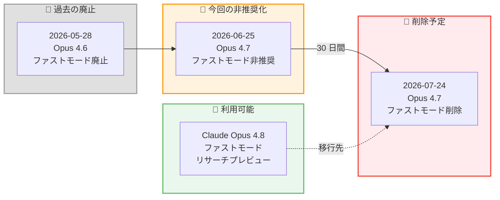
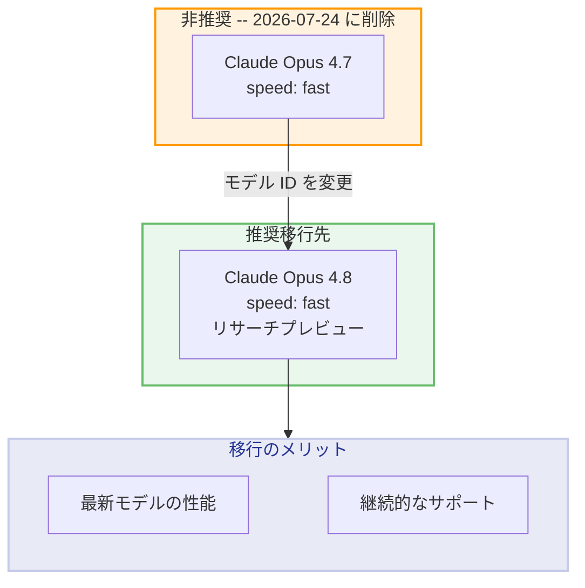

# Claude Opus 4.7 のファストモード廃止予定 -- 2026 年 7 月 24 日に削除、Opus 4.8 への移行が必要

## メタデータ

| 項目 | 内容 |
|------|------|
| 発表日 | 2026-06-25 |
| ソース | Claude API Release Notes |
| カテゴリ | API アップデート / 廃止予定 |
| 公式リンク | [Release Notes](https://platform.claude.com/docs/en/release-notes/overview) |

## 概要

2026 年 6 月 25 日、Anthropic は Claude Opus 4.7 (`claude-opus-4-7-20250219`) のファストモード (`speed: "fast"`) を非推奨 (deprecated) とすることを発表しました。削除予定日は **2026 年 7 月 24 日** であり、発表から 30 日間の移行期間が設けられています。

削除後、`claude-opus-4-7` に対して `speed: "fast"` パラメータを指定したリクエストはエラーを返すようになります。ファストモードの利用を継続する場合は、Claude Opus 4.8 (`claude-opus-4-8-20260528`) への移行が必要です。

## 詳細

### 背景

ファストモード (Fast Mode) は、Claude API において低レイテンシのレスポンスを提供する機能です。`speed: "fast"` パラメータを指定することで、通常の推論よりも高速なレスポンスが得られます。ファストモードには標準の Opus レート制限とは独立した専用のレート制限が設けられています。

Anthropic はモデルのライフサイクル管理の一環として、旧バージョンのモデルに対するファストモードのサポートを段階的に終了しています。

#### ファストモード廃止のタイムライン

| 日付 | イベント |
|------|---------|
| 2026 年 5 月 28 日 | Claude Opus 4.6 のファストモード廃止 |
| **2026 年 6 月 25 日** | **Claude Opus 4.7 のファストモード非推奨化 (本日)** |
| **2026 年 7 月 24 日** | **Claude Opus 4.7 のファストモード削除予定** |

### 主な変更点

1. **Claude Opus 4.7 のファストモード非推奨化**: `claude-opus-4-7-20250219` に対する `speed: "fast"` パラメータが非推奨となりました
2. **30 日間の移行期間**: 2026 年 7 月 24 日まで引き続き動作しますが、早期の移行が推奨されます
3. **削除後のエラー**: 削除日以降、該当リクエストはエラーを返します
4. **推奨移行先**: Claude Opus 4.8 のファストモード (リサーチプレビュー) が代替として利用可能

### 技術的な詳細

#### 影響を受けるリクエスト

以下の条件を満たすリクエストが影響を受けます。

- モデル: `claude-opus-4-7-20250219` (または `claude-opus-4-7` エイリアス)
- パラメータ: `speed: "fast"` を指定

#### ファストモードの仕様

| 項目 | 詳細 |
|------|------|
| パラメータ | `speed: "fast"` |
| 効果 | 低レイテンシのレスポンス |
| レート制限 | 標準 Opus とは独立した専用制限 |
| 対応モデル | Claude Opus 4.8 (リサーチプレビュー) |

#### Claude Opus 4.8 ファストモードの状態

Claude Opus 4.8 のファストモードはリサーチプレビューとして提供されています。本番環境での利用を開始する前に、[サポートモデルの一覧](https://platform.claude.com/docs/en/build-with-claude/fast-mode#supported-models)を確認し、最新の対応状況を把握してください。

## 開発者への影響

### 対象

以下の開発者が直接影響を受けます。

- `claude-opus-4-7` または `claude-opus-4-7-20250219` に対して `speed: "fast"` を指定しているすべてのアプリケーション
- ファストモードの低レイテンシ特性に依存しているリアルタイムシステム
- 上記モデルを Amazon Bedrock、Google Vertex AI 経由でファストモードとして利用している開発者

### 必要なアクション

**2026 年 7 月 24 日までに移行が必要です。** 以下の対応を計画的に実施してください。

1. **影響範囲の特定**: コードベース内で `claude-opus-4-7` と `speed: "fast"` の組み合わせを使用している箇所を洗い出す
2. **モデル ID の更新**: `claude-opus-4-7-20250219` を `claude-opus-4-8-20260528` に変更
3. **動作確認**: Claude Opus 4.8 のファストモード (リサーチプレビュー) で期待通りの動作を確認
4. **レート制限の確認**: Opus 4.8 ファストモードの専用レート制限が要件を満たすか確認
5. **段階的デプロイ**: 本番環境への移行は段階的に実施し、問題が発生した場合に切り戻しが可能な体制を整える

### 移行ガイド

#### モデル ID の変更

| 変更前 | 変更後 |
|--------|--------|
| `claude-opus-4-7-20250219` | `claude-opus-4-8-20260528` |

#### 注意事項

- Claude Opus 4.8 のファストモードはリサーチプレビューの段階です。本番環境での利用可否を事前に確認してください
- ファストモード以外のパラメータ (`max_tokens`, `temperature` など) はそのまま使用可能です
- `speed: "fast"` パラメータ自体の仕様変更はありません。モデル ID のみ更新すれば移行完了です

## コード例

### Python: Opus 4.7 から Opus 4.8 への移行

**変更前 (2026 年 7 月 24 日以降エラーが発生)**:

```python
import anthropic

client = anthropic.Anthropic()

# 2026 年 7 月 24 日以降、このリクエストはエラーを返します
response = client.messages.create(
    model="claude-opus-4-7-20250219",
    speed="fast",
    max_tokens=4096,
    messages=[
        {
            "role": "user",
            "content": "このテキストを要約してください。"
        }
    ]
)
```

**変更後 (推奨)**:

```python
import anthropic

client = anthropic.Anthropic()

response = client.messages.create(
    model="claude-opus-4-8-20260528",
    speed="fast",
    max_tokens=4096,
    messages=[
        {
            "role": "user",
            "content": "このテキストを要約してください。"
        }
    ]
)

print(response.content[0].text)
```

### curl: Opus 4.8 ファストモードへのリクエスト例

```bash
curl https://api.anthropic.com/v1/messages \
     --header "x-api-key: $ANTHROPIC_API_KEY" \
     --header "anthropic-version: 2023-06-01" \
     --header "content-type: application/json" \
     --data \
'{
    "model": "claude-opus-4-8-20260528",
    "speed": "fast",
    "max_tokens": 4096,
    "messages": [
        {
            "role": "user",
            "content": "このテキストを要約してください。"
        }
    ]
}'
```

## アーキテクチャ図

### ファストモード廃止タイムライン



### 移行パス



## 関連リンク

- [Claude Developer Platform Release Notes](https://platform.claude.com/docs/en/release-notes/overview)
- [Fast Mode - Supported Models](https://platform.claude.com/docs/en/build-with-claude/fast-mode#supported-models)
- [Fast Mode Documentation](https://platform.claude.com/docs/en/build-with-claude/fast-mode)
- [Claude Models Overview](https://platform.claude.com/docs/en/about-claude/models/overview)
- [Claude Model Deprecations](https://platform.claude.com/docs/en/about-claude/model-deprecations)

## まとめ

Claude Opus 4.7 (`claude-opus-4-7-20250219`) のファストモード (`speed: "fast"`) が 2026 年 6 月 25 日に非推奨化され、**2026 年 7 月 24 日に完全削除される**ことが発表されました。これは 2026 年 5 月 28 日の Claude Opus 4.6 ファストモード廃止に続く、段階的なサポート終了の一環です。

移行は比較的シンプルで、モデル ID を `claude-opus-4-7-20250219` から `claude-opus-4-8-20260528` に変更するだけで完了します。`speed: "fast"` パラメータの仕様自体に変更はありません。ただし、Claude Opus 4.8 のファストモードはリサーチプレビューの段階であるため、本番環境での利用開始前に十分なテストを実施することを推奨します。

**残り約 29 日の移行期間です。** 該当するアプリケーションを運用している開発者は、早急に移行計画を策定し、テスト環境での動作確認を開始してください。
